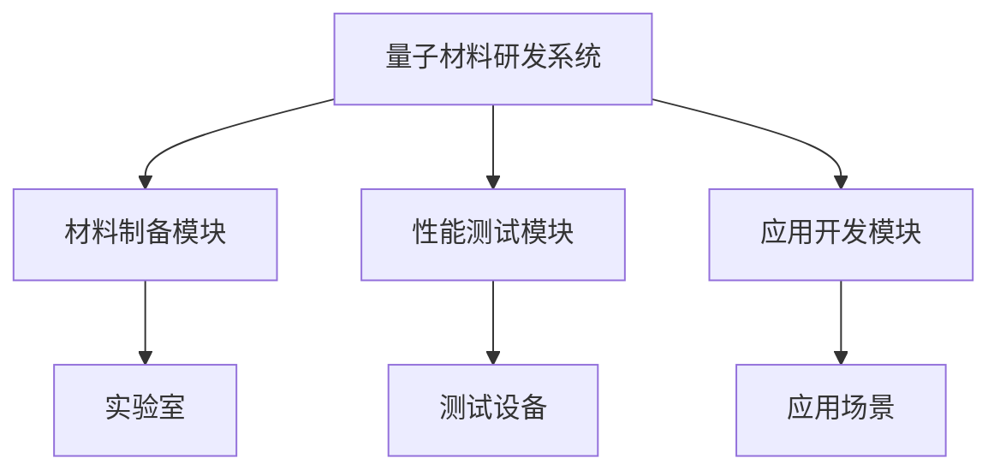
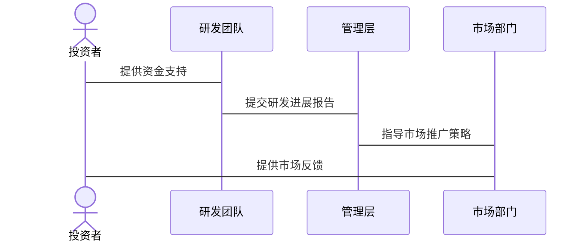

                 


# 巴菲特-芒格的量子材料研发投资：新材料科技的突破口

> 关键词：巴菲特，芒格，量子材料，投资策略，科技创新，新材料研发

> 摘要：本文深入探讨了巴菲特和芒格的投资理念在量子材料研发领域的应用，分析了量子材料的基本概念、应用场景以及投资策略的结合，结合实际案例和系统架构，提出了量子材料研发的突破口。

---

## 第一章 巴菲特-芒格投资理念概述

### 1.1 巴菲特与芒格的投资哲学

#### 1.1.1 巴菲特的价值投资理念
巴菲特的价值投资理念强调长期主义和安全边际。他主张以低于内在价值的价格买入优质资产，并长期持有。这一理念的核心在于对基本面的深入分析和对管理层的信任。

#### 1.1.2 芒格的多元思维模型
芒格提出的多元思维模型强调将不同学科的原理和方法交叉应用，以形成全面的决策框架。他主张投资者应该具备跨领域的知识储备，以避免单一视角的局限性。

#### 1.1.3 价值投资与长期主义
价值投资与长期主义的结合使得巴菲特和芒格的投资策略更具稳定性。他们倾向于投资那些具有持续竞争优势和良好管理团队的企业。

---

### 1.2 巴菲特-芒格投资策略的核心要素

#### 1.2.1 财务指标分析
巴菲特和芒格非常注重企业的财务健康状况，包括利润率、负债率、现金流等关键指标。他们认为这些指标能够反映企业的实际经营能力和抗风险能力。

#### 1.2.2 管理团队评估
芒格强调管理团队的重要性。一个优秀的管理团队能够带领企业应对挑战，抓住机遇。因此，在投资决策中，对管理层的考察至关重要。

#### 1.2.3 行业趋势判断
巴菲特和芒格注重行业趋势的判断。他们倾向于投资那些处于增长周期且具有广阔市场前景的行业。新材料科技领域的量子材料研发正是一个具有巨大潜力的行业。

---

### 1.3 巴菲特-芒格投资理念的现代应用

#### 1.3.1 从传统行业到高科技领域的拓展
随着科技的进步，巴菲特和芒格的投资理念也在不断拓展。他们开始关注高科技领域，尤其是那些具有革命性创新潜力的行业。

#### 1.3.2 量子材料研发的潜在投资机会
量子材料的研发被认为是未来科技领域的突破口。它们在量子计算、量子通信和量子传感等领域具有广泛的应用潜力。

#### 1.3.3 投资与科技创新的结合
巴菲特和芒格的投资理念与科技创新的结合，为量子材料的研发提供了新的思路。通过投资具有创新能力和市场潜力的企业，投资者能够分享科技革命的成果。

---

## 第二章 量子材料的基本概念与应用前景

### 2.1 量子材料的定义与特性

#### 2.1.1 量子材料的定义
量子材料是指在量子力学效应显著的材料。这些材料在微观尺度上表现出独特的物理性质，如超导性、磁性、拓扑性等。

#### 2.1.2 量子材料的核心特性
量子材料的核心特性包括：
- **量子纠缠**：粒子之间的量子态关联。
- **超导性**：零电阻状态。
- **拓扑性**：材料的拓扑结构对物理性质的影响。

#### 2.1.3 量子材料与传统材料的对比
与传统材料相比，量子材料在物理性质上具有显著的差异。例如，超导材料可以在没有能量损失的情况下导电，而传统材料则会存在电阻。

---

### 2.2 量子材料的主要类型

#### 2.2.1 量子点材料
量子点是一种纳米级半导体材料，其电子性质取决于颗粒的尺寸。量子点在显示技术和生物医学领域具有广泛的应用。

#### 2.2.2 量子阱材料
量子阱材料是一种二维量子材料，其电子被限制在一个方向上。这种材料在光电子器件中具有重要的应用。

#### 2.2.3 其他量子材料介绍
除了量子点和量子阱材料，还包括石墨烯、碳纳米管等其他类型的量子材料。

---

### 2.3 量子材料在科技领域的应用

#### 2.3.1 量子计算中的应用
量子计算需要依赖于量子材料的特殊性质。量子比特（qubit）的实现依赖于超导材料或半导体量子点。

#### 2.3.2 量子通信中的应用
量子通信利用量子纠缠效应实现信息的传输。量子密钥分发（QKD）技术需要依赖于量子材料的特性。

#### 2.3.3 量子传感中的应用
量子传感器利用量子材料的敏感性来检测微小的变化。例如，基于超导材料的量子传感器可以用于磁场测量。

---

### 2.4 量子材料研发的挑战与机遇

#### 2.4.1 研发中的技术挑战
量子材料的研发面临诸多技术难题，如材料制备的难度、性能稳定性的问题等。

#### 2.4.2 市场需求的潜力
随着量子计算、量子通信等技术的发展，市场对量子材料的需求将快速增长。

#### 2.4.3 投资机会的分析
量子材料的研发具有较高的技术门槛和较长的研发周期，但其潜在的市场回报也巨大。

---

## 第三章 巴菲特-芒格投资策略在量子材料研发中的应用

### 3.1 投资策略的理论基础

#### 3.1.1 价值投资与量子材料研发的结合
巴菲特的价值投资理念强调对企业的内在价值的挖掘。在量子材料研发领域，投资者需要关注企业的技术实力和市场潜力。

#### 3.1.2 长期主义与科技创新的关系
芒格的长期主义理念与科技创新的周期相契合。量子材料的研发需要长期投入，但一旦成功，将带来巨大的回报。

#### 3.1.3 多元思维模型在量子材料投资中的应用
多元思维模型帮助投资者全面分析量子材料研发的风险和机会，避免单一视角的局限性。

---

### 3.2 量子材料研发的投资逻辑

#### 3.2.1 选择投资标的的标准
- **技术领先性**：企业的研发能力和技术储备。
- **市场需求**：产品的应用前景和市场规模。
- **管理团队**：企业的管理和领导能力。

#### 3.2.2 投资周期的判断
量子材料的研发周期较长，投资者需要耐心等待投资回报。同时，也需要关注技术突破的时机。

#### 3.2.3 风险控制的策略
量子材料研发的风险较高，投资者需要通过分散投资、严格筛选等方式来降低风险。

---

### 3.3 投资案例分析

#### 3.3.1 案例一：某量子计算公司
该公司专注于超导量子比特的研发，拥有一支优秀的研发团队，并获得了多家机构的投资支持。

#### 3.3.2 案例二：某量子传感公司
该公司专注于量子传感器的研发，其产品在磁场测量领域具有广阔的市场前景。

---

## 第四章 量子材料研发的系统分析与架构设计

### 4.1 问题场景介绍
量子材料研发涉及多个学科的交叉，需要构建一个综合性的研发体系。

### 4.2 项目介绍
项目目标：开发具有高性能的量子材料，应用于量子计算和量子通信领域。

### 4.3 系统功能设计
- **材料制备**：开发新型量子材料的制备工艺。
- **性能测试**：建立完善的性能测试体系。
- **应用开发**：开发基于量子材料的量子计算和量子通信设备。

### 4.4 系统架构设计


### 4.5 系统接口设计
- **输入接口**：接收材料制备的参数和实验数据。
- **输出接口**：输出性能测试结果和应用开发方案。

### 4.6 系统交互设计


---

## 第五章 量子材料研发项目的实战

### 5.1 环境安装
- **硬件环境**：搭建实验室，配备必要的实验设备。
- **软件环境**：安装数据分析和模拟软件。

### 5.2 核心实现源代码
以下是一个量子材料性能测试的示例代码：
```python
import numpy as np

def calculate_properties(material):
    # 计算材料的物理性质
    properties = {
        'conductivity': np.mean(material.conductivity),
        'magnetism': np.mean(material.magnetism),
        'topology': material.topology
    }
    return properties

# 示例调用
material = QuantumMaterial()
result = calculate_properties(material)
print(result)
```

### 5.3 实际案例分析
以某量子计算公司为例，分析其研发过程和投资回报。

### 5.4 项目小结
量子材料研发项目的成功需要多方协作和长期投入。

---

## 第六章 总结与展望

### 6.1 投资策略的总结
巴菲特和芒格的投资理念为量子材料研发提供了新的思路。通过价值投资和长期主义，投资者可以分享科技创新的成果。

### 6.2 量子材料研发的未来趋势
随着技术的进步，量子材料将在更多领域得到应用，成为新材料科技的突破口。

### 6.3 对投资者的建议
投资者需要关注量子材料研发的前沿动态，选择具有潜力的企业进行投资。

---

## 第七章 最佳实践与注意事项

### 7.1 最佳实践 tips
- **深入研究**：对量子材料的特性和应用有全面的了解。
- **分散投资**：降低投资风险。
- **关注团队**：选择优秀的管理团队。

### 7.2 注意事项
- **技术风险**：量子材料研发的技术门槛较高。
- **市场风险**：市场需求的变化可能影响投资回报。
- **政策风险**：政策变化可能对行业产生影响。

---

## 附录

### 附录 A：相关术语解释
- **量子材料**：具有量子效应的材料。
- **超导性**：材料在特定条件下表现出零电阻的性质。

### 附录 B：参考文献
- 巴菲特股东大会演讲记录。
- 芒格股东大会演讲记录。
- 量子材料相关的学术论文。

---

## 作者信息

作者：AI天才研究院/AI Genius Institute & 禅与计算机程序设计艺术 /Zen And The Art of Computer Programming

---

以上是《巴菲特-芒格的量子材料研发投资：新材料科技的突破口》的技术博客文章的完整目录大纲和部分具体内容。

