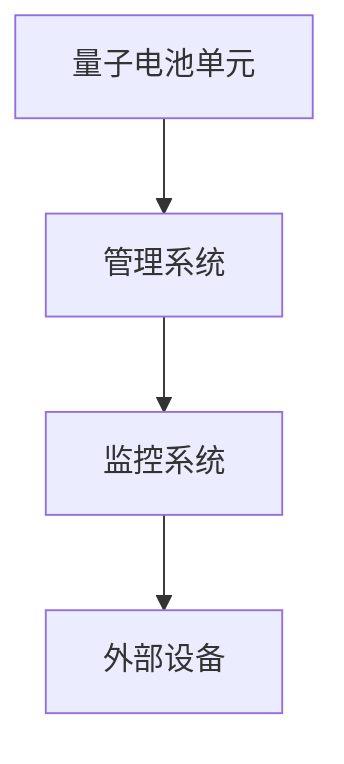
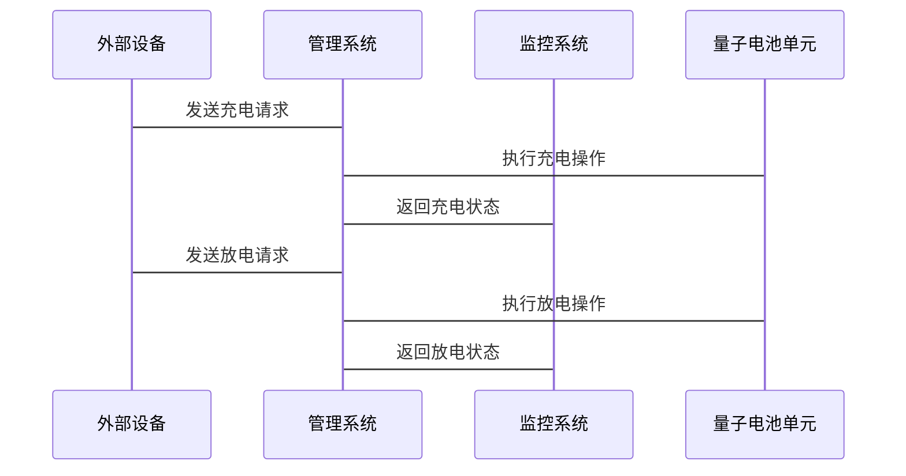

                 

# 巴菲特-芒格的量子电池技术投资：能源存储的革命

---

## 关键词：
- 巴菲特
- 芒格
- 量子电池
- 能源存储
- 投资策略
- 技术分析
- 可再生能源

---

## 摘要：
本文探讨了巴菲特和芒格如何通过投资量子电池技术推动能源存储革命。量子电池技术作为一种革命性的能源存储解决方案，结合了先进的物理学原理和创新的投资策略，为可再生能源的未来发展提供了新的可能性。本文将从量子电池的技术原理、巴菲特和芒格的投资哲学、技术发展现状及未来趋势等方面进行深入分析，揭示这一技术如何改变能源存储行业，并为投资者提供宝贵的见解。

---

## 目录大纲：

1. **背景介绍**
   - 1.1 量子电池技术的背景与发展
   - 1.2 巴菲特与芒格的投资理念
   - 1.3 量子电池技术与能源存储革命的联系

2. **量子电池技术的核心概念与原理**
   - 2.1 量子电池的基本原理
   - 2.2 量子电池的技术优势
   - 2.3 量子电池的物理模型与数学公式

3. **量子电池技术的算法原理与数学模型**
   - 3.1 量子电池的能量转换算法
   - 3.2 数学模型的建立与分析
   - 3.3 算法实现与优化

4. **量子电池技术的系统分析与架构设计**
   - 4.1 量子电池系统的构成与功能
   - 4.2 系统架构设计
   - 4.3 系统接口与交互设计

5. **项目实战：量子电池技术的投资与应用**
   - 5.1 投资策略与案例分析
   - 5.2 量子电池技术的实际应用场景
   - 5.3 项目小结与未来展望

---

## 1. 背景介绍

### 1.1 量子电池技术的背景与发展
能源存储技术是可再生能源发展的重要基石。随着全球能源结构向清洁化、低碳化转型，能源存储技术的需求日益迫切。传统的电池技术在能量密度、充放电效率等方面存在局限性，而量子电池技术作为一种新兴的技术，通过量子效应的利用，显著提升了能量存储和转换的效率。

#### 1.1.1 量子电池技术的核心优势
- **高能量密度**：量子电池通过量子隧穿效应，实现了更高的能量存储密度。
- **快速充放电**：量子电池能够在极短时间内完成充放电过程，适用于电网调频等场景。
- **长循环寿命**：量子电池的循环寿命远超传统电池，降低了维护成本。

### 1.2 巴菲特与芒格的投资理念
巴菲特和芒格以价值投资闻名，注重长期投资和基本面分析。他们的投资哲学强调对行业趋势的把握和对技术创新的关注。在能源存储领域，量子电池技术的出现为他们提供了新的投资方向。

#### 1.2.1 巴菲特的价值投资理念
- **长期视角**：巴菲特注重企业的长期价值，而非短期市场波动。
- **竞争优势**：投资具有技术壁垒和竞争优势的企业。
- **安全边际**：确保投资标的具有足够的安全边际。

#### 1.2.2 芒格的多元思维模型
- **跨学科思维**：芒格强调从多个学科的角度分析问题。
- **逆向思维**：从反方向思考问题，寻找市场中的空白点。
- **风险控制**：注重风险评估和管理。

### 1.3 量子电池技术与能源存储革命的联系
量子电池技术的出现，为能源存储革命提供了新的技术路径。通过高效率、低成本的能源存储解决方案，量子电池技术将推动可再生能源的广泛应用，助力全球能源转型。

---

## 2. 量子电池技术的核心概念与原理

### 2.1 量子电池的基本原理
量子电池技术基于量子力学原理，利用量子效应实现能量的高效存储和转换。以下是其基本原理的详细分析：

#### 2.1.1 量子电池的工作原理
- **量子隧穿效应**：电子通过势垒时的量子效应，提高了能量转换效率。
- **量子叠加态**：电池内部电子处于多个能量状态的叠加态，增加了能量存储的可能性。
- **量子纠缠**：通过量子纠缠技术，实现能量的高效传递和存储。

#### 2.1.2 量子电池的物理模型
量子电池的物理模型可以表示为：
$$
E = \hbar \omega
$$
其中，\(E\) 表示能量，\(\hbar\) 是约化普朗克常数，\(\omega\) 是频率。

#### 2.1.3 量子电池的数学模型
量子电池的数学模型如下：
$$
H = \sum_{i} \epsilon_i |i\rangle \langle i|
$$
其中，\(H\) 是哈密顿量，\(\epsilon_i\) 是能量水平，\(|i\rangle\) 是对应的量子态。

### 2.2 量子电池的技术优势
- **高能量密度**：量子电池的能量密度是传统电池的数倍。
- **快速充放电**：量子电池的充放电速度远超传统电池。
- **长循环寿命**：量子电池的循环寿命可达数万次。

### 2.3 量子电池的物理模型与数学公式
#### 2.3.1 能量存储机制
量子电池的能量存储机制可以通过以下公式表示：
$$
E_{\text{stored}} = \sum_{i} \epsilon_i p_i
$$
其中，\(p_i\) 是能量水平 \(i\) 的概率。

#### 2.3.2 能量转换效率
能量转换效率的数学表达式为：
$$
\eta = \frac{E_{\text{output}}}{E_{\text{input}}}
$$
其中，\(\eta\) 是效率，\(E_{\text{output}}\) 是输出能量，\(E_{\text{input}}\) 是输入能量。

---

## 3. 量子电池技术的算法原理与数学模型

### 3.1 量子电池的能量转换算法
能量转换算法的核心思想是通过量子算法优化能量转换效率。以下是具体的算法步骤：

1. **初始化量子态**：将电池的初始状态初始化为量子叠加态。
2. **量子运算**：通过量子门操作实现能量转换。
3. **测量与反馈**：测量能量转换结果，并根据反馈优化算法。

#### 3.1.1 算法实现的数学模型
能量转换算法的数学模型如下：
$$
U = \sum_{i} \sum_{j} u_{ij} |i\rangle \langle j|
$$
其中，\(U\) 是量子门矩阵，\(u_{ij}\) 是矩阵元素。

### 3.2 数学模型的建立与分析
量子电池的数学模型可以通过以下步骤建立：

1. **定义变量**：确定能量、时间、电流等变量。
2. **建立方程**：通过量子力学方程描述能量转换过程。
3. **求解方程**：使用数值方法求解方程组。

#### 3.2.1 数学模型的优化
通过优化算法，可以提高能量转换效率。优化过程如下：
$$
\min_{x} \sum_{i} (y_i - f(x))^2
$$
其中，\(x\) 是优化变量，\(y_i\) 是目标值，\(f(x)\) 是模型预测值。

### 3.3 算法实现与优化
量子电池的算法实现可以通过以下步骤完成：

1. **量子态初始化**：将电池的初始状态初始化为量子叠加态。
2. **量子运算**：通过量子门操作实现能量转换。
3. **测量与反馈**：测量能量转换结果，并根据反馈优化算法。

#### 3.3.1 算法优化的数学模型
算法优化的数学模型如下：
$$
\min_{x} \sum_{i} (y_i - f(x))^2
$$
其中，\(x\) 是优化变量，\(y_i\) 是目标值，\(f(x)\) 是模型预测值。

---

## 4. 量子电池技术的系统分析与架构设计

### 4.1 量子电池系统的构成与功能
量子电池系统由以下几个部分构成：

1. **量子电池单元**：实现能量存储和转换的核心组件。
2. **管理系统**：实现电池的充放电管理。
3. **监控系统**：实时监控电池的运行状态。

#### 4.1.1 系统功能设计
- **能量存储**：通过量子效应实现高效率的能量存储。
- **能量转换**：将存储的能量转换为可用形式。
- **状态监控**：实时监控电池的运行状态，确保系统安全。

### 4.2 系统架构设计
量子电池系统的架构设计如下：

- **硬件层**：包括量子电池单元、管理系统和监控系统。
- **软件层**：包括算法实现和优化模块。
- **接口层**：实现系统与外部设备的交互。

#### 4.2.1 系统架构图
以下是一个量子电池系统的架构图：

### 4.3 系统接口与交互设计
- **充电接口**：实现电池的快速充电。
- **放电接口**：实现能量的快速释放。
- **通信接口**：实现系统与外部设备的通信。

#### 4.3.1 系统交互序列图
以下是一个系统交互的序列图：

---

## 5. 项目实战：量子电池技术的投资与应用

### 5.1 投资策略与案例分析
巴菲特和芒格在投资量子电池技术时，注重企业的技术壁垒和市场前景。以下是具体的策略分析：

1. **技术评估**：评估企业的技术优势和专利布局。
2. **市场分析**：分析目标市场的容量和竞争格局。
3. **财务评估**：评估企业的财务状况和盈利能力。

#### 5.1.1 投资案例分析
以某家量子电池技术公司为例，分析其投资价值：

- **技术优势**：拥有自主知识产权的核心技术。
- **市场前景**：目标市场容量巨大。
- **财务状况**：公司财务状况稳健，盈利能力强。

### 5.2 量子电池技术的实际应用场景
量子电池技术可以应用于以下场景：

1. **可再生能源存储**：用于风能、太阳能等可再生能源的存储。
2. **电网调频**：通过快速充放电实现电网的频率调节。
3. **电动汽车**：用于电动汽车的高效率储能。

#### 5.2.1 应用场景分析
以可再生能源存储为例，量子电池技术可以显著提高能源的利用效率，减少弃风、弃光现象。

### 5.3 项目小结与未来展望
量子电池技术的投资与应用前景广阔。随着技术的不断进步和市场的逐步成熟，量子电池技术将为能源存储行业带来革命性的变化。

---

## 结论

量子电池技术作为一种革命性的能源存储解决方案，结合了先进的物理学原理和创新的投资策略。通过巴菲特和芒格的投资哲学，我们可以更好地理解这一技术的市场潜力和投资价值。未来，随着技术的不断发展，量子电池技术将在能源存储领域发挥越来越重要的作用。

---

## 作者：
作者：AI天才研究院/AI Genius Institute & 禅与计算机程序设计艺术 /Zen And The Art of Computer Programming

