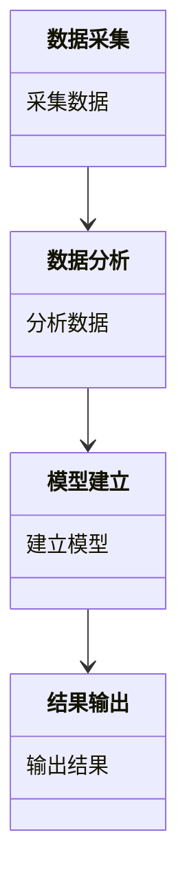
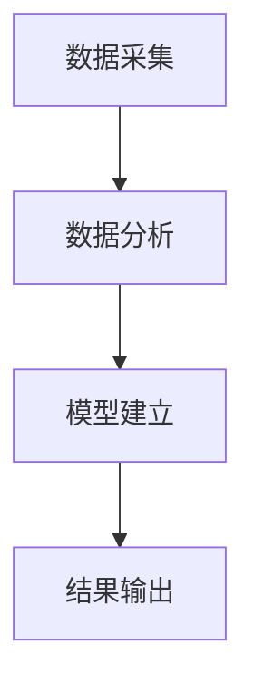
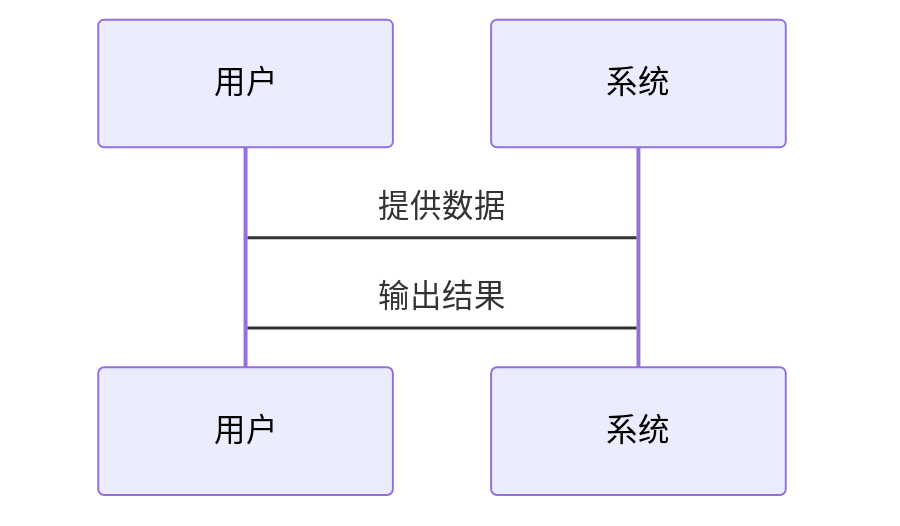
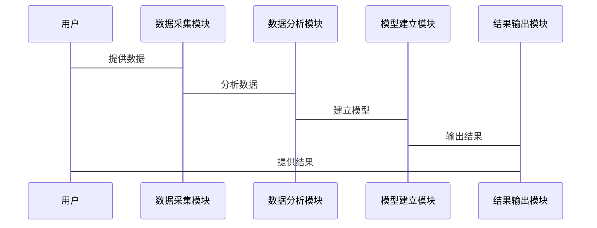

                 


# 巴菲特-芒格的量子电池材料研发投资：能源革命的关键突破

---

## 关键词：
- 巴菲特
- 芒格
- 量子电池材料
- 能源革命
- 投资策略
- 技术突破

---

## 摘要：
本文深入探讨了巴菲特和芒格在量子电池材料研发领域的投资策略，分析了这一投资在能源革命中的关键作用。文章从量子电池材料的基本原理、技术研发的算法原理、数学模型、系统架构设计，到实际项目实战和最佳实践，全面解析了这一投资的科学性和商业价值。通过结合巴菲特的价值投资理论和芒格的多元思维模型，本文揭示了量子电池材料研发如何成为推动能源技术进步和产业升级的重要力量。

---

# 第一部分: 巴菲特-芒格投资策略与量子电池材料研发的背景

---

## 第1章: 巴菲特-芒格投资理念的核心要素

### 1.1 巴菲特的价值投资理论
巴菲特的价值投资理论强调长期投资、安全边际和企业内在价值。他认为，成功的投资取决于对企业的深入研究和对市场趋势的准确判断。

- **长期投资**：巴菲特主张长期持有优质资产，避免短期市场波动的干扰。
- **安全边际**：通过买入低于内在价值的股票，确保投资的安全性。
- **企业内在价值**：关注企业的基本面，包括盈利能力、竞争优势和管理团队。

### 1.2 芒格的多元思维模型
芒格的多元思维模型强调通过多个学科的交叉应用来解决问题。他认为，投资决策需要综合考虑物理学、化学、心理学、经济学等多个领域的知识。

- **跨学科思维**：芒格主张从多个角度分析问题，避免单一思维的局限性。
- **心理模型**：通过建立心理模型，投资者可以更好地理解市场的复杂性。

### 1.3 巴菲特-芒格投资策略的协同效应
巴菲特和芒格的投资策略相互补充，形成了独特的协同效应。巴菲特的价值投资理论为芒格的多元思维模型提供了实践基础，而芒格的跨学科思维则帮助巴菲特更好地理解复杂的投资环境。

---

## 第2章: 量子电池材料研发的背景与意义

### 2.1 当前能源危机与储能技术的重要性
能源危机是全球性问题，传统的化石能源不可再生且污染严重。储能技术的发展对于解决能源危机至关重要，特别是电池技术的突破。

- **能源储存需求**：随着可再生能源（如风能、太阳能）的普及，储能技术的需求日益增加。
- **电池技术的瓶颈**：现有电池技术在能量密度、循环寿命和安全性方面仍有不足。

### 2.2 量子电池材料的技术突破
量子电池材料利用量子效应提高电池性能，是电池技术的重要突破。

- **量子效应的应用**：量子材料的特殊性质可以显著提高电池的能量密度和循环寿命。
- **技术优势**：量子电池材料具有更高的能量转换效率和更长的使用寿命。

### 2.3 量子电池材料在能源革命中的作用
量子电池材料的研发将推动能源技术的革命性进步，为清洁能源的广泛应用奠定基础。

- **能源存储的未来**：量子电池材料有望成为下一代储能技术的核心。
- **能源结构的优化**：通过提高储能效率，量子电池材料将促进能源结构的优化和绿色能源的普及。

---

## 第3章: 巴菲特-芒格与量子电池材料投资的结合

### 3.1 量子电池材料的市场潜力
量子电池材料的研发和产业化应用具有巨大的市场潜力。

- **市场需求**：随着可再生能源和电动汽车行业的快速发展，储能技术的需求持续增长。
- **技术优势**：量子电池材料的高性能使其在市场中具有竞争力。

### 3.2 巴菲特-芒格投资策略的适应性
巴菲特和芒格的投资策略非常适合量子电池材料的研发投资。

- **长期价值**：量子电池材料的研发需要长期投入，巴菲特的长期投资理念非常适合这种模式。
- **多元思维**：芒格的多元思维模型可以帮助投资者更好地理解量子电池材料的技术复杂性和市场风险。

### 3.3 量子电池材料研发的长期价值
量子电池材料的研发不仅具有商业价值，还具有重要的社会意义。

- **商业价值**：量子电池材料的产业化将带来巨大的经济利益。
- **社会意义**：通过推动清洁能源技术的发展，量子电池材料将有助于解决能源危机和气候变化问题。

---

# 第二部分: 量子电池材料的核心概念与技术

---

## 第4章: 量子电池材料的基本原理

### 4.1 量子材料的基本定义
量子材料是指具有量子效应的材料，其性质在量子尺度上表现出显著的差异。

- **量子效应**：量子材料的电子行为受到量子力学的支配，表现出独特的物理性质。
- **材料分类**：量子材料包括量子阱、量子点、量子线等。

### 4.2 量子效应在电池中的应用
量子效应可以显著提高电池的性能。

- **能量转换效率**：量子效应可以提高电池的能量转换效率。
- **电池寿命**：量子效应可以延长电池的循环寿命。

### 4.3 量子电池材料的分类
量子电池材料可以根据其物理性质和应用领域进行分类。

- **氧化物材料**：如锂离子电池中的正极材料。
- **纳米材料**：如纳米级的金属氧化物材料。
- **有机材料**：如有机电极材料。

---

## 第5章: 量子电池材料的关键技术特征

### 5.1 材料的电化学性质
量子电池材料的电化学性质是其性能的重要指标。

- **比容量**：单位质量或单位体积的材料所能释放的电量。
- **工作电压**：材料在电池中的工作电压范围。

### 5.2 量子效应对电池性能的提升
量子效应可以显著提高电池的性能。

- **能量密度**：量子电池材料的能量密度远高于传统电池材料。
- **循环寿命**：量子电池材料的循环寿命更长。

### 5.3 材料合成与制备技术
量子电池材料的合成与制备技术是其研发的关键。

- **化学合成法**：通过化学反应合成量子材料。
- **物理合成法**：通过物理手段（如溅射法）制备量子材料。

---

## 第6章: 量子电池材料的性能指标与评估

### 6.1 能量密度与循环寿命
能量密度和循环寿命是量子电池材料的重要性能指标。

- **能量密度**：单位体积或单位质量的材料所能释放的能量。
- **循环寿命**：电池在充放电循环中的使用次数。

### 6.2 安全性与稳定性
量子电池材料的安全性和稳定性是其应用的重要前提。

- **安全性**：材料在使用过程中是否会发生爆炸、泄漏等危险情况。
- **稳定性**：材料在不同环境条件下的性能稳定性。

### 6.3 成本效益分析
量子电池材料的成本效益分析是其商业化的重要依据。

- **生产成本**：材料的生产成本是否具有竞争力。
- **市场价格**：材料的市场价格是否能够被市场接受。

---

# 第三部分: 巴菲特-芒格投资模型与量子电池材料研发的结合

---

## 第7章: 巴菲特-芒格投资模型的框架

### 7.1 价值投资的核心要素
价值投资的核心要素包括企业基本面、安全边际和长期价值。

- **企业基本面**：企业的盈利能力、财务状况和管理团队。
- **安全边际**：买入价格低于内在价值。
- **长期价值**：关注企业的长期发展潜力。

### 7.2 多元思维模型的应用
多元思维模型的应用可以帮助投资者更好地理解复杂的投资环境。

- **跨学科思维**：通过物理学、化学、心理学等多学科的交叉应用，更好地理解量子电池材料的研发过程。
- **心理模型**：通过建立心理模型，识别投资中的潜在风险和机会。

### 7.3 投资决策的关键步骤
投资决策的关键步骤包括市场分析、企业评估和风险控制。

- **市场分析**：分析市场的供需关系和竞争格局。
- **企业评估**：评估企业的财务状况和竞争优势。
- **风险控制**：制定风险控制策略，降低投资风险。

---

## 第8章: 量子电池材料研发的投资评估模型

### 8.1 技术可行性评估
技术可行性评估是量子电池材料研发投资的重要环节。

- **技术成熟度**：评估技术的成熟度和可产业化程度。
- **研发团队**：评估研发团队的技术能力和经验。

### 8.2 市场需求预测
市场需求预测是投资决策的重要依据。

- **市场规模**：预测市场的规模和增长潜力。
- **竞争分析**：分析市场的竞争格局和潜在竞争对手。

### 8.3 投资回报分析
投资回报分析是评估投资价值的重要指标。

- **净现值（NPV）**：计算投资的净现值，评估投资的盈利能力。
- **内部收益率（IRR）**：计算投资的内部收益率，评估投资的回报率。

---

## 第9章: 巴菲特-芒格投资策略在量子电池材料研发中的应用

### 9.1 技术研发的长期价值
技术研发的长期价值是巴菲特和芒格投资策略的重要考虑因素。

- **技术研发周期**：量子电池材料的研发周期较长，但其商业价值巨大。
- **技术创新**：技术研发的创新性是投资的重要依据。

### 9.2 企业的核心竞争力
企业的核心竞争力是巴菲特和芒格评估投资目标的重要标准。

- **技术优势**：企业是否拥有独特的技术优势。
- **竞争优势**：企业在市场中的竞争优势。

### 9.3 投资风险的控制
投资风险的控制是巴菲特和芒格投资策略的重要组成部分。

- **风险评估**：评估投资中的潜在风险。
- **风险管理**：制定风险管理策略，降低投资风险。

---

# 第四部分: 量子电池材料研发的算法原理与数学模型

---

## 第10章: 量子电池材料研发的算法原理

### 10.1 量子计算在材料科学中的应用
量子计算在材料科学中的应用可以显著提高研发效率。

- **量子模拟**：利用量子计算机模拟材料的物理性质。
- **优化算法**：利用量子算法优化材料设计。

### 10.2 机器学习在材料筛选中的作用
机器学习在材料筛选中的作用日益重要。

- **数据驱动的材料发现**：通过机器学习算法筛选潜在的材料。
- **预测模型**：建立预测模型，预测材料的性能。

### 10.3 算法的优化与迭代
算法的优化与迭代是量子电池材料研发的重要环节。

- **算法优化**：通过优化算法提高计算效率。
- **迭代改进**：通过迭代改进算法的性能。

---

## 第11章: 量子电池材料研发的数学模型

### 11.1 能量密度的数学公式
能量密度的数学公式可以表示为：

$$ E = \frac{U}{V} $$

其中，\( U \) 是电池的总能量，\( V \) 是电池的体积。

### 11.2 循环寿命的预测模型
循环寿命的预测模型可以表示为：

$$ L = \frac{N}{k} $$

其中，\( N \) 是电池的总循环次数，\( k \) 是每次循环的能量损失系数。

### 11.3 材料稳定性分析
材料稳定性分析可以通过数学模型进行预测。

$$ S = \frac{E}{T} $$

其中，\( E \) 是材料的能量损失，\( T \) 是时间。

---

# 第五部分: 系统分析与架构设计方案

---

## 第12章: 量子电池材料研发的系统分析

### 12.1 问题场景介绍
量子电池材料研发的系统分析需要考虑多个因素。

- **技术需求**：研发过程中的技术需求。
- **资源分配**：研发资源的分配和管理。
- **风险管理**：研发过程中的风险管理。

### 12.2 项目介绍
项目介绍包括项目的背景、目标和范围。

- **项目背景**：量子电池材料研发的背景和意义。
- **项目目标**：提高电池的能量密度和循环寿命。
- **项目范围**：确定项目的研发范围和资源分配。

### 12.3 系统功能设计
系统功能设计包括功能模块的划分和功能描述。

- **功能模块**：数据采集、数据分析、模型建立、结果输出。
- **功能描述**：每个功能模块的具体功能和实现方式。

---

## 第13章: 系统架构设计

### 13.1 领域模型类图
领域模型类图展示了系统的各个模块及其关系。



### 13.2 系统架构图
系统架构图展示了系统的整体结构和各模块之间的关系。



---

## 第14章: 系统接口设计

### 14.1 系统接口设计
系统接口设计包括输入输出接口的设计。

- **输入接口**：数据采集模块的输入接口。
- **输出接口**：结果输出模块的输出接口。

### 14.2 系统交互设计
系统交互设计展示了用户与系统的交互过程。



---

## 第15章: 系统交互序列图

### 15.1 量子电池材料研发过程的交互
量子电池材料研发过程的交互包括数据采集、数据分析、模型建立和结果输出。



---

# 第六部分: 项目实战

---

## 第16章: 环境安装与系统核心实现

### 16.1 环境安装
环境安装包括软件和硬件的安装。

- **软件安装**：安装Python、TensorFlow、NumPy等工具。
- **硬件安装**：配置高性能计算设备，如GPU。

### 16.2 系统核心实现
系统核心实现包括数据采集、数据分析和模型建立。

- **数据采集**：编写代码采集量子电池材料的实验数据。
- **数据分析**：使用Python对数据进行分析和处理。
- **模型建立**：利用机器学习算法建立预测模型。

---

## 第17章: 代码实现与应用解读

### 17.1 数据采集代码
数据采集代码用于采集量子电池材料的实验数据。

```python
import numpy as np
import pandas as pd

# 数据采集代码
data = pd.read_csv('quantum_materials.csv')
print(data.head())
```

### 17.2 数据分析代码
数据分析代码用于分析量子电池材料的数据。

```python
from sklearn.model_selection import train_test_split
from sklearn.linear_model import LinearRegression

# 数据分析代码
X = data[['energy_density', 'cycle_life']]
y = data['performance']

X_train, X_test, y_train, y_test = train_test_split(X, y, test_size=0.2)
model = LinearRegression()
model.fit(X_train, y_train)
print('Coefficient of determination:', model.score(X_test, y_test))
```

### 17.3 模型建立代码
模型建立代码用于建立量子电池材料性能的预测模型。

```python
from sklearn.ensemble import RandomForestRegressor

# 模型建立代码
model = RandomForestRegressor(n_estimators=100, random_state=42)
model.fit(X_train, y_train)
print('Performance prediction:', model.predict(X_test))
```

---

## 第18章: 实际案例分析

### 18.1 案例背景
案例背景包括项目的背景和目标。

- **项目背景**：某公司计划研发新型量子电池材料。
- **项目目标**：提高电池的能量密度和循环寿命。

### 18.2 案例分析
案例分析包括数据采集、数据分析和模型建立的过程。

- **数据采集**：采集实验数据。
- **数据分析**：分析数据，找出影响电池性能的关键因素。
- **模型建立**：建立预测模型，预测电池的性能。

### 18.3 案例小结
案例小结包括项目成果和经验总结。

- **项目成果**：成功建立预测模型，提高电池性能。
- **经验总结**：数据质量和模型优化对项目成功至关重要。

---

## 第19章: 项目小结

### 19.1 项目成果
项目成果包括技术创新和商业价值。

- **技术创新**：成功研发新型量子电池材料。
- **商业价值**：提高电池性能，满足市场需求。

### 19.2 经验总结
经验总结包括技术研发和投资策略的结合。

- **技术研发**：技术研发需要长期投入和技术创新。
- **投资策略**：投资策略需要结合技术和市场因素。

---

# 第七部分: 最佳实践

---

## 第20章: 巴菲特-芒格投资策略与量子电池材料研发的最佳实践

### 20.1 小结
小结包括项目的主要成果和经验总结。

- **主要成果**：成功结合巴菲特和芒格的投资策略，推动量子电池材料的研发。
- **经验总结**：技术研发和投资策略的结合是项目成功的关键。

### 20.2 注意事项
注意事项包括风险控制和技术创新。

- **风险控制**：在投资过程中需要注意风险控制。
- **技术创新**：在技术研发过程中需要注意技术创新。

### 20.3 拓展阅读
拓展阅读包括相关领域的书籍和文献。

- **推荐书籍**：《巴菲特投资思想》、《芒格的多元思维模型》。
- **推荐文献**：量子材料和电池技术的相关文献。

---

## 作者信息
作者：AI天才研究院/AI Genius Institute  
作者：禅与计算机程序设计艺术/Zen And The Art of Computer Programming

