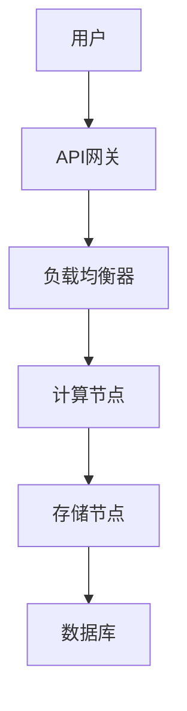

                 

# 巴菲特-芒格的量子计算云服务投资：计算能力民主化

---

## 关键词：
- 巴菲特投资理念
- 芒格多元思维模型
- 量子计算
- 云计算服务
- 计算能力民主化
- 投资策略
- 数学模型

---

## 摘要：
本文探讨了巴菲特和芒格的投资理念与量子计算云服务的结合，分析了量子计算的核心原理、云计算的商业模式以及投资策略。通过详细讲解量子计算的数学基础、算法原理和系统架构，结合实际案例，展示了如何将量子计算应用于投资领域，实现计算能力的民主化。文章还提供了系统的架构设计和投资策略的数学模型，为读者提供了从理论到实践的全面指导。

---

# 目录大纲

---

## 第一部分：巴菲特与芒格的投资理念

### 第1章：巴菲特的价值投资理论与芒格的多元思维模型

#### 1.1 巴菲特的价值投资理念
- 价值投资的核心思想
- 投资的长期性与安全性
- 股票的内在价值与市场价值

#### 1.2 芒格的多元思维模型
- 多元思维的核心概念
- 跨学科思考的重要性
- 芒格的成功投资案例

#### 1.3 巴菲特与芒格理念的结合
- 价值投资与多元思维的融合
- 长期投资策略的优化
- 投资决策的科学化与系统化

---

## 第二部分：量子计算的基本原理

### 第2章：量子计算的数学基础与算法原理

#### 2.1 量子计算的核心概念
- 量子位（qubit）的定义与特性
- 量子叠加与量子纠缠的原理
- 量子门与量子电路的数学表示

#### 2.2 量子算法的核心原理
- Shor算法的数学模型与应用
- Grover算法的优化原理
- 量子傅里叶变换的实现

#### 2.3 量子计算的数学公式
- 量子态的张量积表示
$$
|\psi\rangle = \alpha|0\rangle + \beta|1\rangle
$$
- 量子门的矩阵表示
$$
U = \begin{pmatrix}
\cos\theta & -\sin\theta \\
\sin\theta & \cos\theta
\end{pmatrix}
$$
- 量子算法的复杂度分析

---

### 第3章：云计算服务的系统架构与实现

#### 3.1 云计算服务的系统架构
- 云计算的分层架构
- 资源池化的核心思想
- 云计算的弹性伸缩机制

#### 3.2 云计算服务的系统实现
- 虚拟化技术的实现
- 分布式计算的实现
- 容器化技术的应用

#### 3.3 云计算服务的系统架构图

---

## 第三部分：量子计算云服务的投资策略

### 第4章：量子计算云服务的市场分析与投资机会

#### 4.1 量子计算的市场需求
- 量子计算的应用领域
- 云计算服务的市场趋势
- 量子计算云服务的市场潜力

#### 4.2 巴菲特与芒格的投资策略
- 巴菲特的价值投资策略
- 芒格的多元思维模型
- 量子计算云服务的投资机会

#### 4.3 投资策略的数学模型
- 投资组合优化的数学公式
$$
\max \sum_{i=1}^{n} w_i r_i - \lambda \sum_{i=1}^{n} w_i^2
$$
- 风险与收益的平衡

---

### 第5章：量子计算云服务的投资实战

#### 5.1 量子计算云服务的实际应用
- 量子计算在金融领域的应用
- 云计算服务在投资中的优化作用

#### 5.2 投资案例分析
- 巴菲特与芒格的经典投资案例
- 量子计算云服务的实际投资案例

#### 5.3 投资策略的优化与调整
- 风险管理的数学模型
$$
\text{风险调整后收益} = \text{收益} - \text{风险} \times \text{风险溢价}
$$
- 投资组合的动态优化

---

## 第四部分：计算能力的民主化

### 第6章：计算能力民主化的实现路径

#### 6.1 量子计算的民主化
- 量子计算的普及化趋势
- 云计算服务的普惠性

#### 6.2 计算能力民主化的社会影响
- 科技的公平分配
- 投资机会的平等化

#### 6.3 未来展望
- 量子计算云服务的未来发展
- 巴菲特与芒格投资理念的延续与创新

---

## 第五部分：总结与展望

### 第7章：总结与展望

#### 7.1 本文的核心观点
- 巴菲特与芒格投资理念的现代应用
- 量子计算云服务的投资潜力

#### 7.2 未来的研究方向
- 量子计算的进一步发展
- 投资策略的持续优化

---

## 参考文献与推荐阅读

---

## 作者信息

作者：AI天才研究院/AI Genius Institute & 禅与计算机程序设计艺术/Zen And The Art of Computer Programming

---

这个目录大纲涵盖了从巴菲特和芒格的投资理念到量子计算云服务的投资策略，再到计算能力民主化的实现，内容详实且结构清晰。每个章节都包含必要的背景介绍、核心概念、算法原理和系统架构设计，同时结合实际案例进行详细分析。文章的结尾部分还展望了未来的研究方向，为读者提供了全面的视角和深入的思考。

