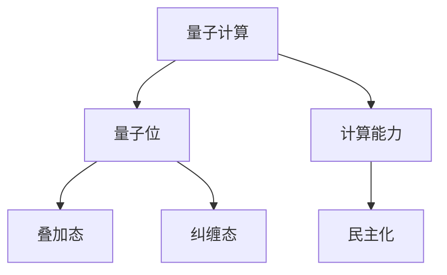
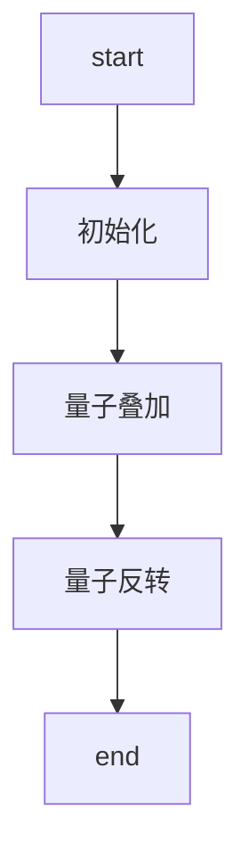
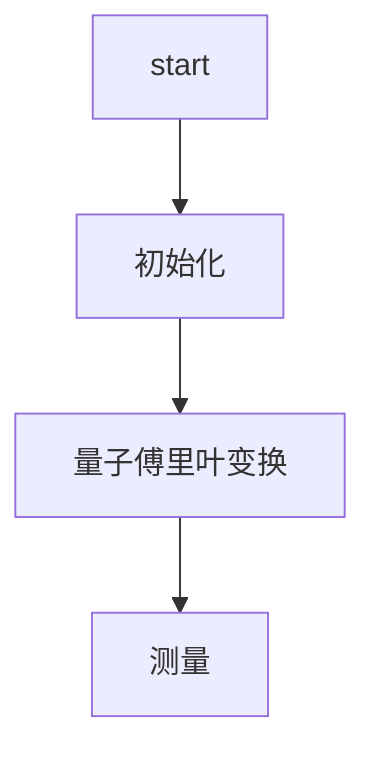
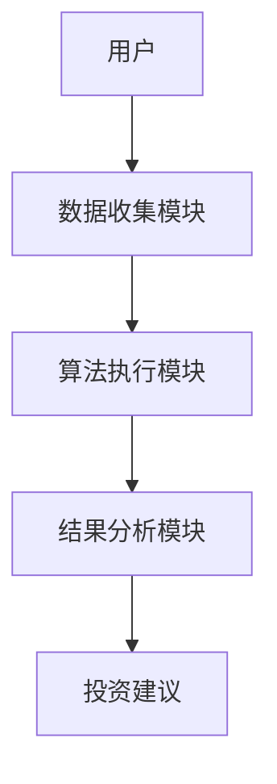

                 


# 巴菲特-芒格的量子计算云服务投资：计算能力民主化的新纪元

## 关键词：量子计算，云计算，投资策略，巴菲特，芒格

## 摘要：
本文探讨了量子计算云服务如何推动计算能力的民主化，以及巴菲特和芒格的投资理念如何影响这一进程。通过详细分析量子计算的基本原理、其在投资领域的应用潜力，以及如何与云计算技术结合，文章展示了计算能力民主化的新纪元。

---

## 第一部分：量子计算云服务的背景与现状

### 第1章：量子计算的基本概念

#### 1.1 量子计算的定义与特点
- **1.1.1 量子计算的定义**  
  量子计算是一种基于量子力学原理的计算方式，利用量子位（qubits）进行信息处理。与经典计算机的二进制位不同，量子位可以同时处于0和1的叠加态。

- **1.1.2 量子计算的特点**  
  量子计算具有并行性、叠加性和纠缠性。这些特性使得量子计算机在处理某些复杂问题时远快于经典计算机。

- **1.1.3 量子计算在投资领域的潜力**  
  量子计算可以用于优化投资组合、风险分析和市场预测，帮助投资者做出更明智的决策。

#### 1.2 巴菲特与芒格的投资理念
- **1.2.1 巴菲特的价值投资策略**  
  巴菲特强调长期投资、价值投资和安全边际，注重企业的内在价值和长期盈利能力。

- **1.2.2 芒格的多元思维模型**  
  芒格提倡通过跨学科的思维方式来分析问题，强调理解事物的底层逻辑和相互关系。

- **1.2.3 投资与技术进步的结合**  
  技术进步，尤其是量子计算，为投资领域带来了新的可能性，巴菲特和芒格的理念为如何利用这些技术提供了指导。

#### 1.3 量子计算云服务的兴起
- **1.3.1 云计算的演变与量子计算的结合**  
  云计算提供了强大的计算资源，而量子计算的加入进一步提升了计算能力，使得更多人能够接触到量子计算的优势。

- **1.3.2 量子计算云服务的优势与挑战**  
  优势包括资源利用率高、按需付费和易于访问；挑战包括技术复杂性和成本问题。

- **1.3.3 计算能力民主化的新纪元**  
  量子计算云服务使得量子计算资源不再是少数人的专属，普通人也能利用这些资源进行计算和投资。

---

## 第二部分：量子计算的核心概念与联系

### 第2章：量子计算的核心原理

#### 2.1 量子位与叠加态
- **量子位（Qubit）**  
  量子位是量子计算的基本单位，可以同时表示0和1的叠加态。通过量子叠加，量子计算机可以在同一时间处理多种可能性。

- **量子纠缠**  
  量子纠缠是指两个或多个量子位之间的关联，无论距离多远，其中一个的状态会直接影响另一个的状态。

#### 2.2 传统计算与量子计算的对比
- **计算速度**  
  量子计算机在某些特定问题上（如大数分解和优化问题）比经典计算机快得多。

- **应用领域**  
  量子计算在密码学、药物发现和金融建模等领域具有重要应用。

- **对比表格**  
  | 特性           | 传统计算         | 量子计算         |
  |----------------|------------------|------------------|
  | 处理速度       | 较慢             | 快速（特定问题） |
  | 资源利用       | 高               | 更高效           |
  | 应用领域       | 数据处理、存储   | 优化、密码学     |

#### 2.3 核心概念的关系图



---

## 第三部分：量子计算的算法原理

### 第3章：量子算法的实现

#### 3.1 Grover算法
- **Grover算法的作用**  
  Grover算法用于在无序数据库中进行搜索，其复杂度为O(√N)，远低于经典算法的O(N)。

- **算法流程图**



- **Python代码示例**

```python
import numpy as np

def grover(n):
    # 初始化量子位
    q = np.array([1, 0])
    # 量子叠加
    q = np.sqrt(0.5) * [1, 1]
    # 量子反转
    amplitude = np.dot(q, np.array([[0, 1], [1, 0]]))
    return amplitude

print(grover(2))
```

#### 3.2 Shor算法
- **Shor算法的作用**  
  Shor算法用于大数分解，是量子计算机在密码学中的重要应用。

- **算法流程图**



- **数学模型**

$$
f(x) = x^2 \mod n
$$

---

## 第四部分：系统分析与架构设计方案

### 第4章：系统设计与架构

#### 4.1 问题场景介绍
- **企业投资优化**  
  企业利用量子计算云服务优化投资组合，降低风险，提高收益。

#### 4.2 系统功能设计
- **数据收集模块**  
  收集市场数据、公司财报等信息。

- **算法执行模块**  
  执行量子算法，进行投资组合优化和风险分析。

- **结果分析模块**  
  分析结果，生成投资建议。

#### 4.3 系统架构设计



---

## 第五部分：项目实战

### 第5章：量子计算云服务的实现与应用

#### 5.1 环境安装
- **安装量子计算SDK**  
  使用Qiskit或Cirq等量子计算库。

#### 5.2 核心代码实现

```python
from qiskit import QuantumCircuit, execute, Aer

# 创建量子电路
qc = QuantumCircuit(2, 1)
qc.h(0)
qc.cnot(0, 1)
qc.measure(0, 0)

# 执行电路
backend = Aer.get_backend('qasm_simulator')
job = execute(qc, backend)
result = job.result()

print(result.counts)
```

#### 5.3 案例分析
- **投资组合优化**  
  使用量子计算优化投资组合，降低风险，提高收益。

---

## 第六部分：最佳实践与总结

### 第6章：最佳实践与总结

#### 6.1 小结
- 量子计算云服务为投资领域带来了新的可能性，计算能力的民主化使得更多人能够接触到这些技术。

#### 6.2 注意事项
- 数据隐私和计算资源分配是需要关注的问题。

#### 6.3 拓展阅读
- 推荐阅读《量子计算入门》和《巴菲特投资策略》。

---

## 作者：AI天才研究院 & 禅与计算机程序设计艺术

---

以上是文章的完整目录和内容框架，涵盖了从量子计算的基本概念到实际应用的各个方面，结合了巴菲特和芒格的投资理念，详细分析了量子计算云服务在投资领域的潜力和应用。

