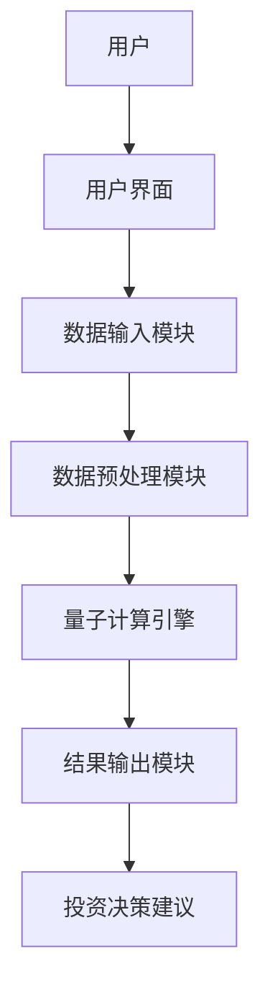
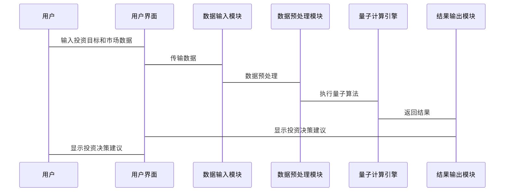

                 


```markdown
# 巴菲特-芒格的量子计算投资观：未来科技的潜在影响

## 关键词
- 巴菲特投资观
- 量子计算
- 量子投资模型
- 投资分析
- 量子算法

## 摘要
本文探讨巴菲特和芒格的投资理念与量子计算的结合，分析量子计算在投资分析中的应用，构建量子计算投资观模型，并讨论其未来影响。通过量子计算的投资观模型，投资者可以利用量子算法优化投资策略，提升决策的准确性和效率。

---

# 第一部分: 巴菲特-芒格投资观与量子计算的结合

## 第1章: 巴菲特-芒格投资观概述

### 1.1 巴菲特-芒格投资观的核心理念

#### 1.1.1 巴菲特的价值投资理论
- **长期价值投资**：巴菲特强调长期持有优质资产，关注企业的内在价值。
- **安全边际**：通过购买价格低于内在价值的股票，降低投资风险。
- **企业基本面分析**：关注企业的盈利能力、财务状况和行业地位。

#### 1.1.2 芒格的多元思维模型
- **多学科视角**：芒格提倡从多个学科（心理学、经济学、物理学等）分析问题。
- **决策树模型**：通过构建决策树，分析可能的决策路径和结果。
- **逆向思维**：从反方向思考问题，寻找竞争优势。

#### 1.1.3 投资观的现代发展与挑战
- **传统投资观的局限性**：依赖历史数据和线性模型，难以应对非线性变化。
- **现代投资挑战**：复杂市场、高频交易和大数据带来的挑战。
- **技术驱动的变革**：人工智能和量子计算为投资分析带来新机遇。

### 1.2 量子计算的基本概念

#### 1.2.1 量子计算的定义
- 量子计算利用量子位（qubit）进行信息处理，基于量子叠加和纠缠原理。
- 量子位可以同时处于多个状态，提供并行计算能力。

#### 1.2.2 量子计算与经典计算的区别
- **并行性**：量子计算可以同时处理大量可能性，而经典计算按顺序处理。
- **计算速度**：在某些复杂问题上，量子计算速度远超经典计算。
- **数据表示**：量子位利用叠加态表示数据，经典位使用二进制。

#### 1.2.3 量子计算的核心原理
- **叠加态**：量子位可以同时处于0和1的状态。
- **纠缠态**：两个或多个量子位之间形成强关联，影响彼此的状态。
- **量子门**：通过量子门操作，实现量子态的变换。

### 1.3 巴菲特-芒格投资观与量子计算的结合

#### 1.3.1 投资观中的量子思维
- **量子思维的引入**：将量子叠加态应用于投资决策，考虑多种可能性。
- **非线性关系**：利用量子计算处理复杂非线性关系，提升预测准确性。
- **全局优化**：量子计算能够全局优化投资组合，避免局部最优。

#### 1.3.2 量子计算在投资分析中的潜在应用
- **风险评估**：通过量子算法评估市场风险，优化投资组合。
- **市场预测**：利用量子计算处理大数据，预测市场趋势。
- **投资组合优化**：通过量子优化算法找到最优资产配置。

#### 1.3.3 结合投资观与量子计算的必要性
- **技术驱动的必要性**：传统方法难以应对复杂市场环境。
- **效率提升**：量子计算提高投资分析效率和准确性。
- **竞争优势**：利用量子计算获得投资优势。

---

## 第2章: 量子计算在投资分析中的应用

### 2.1 量子计算在风险评估中的应用

#### 2.1.1 量子算法在风险评估中的优势
- **并行计算能力**：量子算法同时评估多种风险因素。
- **非线性关系处理**：量子算法擅长处理复杂非线性关系。
- **风险因子分析**：通过量子计算分析多个风险因子的相互作用。

#### 2.1.2 量子计算在市场波动预测中的应用
- **量子时间序列分析**：利用量子算法预测市场波动。
- **量子回归分析**：分析市场变量之间的关系，预测价格走势。
- **量子异常检测**：识别市场中的异常波动和潜在风险。

#### 2.1.3 投资组合优化的量子方法
- **量子优化算法**：通过量子计算优化投资组合，降低风险。
- **量子组合优化**：寻找最优资产配置，平衡风险和收益。
- **量子风险对冲**：利用量子计算进行风险对冲，降低投资组合波动。

### 2.2 量子计算在市场预测中的应用

#### 2.2.1 量子计算在股票筛选中的应用
- **量子多因子模型**：筛选具有高收益潜力的股票。
- **量子因子分析**：分析多个因子对股票的影响，优化投资决策。
- **量子市场细分**：根据量子计算结果，细分市场，寻找投资机会。

#### 2.2.2 量子计算在市场情绪分析中的应用
- **量子自然语言处理**：分析新闻和社交媒体情绪，预测市场反应。
- **量子情感分析**：通过量子算法判断市场情绪，辅助投资决策。
- **量子情感传播模型**：模拟情绪在市场中的传播，预测价格波动。

#### 2.2.3 量子计算在宏观经济预测中的应用
- **量子宏观经济模型**：预测经济指标如GDP、通胀率等。
- **量子经济政策分析**：评估政策对市场的影响，优化投资策略。
- **量子经济周期预测**：预测经济周期变化，指导投资决策。

### 2.3 量子计算在投资组合管理中的应用

#### 2.3.1 投资组合优化的量子算法
- **量子组合优化算法**：寻找最优资产配置，平衡风险和收益。
- **量子马科维茨优化**：量子化马科维茨投资组合理论，优化投资组合。
- **量子风险中性化**：通过量子计算调整投资组合，中和风险因素。

#### 2.3.2 量子计算在资产配置中的应用
- **量子资产分类**：通过量子计算对资产进行分类，优化配置。
- **量子风险分配**：根据量子计算结果，合理分配资产风险。
- **量子资产轮动**：利用量子计算预测资产轮动，调整投资组合。

#### 2.3.3 量子计算在风险管理中的应用
- **量子风险对冲**：利用量子计算进行风险对冲，降低投资组合波动。
- **量子情景分析**：模拟不同市场情景，评估投资组合表现。
- **量子压力测试**：通过量子计算进行压力测试，评估极端情况下的投资组合表现。

---

## 第3章: 量子计算投资观模型

### 3.1 量子计算投资观模型的构建

#### 3.1.1 模型构建的背景与目标
- **背景**：传统投资模型的局限性，量子计算的技术优势。
- **目标**：构建一个基于量子计算的投资观模型，优化投资决策。

#### 3.1.2 模型的核心要素与关系
- **核心要素**：量子计算引擎、投资目标、市场数据、风险因素。
- **关系**：量子计算引擎处理市场数据和风险因素，生成优化的投资策略。

#### 3.1.3 模型的数学框架与公式
- **量子计算引擎**：利用量子算法处理数据。
- **投资目标函数**：定义投资目标，如最大化收益、最小化风险。
- **市场数据输入**：包括历史价格、财务数据、市场情绪等。

### 3.2 量子计算投资观模型的实现

#### 3.2.1 模型的算法设计
- **量子算法选择**：根据问题类型选择合适的量子算法，如量子傅里叶变换、量子优化算法。
- **算法实现步骤**：
  1. 数据预处理：将市场数据转换为量子计算可处理的形式。
  2. 算法执行：在量子计算机上运行量子算法。
  3. 结果解读：将量子计算结果转换为投资决策建议。

#### 3.2.2 模型的量子计算实现
- **量子电路设计**：设计量子电路实现投资模型。
- **量子计算平台选择**：选择适合的量子计算平台，如IBM Q、Rigetti等。
- **量子计算资源分配**：分配计算资源，确保模型高效运行。

#### 3.2.3 模型的验证与测试
- **测试用例设计**：设计不同市场条件下的测试用例。
- **模型性能评估**：评估模型的准确性和效率。
- **结果分析**：分析模型输出结果，验证其有效性。

### 3.3 模型的应用与案例分析

#### 3.3.1 案例一：股票市场的量子预测
- **案例背景**：预测某股票的未来价格走势。
- **量子计算应用**：利用量子回归算法分析影响股价的因素，预测价格。
- **结果分析**：比较量子计算预测结果与实际价格，评估模型准确性。

#### 3.3.2 案例二：宏观经济趋势的量子分析
- **案例背景**：分析宏观经济指标对投资的影响。
- **量子计算应用**：利用量子时间序列分析预测经济指标走势。
- **结果分析**：评估模型对宏观经济趋势的预测能力。

#### 3.3.3 案例三：投资组合优化的量子方法
- **案例背景**：优化一个投资组合，平衡风险和收益。
- **量子计算应用**：利用量子优化算法寻找最优资产配置。
- **结果分析**：比较量子优化结果与传统方法，评估模型优势。

---

## 第4章: 量子计算在投资中的挑战与解决方案

### 4.1 量子计算在投资中的技术挑战

#### 4.1.1 量子计算的技术瓶颈
- **量子位稳定性**：量子位容易受到干扰，影响计算准确性。
- **量子计算硬件限制**：目前量子计算机的规模和性能有限。
- **量子算法开发难度**：开发适用于投资分析的量子算法具有挑战性。

#### 4.1.2 量子计算在投资中的成本问题
- **量子计算资源昂贵**：使用量子计算机需要高昂的成本。
- **技术门槛高**：需要专业团队进行量子算法开发和实施。
- **维护和升级成本**：量子计算设备的维护和升级成本较高。

#### 4.1.3 量子计算在投资中的数据处理问题
- **数据量大**：投资分析需要处理大量数据，量子计算的处理能力有限。
- **数据质量问题**：数据噪声和不准确性会影响量子计算结果。
- **数据隐私问题**：处理敏感数据时，需要确保数据安全和隐私保护。

### 4.2 应对挑战的解决方案

#### 4.2.1 技术创新与突破
- **量子计算技术发展**：推动量子计算技术的进步，提高计算能力和稳定性。
- **量子算法优化**：优化量子算法，提高投资分析的效率和准确性。
- **量子计算与经典计算结合**：结合经典计算和量子计算的优势，提升整体性能。

#### 4.2.2 成本优化与资源共享
- **资源共享**：通过共享量子计算资源，降低投资成本。
- **成本分摊**：将量子计算成本分摊到多个投资项目中，降低单个项目成本。
- **技术创新降低成本**：通过技术创新降低量子计算设备和算法的开发成本。

#### 4.2.3 数据处理与分析的优化
- **数据预处理**：优化数据预处理步骤，减少数据噪声和不准确性。
- **数据压缩**：使用数据压缩技术，减少数据量，提高处理效率。
- **数据隐私保护**：采用加密技术，确保数据安全和隐私保护。

### 4.3 量子计算在投资中的未来发展方向

#### 4.3.1 量子计算在投资中的未来趋势
- **量子计算的普及**：随着技术进步，量子计算在投资中的应用将更加广泛。
- **量子算法的优化**：开发更多适用于投资分析的量子算法，提高分析效率。
- **量子计算与人工智能结合**：将量子计算与人工智能结合，提升投资分析的智能化水平。

#### 4.3.2 投资观与量子计算的融合
- **投资观的量子化**：将巴菲特和芒格的投资观转化为量子计算模型。
- **量子计算与投资策略的结合**：利用量子计算优化投资策略，提升决策能力。
- **投资观的动态调整**：根据量子计算结果，动态调整投资策略。

#### 4.3.3 量子计算在投资中的潜在应用场景
- **实时市场分析**：利用量子计算实时分析市场数据，指导投资决策。
- **个性化投资建议**：根据投资者风险偏好，提供个性化量子计算投资建议。
- **智能投资顾问**：开发智能投资顾问系统，利用量子计算提供专业投资建议。

---

## 第5章: 量子计算投资观的系统架构设计

### 5.1 系统功能设计

#### 5.1.1 系统功能模块
- **数据输入模块**：接收市场数据、投资目标等输入。
- **量子计算引擎**：执行量子算法，处理数据。
- **结果输出模块**：输出投资决策建议。
- **用户界面模块**：提供用户友好的操作界面。

#### 5.1.2 系统功能流程
1. 用户输入投资目标和市场数据。
2. 数据预处理模块对数据进行清洗和转换。
3. 量子计算引擎执行量子算法，处理数据。
4. 结果输出模块生成投资决策建议。
5. 用户通过用户界面查看结果并进行操作。

### 5.2 系统架构设计

#### 5.2.1 系统架构图


#### 5.2.2 系统接口设计
- **数据接口**：与市场数据源、数据库等进行数据交互。
- **量子计算接口**：与量子计算平台进行通信，执行量子算法。
- **用户接口**：提供用户输入和输出功能。

#### 5.2.3 系统交互图


### 5.3 项目实战

#### 5.3.1 环境安装
- **量子计算平台**：安装 IBM Q 或 Rigetti 等量子计算平台。
- **编程语言**：安装 Python 和相关量子计算库，如 Qiskit。
- **开发工具**：安装 IDE 和版本控制工具，如 VS Code 和 Git。

#### 5.3.2 系统核心实现源代码

##### 量子计算投资观模型实现
```python
from qiskit import QuantumCircuit, execute, Aer
from qiskit.circuit import QuantumRegister, ClassicalRegister
from qiskit.circuit.library import QuantumFourierTransform
import numpy as np

# 定义量子电路
def quantum_investment_model(n_qubits):
    qc = QuantumCircuit(n_qubits, n_qubits)
    # 量子傅里叶变换
    qft = QuantumFourierTransform(qc._qregs[0])
    qc.append(qft, range(n_qubits))
    # 反向量子傅里叶变换
    inverse_qft = qft.to_inverse()
    qc.append(inverse_qft, range(n_qubits))
    # 测量
    qc.measure(range(n_qubits), range(n_qubits))
    return qc

# 执行量子计算
def run_quantum_model(qc):
    backend = Aer.get_backend('qasm_simulator')
    result = execute(qc, backend).result()
    return result.get_counts()

# 示例：3量子位的投资模型
n_qubits = 3
qc = quantum_investment_model(n_qubits)
result = run_quantum_model(qc)
print(result)
```

#### 5.3.3 代码应用解读与分析
- **量子电路定义**：定义一个包含n个量子位的量子电路，执行量子傅里叶变换和反变换。
- **量子计算执行**：使用QASM模拟器执行量子电路，获取测量结果。
- **结果解读**：分析测量结果，生成投资决策建议。

#### 5.3.4 实际案例分析
- **案例背景**：假设有一个包含3只股票的投资组合，需要进行优化。
- **量子计算应用**：使用上述代码定义量子电路，执行量子优化算法，寻找最优资产配置。
- **结果分析**：根据测量结果，确定最优投资组合，评估其风险和收益。

#### 5.3.5 项目小结
- **项目总结**：量子计算投资观模型的实现步骤和关键点。
- **项目优势**：相比传统投资模型，量子计算投资观模型具有更高的效率和准确性。
- **项目挑战**：当前量子计算技术的局限性以及投资市场的复杂性。

---

## 第6章: 总结与展望

### 6.1 总结
- **量子计算与投资观的结合**：量子计算为投资分析提供了新的工具和方法。
- **投资观的量子化**：将巴菲特和芒格的投资观转化为量子计算模型，优化投资决策。
- **量子计算的优势**：在风险评估、市场预测和投资组合优化方面具有显著优势。

### 6.2 投资策略建议
- **长期投资与量子计算结合**：利用量子计算优化长期投资策略。
- **风险管理的量子方法**：通过量子计算进行风险对冲和压力测试。
- **持续学习与技术更新**：保持对量子计算技术的关注，及时更新投资策略。

### 6.3 未来展望
- **量子计算的普及**：随着技术进步，量子计算将在投资领域得到更广泛应用。
- **量子算法的优化**：开发更多适用于投资分析的量子算法，提升分析效率。
- **量子计算与人工智能结合**：将量子计算与人工智能结合，推动投资分析的智能化和自动化。

### 6.4 最佳实践 tips
- **保持学习**：持续学习量子计算和投资分析的新知识。
- **实践应用**：将量子计算应用到实际投资分析中，积累经验。
- **风险控制**：在使用量子计算优化投资策略时，注意风险控制和数据隐私。

### 6.5 小结
量子计算投资观的结合为投资分析带来了新的可能性，投资者应积极拥抱技术变革，利用量子计算优化投资决策，提升投资效率和准确性。

---

## 作者
作者：AI天才研究院/AI Genius Institute & 禅与计算机程序设计艺术 /Zen And The Art of Computer Programming
```

