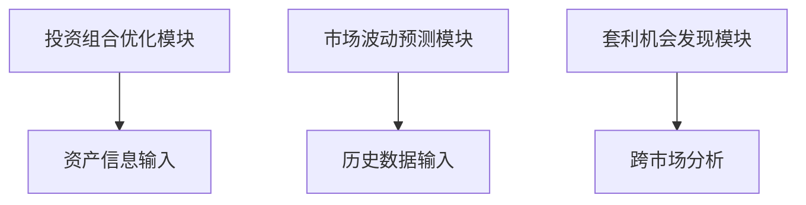
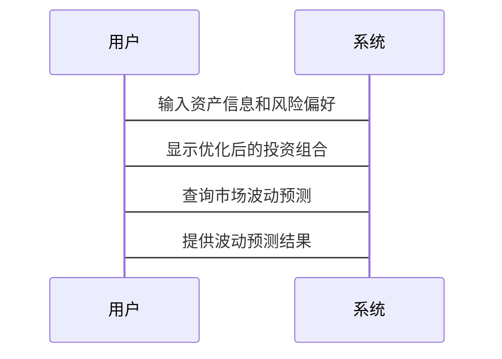

                 


# 巴菲特-芒格的量子计算投资：未来计算力的革命

## 关键词
量子计算、巴菲特、芒格、投资策略、计算力革命、算法优化、金融分析

## 摘要
本文探讨了量子计算技术在投资领域的应用，结合巴菲特和芒格的投资理念，分析了量子计算如何提升投资决策的科学性和效率。通过详细的技术分析和实际案例，文章展示了量子计算在优化投资组合、风险管理、套利机会等方面的优势，并展望了未来量子计算在投资领域的革命性影响。

---

# 第一部分: 量子计算与投资概述

## 第1章: 量子计算的基本概念与原理

### 1.1 量子计算的定义与特点

#### 1.1.1 从经典计算到量子计算的演进
经典计算依赖于二进制位，而量子计算利用量子位（qubit）的叠加态和纠缠态，能够在更短的时间内处理复杂问题。

#### 1.1.2 量子计算的核心原理
- **叠加态**：量子位可以同时处于多个状态，这使得量子计算机能够并行处理多个可能性。
- **纠缠态**：量子位之间的纠缠使得信息传递速度远超经典计算，提高了计算效率。

#### 1.1.3 量子计算的优势与局限性
- **优势**：处理复杂优化问题、因子分解、概率分布等方面具有显著优势。
- **局限性**：当前量子计算技术仍处于发展阶段，稳定性和可扩展性有待提升。

### 1.2 量子计算在投资中的应用前景

#### 1.2.1 投资领域的复杂性与挑战
投资领域涉及大量的非线性关系和不确定性，传统方法难以有效解决。

#### 1.2.2 量子计算如何提升投资效率
- 优化投资组合：量子计算能够快速找到最优资产配置。
- 风险管理：通过量子算法预测市场波动和风险事件。

#### 1.2.3 未来投资中的量子计算潜力
量子计算将彻底改变投资分析的方式，提供更精准的预测和决策支持。

---

## 第2章: 巴菲特与芒格的投资理念

### 2.1 巴菲特的价值投资理论

#### 2.1.1 价值投资的核心思想
价值投资强调以合理的价格购买优质的资产，追求长期稳定的收益。

#### 2.1.2 股票分析的三重标准
- 企业具有持续的盈利能力。
- 管理层具备诚信和能力。
- 公司具有良好的财务状况。

#### 2.1.3 长期投资与安全边际
巴菲特强调长期投资和安全边际，以避免短期市场波动带来的风险。

### 2.2 芒格的多元思维模型

#### 2.2.1 多元思维模型的定义
多元思维模型强调从多个学科的角度分析问题，避免单一思维的局限性。

#### 2.2.2 跨学科思维在投资中的应用
- 结合心理学、经济学、物理学等多个学科的知识，全面分析投资问题。
- 通过跨学科分析，发现传统方法难以察觉的投资机会。

#### 2.2.3 复合决策的优势
芒格认为，通过多元思维模型可以做出更全面、更合理的决策。

---

## 第3章: 量子计算与投资策略的结合

### 3.1 量子计算在投资组合优化中的应用

#### 3.1.1 投资组合优化的数学模型
- **目标函数**：最大化收益或最小化风险。
- **约束条件**：资产分配比例、风险承受能力等。

#### 3.1.2 量子优化算法的实现
- 使用量子叠加态并行计算多个资产组合，找到最优解。

### 3.2 量子计算在风险管理中的应用

#### 3.2.1 市场波动预测
- 利用量子算法预测市场的短期波动，帮助投资者做出及时调整。

#### 3.2.2 风险因子分析
- 通过量子计算分析多个风险因子，评估投资组合的整体风险。

### 3.3 量子计算在套利机会中的应用

#### 3.3.1 跨市场套利
- 利用量子计算分析不同市场的价格差异，寻找套利机会。

#### 3.3.2 时间序列分析
- 通过量子算法分析历史价格数据，预测未来的价格走势。

---

## 第4章: 量子计算投资系统的架构设计

### 4.1 系统设计目标
- 实现量子计算在投资分析中的高效应用。
- 提供用户友好的操作界面和实时数据分析。

### 4.2 系统功能设计

#### 4.2.1 投资组合优化模块
- 输入资产信息和风险偏好，输出最优投资组合。

#### 4.2.2 市场波动预测模块
- 分析历史数据，预测市场短期波动。

#### 4.2.3 套利机会发现模块
- 扫描不同市场，寻找价格差异带来的套利机会。

### 4.3 系统架构图


### 4.4 系统接口设计

#### 4.4.1 输入接口
- 用户输入资产信息和风险偏好。
- 系统读取历史数据和实时数据。

#### 4.4.2 输出接口
- 显示优化后的投资组合。
- 提供市场波动预测结果。
- 列出潜在的套利机会。

### 4.5 系统交互流程图


---

## 第5章: 项目实战

### 5.1 环境搭建

#### 5.1.1 量子计算平台选择
- 使用 IBM Quantum Experience 或 Rigetti Quantum Computing 等平台。

#### 5.1.2 开发工具安装
- 安装 Qiskit 或其他量子计算开发工具。

### 5.2 核心算法实现

#### 5.2.1 投资组合优化算法
- 使用量子优化算法实现投资组合的优化。

#### 5.2.2 市场波动预测算法
- 实现量子版本的时间序列预测算法。

### 5.3 代码实现

#### 5.3.1 投资组合优化的 Python 代码
```python
from qiskit import QuantumCircuit, execute, Aer

def quantum_portfolio_optimization(n_assets):
    # 创建量子电路
    qc = QuantumCircuit(n_assets, n_assets)
    # 添加量子门操作
    qc.h(range(n_assets))
    qc.cx(0, 1)
    qc.cx(1, 2)
    # 执行量子计算
    backend = Aer.get_backend('qasm_simulator')
    job = execute(qc, backend)
    result = job.result()
    return result.get_counts()
```

#### 5.3.2 市场波动预测的 Python 代码
```python
import numpy as np
from qiskit import QuantumCircuit

def quantum_fluctuation_prediction(data):
    qc = QuantumCircuit(len(data))
    for i in range(len(data)):
        if data[i] == 1:
            qc.x(i)
    qc.measure(range(len(data)), range(len(data)))
    return qc
```

### 5.4 案例分析

#### 5.4.1 投资组合优化案例
- 输入：5种资产，风险偏好为中等。
- 输出：优化后的投资组合及其收益率。

#### 5.4.2 市场波动预测案例
- 输入：过去10天的市场数据。
- 输出：未来1天的市场波动预测。

---

## 第6章: 最佳实践与未来展望

### 6.1 最佳实践

#### 6.1.1 投资者注意事项
- 理解量子计算的基本原理。
- 结合传统投资策略和量子计算方法。

#### 6.1.2 开发者的建议
- 持续关注量子计算技术的发展。
- 掌握量子算法的设计与实现。

### 6.2 未来展望

#### 6.2.1 量子计算在投资中的潜力
- 更精确的市场预测。
- 更高效的套利机会发现。

#### 6.2.2 技术与市场的结合
- 量子计算与人工智能的结合，进一步提升投资决策的智能化水平。

---

## 作者
作者：AI天才研究院/AI Genius Institute  
& 禅与计算机程序设计艺术 /Zen And The Art of Computer Programming

