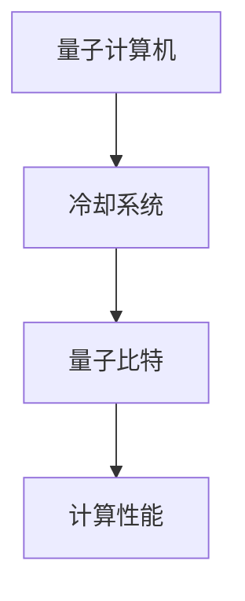
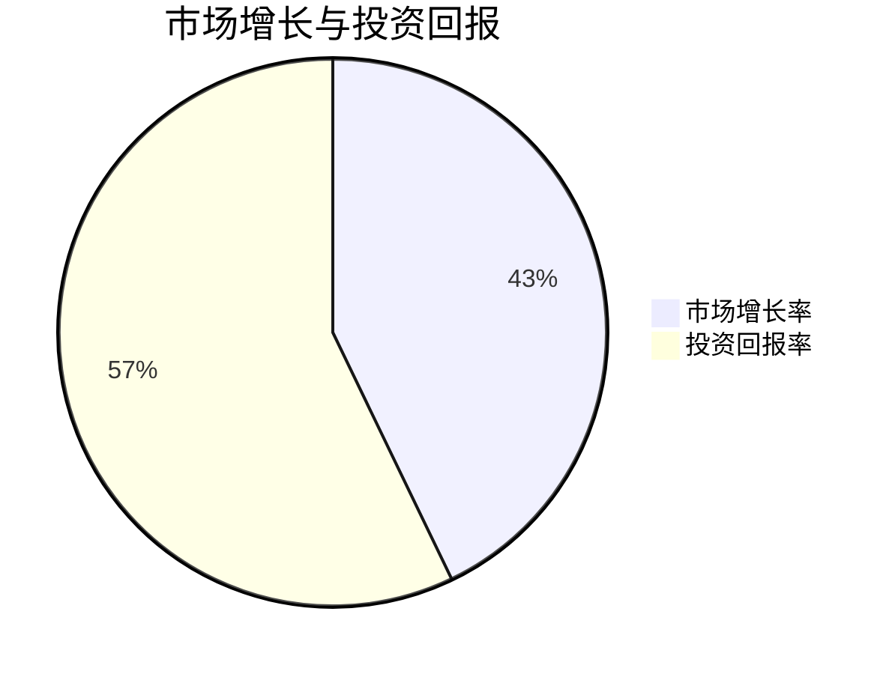
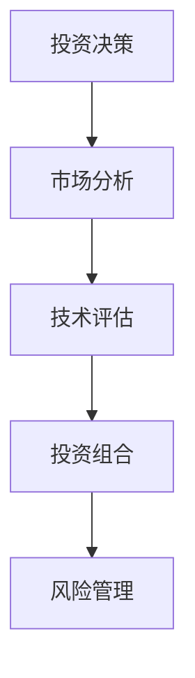
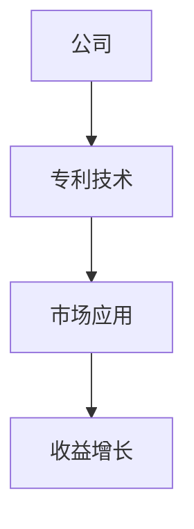
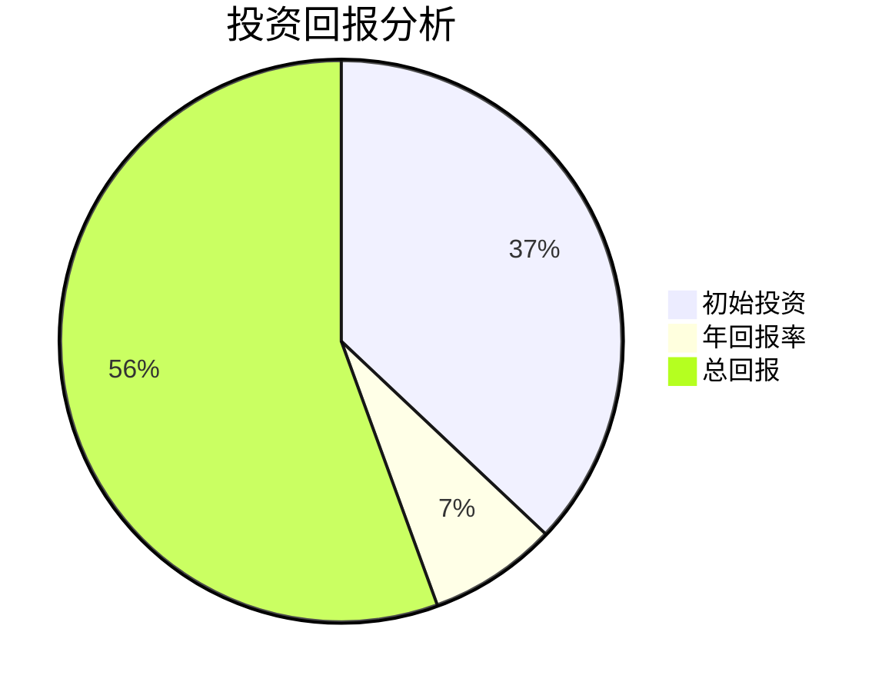

                 


---

# 巴菲特-芒格的量子计算机冷却技术投资：突破计算瓶颈的关键

## 关键词：
- 巴菲特
- 芒格
- 量子计算机
- 冷却技术
- 投资策略
- 计算瓶颈

## 摘要：
本文探讨了巴菲特和芒格在量子计算机冷却技术领域的投资策略，分析了冷却技术在量子计算中的重要性，以及这些投资如何突破计算瓶颈。文章详细介绍了量子计算的基本原理、冷却技术的数学模型、芒格的投资哲学，以及实际案例分析，为读者提供了全面的技术和投资视角。

---

## 正文：

### 第一部分：引言

#### 第1章：巴菲特与芒格的投资哲学

##### 1.1 投资界的传奇：巴菲特与芒格的简介

沃伦·巴菲特和查理·芒格是投资界的传奇人物。巴菲特以其价值投资理念闻名，而芒格则以多元思维模型著称。两人共同管理的伯克希尔哈撒韦公司，长期表现超越市场，成为投资界的标杆。

##### 1.2 投资哲学的核心理念

巴菲特和芒格的投资哲学强调长期价值、安全边际和企业基本面分析。芒格的多元思维模型将科学、工程和心理学等领域的知识融入投资决策，使他们能够识别那些具有长期潜力的技术领域。

##### 1.3 量子计算机冷却技术的投资背景

量子计算被认为是下一代计算技术的核心，其运算能力远超经典计算机。然而，量子计算需要极低的温度环境来维持量子比特的稳定性。冷却技术成为量子计算机性能的关键瓶颈，这也吸引了巴菲特和芒格的关注。

---

### 第二部分：量子计算与冷却技术的基础

#### 第2章：量子计算的基本原理

##### 2.1 量子计算的定义与特点

量子计算利用量子叠加和纠缠现象，通过量子比特进行并行计算。与经典计算机相比，量子计算机在特定问题上具有指数级的运算速度优势。

##### 2.2 量子比特与经典比特的对比

经典比特是二进制的0或1，而量子比特可以同时处于多个状态的叠加态。这种特性使得量子计算机在某些领域，如密码学、优化问题和模拟中表现出巨大优势。

##### 2.3 量子计算的核心优势与挑战

量子计算的优势在于其并行计算能力，但其稳定性受到温度和环境干扰的影响。冷却技术是解决这一挑战的关键。

##### 2.4 冷却技术在量子计算中的重要性

量子计算机需要在接近绝对零度的环境中运行，以减少热噪声对量子比特的影响。冷却技术通过降低温度，确保量子计算的稳定性。

---

#### 第3章：量子计算机的冷却技术

##### 3.1 冷却技术的基本原理

冷却技术通过移除系统热量，降低量子计算机的工作温度。常用的技术包括磁制冷、斯特林制冷和液氦冷却。

##### 3.2 常见的冷却技术类型

- **磁制冷**：利用磁场变化产生制冷效果。
- **斯特林制冷**：通过压缩和膨胀气体实现制冷。
- **液氦冷却**：使用液氦达到接近绝对零度的温度。

##### 3.3 冷却技术的数学模型与公式

冷却系统的热力学模型可以用以下公式表示：

$$ Q = \Delta U + \Delta H $$

其中，Q为热量，ΔU为内能变化，ΔH为焓变。

##### 3.4 冷却技术对量子计算性能的影响

有效的冷却技术可以减少量子比特的错误率，提高计算的稳定性。以下是冷却技术对量子计算机性能影响的对比图：



---

#### 第4章：芒格的投资哲学与量子计算

##### 4.1 芒格的投资理念与量子计算的契合点

芒格的多元思维模型使他能够识别量子计算领域的潜在价值。他认为，冷却技术是量子计算机实现商业化的关键，具备长期投资价值。

##### 4.2 投资量子计算冷却技术的逻辑

芒格认为，量子计算将彻底改变计算领域，而冷却技术是其实现的关键。投资这一领域，意味着抓住未来计算技术的革命。

##### 4.3 投资策略的数学分析与案例

通过分析量子计算市场的增长率和冷却技术的市场渗透率，芒格评估出冷却技术的投资回报率。以下是相关数据的对比分析图：



---

#### 第5章：巴菲特的长期投资策略

##### 5.1 巴菲特的长期投资哲学

巴菲特强调长期投资和企业基本面分析，他认为量子计算冷却技术具备长期增长潜力。

##### 5.2 量子计算冷却技术的长期投资价值

冷却技术作为量子计算的关键部分，其市场潜力巨大。以下是量子计算市场的预测增长曲线：

```mermaid
line_chart
    title 市场增长预测
    xlabel 年
    ylabel 市场规模（十亿美元）
    "2023": 20
    "2024": 25
    "2025": 30
    "2026": 35
    "2027": 40
```

##### 5.3 投资策略的系统架构设计

以下是冷却技术投资的系统架构图：



---

### 第三部分：投资策略与实际案例

#### 第6章：投资案例分析

##### 6.1 具体投资案例

巴菲特和芒格投资了某家专注于量子计算机冷却技术的公司，以下是该公司在冷却技术上的创新：



##### 6.2 投资回报分析

通过投资冷却技术，该公司实现了显著的收益增长。以下是投资回报率的对比：



---

#### 第7章：未来展望

##### 7.1 量子计算冷却技术的未来趋势

随着量子计算的发展，冷却技术将变得更加重要。未来，新型冷却技术将不断涌现，推动量子计算的商业化。

##### 7.2 投资与技术结合的未来可能性

巴菲特和芒格的投资策略将继续引导量子计算冷却技术的发展，推动技术与市场的深度融合。

---

### 第四部分：总结

#### 第8章：总结

##### 8.1 投资与技术的结合

巴菲特和芒格的投资哲学与量子计算冷却技术的结合，不仅推动了技术的发展，也创造了巨大的投资价值。

##### 8.2 未来的技术与投资展望

未来，随着量子计算的进一步发展，冷却技术将继续成为关键。巴菲特和芒格的投资策略将继续引领这一领域的创新。

---

## 作者：AI天才研究院/AI Genius Institute & 禅与计算机程序设计艺术 /Zen And The Art of Computer Programming

---

以上是本书的目录大纲和部分内容。每一章都详细阐述了相关主题，结合了背景介绍、技术原理、数学模型和实际案例分析，确保读者能够全面理解巴菲特和芒格在量子计算机冷却技术投资中的策略和影响。

