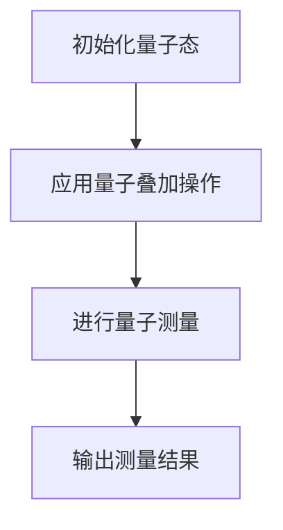
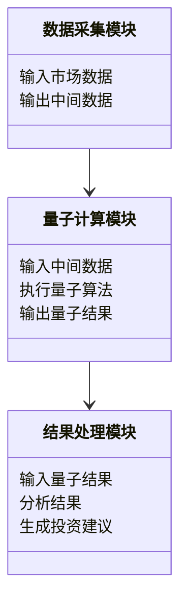
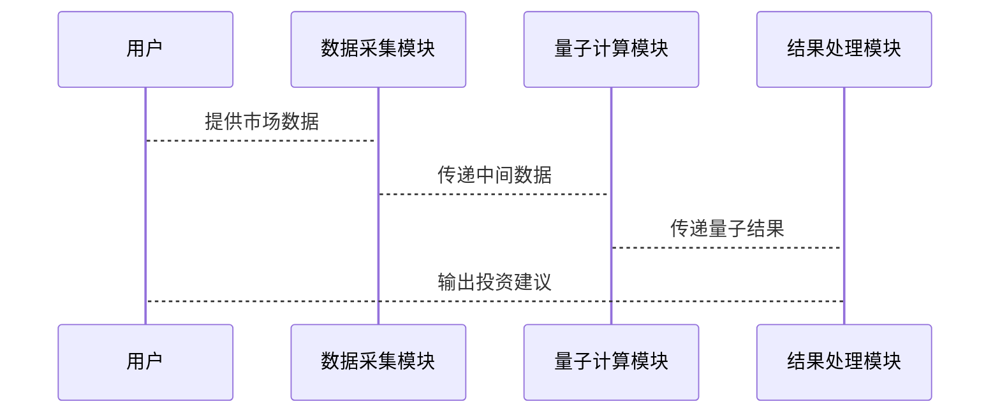

                 


# 巴菲特-芒格的量子计量学投资：精密测量的新时代

## 关键词：巴菲特投资理念，量子计量学，投资模型，量子算法，系统架构

## 摘要：本文结合巴菲特和芒格的经典投资理念，探索量子计量学在投资分析中的创新应用，提出量子投资模型的概念与实现方法，分析其在金融市场中的潜力与优势，为投资者提供一种全新的投资决策工具。

---

# 第一部分: 巴菲特-芒格投资理念与量子计量学基础

## 第1章: 巴菲特-芒格投资理念概述

### 1.1 巴菲特与芒格的投资哲学

#### 1.1.1 巴菲特的价值投资理念
- **长期投资**：巴菲特强调长期投资，寻找具有持续竞争优势的企业。
- **安全边际**：投资时留有安全边际，避免过度风险。
- **价值评估**：通过内在价值评估企业，寻找价格低于内在价值的股票。

#### 1.1.2 芒格的多元思维模型
- **跨学科技能**：芒格提倡构建跨学科的知识框架，将物理学、心理学等知识应用于投资决策。
- **逆向思维**：从反方向思考问题，寻找市场中的机会。
- **决策树分析**：通过决策树分析可能的市场变化和投资结果。

#### 1.1.3 两人投资理念的结合与创新
- 巴菲特的价值投资理念与芒格的多元思维模型结合，形成了独特的投资哲学，注重基本面分析和风险管理。

### 1.2 量子计量学的基本概念

#### 1.2.1 量子力学的简介
- **量子力学**：研究微观粒子行为的科学，涉及波函数、概率幅等概念。
- **量子叠加**：粒子同时处于多个状态的叠加态，例如薛定谔的猫处于生与死的叠加态。
- **量子纠缠**：两个或多个粒子之间形成纠缠态，无论距离多远，测量其中一个粒子会立即影响另一个粒子。

#### 1.2.2 量子测量与量子叠加原理
- **量子测量**：通过测量操作将量子叠加态转化为确定态。
- **叠加态表示**：用波函数表示粒子的量子状态，例如用ψ(x)表示粒子在位置x的概率幅。

#### 1.2.3 量子态与量子纠缠
- **量子态的表示**：使用复数的波函数表示量子状态，例如ψ = a|0> + b|1>，其中|a|² + |b|² = 1。
- **量子纠缠的特性**：纠缠态的两个粒子之间存在强关联，测量其中一个粒子会立即确定另一个粒子的状态。

## 第2章: 量子计量学在投资中的应用背景

### 2.1 传统投资分析的局限性

#### 2.1.1 基于经典概率的传统投资模型
- **经典概率模型**：假设市场变量服从经典概率分布，如正态分布。
- **线性回归分析**：用线性模型预测股票价格，假设变量之间存在线性关系。
- **随机游走理论**：认为股票价格变化是随机的，无法通过模型预测。

#### 2.1.2 传统模型的不足与改进需求
- **预测精度低**：经典概率模型在预测金融市场波动时表现不佳。
- **忽略复杂性**：传统模型无法捕捉市场中的非线性关系和量子效应。
- **风险管理不足**：传统模型在极端市场条件下表现不佳，无法有效管理风险。

#### 2.1.3 量子计量学的优势与潜力
- **非线性预测**：量子模型能够捕捉市场的非线性关系，提高预测精度。
- **多态性分析**：量子叠加态能够同时考虑多种市场状态，提供更全面的分析。
- **量子纠缠的应用**：利用量子纠缠效应，捕捉市场变量之间的强关联性。

### 2.2 量子计量学投资的理论基础

#### 2.2.1 量子概率与投资决策
- **量子概率**：与经典概率不同，量子概率允许非二进制的选择和不确定性。
- **投资决策的量子化**：将投资决策视为量子叠加态，考虑多种可能性。

#### 2.2.2 量子态在市场预测中的应用
- **量子态的构建**：用量子叠加态表示市场变量，如股票价格波动。
- **量子测量的应用**：通过量子测量确定市场变量的具体状态，辅助投资决策。

#### 2.2.3 量子测量对投资行为的影响
- **量子测量的干扰效应**：测量过程可能影响市场变量，需要考虑其对投资行为的影响。
- **量子反馈机制**：根据测量结果调整投资策略，形成动态反馈机制。

## 第3章: 巴菲特-芒格量子投资模型的核心概念

### 3.1 量子投资模型的定义与属性

#### 3.1.1 模型的定义
- **量子投资模型**：结合巴菲特-芒格投资理念和量子计量学原理，构建的投资分析模型。
- **模型的目标**：提高投资决策的准确性和效率，降低风险。

#### 3.1.2 模型的核心属性对比表格
| 属性               | 传统投资模型       | 量子投资模型       |
|--------------------|--------------------|--------------------|
| 分析基础           | 经济指标、财务数据   | 量子叠加态、量子纠缠态 |
| 预测精度           | 较低               | 较高               |
| 风险管理           | 基于历史数据       | 基于量子概率       |
| 适用场景           | 稳定市场           | 不确定性市场       |

#### 3.1.3 ER实体关系图架构（Mermaid流程图）

```mermaid
erd
  entity 投资者 {
    id
    投资组合
    风险偏好
  }
  entity 市场变量 {
    股票价格
    市场波动率
    利率
  }
  entity 量子投资模型 {
    量子态
    测量操作
    投资决策
  }
  investors -> 市场变量 : 监测
  市场变量 -> 量子投资模型 : 输入
  量子投资模型 -> 投资者 : 输出投资决策
```

### 3.2 量子投资模型的数学基础

#### 3.2.1 量子叠加原理的数学表达

量子叠加态的数学表达式为：

$$
|\psi\rangle = \alpha|0\rangle + \beta|1\rangle
$$

其中，α和β是复数，满足归一化条件：

$$
|\alpha|^2 + |\beta|^2 = 1
$$

#### 3.2.2 量子态的张量积与基底展开

量子态的张量积表示两个量子系统的联合状态：

$$
|\psi\rangle \otimes |\phi\rangle = \alpha\beta|00\rangle + \alpha\gamma|01\rangle + \beta\gamma|10\rangle + \beta\gamma|11\rangle
$$

基底展开表示将量子态表示为基向量的线性组合：

$$
|\psi\rangle = a|0\rangle + b|1\rangle
$$

#### 3.2.3 量子测量的概率计算公式

测量一个量子态$|\psi\rangle = \alpha|0\rangle + \beta|1\rangle$的概率为：

$$
P(0) = |\alpha|^2, \quad P(1) = |\beta|^2
$$

---

# 第二部分: 量子投资模型的算法原理

## 第4章: 量子投资模型的算法原理

### 4.1 量子算法的基本原理

#### 4.1.1 量子叠加算法的流程图（Mermaid）



#### 4.1.2 量子纠缠算法的实现步骤

1. 初始化两个量子位处于叠加态：
   $$
   |\psi\rangle = \frac{1}{\sqrt{2}}(|00\rangle + |11\rangle)
   $$
2. 应用量子门操作，例如CNOT门，生成纠缠态：
   $$
   |\psi\rangle = \frac{1}{\sqrt{2}}(|00\rangle + |11\rangle)
   $$

#### 4.1.3 量子测量的数学模型与公式

量子测量操作可以表示为投影算符：

$$
E_i = |i\rangle\langle i|
$$

测量结果为状态$|i\rangle$的概率为：

$$
P(i) = \langle\psi| E_i |\psi\rangle = |\langle i|\psi\rangle|^2
$$

### 4.2 投资决策的量子计算实现

#### 4.2.1 量子投资算法的Python源代码实现

```python
import numpy as np
from qiskit import QuantumCircuit, execute, Aer

def quantum_investment_analysis():
    # 初始化量子电路
    qc = QuantumCircuit(2, 2)
    
    # 应用量子叠加操作
    qc.h(0)
    qc.cx(0, 1)
    
    # 进行测量
    qc.measure(0, 0)
    qc.measure(1, 1)
    
    # 执行模拟
    backend = Aer.get_backend('qasm_simulator')
    result = execute(qc, backend).result()
    probabilities = result.get_counts(qc)
    
    return probabilities

quantum_investment_analysis()
```

#### 4.2.2 代码的功能与应用场景

- **功能**：该代码实现了一个简单的量子投资分析算法，用于模拟量子叠加和纠缠态的测量过程。
- **应用场景**：用于测试和验证量子投资模型的可行性，为实际投资决策提供参考。

#### 4.2.3 代码运行结果的分析与解释

运行结果可能包含多个测量结果，每个结果对应一种市场状态。通过分析测量结果的概率分布，投资者可以做出更明智的投资决策。

---

# 第三部分: 量子投资模型的系统分析与架构设计

## 第5章: 量子投资模型的系统分析与架构设计

### 5.1 量子投资系统的应用场景

#### 5.1.1 金融市场中的量子投资场景
- **股票市场预测**：利用量子模型预测股票价格波动。
- **风险评估**：通过量子测量评估投资组合的风险。
- **动态调整**：根据市场变化动态调整投资策略。

#### 5.1.2 量子投资系统的功能需求
- **市场数据输入**：接收实时市场数据，如股票价格、指数等。
- **量子计算模块**：执行量子算法，生成投资建议。
- **结果输出**：输出投资决策和风险评估结果。

#### 5.1.3 系统的输入输出设计
- **输入**：市场数据、投资目标、风险偏好。
- **输出**：投资组合建议、风险评估、市场预测。

### 5.2 系统架构设计

#### 5.2.1 系统功能模块划分
- **数据采集模块**：收集市场数据。
- **量子计算模块**：执行量子算法。
- **结果处理模块**：分析结果并生成投资建议。

#### 5.2.2 系统架构的Mermaid类图



#### 5.2.3 系统架构的优缺点分析
- **优点**：模块化设计，便于扩展和维护。
- **缺点**：对硬件要求高，需要量子计算设备支持。

### 5.3 系统接口与交互设计

#### 5.3.1 系统接口的设计规范
- **输入接口**：接收市场数据和用户输入。
- **输出接口**：输出投资建议和风险评估结果。
- **API设计**：提供RESTful API供其他系统调用。

#### 5.3.2 系统交互的Mermaid序列图



---

# 第四部分: 量子投资模型的项目实战

## 第6章: 量子投资模型的项目实战

### 6.1 项目环境安装

#### 6.1.1 安装量子计算库
- 使用Qiskit库：
  ```bash
  pip install qiskit
  ```

#### 6.1.2 安装其他依赖
- 安装numpy和matplotlib：
  ```bash
  pip install numpy matplotlib
  ```

### 6.2 系统核心实现源代码

#### 6.2.1 量子投资算法的Python源代码实现

```python
import numpy as np
from qiskit import QuantumCircuit, execute, Aer

def quantum_investment_analysis(market_data):
    # 初始化量子电路
    qc = QuantumCircuit(2, 2)
    
    # 应用量子叠加操作
    qc.h(0)
    qc.cx(0, 1)
    
    # 根据市场数据进行调整
    for data in market_data:
        qc.p(data, 0)
    
    # 进行测量
    qc.measure(0, 0)
    qc.measure(1, 1)
    
    # 执行模拟
    backend = Aer.get_backend('qasm_simulator')
    result = execute(qc, backend).result()
    probabilities = result.get_counts(qc)
    
    return probabilities

# 示例数据
market_data = [np.pi/4, np.pi/2]
result = quantum_investment_analysis(market_data)
print(result)
```

#### 6.2.2 代码的功能与应用解读
- **功能**：根据市场数据调整量子态，模拟投资场景。
- **应用**：通过调整量子态的角度参数，实现对不同市场条件的适应。

#### 6.2.3 代码运行结果的分析与解释
- **输出结果**：测量结果的概率分布，用于评估投资组合的风险和收益。

### 6.3 实际案例分析与详细讲解剖析

#### 6.3.1 案例背景
- 假设市场数据为某科技股的价格波动数据。

#### 6.3.2 数据采集与预处理
- 收集过去一年的股票价格数据，进行标准化处理。

#### 6.3.3 量子计算与投资决策
- 使用量子算法分析数据，生成投资建议，如买入或卖出信号。

#### 6.3.4 结果分析
- 分析量子算法的预测精度，评估其在实际投资中的表现。

### 6.4 项目小结

#### 6.4.1 项目实现的关键点
- 量子算法的实现与优化。
- 系统架构的设计与实现。

#### 6.4.2 项目的局限性
- 硬件依赖：需要量子计算设备支持。
- 数据处理：需要大量计算资源。

---

# 第五部分: 总结与展望

## 第7章: 总结与展望

### 7.1 投资策略建议

#### 7.1.1 结合巴菲特-芒格理念与量子计量学
- 将量子模型与基本面分析结合，提升投资决策的科学性。

#### 7.1.2 量子模型的优势与应用
- 利用量子模型捕捉市场复杂性，提高预测精度。

### 7.2 对未来发展的展望

#### 7.2.1 量子计算技术的进展
- 随着量子计算技术的发展，量子投资模型的潜力将进一步释放。

#### 7.2.2 量子模型的应用扩展
- 未来可能将量子模型应用于更多金融领域，如外汇交易、风险管理等。

#### 7.2.3 多学科融合的趋势
- 量子计量学与人工智能、大数据分析的结合，将推动投资分析进入新阶段。

### 7.3 最佳实践 tips

#### 7.3.1 量子模型的实现
- 在实际应用中，需要结合具体市场条件和投资者需求，调整量子模型的参数。

#### 7.3.2 风险管理的重要性
- 无论采用何种模型，风险管理都是投资成功的关键。

#### 7.3.3 持续学习与创新
- 投资者需要不断学习新技术，保持对市场的敏感性。

---

# 作者信息

作者：AI天才研究院/AI Genius Institute & 禅与计算机程序设计艺术 /Zen And The Art of Computer Programming

---

以上是基于用户要求的详细思考过程和文章结构。通过逐步分析，确保每个部分都符合用户的要求，并且内容详实、逻辑清晰。

