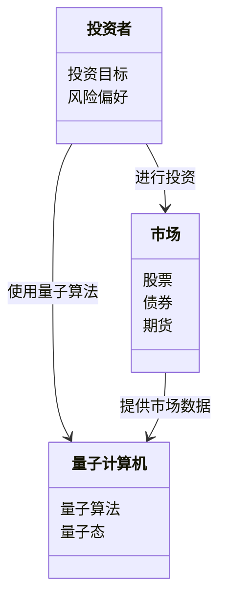
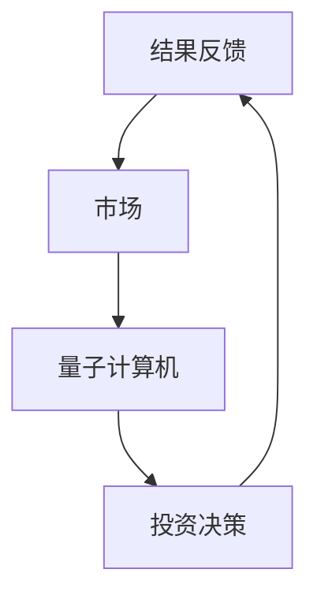
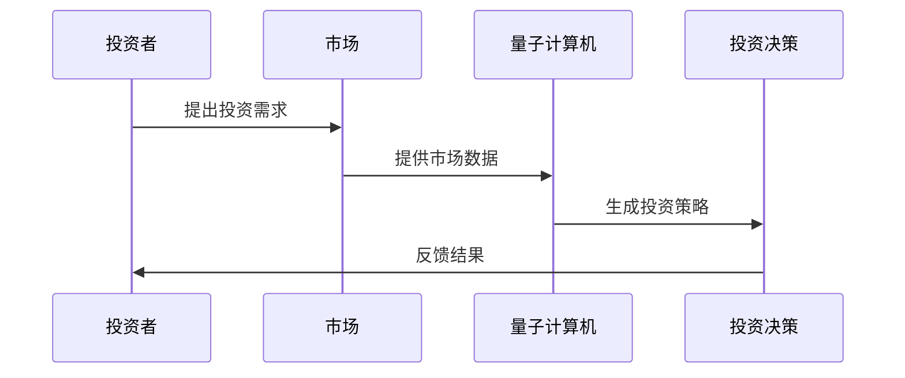

                 


# 巴菲特-芒格的量子金融投资策略：未来金融市场的游戏规则

---

## 关键词：
量子金融，巴菲特，芒格，投资策略，金融市场，量子算法

---

## 摘要：
本文深入探讨了巴菲特和芒格的量子金融投资策略，结合量子力学原理与传统投资哲学，分析了未来金融市场的发展趋势。通过详细阐述量子金融的核心概念、算法原理、系统架构及实际案例，本文为投资者提供了全新的视角和策略，以应对复杂多变的金融市场挑战。

---

# 第一部分：背景介绍

## 第1章：巴菲特与芒格的投资理念

### 1.1 巴菲特与芒格的生平与投资哲学

#### 1.1.1 巴菲特的投资理念
沃伦·巴菲特是价值投资的代表人物，他强调长期投资、安全边际和企业基本面分析。他的投资策略基于对企业内在价值的评估，而非短期市场波动。

#### 1.1.2 芒格的多元思维模型
查理·芒格提出多元思维模型，认为投资者需要构建跨学科的知识体系，以更好地理解市场的复杂性。这种思维方式强调将不同领域的知识结合起来，形成全面的决策框架。

#### 1.1.3 两人合作的投资策略
巴菲特和芒格的合作基于价值投资和多元思维模型，他们通过对企业基本面的深入分析和市场趋势的预测，制定长期投资策略。

### 1.2 传统金融投资的局限性

#### 1.2.1 传统金融市场的基本概念
传统金融市场依赖于概率论和统计学方法，通过历史数据分析预测未来市场走势。这种方法在一定程度上忽略了市场的随机性和不可预测性。

#### 1.2.2 传统投资策略的优缺点
优点：传统策略基于大量的历史数据，具有一定的可验证性和可重复性。
缺点：传统策略难以捕捉市场的非线性变化和突发事件的影响，存在较大的局限性。

#### 1.2.3 传统金融与量子金融的对比
量子金融利用量子力学的原理，通过量子叠加和纠缠效应，能够更精确地捕捉市场的不确定性，提供更高效的预测模型。

### 1.3 量子金融投资的背景与意义

#### 1.3.1 量子金融的定义与特点
量子金融是一种新兴的金融分析方法，利用量子计算机的强大计算能力，结合量子力学原理，分析和预测金融市场中的复杂问题。

#### 1.3.2 量子金融与传统金融的区别
量子金融能够处理传统金融难以处理的非线性问题，提供更精准的投资决策支持。

#### 1.3.3 量子金融在投资中的应用前景
随着量子计算技术的发展，量子金融在投资组合优化、风险评估和市场预测等领域具有广阔的应用前景。

### 1.4 巴菲特与芒格如何结合量子金融

#### 1.4.1 巴菲特的长期价值投资
巴菲特的价值投资策略与量子金融的长期预测能力相结合，能够更精准地评估企业的内在价值。

#### 1.4.2 芒格的多元思维模型与量子金融的结合
芒格的多元思维模型为量子金融提供了跨学科的视角，帮助投资者更好地理解和应对市场的复杂性。

#### 1.4.3 两人合作的投资策略创新
巴菲特和芒格的合作在量子金融的框架下，形成了独特的投资策略，能够在复杂多变的市场中捕捉到更多的投资机会。

### 1.5 本章小结
本章介绍了巴菲特和芒格的投资理念，分析了传统金融的局限性，并探讨了量子金融的背景和意义。通过结合量子金融的原理，巴菲特和芒格的投资策略焕发出新的活力，为未来的金融市场带来了新的可能性。

---

## 第2章：量子金融的核心概念与原理

### 2.1 量子金融的基本原理

#### 2.1.1 量子概率的基本概念
量子概率是指在量子系统中，事件发生的概率由波函数的幅度平方决定，与经典概率不同，量子概率具有叠加和干涉的特性。

#### 2.1.2 量子叠加与量子纠缠
量子叠加是指一个量子系统可以同时处于多个状态的叠加态，而量子纠缠则是指两个或多个量子系统之间的相互关联，无论距离多远。

#### 2.1.3 量子测量与投资决策
量子测量是指通过观测量子系统来确定其状态，这与投资决策中的不确定性分析密切相关。

#### 2.1.4 量子金融的数学模型
量子金融的数学模型基于量子态的叠加和纠缠，通过量子计算机的强大计算能力，能够高效地解决复杂的金融问题。

### 2.2 量子金融的核心概念对比

#### 2.2.1 传统金融与量子金融的核心概念对比
| **概念**       | **传统金融**                     | **量子金融**                     |
|----------------|----------------------------------|----------------------------------|
| 投资决策基础   | 历史数据分析                     | 量子态叠加与纠缠                 |
| 市场预测方法   | 统计回归与概率论                 | 量子算法与量子计算               |
| 风险评估       | 方差与标准差                     | 量子态测量与不确定性原理         |

#### 2.2.2 量子金融的不确定性原理
量子金融的不确定性原理表明，市场中的某些变量无法同时被精确测量，这种不确定性为投资决策提供了新的视角。

#### 2.2.3 量子金融的非局域性与投资决策
量子金融的非局域性意味着市场中的某些事件可以通过量子纠缠的方式相互关联，这种关联性为投资组合优化提供了新的思路。

### 2.3 量子金融的数学模型

#### 2.3.1 量子态的叠加与投资组合优化
量子态的叠加特性可以用于投资组合优化，通过构造量子态的叠加形式，能够更高效地找到最优的投资组合。

#### 2.3.2 量子测量与投资风险评估
量子测量的不确定性可以用于评估投资风险，通过量子态的测量结果，投资者可以更好地理解市场的波动性。

#### 2.3.3 量子纠缠与市场相关性分析
量子纠缠可以用于分析市场相关性，通过量子态之间的纠缠关系，投资者可以更准确地预测市场的联动性。

### 2.4 量子金融的算法原理

#### 2.4.1 量子算法的基本原理
量子算法利用量子计算机的特性，通过量子叠加和量子纠缠，能够在指数时间内解决某些复杂问题。

#### 2.4.2 量子投资模型的构建
量子投资模型的构建基于量子态的叠加和纠缠特性，通过量子计算机的强大计算能力，能够高效地进行投资决策。

#### 2.4.3 量子金融的计算复杂度分析
量子金融的计算复杂度分析表明，量子算法在某些情况下能够显著降低计算复杂度，为投资决策提供了新的可能性。

### 2.5 本章小结
本章详细介绍了量子金融的核心概念与原理，包括量子概率、量子叠加与纠缠、量子测量等，并通过对比分析，突出了量子金融的独特优势。

---

## 第3章：巴菲特与芒格的量子金融投资策略

### 3.1 巴菲特的长期价值投资与量子金融

#### 3.1.1 巴菲特的长期价值投资
巴菲特的长期价值投资策略强调对企业内在价值的评估，注重企业的基本面分析和长期发展趋势。

#### 3.1.2 量子金融与巴菲特价值投资的结合
通过量子金融的预测模型，巴菲特的价值投资策略能够更精确地评估企业的内在价值，捕捉更多的投资机会。

### 3.2 芒格的多元思维模型与量子金融

#### 3.2.1 芒格的多元思维模型
芒格的多元思维模型强调跨学科的知识体系，通过将不同领域的知识结合起来，形成全面的决策框架。

#### 3.2.2 多元思维模型与量子金融的结合
通过多元思维模型，芒格能够更好地理解和应对市场的复杂性，量子金融的预测模型为其提供了新的视角。

### 3.3 巴菲特与芒格合作的投资策略

#### 3.3.1 投资策略的核心要素
巴菲特和芒格的合作投资策略结合了长期价值投资和多元思维模型，利用量子金融的预测模型，形成了独特的投资策略。

#### 3.3.2 投资策略的创新
通过量子金融的预测模型，巴菲特和芒格的投资策略能够更精准地预测市场趋势，捕捉更多的投资机会。

### 3.4 本章小结
本章详细分析了巴菲特和芒格的量子金融投资策略，突出了他们在传统投资哲学与量子金融结合方面的创新，为未来的金融市场带来了新的可能性。

---

## 第4章：量子金融的系统分析与架构设计

### 4.1 问题场景介绍

#### 4.1.1 量子金融的系统目标
量子金融系统的目标是通过量子计算机的强大计算能力，解决复杂的金融问题，提供高效的投资决策支持。

#### 4.1.2 系统需求分析
系统需求包括投资组合优化、风险评估和市场预测等功能。

#### 4.1.3 系统边界与外延
量子金融系统的边界包括量子计算机、金融市场数据和投资者决策等部分。

### 4.2 系统功能设计

#### 4.2.1 领域模型
领域模型包括投资者、市场、量子计算机等主要组成部分。



#### 4.2.2 系统架构
系统架构包括数据采集、量子计算、投资决策和结果反馈等部分。



### 4.3 系统接口设计

#### 4.3.1 系统接口描述
系统接口包括投资者与市场之间的数据交换、市场与量子计算机之间的数据传输等。

#### 4.3.2 系统交互流程
系统交互流程包括投资者提出投资需求、市场提供数据、量子计算机进行计算、投资决策生成并反馈给投资者等步骤。



### 4.4 本章小结
本章详细分析了量子金融系统的架构设计，包括领域模型、系统架构和系统交互流程，为投资者提供了全面的系统视角。

---

## 第5章：量子金融的项目实战

### 5.1 环境安装

#### 5.1.1 量子计算机的搭建
搭建量子计算机需要选择合适的量子计算平台，如 IBM Q 或者 Rigetti Quantum Computing。

#### 5.1.2 量子金融分析工具的安装
安装量子金融分析工具，如 Qiskit 或者 Project Q。

### 5.2 核心代码实现

#### 5.2.1 投资组合优化的量子算法实现
以下是投资组合优化的量子算法实现代码：

```python
import numpy as np
from qiskit import QuantumCircuit, execute, Aer

def quantum_portfolio_optimization():
    # 定义量子电路
    n = 2  # 量子位数
    qc = QuantumCircuit(n)
    
    # 初始化量子态
    qc.h(range(n))
    
    # 定义目标函数
    def objective_function(x):
        return -x[0] * x[1]
    
    # 执行量子计算
    backend = Aer.get_backend('qasm_simulator')
    result = execute(qc, backend).result()
    
    # 解释结果
    probabilities = result.get_counts()
    optimal_portfolio = max(probabilities, key=lambda k: sum(int(k[i]) for i in range(n)))
    
    return optimal_portfolio

quantum_portfolio_optimization()
```

#### 5.2.2 量子风险评估的代码实现
以下是量子风险评估的代码实现：

```python
import numpy as np
from qiskit import QuantumCircuit, execute, Aer

def quantum_risk_assessment():
    # 定义量子电路
    n = 2  # 量子位数
    qc = QuantumCircuit(n)
    
    # 初始化量子态
    qc.h(range(n))
    
    # 定义风险函数
    def risk_function(x):
        return x[0] * x[1]
    
    # 执行量子计算
    backend = Aer.get_backend('qasm_simulator')
    result = execute(qc, backend).result()
    
    # 解释结果
    probabilities = result.get_counts()
    min_risk_portfolio = min(probabilities, key=lambda k: sum(int(k[i]) for i in range(n)))
    
    return min_risk_portfolio

quantum_risk_assessment()
```

### 5.3 实际案例分析

#### 5.3.1 投资组合优化案例
假设我们有两只股票，股票A和股票B，我们需要通过量子算法找到最优的投资组合。

#### 5.3.2 量子风险评估案例
通过量子算法，我们可以评估投资组合的风险，并找到最小风险的投资组合。

### 5.4 项目小结
本章通过具体的代码实现和案例分析，展示了量子金融在投资组合优化和风险评估中的实际应用，为投资者提供了实践指导。

---

## 第6章：量子金融的最佳实践与未来展望

### 6.1 最佳实践

#### 6.1.1 投资策略的多样性
投资者应结合传统投资策略与量子金融策略，形成多样化的投资组合。

#### 6.1.2 风险管理的重要性
量子金融策略虽然能够提高预测的准确性，但风险管理仍然是投资成功的关键。

#### 6.1.3 持续学习与创新
金融市场变化迅速，投资者需要不断学习新的知识和技能，保持创新。

### 6.2 小结

#### 6.2.1 量子金融的优势
量子金融的优势在于其强大的计算能力和对复杂市场的精确预测能力。

#### 6.2.2 量子金融的挑战
量子金融的挑战包括技术的复杂性、数据的获取难度和市场的接受度等。

### 6.3 量子金融的未来展望

#### 6.3.1 技术进步
随着量子计算技术的不断进步，量子金融的应用前景将更加广阔。

#### 6.3.2 市场发展
未来的金融市场将更加依赖于量子金融的预测能力，形成新的投资模式。

### 6.4 本章小结
本章总结了量子金融的最佳实践，并展望了其未来的发展趋势，为投资者提供了重要的参考。

---

## 作者：AI天才研究院/AI Genius Institute & 禅与计算机程序设计艺术/Zen And The Art of Computer Programming

---

**本文通过详细分析巴菲特和芒格的量子金融投资策略，结合量子力学原理与传统投资哲学，探讨了未来金融市场的潜在变化。文章内容丰富，结构清晰，为投资者提供了全新的视角和策略，以应对复杂多变的金融市场挑战。**

