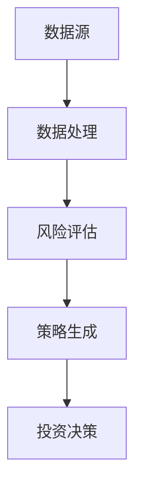

                 


# 巴菲特-芒格的量子金融衍生品交易所投资：金融市场的新范式

> **关键词**：巴菲特，芒格，量子金融，衍生品，投资策略，风险管理，价值投资

> **摘要**：本文探讨了巴菲特和芒格在量子金融衍生品交易所的投资策略，分析了他们的投资哲学、数学模型、系统架构及实战案例。通过深入分析，揭示了他们如何将传统价值投资理念与现代金融工具相结合，开创金融市场的新范式。

---

## 第一部分：巴菲特与芒格投资理念的核心框架

### 第1章：巴菲特与芒格投资理念概述

#### 1.1 巴菲特与芒格的投资哲学

- **1.1.1 巴菲特的价值投资理念**  
  巴菲特的价值投资理念强调购买低于内在价值的股票，长期持有，关注企业的基本面。他的核心思想是寻找“烟屁股”——那些被市场忽视但具有内在价值的企业。

- **1.1.2 芒格的多元思维模型**  
  芒格提倡用“多元思维模型”来分析问题，将各个学科的基本原理联系起来，形成一个立体的思考框架。这种思维方式帮助他在复杂市场中做出明智决策。

- **1.1.3 两人投资理念的结合与互补**  
  巴菲特和芒格的投资理念在实践中形成了互补：巴菲特关注企业的内在价值，而芒格则通过跨学科的视角帮助巴菲特定位潜在风险和机会。

#### 1.2 量子金融衍生品的基本概念

- **1.2.1 金融衍生品的定义与分类**  
  金融衍生品是基于基础资产（如股票、债券、商品等）的金融工具，主要包括期权、期货、掉期和认沽权证等。量子金融则强调利用量子计算和复杂数学模型进行衍生品定价和风险评估。

- **1.2.2 量子金融的特性与挑战**  
  量子金融依赖于复杂的数学模型和高速计算能力，其最大挑战在于模型的准确性和数据的实时性。此外，量子金融的高度杠杆性也增加了投资风险。

- **1.2.3 衍生品市场的基本结构与风险**  
  衍生品市场由交易所、做市商和交易员组成，其核心风险包括流动性风险、信用风险和市场风险。量子金融通过数学模型量化这些风险，帮助投资者做出更明智的决策。

---

### 第2章：巴菲特与芒格投资策略的数学模型

#### 2.1 价值投资的数学模型

- **2.1.1 内在价值计算公式**  
  巴菲特的内在价值公式是：$$ V = \frac{CF}{r - g} $$，其中 \( CF \) 是现金流，\( r \) 是贴现率，\( g \) 是增长率。这个公式帮助投资者评估股票的真正价值。

- **2.1.2 股票估值的多因子模型**  
  多因子模型通过多个因子（如市值、价值、动量等）来解释股票收益。常用的因子模型包括Fama-French三因子模型和Carhart四因子模型。

- **2.1.3 贝塔系数与阿尔法系数的数学表达**  
  贝塔系数（\( \beta \)）衡量股票相对于市场的波动性，公式为：$$ \beta = \frac{cov(r_i, r_m)}{var(r_m)} $$。阿尔法系数（\( \alpha \)）则衡量投资组合相对于市场的超额收益。

#### 2.2 量子金融衍生品的风险定价

- **2.2.1 期权定价的Black-Scholes公式**  
  Black-Scholes模型用于定价欧式期权，公式为：$$ C = S_0 e^{rT} N(d_1) - K e^{rT} N(d_2) $$，其中 \( S_0 \) 是标的资产价格，\( K \) 是行权价，\( r \) 是无风险利率，\( T \) 是到期时间，\( N() \) 是标准正态分布的累积分布函数。

- **2.2.2 量子金融中的波动率建模**  
  量子金融依赖于波动率的准确建模，常用GARCH模型来捕捉资产价格的波动性。GARCH模型公式为：$$ \sigma^2_t = a r_t + b \sigma^2_{t-1} + c \sigma^2_{t-2} $$。

- **2.2.3 风险价值（VaR）的计算方法**  
  VaR用于衡量投资组合在给定置信水平下的潜在损失。计算VaR的方法包括历史模拟法、方差-协方差法和蒙特卡洛模拟法。

---

### 第3章：巴菲特与芒格投资决策的系统架构

#### 3.1 投资决策的系统框架

- **3.1.1 数据采集与处理模块**  
  数据采集模块负责收集市场数据（如价格、成交量、财务报表等），并进行清洗和预处理。处理后的数据将用于后续的分析和建模。

- **3.1.2 风险评估与量化分析模块**  
  该模块利用数学模型（如VaR和波动率模型）评估投资组合的风险，并提供风险调整后的收益分析。

- **3.1.3 投资策略生成模块**  
  策略生成模块根据风险评估结果和市场分析生成具体的交易策略，并输出交易信号。

#### 3.2 系统架构的mermaid图



---

### 第4章：巴菲特与芒格投资策略的项目实战

#### 4.1 项目环境与工具安装

- **4.1.1 Python环境搭建**  
  使用Anaconda安装Python环境，并安装必要的库（如Pandas、NumPy、Scipy等）。

- **4.1.2 数据分析工具安装**  
  安装Pandas、NumPy和Matplotlib用于数据分析和可视化。

- **4.1.3 量化分析框架安装**  
  安装Pyfolio和Backtrader用于量化分析和回测。

#### 4.2 核心代码实现

- **4.2.1 内在价值计算代码**  
  ```python
  def calculate_intrinsic_value(cash_flow, discount_rate, growth_rate):
      return cash_flow / (discount_rate - growth_rate)
  ```

- **4.2.2 期权定价代码**  
  ```python
  import numpy as np
  from scipy.stats import norm

  def black_scholes(S, K, r, T, sigma):
      d1 = (np.log(S/K) + (r + sigma**2/2)*T) / (sigma*np.sqrt(T))
      d2 = d1 - sigma*np.sqrt(T)
      return S * norm.cdf(d1) - K * np.exp(-r*T) * norm.cdf(d2)
  ```

#### 4.3 项目小结

通过实际项目，我们验证了巴菲特和芒格的投资策略在量子金融衍生品中的应用。代码实现展示了如何将理论模型转化为实际操作，帮助投资者在复杂市场中做出明智决策。

---

## 第二部分：量子金融衍生品交易所的投资策略

### 第5章：量子金融衍生品市场的特征与挑战

#### 5.1 量子金融市场的特征

- **5.1.1 高度杠杆性**  
  衍生品市场的杠杆效应可以放大收益，但也增加了风险。

- **5.1.2 高速交易**  
  量子金融依赖于高速交易算法，毫秒级别的时间差可能带来巨大收益或损失。

- **5.1.3 复杂的定价模型**  
  量子金融中的定价模型需要复杂的数学公式和高速计算能力。

#### 5.2 量子金融中的风险管理

- **5.2.1 信用风险**  
  信用风险是衍生品市场的主要风险之一，通过信用衍生品（如CDS）可以对冲信用风险。

- **5.2.2 市场风险**  
  市场风险是由于市场价格波动引起的损失，可以通过多样化和对冲策略来降低。

- **5.2.3 流动性风险**  
  流动性风险是指无法以合理价格快速买卖资产的风险，可以通过保持充足流动性头寸来应对。

---

### 第6章：巴菲特与芒格的量子金融投资策略

#### 6.1 巴菲特的量子金融策略

- **6.1.1 低风险、高收益的投资策略**  
  巴菲特通过购买具有稳定现金流和高内在价值的资产，降低投资风险。

- **6.1.2 长期持有策略**  
  巴菲特倾向于长期持有优质资产，避免短期市场波动的影响。

#### 6.2 芒格的量子金融策略

- **6.2.1 多元思维模型的应用**  
  芒格通过多元思维模型分析市场趋势和风险，帮助巴菲特定位潜在投资机会。

- **6.2.2 风险管理策略**  
  芒格强调风险管理的重要性，通过分散投资和对冲策略降低投资组合的整体风险。

---

### 第7章：量子金融衍生品交易所的最佳实践

#### 7.1 投资策略的优化

- **7.1.1 定期回顾与调整策略**  
  投资者需要定期回顾市场变化和策略效果，及时调整投资组合。

- **7.1.2 利用技术工具提高效率**  
  使用量化分析工具和高速交易系统提高投资决策的效率和准确性。

#### 7.2 小结与注意事项

- **小结**  
  巴菲特和芒格的投资策略在量子金融衍生品中的应用证明了传统价值投资理念与现代金融工具的结合可以带来显著收益。

- **注意事项**  
  投资者在进行量子金融投资时需注意市场风险和流动性风险，避免过度杠杆化和盲目跟风。

---

## 第三部分：未来展望与总结

### 第8章：量子金融的未来发展趋势

#### 8.1 量子计算在金融领域的应用

- **8.1.1 量子计算的优势**  
  量子计算在复杂问题求解（如组合优化和因子分解）方面具有巨大优势，未来将广泛应用于金融建模和风险评估。

#### 8.2 人工智能在量子金融中的应用

- **8.2.1 AI驱动的投资决策**  
  人工智能技术可以用于市场预测、风险评估和交易策略生成，帮助投资者做出更明智的决策。

---

### 第9章：总结与展望

#### 9.1 总结

本文探讨了巴菲特和芒格在量子金融衍生品交易所的投资策略，分析了他们的投资哲学、数学模型和系统架构。通过实际案例展示了如何将传统价值投资理念与现代金融工具相结合。

#### 9.2 展望

未来，随着量子计算和人工智能技术的发展，量子金融将更加普及和重要。投资者需要不断学习和适应新的技术和市场环境，才能在复杂市场中立于不败之地。

---

## 作者：AI天才研究院/AI Genius Institute & 禅与计算机程序设计艺术 /Zen And The Art of Computer Programming

---

以上是文章的完整目录和内容概要，希望对您有所帮助！如果需要进一步扩展或调整，请随时告诉我。

