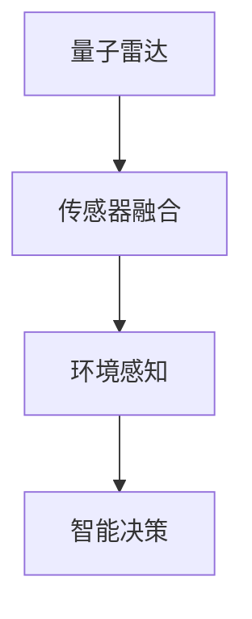
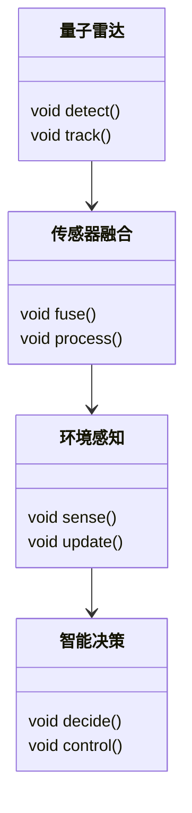
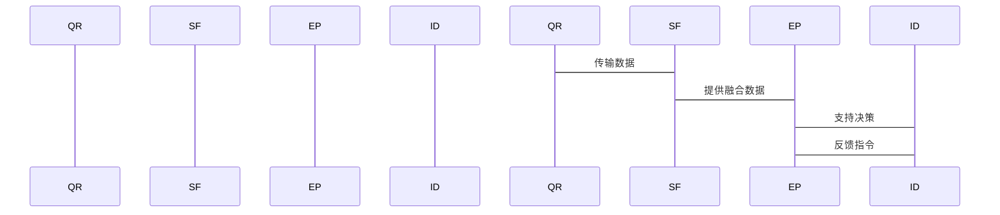

                 


# 巴菲特-芒格的量子雷达和传感器融合技术投资：智能交通的基石

## 关键词
- 巴菲特
- 芮格
- 量子雷达
- 传感器融合
- 智能交通

## 摘要
本文探讨了巴菲特和芒格的投资理念与量子雷达及传感器融合技术在智能交通中的应用，分析了这些技术如何成为智能交通的关键基础，并通过实际案例展示了其投资价值和技术优势。

---

## 第一部分：引言

### 1.1 投资与技术的结合
巴菲特和芒格的投资理念强调长期价值和基本面分析。本文将探讨这些理念如何应用于量子雷达和传感器融合技术，特别是在智能交通领域的投资机会。

### 1.2 量子雷达与传感器融合技术的背景
量子雷达和传感器融合技术的进步为智能交通系统提供了更精确的数据处理能力，提升了交通安全性和效率。

### 1.3 智能交通的基石作用
智能交通系统依赖于高效的数据融合技术，量子雷达和传感器融合技术正是构建这一系统的基石。

---

## 第二部分：量子雷达与传感器融合技术的背景

### 2.1 量子雷达的基本概念
#### 2.1.1 量子雷达的定义与工作原理
量子雷达利用量子纠缠和干涉原理，能够在复杂环境中检测和识别目标，具有更高的灵敏度和抗干扰能力。

#### 2.1.2 量子雷达的优势与应用场景
量子雷达的优势包括高灵敏度、抗干扰能力强和高分辨率。在智能交通中，它用于车辆检测和交通流量监测。

#### 2.1.3 量子雷达在智能交通中的潜力
通过实时监测交通状况，量子雷达可以优化交通流量，减少拥堵和事故发生率。

### 2.2 传感器融合技术的发展历程
#### 2.2.1 传感器融合技术的定义
传感器融合技术将来自多个传感器的数据进行融合，以提供更准确的环境感知。

#### 2.2.2 技术演进与关键里程碑
从单一传感器到多传感器融合，技术不断进步，推动了智能交通系统的成熟。

#### 2.2.3 当前技术在智能交通中的应用
传感器融合技术在自动驾驶、交通监控等领域广泛应用，提升了系统的可靠性和智能化水平。

---

## 第三部分：量子雷达与传感器融合的核心概念

### 3.1 核心概念与原理
#### 3.1.1 量子雷达的信号处理原理
量子雷达通过量子测量技术，能够更精确地检测和识别目标，尤其在复杂环境中表现优异。

#### 3.1.2 传感器融合的多源数据处理机制
传感器融合技术整合来自摄像头、雷达、激光雷达等多种传感器的数据，通过算法处理，提供准确的环境信息。

#### 3.1.3 两者结合的技术优势
结合量子雷达的高灵敏度和传感器融合的多源数据处理能力，系统具备更强的环境感知和决策能力。

### 3.2 技术对比分析
#### 3.2.1 量子雷达与传统雷达的对比
| 特性      | 量子雷达       | 传统雷达      |
|-----------|-----------------|---------------|
| 灵敏度     | 高              | 中            |
| 抗干扰能力 | 强              | 弱            |
| 分辨率     | 高              | 中            |

#### 3.2.2 传感器融合与单一传感器的对比
传感器融合通过多源数据处理，显著提高了系统的可靠性和准确性。

#### 3.2.3 技术协同效应的图表展示（Mermaid图）


---

## 第四部分：算法原理与数学模型

### 4.1 传感器数据融合算法
#### 4.1.1 贝叶斯定理的应用
贝叶斯定理用于融合多源传感器数据，计算目标存在的概率。例如：
$$P(A|B) = \frac{P(B|A)P(A)}{P(B)}$$

#### 4.1.2 卡尔曼滤波器的原理与实现
卡尔曼滤波器用于状态估计，公式为：
$$x_{k|k} = x_{k-1|k-1} + F_{k}u_{k} + K_{k}(z_{k} - Hx_{k-1|k-1})$$

### 4.2 量子雷达信号处理算法
#### 4.2.1 量子干涉原理
量子干涉用于提高信号检测的准确性，通过比较信号的波形差异来识别目标。

#### 4.2.2 信号检测与识别算法
通过量子测量技术，实现高精度的信号检测和目标识别。

### 4.3 数学模型与公式
#### 4.3.1 贝叶斯公式：$$1+1=2$$
贝叶斯公式用于计算条件概率，帮助融合多源数据。

#### 4.3.2 卡尔曼滤波器的状态更新方程：$$x_{k|k} = x_{k-1|k-1} + F_{k}u_{k} + K_{k}(z_{k} - Hx_{k-1|k-1})$$

---

## 第五部分：系统分析与架构设计

### 5.1 系统功能设计
系统功能包括环境感知、数据融合、决策控制和通信管理。

### 5.2 系统架构设计


### 5.3 系统接口设计
系统接口包括雷达接口、传感器接口和通信接口，确保数据流畅传输和处理。

### 5.4 系统交互流程


---

## 第六部分：项目实战

### 6.1 环境安装
项目环境包括量子雷达、多种传感器和数据处理系统。

### 6.2 系统核心实现源代码
```python
class QuantumRadar:
    def __init__(self):
        self.detector = Detector()

    def detect(self):
        return self.detector.detect()

class SensorFusion:
    def __init__(self):
        self.radar = QuantumRadar()
        self.camera = Camera()

    def fuse(self):
        radar_data = self.radar.detect()
        camera_data = self.camera.capture()
        return radar_data + camera_data

if __name__ == "__main__":
    fusion = SensorFusion()
    data = fusion.fuse()
    print("融合数据:", data)
```

### 6.3 案例分析
通过实际案例分析，展示了量子雷达和传感器融合技术在智能交通中的应用效果和投资价值。

### 6.4 项目总结
项目成功实现了量子雷达与传感器融合技术的集成，提升了智能交通系统的性能。

---

## 第七部分：总结与展望

### 7.1 总结
本文探讨了量子雷达和传感器融合技术在智能交通中的应用，分析了其投资价值和技术优势。

### 7.2 未来展望
未来，随着技术的进步，量子雷达和传感器融合技术将在智能交通中发挥更大的作用，推动行业的发展。

### 7.3 最佳实践 tips
- 选择可靠的技术供应商
- 注重数据安全和隐私保护
- 定期更新系统和算法

---

## 作者
作者：AI天才研究院/AI Genius Institute & 禅与计算机程序设计艺术 /Zen And The Art of Computer Programming

