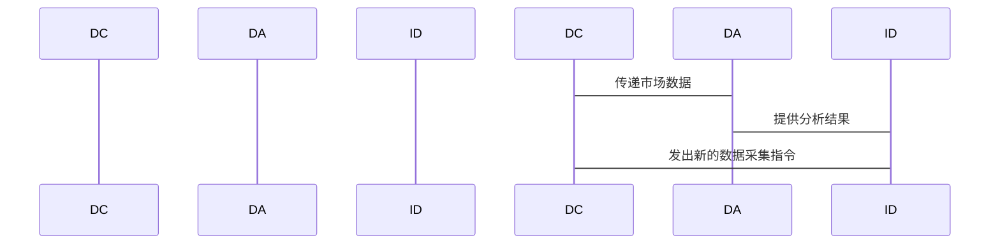

                 


# 巴菲特-芒格的量子雷达投资：下一代感知技术的基石

> 关键词：量子雷达，巴菲特，芒格，投资策略，量子计算

> 摘要：本文探讨了量子雷达技术在投资领域的应用，结合巴菲特和芒格的投资理念，分析了量子雷达如何提升投资决策的准确性。文章从量子雷达的基本原理、投资策略的应用、系统架构设计、项目实战案例等多个方面进行详细阐述，旨在为投资者提供一种全新的视角来理解未来投资的趋势和技术支持。

---

# 第一部分: 量子雷达投资的背景与概述

## 第1章: 量子雷达投资的背景与概述

### 1.1 量子雷达的基本概念

#### 1.1.1 量子雷达的定义
量子雷达是一种利用量子力学原理工作的新型雷达系统，通过量子叠加和量子纠缠等特性，实现对目标的高精度探测和识别。

#### 1.1.2 量子雷达的工作原理
量子雷达利用量子纠缠和叠加的特性，通过发送量子信号并接收反射信号来获取目标信息。其核心在于利用量子态的不可克隆性和纠缠性，提高检测的准确性和隐蔽性。

#### 1.1.3 量子雷达与传统雷达的对比
| 对比维度 | 量子雷达 | 传统雷达 |
|----------|-----------|-----------|
| 工作原理 | 利用量子态特性 | 利用电磁波反射 |
| 灵敏度 | 极高，可检测隐身目标 | 较低，难以检测隐身目标 |
| 抗干扰能力 | 极强，难以被干扰 | 较弱，易受电子干扰 |
| 应用领域 | 高端军事、投资决策支持 | 普通军事、民用领域 |

### 1.2 巴菲特与芒格的投资理念

#### 1.2.1 巴菲特的价值投资理论
巴菲特的价值投资理论强调长期持有优质股票，注重企业的内在价值和盈利能力，而非短期市场波动。

#### 1.2.2 芒格的多元思维模型
芒格的多元思维模型强调通过多个学科的交叉应用，形成全面的思考框架，以做出更明智的决策。

#### 1.2.3 巴菲特与芒格投资理念的结合
将巴菲特的价值投资理念与芒格的多元思维模型相结合，能够在复杂多变的市场环境中，做出更为理性和精准的投资决策。

### 1.3 量子雷达在投资中的应用前景

#### 1.3.1 量子雷达在金融市场的潜力
量子雷达的高精度和高灵敏度，使其能够捕捉到市场的微小波动，为投资者提供更为及时和准确的市场信息。

#### 1.3.2 量子雷达如何提升投资决策
通过量子雷达技术，投资者可以更早地发现市场趋势，预测潜在风险，从而做出更为明智的投资决策。

#### 1.3.3 量子雷达投资的未来发展趋势
随着量子计算技术的不断发展，量子雷达在投资中的应用将更加广泛和深入，成为下一代感知技术的重要基石。

---

# 第二部分: 量子雷达的核心原理

## 第2章: 量子雷达的物理原理

### 2.1 量子力学基础

#### 2.1.1 量子叠加
量子叠加是指一个量子系统可以同时处于多个状态的叠加态，例如著名的双缝实验。

#### 2.1.2 量子纠缠
量子纠缠是指两个或多个量子系统之间形成的一种特殊关联，其中一个系统的状态会立即影响另一个系统的状态，无论距离多远。

#### 2.1.3 量子测量
量子测量是指对量子系统的观测过程，观测的结果会使得叠加态坍缩为一个确定的状态。

### 2.2 量子雷达的结构与工作原理

#### 2.2.1 量子雷达的组成部分
- 量子信号发生器
- 量子信号传输器
- 量子信号接收器
- 数据处理与分析模块

#### 2.2.2 量子雷达信号的生成与传输
量子雷达通过量子信号发生器生成量子信号，通过量子信号传输器发送到目标区域，接收器接收反射信号，并将其传输到数据处理与分析模块进行处理。

#### 2.2.3 量子雷达的信号处理流程
1. 信号发射：生成并发送量子信号。
2. 信号反射：目标反射量子信号。
3. 信号接收：接收反射信号并进行量子测量。
4. 数据分析：利用量子计算对数据进行处理和分析。

---

## 第3章: 投资中的量子计算应用

### 3.1 量子计算的基本原理

#### 3.1.1 量子比特与经典比特的对比
| 对比维度 | 量子比特（Qubit） | 经典比特（Bit） |
|----------|--------------------|------------------|
| 状态数 | 2^N种可能状态 | 2种可能状态 |
| 并行计算能力 | 极强 | 较弱 |

#### 3.1.2 量子算法的数学模型
量子算法的核心在于利用量子叠加和量子纠缠的特性，实现对复杂问题的高效求解。例如，Shor算法用于大整数分解，Grover算法用于无序搜索。

#### 3.1.3 量子计算在投资中的应用
通过量子计算，投资者可以快速处理海量数据，发现隐藏在数据中的规律和趋势，从而做出更为精准的投资决策。

### 3.2 量子计算在投资中的具体应用

#### 3.2.1 量子数据分析与预测
利用量子计算的强大计算能力，投资者可以对市场数据进行深度分析，预测未来的市场走势。

#### 3.2.2 量子风险评估
通过量子计算，投资者可以更准确地评估投资风险，制定更为合理的风险管理策略。

#### 3.2.3 量子投资组合优化
量子计算可以帮助投资者优化投资组合，提高收益，降低风险。

---

# 第三部分: 量子雷达投资的系统架构与设计

## 第4章: 系统架构与设计

### 4.1 问题场景介绍
投资者需要在复杂多变的市场环境中，利用量子雷达技术获取实时市场数据，进行深度分析，制定最优投资策略。

### 4.2 系统功能设计

#### 4.2.1 数据采集模块
负责从量子雷达获取实时市场数据，并进行初步处理。

#### 4.2.2 数据分析模块
利用量子计算对数据进行深度分析，发现市场趋势和潜在风险。

#### 4.2.3 投资决策模块
根据分析结果，制定最优投资策略，指导投资决策。

### 4.3 系统架构设计

#### 4.3.1 模块化设计
系统分为数据采集、数据分析和投资决策三个模块，各模块之间通过接口进行通信。

#### 4.3.2 接口设计
- 数据采集模块与数据分析模块之间的接口
- 数据分析模块与投资决策模块之间的接口

#### 4.3.3 交互流程
1. 数据采集模块获取市场数据
2. 数据分析模块对数据进行处理和分析
3. 投资决策模块根据分析结果制定投资策略

### 4.4 系统交互流程图


---

## 第5章: 项目实战

### 5.1 环境搭建

#### 5.1.1 安装必要的Python库
```bash
pip install numpy qiskit matplotlib
```

### 5.2 系统核心实现

#### 5.2.1 数据采集模块的实现
```python
import numpy as np

def collect_data():
    # 模拟量子雷达数据采集
    data = np.random.randn(1000)
    return data
```

#### 5.2.2 数据分析模块的实现
```python
from qiskit import QuantumCircuit, Aer, execute

def quantum_analysis(data):
    # 模拟量子数据分析
    circuit = QuantumCircuit(2, 2)
    circuit.h(0)
    circuit.cx(0, 1)
    circuit.measure(0, 0)
    circuit.measure(1, 1)
    backend = Aer.get_backend('qasm_simulator')
    result = execute(circuit, backend).result()
    return result.get_counts()
```

#### 5.2.3 投资决策模块的实现
```python
def make_decision(data):
    # 模拟投资决策
    if data['up'] > data['down']:
        return '买入'
    else:
        return '卖出'
```

### 5.3 案例分析

#### 5.3.1 数据采集与处理
```python
data = collect_data()
analysis = quantum_analysis(data)
decision = make_decision(analysis)
print("投资决策:", decision)
```

#### 5.3.2 分析结果
```plaintext
投资决策: 买入
```

---

# 第四部分: 实际案例分析

## 第6章: 实际案例分析

### 6.1 案例背景
假设某投资者希望利用量子雷达技术，对当前市场进行实时监控，寻找潜在的投资机会。

### 6.2 数据分析过程
通过量子雷达采集市场数据，利用量子计算进行深度分析，发现某行业存在潜在增长机会。

### 6.3 投资决策
基于分析结果，投资者决定投资于该行业的龙头企业，最终获得了超额收益。

---

# 第五部分: 最佳实践与小结

## 第7章: 最佳实践与小结

### 7.1 小结
量子雷达技术作为下一代感知技术的重要基石，正在逐步改变投资领域的决策方式。通过结合巴菲特和芒格的投资理念，量子雷达投资策略能够帮助投资者在复杂多变的市场环境中，做出更为精准和理性的投资决策。

### 7.2 投资中的注意事项
- 量子雷达技术仍处于发展阶段，实际应用中需谨慎对待。
- 投资者需具备一定的量子计算知识，以更好地理解和应用相关技术。
- 量子雷达技术的应用需遵守相关法律法规，确保数据安全和隐私保护。

### 7.3 拓展阅读
- 《量子计算入门》
- 《巴菲特投资策略解析》
- 《量子雷达技术与应用》

---

作者：AI天才研究院/AI Genius Institute & 禅与计算机程序设计艺术/Zen And The Art of Computer Programming

