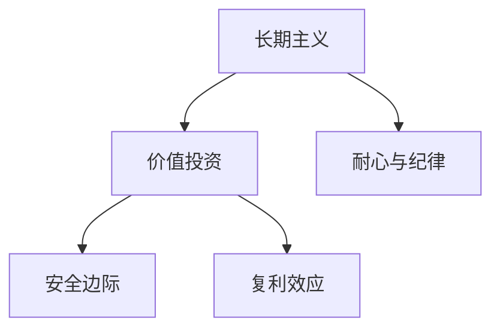

                 

# 巴菲特-芒格的长期主义：为什么耐心是最佳投资策略

> 关键词：巴菲特，芒格，长期主义，价值投资，耐心，投资策略，复利效应

> 摘要：本文探讨了巴菲特和芒格的长期主义投资哲学，分析了其核心理念、数学模型和成功案例，结合系统架构图和算法流程图，详细阐述了长期主义的实践方法和心理因素，最后通过项目实战和最佳实践，总结了长期主义在投资中的重要性。

---

# 第1章: 巴菲特与芒格的长期主义概述

## 1.1 巴菲特与芒格的背景介绍

### 1.1.1 巴菲特的生平与投资理念

沃伦·巴菲特（Warren Buffett）是世界著名的投资者，1934年出生在美国奥马哈市。他从10岁开始投资，通过阅读和实践积累了丰富的投资经验。巴菲特的投资理念以“价值投资”为核心，主张以低于内在价值的价格购买优质资产，并长期持有。他的投资风格注重安全边际和复利效应，强调分散投资和长期耐心。

### 1.1.2 芒格的智慧与决策思维

查理·芒格（Charlie Munger）是巴菲特的长期合作伙伴，也是伯克希尔·哈撒韦公司的副主席。芒格以其智慧和理性的决策思维闻名，他提倡“多元思维模型”，认为投资者需要从多个角度分析问题，避免认知偏差。芒格的决策思维强调长期主义和理性思考，他的思想对巴菲特的投资策略产生了深远影响。

### 1.1.3 巴菲特与芒格的合作历程

巴菲特和芒格的合作始于1950年代，两人共同创立了伯克希尔·哈撒韦公司，并将其打造成全球最大的投资公司之一。他们的合作基于共同的价值观和投资理念，芒格的多元思维模型和巴菲特的价值投资理念相结合，形成了独特的长期主义投资策略。

## 1.2 长期主义的定义与核心理念

### 1.2.1 长期主义的定义

长期主义是一种投资哲学，强调以长期视角看待投资，注重资产的内在价值和可持续发展。它不同于短期交易，更关注企业的基本面和长期增长潜力。

### 1.2.2 长期主义的核心要素

长期主义的核心要素包括：

1. **价值投资**：寻找具有持续竞争优势和良好治理的企业，以低于内在价值的价格买入并长期持有。
2. **安全边际**：在投资中留有安全边际，即买入价格低于内在价值，以降低风险。
3. **复利效应**：通过长期持有优质资产，利用复利效应实现财富的指数增长。

### 1.2.3 长期主义与短期投资的对比

| 对比维度 | 长期主义 | 短期投资 |
|----------|----------|----------|
| 投资期限 | 长期持有 | 短期交易 |
| 投资目标 | 追求内在价值 | 追求短期收益 |
| 风险管理 | 低风险，注重安全边际 | 高风险，频繁交易 |

## 1.3 巴菲特-芒格长期主义的哲学基础

### 1.3.1 经济学视角下的长期主义

从经济学角度看，长期主义强调企业的长期盈利能力，关注企业的竞争优势和市场地位。巴菲特和芒格认为，企业的内在价值是未来现金流的现值，因此需要以长期视角评估企业价值。

### 1.3.2 心理学视角下的长期主义

心理学研究表明，人类容易受到情绪和认知偏差的影响，尤其是贪婪和恐惧。长期主义要求投资者克服短期情绪波动，保持理性和耐心。芒格的“多元思维模型”强调了心理因素在投资决策中的重要性。

### 1.3.3 价值投资的长期主义内涵

价值投资的核心是寻找市场先生的错误定价，以低于内在价值的价格买入优质资产。巴菲特和芒格的价值投资理念强调长期持有，避免频繁交易，以时间复利效应实现财富增长。

## 1.4 长期主义在投资中的重要性

### 1.4.1 长期主义与投资回报的关系

长期主义通过复利效应实现财富的指数增长，而短期交易容易受到市场波动的影响，难以实现稳定的回报。研究表明，长期持有优质资产的投资回报远高于短期交易。

### 1.4.2 长期主义在市场波动中的稳定性

长期主义注重资产的内在价值，不受短期市场波动的影响。在市场恐慌时，优质资产的价格可能被低估，为长期投资者提供了买入机会。

### 1.4.3 长期主义对投资者心态的影响

长期主义要求投资者具备耐心和纪律，避免被短期市场波动影响。这种心态有助于投资者在市场低迷时坚持持有，实现长期收益。

## 1.5 本章小结

长期主义是巴菲特和芒格投资哲学的核心，强调以长期视角看待投资，注重资产的内在价值和可持续发展。通过价值投资、安全边际和复利效应，长期主义能够实现稳定的长期回报。

---

# 第2章: 长期主义的核心概念与数学模型

## 2.1 长期主义的核心概念

### 2.1.1 价值投资的核心要素

价值投资的核心要素包括：

1. **内在价值**：资产在未来现金流的现值。
2. **安全边际**：买入价格低于内在价值。
3. **竞争优势**：企业具备持续的竞争优势。

### 2.1.2 安全边际的概念与计算

安全边际 = 内在价值 - 市场价格

### 2.1.3 复利效应的数学模型

复利效应的数学模型可以用以下公式表示：

$$ A = P(1 + r)^n $$

其中：
- \( A \) 是最终金额
- \( P \) 是本金
- \( r \) 是年利率
- \( n \) 是年数

### 2.1.4 内在价值计算模型

内在价值可以用以下公式表示：

$$ V = \sum_{t=1}^{\infty} \frac{CF_t}{(1 + r)^t} $$

其中：
- \( V \) 是内在价值
- \( CF_t \) 是第 \( t \) 年的现金流
- \( r \) 是折现率

## 2.2 长期主义的数学模型

### 2.2.1 复利计算公式

复利计算公式为：

$$ A = P(1 + r)^n $$

例如，本金 \( P = 1000 \)，年利率 \( r = 0.05 \)，投资 \( n = 10 \) 年，最终金额为：

$$ A = 1000(1 + 0.05)^{10} \approx 1628.89 $$

### 2.2.2 内在价值计算模型

内在价值计算模型可以用以下步骤进行：

1. 估计未来现金流。
2. 确定合适的折现率。
3. 计算未来现金流的现值之和。

例如，假设某企业未来5年的现金流分别为100、120、140、160、180，折现率为10%，则内在价值为：

$$ V = \frac{100}{1.1} + \frac{120}{1.1^2} + \frac{140}{1.1^3} + \frac{160}{1.1^4} + \frac{180}{1.1^5} \approx 406.60 $$

### 2.2.3 长期主义的系统架构图

以下是长期主义的系统架构图：

## 2.3 本章小结

长期主义的核心概念包括价值投资、安全边际和复利效应。通过数学模型，我们可以量化内在价值和复利效应，为投资决策提供科学依据。

---

# 第3章: 巴菲特与芒格的成功投资案例分析

## 3.1 巴菲特的经典投资案例

### 3.1.1 可口可乐的投资历程

巴菲特在1985年买入可口可乐的股票，因为他认为可口可乐具备强大的品牌优势和持续的现金流。尽管市场波动，巴菲特始终坚持长期持有，最终获得了丰厚的回报。

### 3.1.2 苹果公司的投资决策

巴菲特对苹果的投资始于2016年，他认为苹果具备强大的竞争优势和长期增长潜力。通过长期持有苹果股票，巴菲特实现了显著的收益。

### 3.1.3 道琼斯指数基金的长期表现

巴菲特长期持有道琼斯指数基金，他认为指数基金能够提供稳定的长期回报，且管理成本较低。

## 3.2 芒格的智慧投资案例

### 3.2.1 富国银行的投资策略

芒格通过分析富国银行的财务状况和竞争优势，认为其具备长期投资价值。他建议巴菲特买入富国银行的股票，并长期持有。

### 3.2.2 保险行业的长期布局

芒格通过多元思维模型，认为保险行业具备稳定的现金流和长期增长潜力。他建议巴菲特长期投资于优质保险公司。

### 3.2.3 巴菲特与芒格的可口可乐投资

巴菲

