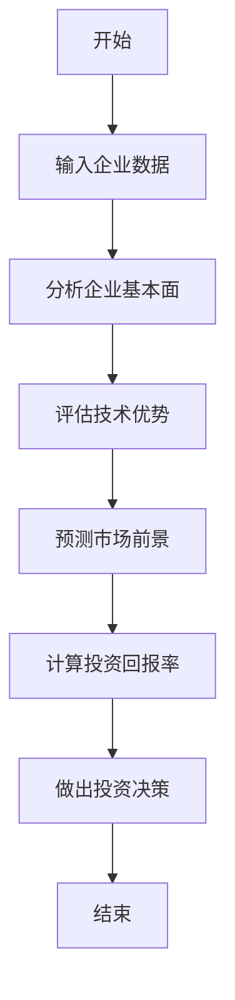

                 


```markdown
# 巴菲特-芒格的高超音速技术投资：未来交通的革命

> 关键词：巴菲特, 芒格, 高超音速技术, 投资策略, 未来交通, 商业航天, 技术革命

> 摘要：本文探讨了巴菲特和芒格在高超音速技术投资领域的策略和成功经验，分析了高超音速技术的定义、背景、市场前景，以及其对未来交通革命的深远影响。通过具体的投资案例分析，总结了高超音速技术的投资机会和风险，并提出了系统的投资决策方法和架构设计。

---

## 第一部分: 高超音速技术的定义与背景

### 第1章: 高超音速技术的定义与背景

#### 1.1 高超音速技术的定义
##### 1.1.1 高超音速技术的定义与特点
高超音速技术是指飞行速度超过5倍音速（ Mach 5）的飞行技术，涉及空气动力学、材料科学、推进系统等多个领域的高度集成。其核心特点包括极端的速度、高温环境和复杂的空气动力学挑战。

##### 1.1.2 高超音速技术的历史发展
高超音速技术起源于20世纪50年代的航空航天研究，经历了多次技术突破和挫折。近年来，随着技术的进步和市场需求的增加，高超音速技术重新受到关注。

##### 1.1.3 高超音速技术在交通领域的应用前景
高超音速技术在商业航天、高速交通和军事领域具有广阔的应用前景。未来，高超音速技术可能彻底改变全球交通方式，实现洲际旅行的小时级到达。

---

### 第2章: 巴菲特与芒格的投资哲学

#### 2.1 巴菲特的价值投资理念
##### 2.1.1 价值投资的核心要素
巴菲特强调长期投资、安全边际和企业基本面分析。他认为，投资的本质是寻找具有持续竞争优势和良好管理的企业。

##### 2.1.2 投资的三大要素
1. 企业护城河：企业必须具备独特的竞争优势。
2. 管理层：管理层必须诚实、有能力且以股东利益为重。
3. 估值：买入价格必须低于内在价值。

#### 2.2 芒格的多元思维模型
##### 2.2.1 多元思维模型的定义
芒格强调通过多个学科的交叉应用来解决问题，避免单一思维的局限性。

##### 2.2.2 多元思维模型在投资中的应用
1. 物理学：能量守恒、杠杆原理等。
2. 生物学：进化论、物种竞争等。
3. 经济学：市场均衡、成本曲线等。

#### 2.3 巴菲特与芒格投资哲学的结合
##### 2.3.1 价值投资与多元思维的结合
通过多元思维模型筛选具有长期竞争优势的企业，并结合价值投资的理念进行投资决策。

---

## 第二部分: 巴菲特与芒格的高超音速技术投资案例

### 第3章: 高超音速技术企业的投资分析

#### 3.1 高超音速技术企业的技术优势
##### 3.1.1 火箭技术的核心优势
SpaceX通过可重复使用的火箭技术大幅降低了发射成本，成为商业航天领域的领导者。

##### 3.1.2 高超音速飞行器的技术突破
Blue Origin的New Shepard火箭成功实现了亚轨道飞行，展示了高超音速技术的可行性。

#### 3.2 投资案例分析
##### 3.2.1 SpaceX的投资分析
1. 技术优势：可重复使用的火箭、先进制造技术。
2. 市场定位：商业航天市场的领导者。
3. 投资回报：SpaceX的估值从2015年的约200亿美元增长至2023年的超过1000亿美元。

##### 3.2.2 Blue Origin的投资分析
1. 技术优势：亚轨道飞行器、垂直回收技术。
2. 市场定位：专注于亚轨道旅行和高超音速技术。
3. 投资回报：Blue Origin的估值稳步增长，吸引了包括巴菲特在内的投资者。

---

## 第三部分: 高超音速技术的市场前景与投资机会

### 第4章: 高超音速技术的市场需求

#### 4.1 高超音速技术的市场需求分析
##### 4.1.1 商业航天的市场需求
随着太空旅行的兴起，商业航天市场的需求迅速增长，SpaceX和Blue Origin等企业成为主要参与者。

##### 4.1.2 高速交通领域的市场潜力
高超音速技术有望实现全球范围内快速、高效的交通方式，市场需求巨大。

#### 4.2 高超音速技术的市场增长预测
##### 4.2.1 全球高超音速技术市场的规模预测
预计到2030年，全球高超音速技术市场规模将超过1000亿美元。

##### 4.2.2 市场增长的主要驱动因素
1. 商业航天的发展。
2. 军事需求的增加。
3. 民用市场的拓展。

---

### 第5章: 高超音速技术的投资机会

#### 5.1 高超音速技术的投资机会
##### 5.1.1 技术成熟度与投资风险
高超音速技术目前仍处于发展阶段，存在较高的技术风险和市场不确定性。

##### 5.1.2 市场增长与投资回报潜力
随着技术成熟和市场需求的增长，高超音速技术的投资回报潜力巨大。

##### 5.1.3 投资高超音速技术的长期战略意义
高超音速技术的投资不仅能够带来经济回报，还具有重要的战略意义，特别是在商业航天和军事领域。

---

## 第四部分: 高超音速技术投资的系统分析与架构设计

### 第6章: 高超音速技术投资的系统分析

#### 6.1 高超音速技术投资的系统分析
##### 6.1.1 投资目标与问题场景
高超音速技术投资的目标是通过长期价值投资和多元思维模型，识别具有竞争优势的高超音速技术企业。

##### 6.1.2 项目介绍与核心功能设计
1. 项目介绍：高超音速技术企业的投资分析。
2. 核心功能：企业基本面分析、技术优势评估、市场前景预测。

##### 6.1.3 领域模型与系统架构设计
1. 领域模型：高超音速技术企业的关键要素包括技术优势、市场定位、财务状况等。
2. 系统架构设计：采用模块化架构，包括数据采集、分析、决策支持等功能模块。

#### 6.2 投资决策的算法原理
##### 6.2.1 投资决策算法的数学模型
投资回报率（ROI）= (净利润 / 初始投资) × 100%

##### 6.2.2 算法流程图


#### 6.3 投资决策的Python源代码实现
```python
def calculate_return_on_investment(net_profit, initial_investment):
    return (net_profit / initial_investment) * 100

# 示例数据
net_profit = 1000000  # 净利润（美元）
initial_investment = 5000000  # 初始投资（美元）

roi = calculate_return_on_investment(net_profit, initial_investment)
print(f"投资回报率: {roi}%")
```

---

## 第五部分: 高超音速技术投资的项目实战

### 第7章: 项目环境与工具安装

#### 7.1 项目环境
##### 7.1.1 操作系统
建议使用Linux或MacOS系统。

##### 7.1.2 开发工具
推荐使用PyCharm或VS Code作为开发工具。

#### 7.2 工具安装
##### 7.2.1 Python安装
```bash
python --version
pip install --upgrade pip
```

##### 7.2.2 Mermaid工具安装
```bash
pip install graphviz
pip install pymermaid
```

---

### 第8章: 系统核心实现源代码

#### 8.1 高超音速技术投资决策系统
##### 8.1.1 数据采集模块
```python
import requests
from bs4 import BeautifulSoup

def fetch_data(url):
    response = requests.get(url)
    soup = BeautifulSoup(response.text, 'html.parser')
    # 提取企业数据
    return data
```

##### 8.1.2 数据分析模块
```python
import pandas as pd

def analyze_data(data):
    df = pd.DataFrame(data)
    # 进行数据分析和建模
    return analysis_result
```

##### 8.1.3 决策支持模块
```python
def make_investment_decision(analysis_result):
    if analysis_result['roi'] > 20:
        return "投资"
    else:
        return "不投资"
```

---

## 第六部分: 总结与展望

### 第9章: 总结

#### 9.1 投资策略总结
高超音速技术的投资需要结合巴菲特的价值投资理念和芒格的多元思维模型，通过系统分析和长期观察，识别具有竞争优势的企业。

#### 9.2 投资风险与注意事项
1. 技术风险：高超音速技术仍处于发展阶段，存在较高的技术不确定性。
2. 市场风险：市场需求可能受到政策和竞争的影响。
3. 估值风险：高超音速技术企业的估值可能过高。

---

### 第10章: 未来展望

#### 10.1 高超音速技术的未来发展
随着技术的进步和市场需求的增加，高超音速技术将在商业航天、高速交通等领域发挥重要作用。

#### 10.2 投资策略的优化
未来的投资策略需要更加注重技术发展和市场变化，结合实时数据和动态分析，优化投资决策。

---

## 作者信息

作者：AI天才研究院/AI Genius Institute & 禅与计算机程序设计艺术 /Zen And The Art of Computer Programming
```

