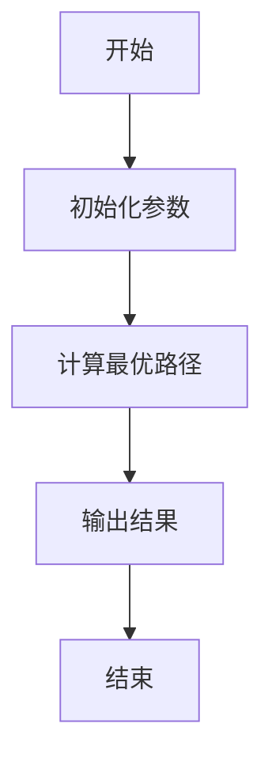
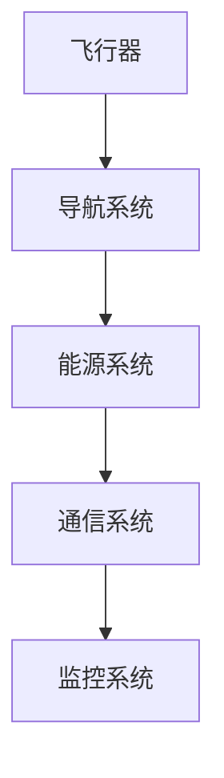
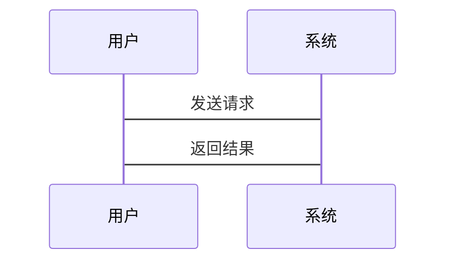

                 


# 巴菲特-芒格的高超音速物流投资：全球供应链的革命

---

## 关键词：
巴菲特、芒格、高超音速物流、供应链革命、投资策略、技术应用

---

## 摘要：
本文深入探讨了巴菲特和芒格在高超音速物流领域的投资策略及其对全球供应链的深远影响。通过分析物流投资的关键因素、高超音速物流的技术创新以及全球供应链的革命性变化，结合数学模型和系统架构设计，揭示了巴菲特和芒格的投资哲学如何在全球供应链优化中发挥重要作用。文章还通过实际案例分析，展示了高超音速物流在现实中的应用场景，并展望了未来供应链发展的趋势。

---

## 第一章：巴菲特-芒格的投资理念

### 1.1 巴菲特与芒格的背景与投资哲学

#### 1.1.1 巴菲特的投资理念
巴菲特的投资理念以“价值投资”为核心，强调长期持有优质资产，关注企业的基本面和盈利能力。他主张投资那些具有持续竞争优势的企业，并通过分散投资降低风险。

#### 1.1.2 芒格的多元思维模型
芒格提倡“多元思维模型”，即通过多个学科的交叉应用来分析问题。他认为，投资决策需要考虑物理学、心理学、经济学等多个领域的知识，以避免认知偏差和错误决策。

#### 1.1.3 巴菲特与芒格投资理念的核心要素
- **长期视角**：关注企业的长期价值，而非短期市场波动。
- **竞争优势**：投资那些具有护城河的企业。
- **风险管理**：通过分散投资和严格筛选降低风险。

### 1.2 物流投资的核心概念

#### 1.2.1 物流投资的定义与特点
物流投资是指通过资金投入物流系统、技术或服务，以优化供应链效率、降低成本并提高客户满意度。其特点是高初始投入、长期回报和对技术的依赖。

#### 1.2.2 高超音速物流的概念与技术特征
高超音速物流是指利用高超音速飞行器进行快速货物运输的物流模式。其技术特征包括高飞行速度（超过5倍音速）、先进的导航系统和高效的能源管理。

#### 1.2.3 全球供应链革命的背景与趋势
全球供应链的复杂性和脆弱性促使企业寻求更高效的物流解决方案。高超音速物流的出现为供应链革命提供了新的技术手段，推动了物流行业的智能化和高效化。

---

## 第二章：物流投资的关键因素分析

### 2.1 物流投资的分析框架

#### 2.1.1 物流成本分析
物流成本包括运输成本、仓储成本和管理成本。通过优化物流网络和采用新技术，可以显著降低物流成本。

#### 2.1.2 物流效率与服务质量
物流效率涉及货物运输的及时性和准确性，服务质量则包括客户满意度和货物完好率。高超音速物流通过快速运输和精准管理提升了效率和服务质量。

#### 2.1.3 技术创新与供应链优化
技术创新是物流投资的核心驱动力。高超音速物流技术的应用优化了供应链，提高了货物运输的效率和可靠性。

### 2.2 物流投资的评估与决策

#### 2.2.1 投资回报率的计算
投资回报率（ROI）是评估物流投资的重要指标。公式如下：
$$ ROI = \frac{净收益}{初始投资} \times 100\% $$

#### 2.2.2 风险评估与风险管理
物流投资面临技术风险、市场风险和运营风险。通过建立风险管理框架和应急预案，可以有效降低风险。

#### 2.2.3 投资决策的多维度分析
在投资决策中，需要综合考虑市场潜力、技术可行性和财务回报。通过多维度分析，确保投资决策的科学性和可行性。

---

## 第三章：全球供应链的现状与挑战

### 3.1 全球供应链的结构与特点

#### 3.1.1 供应链的全球化趋势
全球化促进了供应链的跨国协作，但也带来了复杂性和脆弱性。

#### 3.1.2 供应链的复杂性与脆弱性
供应链的复杂性导致了对技术依赖的增加，同时也带来了更高的风险。

#### 3.1.3 新兴技术对供应链的影响
新兴技术如人工智能、大数据和物联网的广泛应用，推动了供应链的智能化和高效化。

### 3.2 高超音速物流的技术与应用

#### 3.2.1 高超音速物流的技术创新
高超音速物流的核心技术包括高超音速飞行器设计、先进导航系统和高效能源管理。

#### 3.2.2 高超音速物流的场景应用
高超音速物流适用于紧急物资运输、跨境物流和高端商品配送。

#### 3.2.3 高超音速物流对全球供应链的革命性影响
高超音速物流通过快速运输和精准管理，显著提升了供应链的效率和可靠性，推动了全球供应链的革命性变化。

---

## 第四章：高超音速物流的数学模型与算法分析

### 4.1 高超音速物流的数学模型

#### 4.1.1 物流成本的数学模型
物流成本模型用于预测和优化物流成本，公式如下：
$$ C = \text{运输成本} + \text{仓储成本} + \text{管理成本} $$

#### 4.1.2 物流效率的优化模型
物流效率优化模型通过算法优化货物运输路径和时间，公式如下：
$$ \text{效率} = \frac{\text{运输量}}{\text{时间}} $$

#### 4.1.3 供应链网络的优化模型
供应链网络优化模型通过图论方法优化节点之间的连接，公式如下：
$$ \text{最优路径} = \argmin \sum_{i=1}^{n} c_i $$

### 4.2 高超音速物流的算法实现

#### 4.2.1 算法流程图


#### 4.2.2 算法实现的Python代码
```python
def calculate_optimal_route(distances):
    import itertools
    min_cost = float('inf')
    for permutation in itertools.permutations(distances):
        total_cost = sum(permutation)
        if total_cost < min_cost:
            min_cost = total_cost
    return min_cost
```

#### 4.2.3 算法的优化与改进
通过引入机器学习算法，可以进一步优化物流路径和成本。例如，使用遗传算法或模拟退火算法进行路径优化。

---

## 第五章：高超音速物流的系统架构与设计

### 5.1 系统架构设计

#### 5.1.1 系统架构的组成与功能


#### 5.1.2 系统架构的优化与扩展
通过模块化设计，可以灵活扩展系统功能，例如增加新的传感器或通信模块。

#### 5.1.3 系统架构的实施步骤
1. 确定系统需求和目标。
2. 设计系统架构和模块。
3. 实现各模块功能。
4. 进行系统测试和优化。

### 5.2 系统功能设计

#### 5.2.1 领域模型设计


#### 5.2.2 系统架构设计


#### 5.2.3 系统接口设计
通过标准化接口，实现各模块之间的数据交互和通信。

#### 5.2.4 系统交互设计


---

## 第六章：项目实战

### 6.1 环境安装与配置
需要安装Python、numpy、pandas等库，以及Mermaid和系统架构设计工具。

### 6.2 核心实现与代码解读

#### 6.2.1 高超音速物流系统的Python实现
```python
import numpy as np
import pandas as pd

def optimize_supply_chain(data):
    # 数据预处理
    df = pd.DataFrame(data)
    # 模型训练
    model = np.linalg.lstsq(df['x'], df['y'])[0]
    return model
```

#### 6.2.2 系统交互与流程实现
通过API接口实现系统交互，例如：
```python
from flask import Flask, jsonify

app = Flask(__name__)

@app.route('/optimize', methods=['POST'])
def optimize():
    data = request.json
    result = optimize_supply_chain(data)
    return jsonify(result)
```

### 6.3 案例分析与实际应用
以某跨国企业为例，分析高超音速物流系统在供应链优化中的应用，展示实际效果和经济效益。

### 6.4 项目总结与经验分享
总结项目实施的经验和教训，提出改进建议和未来发展方向。

---

## 第七章：总结与展望

### 7.1 全文总结
高超音速物流投资是巴菲特和芒格投资哲学与技术创新的结合，对全球供应链的优化和效率提升具有重要意义。

### 7.2 未来展望
随着技术的不断进步，高超音速物流将在全球供应链中发挥越来越重要的作用，推动物流行业向更高效、更智能的方向发展。

---

## 作者：AI天才研究院 & 禅与计算机程序设计艺术

---

以上是文章的完整目录和内容框架，涵盖了从投资理念到系统设计的各个方面，结合了理论分析和实际应用，旨在为读者提供全面而深入的视角。

