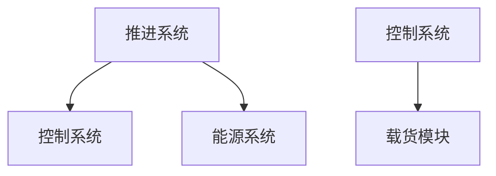
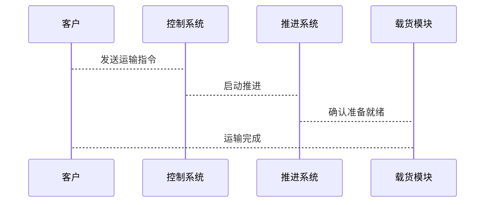

                 


# 巴菲特-芒格的高超音速运输投资：重塑全球物流网络

---

## 关键词：
- 巴菲特
- 芒格
- 高超音速运输
- 投资策略
- 全球物流网络
- 供应链优化

---

## 摘要：
本文探讨了巴菲特和芒格投资高超音速运输技术的背景、动机及其对全球物流网络的深远影响。通过分析高超音速运输的核心技术、投资评估模型以及系统架构，本文揭示了这一技术如何重塑全球物流体系，优化供应链效率，并为投资者提供新的机遇。

---

## 第一部分：背景介绍

### 第1章：高超音速运输技术的背景与现状

#### 1.1 高超音速运输技术的定义与特点
- **定义**：高超音速运输技术是指能够在大气层内以5倍音速（约6174公里/小时）或更高速度飞行的技术。
- **特点**：
  - 极高的飞行速度
  - 耐高温材料需求
  - 复杂的空气动力学设计

#### 1.2 巴菲特与芒格的投资理念
- **巴菲特的价值投资理论**：注重企业的长期价值，寻找具有持续竞争优势的公司。
- **芒格的多元思维模型**：强调跨学科思考，寻找复杂问题的简单解决方案。
- **投资动机**：高超音速运输技术的市场潜力和战略价值。

#### 1.3 高超音速运输技术与物流网络
- **技术优势**：显著缩短运输时间，优化供应链效率。
- **市场影响**：降低运输成本，提升全球贸易效率。

---

### 第2章：高超音速运输技术对全球物流网络的影响

#### 2.1 全球物流网络的现状
- **传统运输方式的局限**：速度慢、成本高。
- **高超音速运输的优势**：高效、快速，适用于高附加值货物运输。

#### 2.2 高超音速运输技术对物流网络的重塑
- **运输效率提升**：大幅缩短交货时间，增强供应链灵活性。
- **成本优化**：通过更高的载重和更高效的能源利用降低成本。

---

## 第二部分：核心技术与投资评估

### 第3章：高超音速运输技术的核心技术分析

#### 3.1 推进系统
- **火箭发动机**：高效率、高推力，适合高超音速飞行。
- **超音速推进技术**：创新设计以应对高速飞行中的空气动力学挑战。

#### 3.2 材料科学
- **耐高温材料**：碳纤维复合材料和高温合金的应用。
- **轻量化设计**：降低燃料消耗，提高飞行效率。

#### 3.3 空气动力学
- **高超音速飞行器设计**：优化外形以减少阻力，提高飞行稳定性。

---

### 第4章：高超音速运输技术的投资评估模型

#### 4.1 投资评估的关键指标
- **技术可行性**：研发进展和专利数量。
- **市场需求**：高附加值货物运输需求的增长。
- **投资回报周期**：高技术壁垒和高市场准入门槛。

#### 4.2 投资模型的构建
- **净现值（NPV）计算**：
  $$ NPV = \sum_{t=1}^{n} \frac{C_t}{(1+r)^t} $$
- **内部收益率（IRR）**：
  $$ IRR = r \text{ 使得 } NPV = 0 $$

---

## 第三部分：系统分析与架构设计方案

### 第5章：高超音速运输系统的实施与架构

#### 5.1 项目管理
- **项目目标**：技术研发、市场推广和商业化。
- **关键里程碑**：原型机测试、飞行试验和商业化运营。

#### 5.2 系统架构设计
- **功能模块**：推进系统、控制系统和载货模块。
- **系统架构图**：


#### 5.3 接口设计
- **数据接口**：传感器数据、控制系统指令。
- **交互流程图**：


---

## 第四部分：项目实战与案例分析

### 第6章：高超音速运输项目实战

#### 6.1 环境配置
- **开发环境**：高性能计算集群，模拟器和测试设备。
- **工具链**：CAD设计软件、CFD模拟工具和优化算法。

#### 6.2 核心代码实现
- **推进系统模拟代码**：
  ```python
  def calculate_thrust():
      # 模拟推进系统推力计算
      return thrust_value
  ```
- **控制系统实现**：
  ```python
  def control_system():
      # 读取传感器数据并调整推力
      return control_output
  ```

#### 6.3 代码解读与分析
- **推进系统代码**：基于物理模型计算推力。
- **控制系统代码**：实时调整飞行参数以确保稳定。

#### 6.4 实际案例分析
- **SpaceX高超音速项目**：从研发到测试的详细分析。
- **项目总结**：技术创新和市场可行性。

---

## 第五部分：最佳实践与小结

### 第7章：最佳投资策略与风险管理

#### 7.1 投资策略
- **长期视角**：关注技术创新和市场潜力。
- **风险管理**：分散投资、定期评估。

#### 7.2 小结
- 高超音速运输技术的前景广阔，但投资需谨慎评估。
- 巴菲特和芒格的投资理念为投资者提供了 valuable insights。

---

## 结论

巴菲特和芒格的投资策略揭示了高超音速运输技术的潜力，其对全球物流网络的重塑将深远影响供应链效率。本文通过技术分析、投资模型和系统设计，为投资者和从业者提供了全面的视角。

---

## 作者：AI天才研究院 & 禅与计算机程序设计艺术

---

