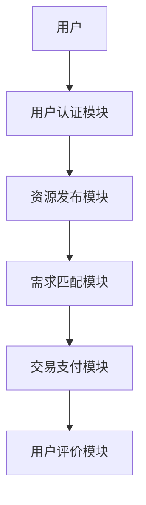
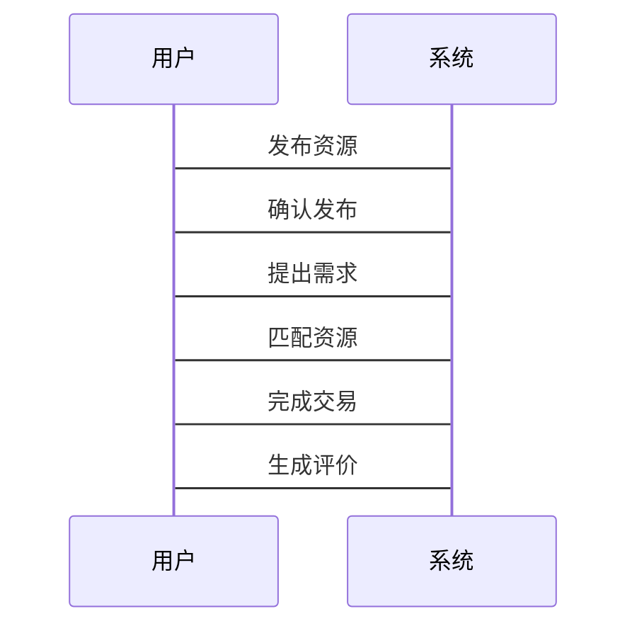

                 


# 巴菲特-芒格看共享经济：商业模式的革新

> **关键词**: 巴菲特, 芒格, 共享经济, 商业模式, 投资哲学, 系统架构, 项目实战

> **摘要**: 本文从巴菲特和芒格的投资哲学出发，分析共享经济的商业模式，结合系统架构和项目实战，探讨如何通过巴菲特和芒格的思维方式革新共享经济的商业模式。文章内容丰富，逻辑严密，既有理论分析，又有实际案例，适合对投资哲学和商业模式创新感兴趣的读者阅读。

---

## 第1章: 巴菲特与芒格的投资哲学

### 1.1 巴菲特与芒格的合伙关系

#### 1.1.1 巴菲特与芒格的合伙背景
- 巴菲特与芒格的合伙关系起源于20世纪50年代，芒格为巴菲特提供多元化的投资思路。
- 芒格的多元思维模型对巴菲特的投资决策产生了深远影响。

#### 1.1.2 芒格对巴菲特投资理念的影响
- 芒格的思维方式帮助巴菲特扩展了投资视野，尤其是在企业估值和风险控制方面。
- 芒格强调的“安全边际”理念成为巴菲特投资决策的重要原则。

#### 1.1.3 芒格的多元思维模型
- 多元思维模型包括物理学、心理学、经济学等多个学科的交叉应用。
- 通过跨学科的思考，芒格帮助巴菲特避免了单一思维的局限性。

### 1.2 巴菲特的价值投资原则

#### 1.2.1 价值投资的核心理念
- 价值投资的核心是寻找市场低估的优质企业。
- 巴菲特强调长期投资，关注企业的内在价值。

#### 1.2.2 安全边际的概念与应用
- 安全边际是指买入价格低于企业内在价值的差额。
- 通过安全边际，巴菲特降低了投资的风险。

#### 1.2.3 长期投资与复利效应
- 长期投资通过复利效应实现财富的稳步增长。
- 巴菲特通过长期持有优质企业股票，实现了投资的长期收益。

### 1.3 巴菲特与芒格的思维方式

#### 1.3.1 简化决策原则
- 巴菲特强调简化决策，专注于少数优质企业。
- 简化决策有助于避免过度分散投资带来的风险。

#### 1.3.2 多元思维模型的应用
- 芒格的多元思维模型帮助巴菲特在投资决策中考虑更多的因素。
- 通过多元思维模型，巴菲特能够更好地识别企业的竞争优势和潜在风险。

## 第2章: 共享经济的基本概念

### 2.1 共享经济的定义与特点

#### 2.1.1 共享经济的定义
- 共享经济是指通过共享资源实现经济活动的模式。
- 共享经济的核心是通过技术手段实现资源的高效利用。

#### 2.1.2 共享经济的特点
- 基于互联网技术的资源共享。
- 用户参与度高，资源利用效率高。
- 通过平台实现供需匹配。

#### 2.1.3 共享经济的模式分类
- P2P模式：个人对个人的共享。
- B2C模式：企业对个人的共享。
- C2B模式：个人对企业或组织的共享。

### 2.2 共享经济的现状与挑战

#### 2.2.1 共享经济的发展现状
- 共享经济在全球范围内迅速发展，涵盖交通、住宿、办公等多个领域。
- 技术的进步为共享经济的发展提供了基础。

#### 2.2.2 共享经济面临的主要挑战
- 法律法规的不确定性。
- 用户隐私和数据安全问题。
- 服务质量与用户体验的平衡。

#### 2.2.3 共享经济的未来发展趋势
- 技术创新将推动共享经济的进一步发展。
- 用户需求的多样化将促使共享经济模式不断创新。
- 共享经济将更加注重可持续发展和社会责任。

## 第3章: 巴菲特与芒格视角下的共享经济分析

### 3.1 巴菲特视角下的共享经济

#### 3.1.1 巴菲特对共享经济的评价
- 巴菲特认为共享经济是一种高效的资源利用模式。
- 他关注共享经济平台的长期盈利能力和发展潜力。

#### 3.1.2 巴菲特对共享经济的投资策略
- 巴菲特倾向于投资那些具有强大竞争优势和护城河的共享经济平台。
- 他注重企业的财务健康状况和管理层能力。

### 3.2 芒格视角下的共享经济

#### 3.2.1 芒格对共享经济的评价
- 芒格认为共享经济是一种创新的商业模式，能够提高资源利用效率。
- 他关注共享经济平台的用户黏性和市场扩展能力。

#### 3.2.2 芒格对共享经济的风险管理
- 芒格强调分散投资以降低风险。
- 他建议投资者在投资共享经济时，要全面评估企业的商业模式和市场前景。

## 第4章: 共享经济的系统分析与架构设计

### 4.1 系统架构设计

#### 4.1.1 系统功能设计
- 用户注册与登录。
- 资源发布与需求匹配。
- 交易支付与结算。
- 用户评价与反馈。

#### 4.1.2 系统架构图


#### 4.1.3 数据流设计


### 4.2 系统实现

#### 4.2.1 环境安装
- 需要安装Python、Django框架、MySQL数据库。
- 安装相关依赖库，如Django REST framework。

#### 4.2.2 核心代码实现
```python
from django.shortcuts import render
from rest_framework.views import APIView
from rest_framework.response import Response
from .models import Resource

class ResourceAPIView(APIView):
    def post(self, request):
        serializer = ResourceSerializer(data=request.data)
        if serializer.is_valid():
            serializer.save()
            return Response(serializer.data, status=201)
        return Response(serializer.errors, status=400)
```

#### 4.2.3 代码解读与分析
- 该代码实现了资源发布功能，用户可以通过API接口上传资源信息。
- 使用Django REST framework构建RESTful API，方便前后端分离开发。

### 4.3 系统交互设计

#### 4.3.1 用户交互流程
- 用户登录系统。
- 发布资源或提出需求。
- 系统匹配供需。
- 完成交易并进行评价。

#### 4.3.2 序列图设计


## 第5章: 项目实战

### 5.1 环境安装与配置

#### 5.1.1 安装Python与Django
```bash
python -m pip install --upgrade pip
pip install django
pip install djangorestframework
pip install mysqlclient
```

#### 5.1.2 数据库配置
- 配置MySQL数据库，创建共享经济平台的数据库和表。
- 配置Django项目，连接到MySQL数据库。

### 5.2 核心代码实现

#### 5.2.1 资源发布模块
```python
from rest_framework import serializers

class ResourceSerializer(serializers.ModelSerializer):
    class Meta:
        model = Resource
        fields = '__all__'
```

#### 5.2.2 需求匹配模块
```python
from django.db.models import Q
from .models import Resource, Demand

def match_supply_and_demand():
    resources = Resource.objects.all()
    demands = Demand.objects.all()
    for demand in demands:
        matching_resources = Resource.objects.filter(
            Q(type=demand.type) &
            Q(location=demand.location)
        )
        if matching_resources.exists():
            # 进行匹配处理
            pass
```

#### 5.2.3 交易支付模块
```python
from django.views.decorators.csrf import csrf_exempt
from rest_framework import serializers
from .models import Transaction

class TransactionSerializer(serializers.ModelSerializer):
    class Meta:
        model = Transaction
        fields = '__all__'
```

### 5.3 项目小结

#### 5.3.1 项目总结
- 成功搭建了一个共享经济平台的基本框架。
- 实现了资源发布、需求匹配和交易支付的核心功能。

#### 5.3.2 注意事项
- 在实际应用中，需要考虑用户隐私和数据安全。
- 需要设计完善的用户评价和反馈机制。

#### 5.3.3 拓展建议
- 引入区块链技术，提高系统的透明度和安全性。
- 优化需求匹配算法，提高资源利用率。

## 第6章: 总结与展望

### 6.1 总结

#### 6.1.1 核心观点回顾
- 巴菲特和芒格的投资哲学为共享经济的商业模式创新提供了重要的启示。
- 共享经济的系统架构设计需要考虑技术实现和用户体验的双重因素。

#### 6.1.2 投资哲学与商业模式的结合
- 巴菲特和芒格的思维方式帮助投资者更好地识别共享经济中的投资机会。
- 共享经济的商业模式创新需要结合技术进步和市场需求。

### 6.2 展望

#### 6.2.1 当前模式的不足
- 共享经济的法律法规和政策环境尚不完善。
- 用户隐私和数据安全问题需要进一步解决。

#### 6.2.2 未来发展方向
- 技术创新将推动共享经济的进一步发展。
- 共享经济将更加注重可持续发展和社会责任。
- 用户需求的多样化将促使共享经济模式不断创新。

---

## 作者

作者：AI天才研究院/AI Genius Institute & 禅与计算机程序设计艺术 /Zen And The Art of Computer Programming

---

通过以上目录，我们可以看到，文章从巴菲特和芒格的投资哲学出发，结合共享经济的商业模式，通过系统架构和项目实战，全面分析了如何通过巴菲特和芒格的思维方式革新共享经济的商业模式。文章内容丰富，逻辑严密，既有理论分析，又有实际案例，适合对投资哲学和商业模式创新感兴趣的读者阅读。

