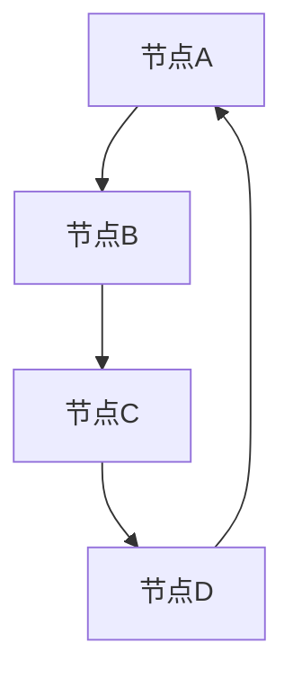
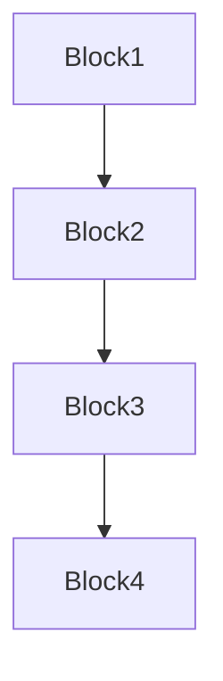

                 

# 巴菲特-芒格看区块链：技术创新与投资机会

> 关键词：区块链技术，巴菲特投资，芒格思维，加密货币，智能合约，分布式账本，价值投资

> 摘要：本文深入分析区块链技术的核心原理及其在金融、供应链等领域的广泛应用，结合巴菲特和芒格的价值投资理念，探讨区块链领域的投资机会和策略。通过实际案例分析，总结成功的投资经验，为投资者提供宝贵见解。

---

## 第1章：区块链技术的概述

### 1.1 区块链的基本概念

#### 1.1.1 区块链的定义
区块链是一种去中心化的分布式账本技术，通过密码学和共识机制确保数据的安全性和不可篡改性。

#### 1.1.2 区块链的核心特点
- **去中心化**：无须依赖中心机构，数据由所有参与者共同维护。
- **不可篡改**：通过密码学确保数据的安全性和一致性。
- **透明性**：所有交易记录公开透明，可追溯。

#### 1.1.3 区块链与传统技术的对比
| 特性 | 区块链 | 传统中心化系统 |
|------|--------|----------------|
| 数据控制 | 去中心化 | 中心化          |
| 安全性 | 高      | 中等           |
| 透明性 | 高      | 低             |

### 1.2 区块链的核心技术原理

#### 1.2.1 分布式账本
分布式账本通过多个节点同步记录数据，确保数据的一致性和可靠性。节点之间通过点对点网络连接，避免单点故障。

#### 1.2.2 共识机制
共识机制确保所有节点达成一致，常见的机制包括工作量证明（PoW）和权益证明（PoS）。

#### 1.2.3 智能合约
智能合约是基于区块链的自动执行程序，用于自动执行合同条款。其核心在于自动性和不可篡改性。

---

## 第2章：区块链的底层技术

### 2.1 分布式账本的实现

#### 2.1.1 分布式账本的概念
分布式账本通过多个节点记录数据，确保数据的冗余性和可靠性。

#### 2.1.2 区块链的数据结构
区块链由区块和链组成，每个区块包含交易数据和哈希指针。

#### 2.1.3 区块链的共识机制

### 2.2 共识机制的算法原理

#### 2.2.1 工作量证明（PoW）
PoW通过计算哈希值来验证工作量，确保网络安全。

#### 2.2.2 权益证明（PoS）
PoS通过持有代币的数量来分配记账权，降低能源消耗。

#### 2.2.3 拜占庭容错（BFT）
BFT通过多数节点达成共识，适用于网络条件较差的情况。

---

## 第3章：区块链的投资机会

### 3.1 区块链在金融领域的应用

#### 3.1.1 数字货币
比特币和以太坊等数字货币通过区块链实现去中心化的价值转移。

#### 3.1.2 智能合约在金融中的应用
智能合约自动执行金融交易，提高效率和透明度。

### 3.2 区块链在供应链管理中的应用

#### 3.2.1 供应链透明化
区块链确保供应链数据的透明和可追溯，减少欺诈。

#### 3.2.2 质量追溯
通过区块链记录产品信息，消费者可追溯产品来源。

---

## 第4章：巴菲特和芒格的价值投资理念

### 4.1 巴菲特的价值投资原则

#### 4.1.1 企业基本面分析
巴菲特注重企业的盈利能力、财务状况和竞争优势。

#### 4.1.2 长期投资策略
巴菲特倡导长期投资，避免短期波动。

### 4.2 芒格的多元思维模型

#### 4.2.1 多学科思维的重要性
芒格强调跨学科思考，避免认知偏差。

#### 4.2.2 独立思考与决策
芒格主张独立思考，避免从众心理。

---

## 第5章：区块链领域的投资策略

### 5.1 区块链项目评估的关键指标

#### 5.1.1 技术可行性
评估项目的技术实现难度和成熟度。

#### 5.1.2 市场需求
分析项目的市场前景和用户需求。

### 5.2 巴菲特和芒格理念在区块链投资中的应用

#### 5.2.1 企业基本面分析
评估区块链公司的财务状况和竞争优势。

#### 5.2.2 长期价值投资
关注区块链技术的长期应用前景。

---

## 第6章：实际投资案例分析

### 6.1 成功案例：比特币

#### 6.1.1 比特币的技术优势
比特币通过区块链实现去中心化的价值转移。

#### 6.1.2 投资回报分析
比特币价格从2017年至今大幅波动，但长期趋势向好。

### 6.2 失败案例：某些ICO项目

#### 6.2.1 项目失败的原因
部分ICO项目缺乏实际应用场景和技术创新。

#### 6.2.2 投资者教训
投资者需谨慎评估项目团队和市场前景。

---

## 第7章：总结与展望

### 7.1 区块链技术的未来发展趋势

#### 7.1.1 技术创新方向
区块链技术将向可扩展性和隐私保护方向发展。

#### 7.1.2 市场应用前景
区块链将在金融、供应链等领域得到广泛应用。

### 7.2 投资策略的小结

#### 7.2.1 投资者注意事项
投资者需关注技术风险和市场风险，谨慎选择投资项目。

#### 7.2.2 未来投资机会
区块链技术的创新和应用将带来更多投资机会。

### 7.3 本书的总结

#### 7.3.1 核心观点回顾
区块链技术与巴菲特、芒格的投资理念结合，为投资者提供新的视角。

#### 7.3.2 对读者的建议
读者应深入理解区块链技术，结合价值投资理念，谨慎选择投资机会。

---

## 作者：AI天才研究院/AI Genius Institute & 禅与计算机程序设计艺术 /Zen And The Art of Computer Programming

---

通过以上结构，文章详细分析了区块链技术的核心原理、投资机会，结合巴菲特和芒格的投资理念，提供了深入的分析和实际案例，帮助读者全面理解区块链技术和投资机会。

