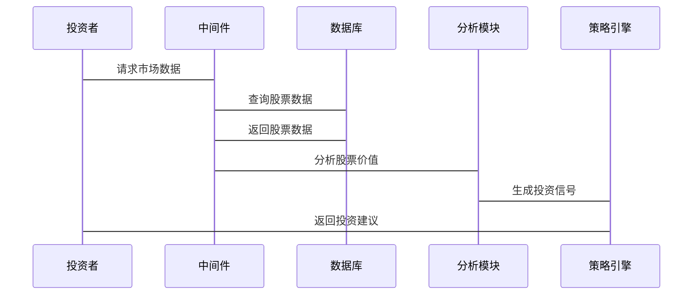

                 


# 巴菲特-芒格策略在不同市场环境下的表现

> 关键词：巴菲特，芒格，价值投资，市场环境，策略表现，安全边际，投资决策

> 摘要：本文系统地分析了巴菲特和芒格的投资策略在不同市场环境下的表现。通过深入探讨价值投资的核心理念、数学模型、系统架构以及实际案例，本文揭示了巴菲特-芒格策略在市场波动、经济周期和行业变化中的适应性与有效性。文章还结合了技术分析和系统设计的方法，为投资者提供了从理论到实践的完整指导。

---

# 第一部分: 巴菲特-芒格策略的核心理念与基础

## 第1章: 巴菲特-芒格策略的背景与核心思想

### 1.1 巴菲特与芒格的投资哲学

#### 1.1.1 巴菲特的生平与投资理念
巴菲特（Warren Buffett）是全球最著名的投资者之一，他的投资哲学以“价值投资”为核心。他强调寻找具有持续竞争优势的企业，并以合理的价格买入并长期持有。巴菲特的投资理念可以总结为以下几点：
- **安全边际**：买入价格低于内在价值，确保足够的安全空间。
- **竞争优势**：选择具有强大护城河的企业，能够持续创造价值。
- **长期视角**：关注企业的长期盈利能力，而非短期市场波动。

#### 1.1.2 芒格的智慧与决策思维
芒格（Charlie Munger）是巴菲特的长期合作伙伴，他的决策思维强调理性、逻辑和逆向思考。芒格认为，投资者应该避免情绪化决策，并专注于寻找那些“击倒球”（即容易获胜的投资机会）。芒格的思想弥补了巴菲特在微观分析上的不足，使两人形成了独特的投资组合。

#### 1.1.3 巴菲特-芒格策略的核心思想
巴菲特和芒格的策略结合了基本面分析和心理因素，形成了以下核心思想：
- **价值与价格的分离**：市场短期是投票器，长期是称重机。
- **逆向思维**：在市场恐慌时买入，在市场狂热时卖出。
- **安全边际**：确保投资的安全性，追求确定性收益。

---

## 第2章: 巴菲特-芒格策略的数学模型与分析方法

### 2.1 价值投资的数学模型

#### 2.1.1 股票内在价值的计算公式
巴菲特的内在价值计算公式如下：
$$
\text{内在价值} = \sum_{t=1}^{\infty} \frac{\text{现金流}_t}{(1 + r)^t}
$$
其中，$r$ 是投资者要求的收益率，$\text{现金流}_t$ 是第 $t$ 年的自由现金流。

#### 2.1.2 安全边际的计算公式
安全边际是内在价值与市场价格之间的差值：
$$
\text{安全边际} = \text{内在价值} - \text{市场价格}
$$

#### 2.1.3 市盈率与市净率的对比分析
市盈率（P/E）和市净率（P/B）是常用的估值指标：
- 市盈率：$$\text{P/E} = \frac{\text{股价}}{\text{每股收益}}$$
- 市净率：$$\text{P/B} = \frac{\text{股价}}{\text{每股净资产}}$$

---

## 第3章: 巴菲特-芒格策略的系统分析与架构设计

### 3.1 投资决策系统功能设计

#### 3.1.1 领域模型（Mermaid 类图）
```mermaid
classDiagram
    class 投资者 {
        + 资金：float
        + 投资组合：list<股票>
        + 风险偏好：string
        + 市场环境：string
        + 策略选择：string
    }
    class 股票 {
        + 名称：string
        + 内在价值：float
        + 市场价格：float
        + 安全边际：float
    }
    class 市场环境 {
        + 市场状态：{牛市 | 熊市 | 横盘}
        + 行业趋势：{上升 | 下降 | 平稳}
    }
    class 策略选择 {
        + 买入信号：boolean
        + 卖出信号：boolean
    }
    投资者 --> 股票: 持有
    投资者 --> 市场环境: 监测
    投资者 --> 策略选择: 执行
```

---

### 3.2 系统架构设计（Mermaid 架构图）


---

### 3.3 系统接口设计与交互（Mermaid 序列图）


---

## 第4章: 巴菲特-芒格策略的算法实现

### 4.1 安全边际计算算法

```python
def calculate_intrinsic_value(cash_flows, discount_rate):
    iv = 0
    for t in range(len(cash_flows)):
        iv += cash_flows[t] / (1 + discount_rate) ** t
    return iv

def calculate_margin_of_safety(iv, market_price):
    return iv - market_price
```

---

## 第5章: 巴菲特-芒格策略的实际案例分析

### 5.1 美国运通公司（American Express）的案例

#### 5.1.1 公司背景与财务分析
- 美国运通是全球最大的信用卡公司之一。
- 2008年金融危机期间，美国运通股价大幅下跌，内在价值远高于市场价格。

#### 5.1.2 投资决策
- 巴菲特在危机期间大量买入美国运通股票，利用其强大的竞争优势和安全边际。

---

## 第6章: 巴菲特-芒格策略的未来挑战与趋势

### 6.1 数字化与技术的影响
随着大数据和人工智能的发展，巴菲特-芒格策略可以通过技术手段进行优化和扩展：
- **大数据分析**：利用大数据技术筛选潜在投资机会。
- **量化模型**：将巴菲特的策略转化为可量化的算法模型。

### 6.2 系统化投资的未来
未来，巴菲特-芒格策略将更加系统化和自动化：
- **自动化决策**：通过算法自动执行投资决策。
- **动态调整**：根据市场变化动态调整投资组合。

---

## 第7章: 总结与展望

### 7.1 本章小结
本文系统地分析了巴菲特-芒格策略的核心理念、数学模型、系统架构以及实际案例，揭示了该策略在不同市场环境下的表现和适应性。

### 7.2 最佳实践 tips
- **长期视角**：坚持价值投资，避免短期波动干扰。
- **安全边际**：始终关注安全边际，确保投资的安全性。
- **逆向思维**：在市场恐慌时寻找机会，在市场狂热时保持冷静。

### 7.3 未来展望
随着技术的进步，巴菲特-芒格策略将更加系统化和智能化，为投资者提供更高效的投资工具和决策支持。

---

# 作者：AI天才研究院/AI Genius Institute & 禅与计算机程序设计艺术 /Zen And The Art of Computer Programming

