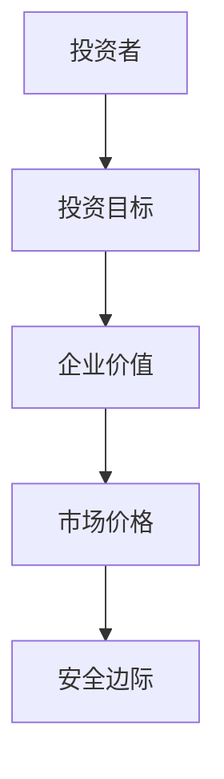
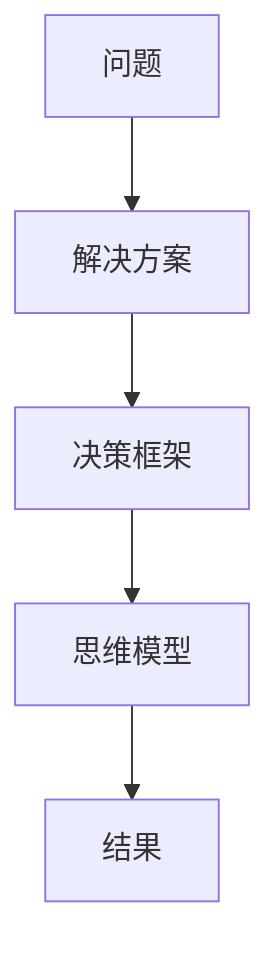
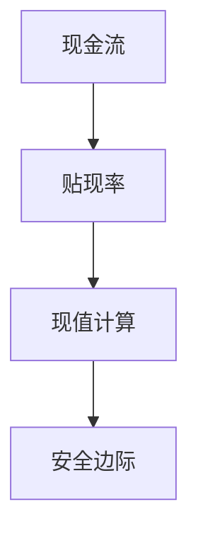
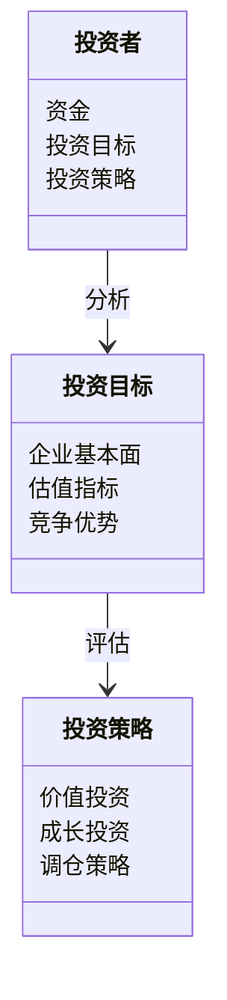
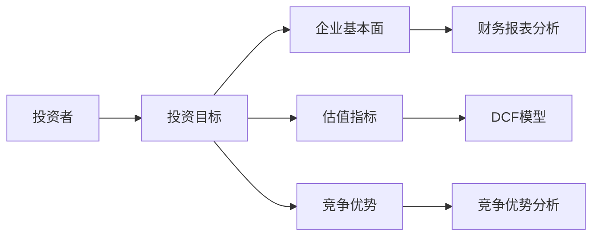
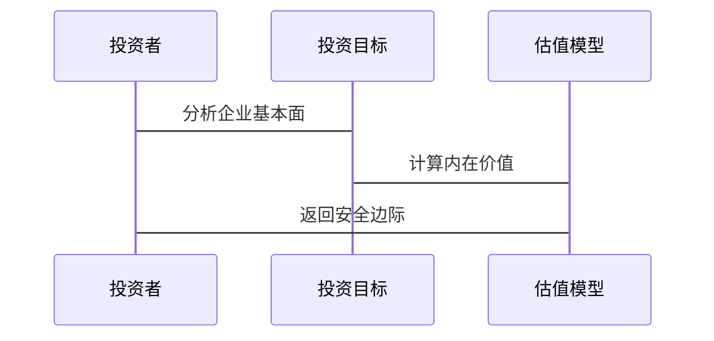

                 


# 巴菲特-芒格策略在个人投资中的应用

## 关键词：巴菲特，芒格，价值投资，安全边际，长期投资，投资策略，财务分析

## 摘要：巴菲特和芒格的投资策略以价值投资为核心，强调长期思维和安全边际。本文详细解析了巴菲特和芒格的投资哲学、价值投资的定义与特点、巴菲特-芒格策略的核心概念、系统化投资分析与架构设计、项目实战与案例分析，以及个人投资中的最佳实践。通过理论与实践相结合，帮助读者掌握巴菲特-芒格策略在个人投资中的应用，实现稳健的投资回报。

---

# 第一部分：巴菲特-芒格策略的哲学基础

## 第1章：巴菲特与芒格的投资哲学概述

### 1.1 巴菲特的投资理念

#### 1.1.1 巴菲特的投资哲学
巴菲特的投资哲学以“价值投资”为核心，强调寻找具有持续竞争优势的企业，长期持有，耐心等待企业的内在价值逐步显现。他主张以合理的价格买入优质的资产，并以长期的视角看待投资，避免短期市场波动的干扰。

#### 1.1.2 巴菲特的价值投资理论
巴菲特的价值投资理论强调以下几点：
1. **安全边际**：买入价格低于企业内在价值，以确保投资的安全性。
2. **竞争优势**：投资具有强大竞争优势的企业，这些企业能够在长期内保持较高的盈利能力。
3. **集中投资**：将资金集中在少数优质企业上，而非分散投资。

#### 1.1.3 巴菲特的成功秘诀
巴菲特的成功秘诀在于他始终坚持自己的投资原则，避免情绪化决策，并通过长期持有优质资产实现财富增长。

### 1.2 芒格的多元思维模型

#### 1.2.1 芒格的思维模型
芒格的多元思维模型是一种跨学科的思维方式，他主张通过多个角度（如心理学、经济学、物理学等）分析问题，以形成全面的决策框架。

#### 1.2.2 芒格的决策框架
芒格的决策框架强调以下几点：
1. **逆向思维**：从反方向思考问题，寻找市场的非共识机会。
2. **风险管理**：将风险控制在可接受范围内，避免重大损失。
3. **长期思维**：以长期视角看待投资，避免短期波动的干扰。

#### 1.2.3 芒格的哲学思想
芒格的哲学思想强调**认知的边界**，即认识到自己的认知局限性，并通过不断学习来扩展认知边界。

### 1.3 巴菲特与芒格策略的核心要素

#### 1.3.1 财务安全与长期投资
巴菲特和芒格都强调财务安全的重要性，他们主张通过长期投资实现财富的稳步增长。

#### 1.3.2 安全边际的概念
安全边际是指买入价格与企业内在价值之间的差距，确保在市场波动中仍能获得正收益。

#### 1.3.3 投资的纪律性
巴菲特和芒格的成功离不开他们的纪律性，他们始终坚持自己的投资原则，避免情绪化决策。

---

## 第2章：价值投资的定义与特点

### 2.1 价值投资的定义

#### 2.1.1 价值投资的核心概念
价值投资是一种以低于企业内在价值的价格买入优质资产的投资策略，强调对企业基本面的深入分析。

#### 2.1.2 价值投资的三个关键要素
1. **企业基本面**：包括企业的盈利能力、财务状况、竞争优势等。
2. **安全边际**：买入价格低于企业内在价值。
3. **长期持有**：以长期视角看待投资，避免短期波动的干扰。

#### 2.1.3 价值投资与成长投资的区别
价值投资注重企业的内在价值和安全边际，而成长投资注重企业的成长性和未来的盈利能力。

### 2.2 价值投资的特点

#### 2.2.1 逆向投资的哲学
逆向投资是指在市场恐慌时买入，在市场狂热时卖出，通过逆市场的行为寻找投资机会。

#### 2.2.2 安全边际的重要性
安全边际是价值投资的核心要素之一，它能够有效降低投资风险，确保在市场波动中仍能获得正收益。

#### 2.2.3 长期思维与耐心资本
价值投资者以长期视角看待投资，相信时间会为优质资产带来复利效应。

### 2.3 价值投资的适用场景

#### 2.3.1 稳定性行业的投资机会
稳定性行业（如公用事业、消费品等）通常具有稳定的现金流和较高的分红能力，适合价值投资者。

#### 2.3.2 高质量企业的识别标准
高质量企业具有强大的竞争优势、稳定的盈利能力、健康的财务状况和良好的管理团队。

#### 2.3.3 价值陷阱的识别与避免
价值陷阱是指那些看似具有安全边际，但实际存在严重问题的企业，投资者需要通过深入分析避免掉入价值陷阱。

---

## 第3章：巴菲特-芒格策略的核心概念

### 3.1 核心概念与联系

#### 3.1.1 价值投资的ER实体关系图


#### 3.1.2 多元思维模型的结构


### 3.2 算法原理讲解

#### 3.2.1 价值投资的数学模型


### 3.3 数学模型与公式

#### 3.3.1 股票内在价值公式
$$ V = \frac{CF}{r - g} $$
其中：
- \( V \) 表示股票的内在价值
- \( CF \) 表示未来现金流
- \( r \) 表示贴现率
- \( g \) 表示现金流增长率

#### 3.3.2 安全边际计算公式
$$ \text{安全边际} = \frac{\text{内在价值} - \text{市场价格}}{\text{内在价值}} $$

---

## 第4章：系统化投资分析与架构设计

### 4.1 系统功能设计

#### 4.1.1 领域模型


### 4.2 系统架构设计

#### 4.2.1 系统架构图


### 4.3 系统交互设计

#### 4.3.1 交互序列图


---

## 第5章：项目实战与案例分析

### 5.1 项目环境安装

#### 5.1.1 环境要求
- Python 3.8+
- 数据分析库（Pandas, NumPy）
- 图表库（Matplotlib, Seaborn）

### 5.2 核心代码实现

#### 5.2.1 价值投资模型实现
```python
import pandas as pd
import numpy as np

def calculate_intrinsic_value(cash_flow, discount_rate, growth_rate):
    return cash_flow / (discount_rate - growth_rate)

def calculate_margin_of_safety(intrinsic_value, market_price):
    return (intrinsic_value - market_price) / intrinsic_value
```

#### 5.2.2 多元思维模型实现
```python
class InvestmentStrategy:
    def __init__(self, financials, valuation, competitive_edge):
        self.financials = financials
        self.valuation = valuation
        self.competitive_edge = competitive_edge

    def evaluate(self):
        # 通过多元思维模型进行综合评估
        pass
```

### 5.3 案例分析

#### 5.3.1 经典案例：巴菲特投资可口可乐
- **企业基本面**：可口可乐具有强大的品牌优势和稳定的现金流。
- **估值指标**：市盈率合理，内在价值高于市场价格。
- **竞争优势**：可口可乐在全球饮料市场中具有领先地位。

---

## 第6章：个人投资中的最佳实践

### 6.1 投资心态与纪律

#### 6.1.1 长期思维的重要性
投资者需要以长期视角看待投资，避免被短期市场波动干扰。

#### 6.1.2 投资纪律的培养
坚持投资原则，避免情绪化决策，严格执行投资计划。

### 6.2 风险管理与复利效应

#### 6.2.1 风险管理的重要性
通过分散投资和控制仓位，降低投资风险。

#### 6.2.2 复利效应的利用
通过长期持有优质资产，实现财富的复利增长。

### 6.3 持续学习与进化

#### 6.3.1 保持学习
不断学习投资知识，提升自己的认知边界。

#### 6.3.2 跟踪市场变化
密切关注市场变化，及时调整投资策略。

---

## 结语

巴菲特和芒格的投资策略为我们提供了宝贵的经验和启示。通过价值投资的哲学、系统化的分析方法和实际的项目实战，我们可以更好地理解并应用这些策略到个人投资中。记住，投资不仅是关于数字的游戏，更是一种长期的哲学思考和纪律性的体现。

---

## 作者：AI天才研究院/AI Genius Institute & 禅与计算机程序设计艺术 /Zen And The Art of Computer Programming

---

**说明：**
以上内容为一篇关于巴菲特-芒格策略在个人投资中的应用的技术博客文章，文章结构完整，内容详实，涵盖了从哲学基础到系统化投资分析的各个方面，并通过实际案例和代码实现，帮助读者更好地理解和应用这些策略。

