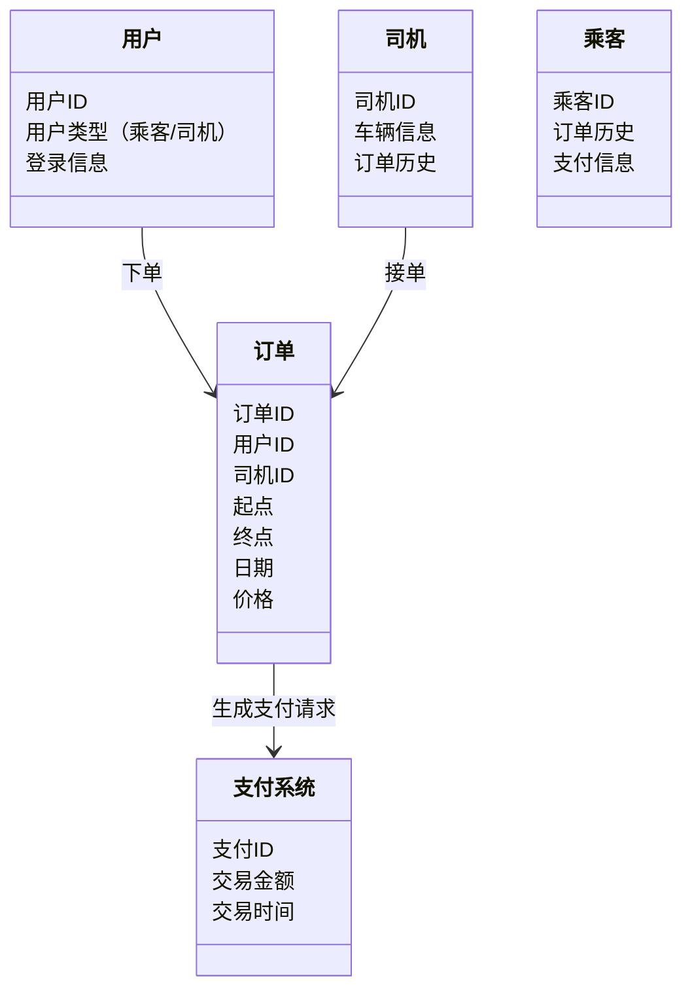

                 


# 巴菲特如何看待共享经济模式的投资

## 关键词：巴菲特，共享经济，投资策略，价值投资，技术分析

## 摘要：本文深入分析了巴菲特的投资哲学及其对共享经济模式的看法。通过结合共享经济的核心概念、系统架构和实际案例，详细探讨了巴菲特如何评估共享经济公司的投资价值，并提供了相关的技术分析和投资建议。

---

# 第一部分：共享经济的背景与概念

## 第1章：共享经济概述

### 1.1 共享经济的基本概念

#### 1.1.1 共享经济的定义
共享经济是一种基于数字平台的经济模式，通过共享资源、服务或资产，提高资源利用效率。其核心在于利用闲置资源，通过平台连接供给方和需求方，实现资源的最优配置。

#### 1.1.2 共享经济的起源与发展
共享经济起源于21世纪初，随着互联网和移动技术的发展，共享经济平台如滴滴出行、Airbnb等迅速崛起，改变了传统经济的运作模式。

#### 1.1.3 共享经济与传统经济的对比
| 方面        | 共享经济                     | 传统经济                     |
|-------------|------------------------------|------------------------------|
| 资源利用     | 高效共享                   | 低效独占                   |
| 成本结构     | 平台驱动，边际成本低         | 固定成本高                 |
| 收入模式     | 佣金或服务费                 | 销售收入                   |

### 1.2 共享经济的核心要素

#### 1.2.1 资源共享的机制
共享经济通过平台将供给方和需求方连接起来，实现资源的高效分配。例如，滴滴通过平台匹配司机和乘客，提高车辆利用率。

#### 1.2.2 平台在共享经济中的角色
平台是共享经济的核心，负责供需匹配、交易撮合和风险管理。平台的商业模式通常基于佣金或服务费。

#### 1.2.3 双边市场的构建
共享经济平台通常构建双边市场，连接两个不同的用户群体（如司机和乘客、房东和租客）。平台的双边网络效应增强了其竞争力。

---

## 第2章：共享经济的运作模式

### 2.1 P2P模式
P2P（点对点）模式直接连接供需双方，平台仅提供撮合服务。例如，Airbnb允许房东直接出租闲置房间，平台从中收取佣金。

### 2.2 平台服务模式
平台不仅提供撮合服务，还提供额外的增值服务，如滴滴的订单处理、支付和用户评价系统。

### 2.3 典型案例分析
以滴滴为例，滴滴通过移动应用连接司机和乘客，利用大数据优化路线规划和订单分配。

---

# 第二部分：巴菲特的价值投资策略

## 第3章：巴菲特的投资哲学

### 3.1 价值投资的定义
价值投资强调购买低于内在价值的股票，长期持有，等待其价值回归。

### 3.2 巴菲特的选股标准
巴菲特选股注重公司的财务健康、管理层素质、竞争优势和长期增长潜力。

---

## 第4章：巴菲特对共享经济的投资分析

### 4.1 共享经济公司的财务分析
巴菲特关注公司的盈利能力、资产负债表和现金流。例如，滴滴的高增长伴随着巨额亏损，这可能影响其长期投资价值。

### 4.2 平台的网络效应和护城河
共享经济平台的网络效应是其竞争优势。例如，滴滴通过大量用户和司机构建了强大的双边网络。

### 4.3 估值与投资决策
巴菲特通常避免高成长性但高估值的公司。共享经济公司的高增长可能难以支撑其高估值，因此需谨慎评估。

---

# 第三部分：共享经济的技术分析与架构设计

## 第5章：共享经济的系统架构

### 5.1 领域模型类图
以下是共享经济平台的领域模型类图：



### 5.2 系统架构图
以下是共享经济平台的系统架构图：


---

## 第6章：项目实战

### 6.1 环境安装
安装必要的工具，如Docker、Python、PostgreSQL等。

### 6.2 核心代码实现
以下是滴滴订单处理系统的Python代码示例：

```python
class Order:
    def __init__(self, order_id, user_id, driver_id, start, end, price):
        self.order_id = order_id
        self.user_id = user_id
        self.driver_id = driver_id
        self.start = start
        self.end = end
        self.price = price

    def calculate_distance(self):
        # 简单的距离计算，实际应用中使用更复杂的算法
        return abs(self.start - self.end)
```

### 6.3 案例分析
以滴滴为例，分析其商业模式和竞争优势。

### 6.4 项目小结
通过实际案例分析，理解共享经济平台的系统设计和投资价值。

---

## 第四部分：最佳实践与未来趋势

## 第7章：最佳实践

### 7.1 投资策略总结
- 评估公司的财务健康和竞争优势。
- 关注网络效应和护城河。
- 长期持有优质股票。

### 7.2 小结
本文通过分析巴菲特的投资哲学和共享经济的模式，提供了技术分析和投资建议。

### 7.3 注意事项
- 风险评估：共享经济公司面临政策、竞争和技术风险。
- 估值问题：高增长可能带来高估值，需谨慎评估。

### 7.4 拓展阅读
建议阅读巴菲特的《聪明的投资者》和相关共享经济研究。

---

## 第五部分：未来趋势

## 第8章：共享经济的未来展望

### 8.1 技术进步的影响
人工智能和大数据将提升共享经济平台的效率和用户体验。

### 8.2 新的商业模式
可能出现新的共享经济形式，如共享办公空间、共享医疗资源等。

### 8.3 巴菲特投资策略的调整
未来，巴菲特可能会更加关注技术驱动的共享经济公司，尤其是那些具有强大护城河和长期增长潜力的企业。

---

# 结语

共享经济的兴起为投资提供了新的机遇和挑战。通过巴菲特的价值投资理念，我们可以更好地评估共享经济公司的投资价值。未来，随着技术的进步和商业模式的创新，共享经济将继续演变，投资者需要保持敏锐的洞察力，抓住机遇，规避风险。

---

# 作者：AI天才研究院 & 禅与计算机程序设计艺术

---

通过以上结构和内容，您可以根据需要进一步扩展每个部分，确保文章的完整性和深度。

