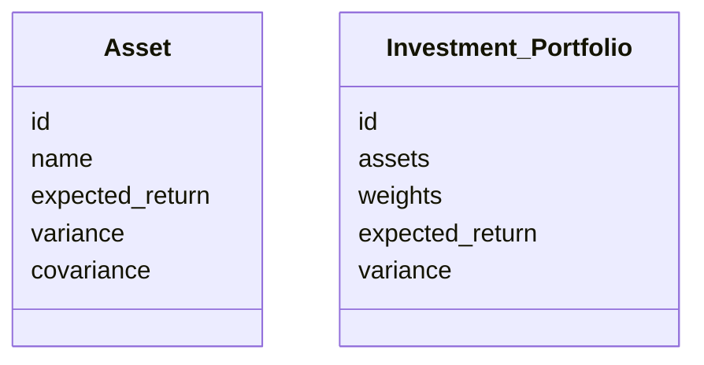

                 


# 巴菲特如何看待分散投资

> 关键词：分散投资，巴菲特，风险管理，投资组合，资产配置

> 摘要：本文深入探讨了巴菲特的分散投资理念，结合现代投资组合理论（MPT）和马科维茨的有效前沿模型，分析了分散投资的数学模型和算法实现。通过系统架构设计和项目实战，展示了如何在实际投资中应用这些策略。文章还总结了分散投资的最佳实践和注意事项，为投资者提供了实用的指导。

---

## 第一部分: 分散投资的基本概念与重要性

### 第1章: 分散投资的基本概念

#### 1.1 分散投资的定义与背景

##### 1.1.1 什么是分散投资
分散投资是一种通过将资金分配到不同的资产类别、行业或地理区域来降低投资风险的投资策略。其核心思想是通过多样化来减少特定资产或市场的波动对整体投资组合的影响。

##### 1.1.2 分散投资的起源与发展
分散投资的概念可以追溯到古代，但在20世纪，随着现代投资组合理论（MPT）的提出，分散投资成为系统化和科学化的投资方法。马科维茨（Harry Markowitz）在1952年提出了有效前沿模型，为分散投资提供了理论基础。

##### 1.1.3 分散投资在现代金融中的地位
分散投资是现代金融的核心策略之一，广泛应用于机构投资和个人投资。通过分散投资，投资者可以在不同资产之间平衡风险和收益，从而实现长期稳定的财富增长。

#### 1.2 分散投资的核心理念

##### 1.2.1 投资组合管理的基本原理
投资组合管理的目标是在风险可控的前提下，最大化投资收益。分散投资通过优化资产配置，降低非系统性风险，提高投资组合的整体稳定性。

##### 1.2.2 分散投资与风险控制
分散投资的核心在于降低风险。通过将资金分配到相关性较低的资产，投资者可以减少特定资产或市场的波动对整体投资组合的影响。

##### 1.2.3 分散投资的数学模型基础
分散投资的数学模型主要基于现代投资组合理论（MPT）。MPT通过优化投资组合的期望收益和风险，找到最优的资产配置。

#### 1.3 巴菲特的分散投资理念

##### 1.3.1 巴菲特的投资哲学概述
巴菲特的投资哲学强调长期价值投资，他注重企业的基本面分析，寻找具有持续竞争优势的企业进行长期投资。

##### 1.3.2 巴菲特分散投资的核心思想
巴菲特的分散投资理念并非传统的资产多样化，而是通过投资于多个具有长期增长潜力的企业来分散风险。他认为，投资于少数具有强大竞争优势的企业，可以实现长期稳定的收益。

##### 1.3.3 巴菲特分散投资与传统分散投资的异同
与传统分散投资不同，巴菲特的分散投资更注重企业质量和长期增长潜力，而非简单的资产多样化。但两者都强调风险控制和收益优化。

#### 1.4 本章小结
分散投资是降低风险、提高收益的重要策略。巴菲特的分散投资理念强调长期价值和企业质量，与传统分散投资在本质上有所不同。然而，两者都致力于通过优化资产配置来实现长期稳定的收益。

---

## 第二部分: 分散投资的核心概念与联系

### 第2章: 投资组合管理的数学模型

#### 2.1 现代投资组合理论（MPT）概述

##### 2.1.1 MPT的基本假设
MPT假设市场参与者是理性的，市场是有效的，且资产收益服从正态分布。此外，MPT不考虑交易成本和税收。

##### 2.1.2 MPT的核心公式与模型
MPT的核心公式是均值-方差优化模型，即通过优化投资组合的期望收益和风险，找到最优的资产配置。

##### 2.1.3 MPT的优缺点分析
优点：MPT提供了科学的资产配置方法，能够有效降低投资风险。缺点：假设过于理想化，实际市场中存在非正态分布和交易成本等问题。

#### 2.2 马科维茨的有效前沿模型

##### 2.2.1 有效前沿的定义与特点
有效前沿是所有可能的投资组合中，风险最低且收益最高的组合。在有效前沿上的组合无法被其他组合所超越。

##### 2.2.2 有效前沿的数学推导
通过优化投资组合的均值-方差，找到有效前沿。具体步骤包括计算资产的期望收益、方差、协方差矩阵，然后求解最优解。

##### 2.2.3 有效前沿在分散投资中的应用
有效前沿模型为分散投资提供了理论基础，帮助投资者找到最优的资产配置。

#### 2.3 分散投资的数学公式与计算

##### 2.3.1 投资组合的期望收益计算
$$ E(r_p) = \sum_{i=1}^n w_i E(r_i) $$
其中，\( w_i \) 是资产i的权重，\( E(r_i) \) 是资产i的期望收益。

##### 2.3.2 投资组合的风险计算
$$ Var(r_p) = \sum_{i=1}^n \sum_{j=1}^n w_i w_j Cov(r_i, r_j) $$
其中，\( Cov(r_i, r_j) \) 是资产i和资产j的协方差。

##### 2.3.3 投资组合的优化算法
均值-方差优化算法是MPT的核心算法，通过优化投资组合的均值和方差，找到最优的资产配置。

#### 2.4 巴菲特分散投资的数学模型

##### 2.4.1 巴菲特分散投资的资产选择模型
巴菲特的分散投资模型注重资产的质量和长期增长潜力，而非简单的数学优化。

##### 2.4.2 巴菲特分散投资的风险控制模型
通过投资于具有强大竞争优势的企业，降低企业特定风险。

##### 2.4.3 巴菲特分散投资的动态调整模型
根据市场变化和企业基本面，动态调整投资组合。

#### 2.5 本章小结
分散投资的数学模型为投资组合管理提供了科学的工具。MPT和有效前沿模型为分散投资提供了理论基础，而巴菲特的分散投资理念则强调资产质量和长期增长潜力。

---

## 第三部分: 分散投资的算法原理与实现

### 第3章: 分散投资算法的原理与实现

#### 3.1 现代投资组合理论的算法实现

##### 3.1.1 均值-方差优化算法
均值-方差优化算法是MPT的核心算法，通过优化投资组合的均值和方差，找到最优的资产配置。

##### 3.1.2 马科维茨算法的数学推导
通过求解优化问题，找到最优的资产配置。

##### 3.1.3 算法实现的步骤与流程
1. 计算资产的期望收益、方差和协方差矩阵。
2. 建立优化问题。
3. 使用优化算法求解最优解。

#### 3.2 巴菲特分散投资算法的实现

##### 3.2.1 巴菲特分散投资的资产选择算法
通过基本面分析，选择具有强大竞争优势的企业。

##### 3.2.2 巴菲特分散投资的动态调整算法
根据市场变化和企业基本面，动态调整投资组合。

##### 3.2.3 算法实现的步骤与流程
1. 进行基本面分析，选择优质企业。
2. 根据市场变化，动态调整投资组合。

#### 3.3 分散投资算法的数学模型

##### 3.3.1 均值-方差优化模型
$$ \min_{w} w^T \Sigma w $$
$$ \text{subject to} \quad w^T \mu = \text{target return} $$
其中，\( w \) 是权重向量，\( \Sigma \) 是协方差矩阵，\( \mu \) 是收益向量。

##### 3.3.2 巴菲特分散投资模型
通过选择优质企业，实现分散投资。

#### 3.4 本章小结
分散投资的算法实现包括均值-方差优化算法和巴菲特的资产选择算法。通过数学模型和优化算法，可以实现最优的资产配置。

---

## 第四部分: 系统分析与架构设计方案

### 第4章: 投资组合管理系统架构设计

#### 4.1 项目介绍
投资组合管理系统是一个帮助投资者进行分散投资的工具，通过优化资产配置，实现风险可控下的最大收益。

#### 4.2 系统功能设计

##### 4.2.1 领域模型


##### 4.2.2 系统架构设计


#### 4.3 系统接口设计

##### 4.3.1 API接口
```json
{
    "assets": [
        {
            "id": 1,
            "name": "Asset 1",
            "expected_return": 0.1,
            "variance": 0.05
        },
        {
            "id": 2,
            "name": "Asset 2",
            "expected_return": 0.08,
            "variance": 0.1
        }
    ],
    "weights": [0.5, 0.5]
}
```

#### 4.4 本章小结
投资组合管理系统通过优化资产配置，实现分散投资。系统架构设计包括领域模型、API接口和系统架构图。

---

## 第五部分: 项目实战

### 第5章: 分散投资策略的实战应用

#### 5.1 环境安装

##### 5.1.1 安装Python
```bash
python --version
pip install numpy pandas matplotlib
```

#### 5.2 核心代码实现

##### 5.2.1 均值-方差优化算法
```python
import numpy as np

def mean_variance_optimization(returns):
    n = len(returns.columns)
    Cov = returns.cov()
    mu = returns.mean()
    w = np.linalg.solve(Cov, mu)
    w = w / w.sum()
    return w
```

##### 5.2.2 巴菲特分散投资策略
```python
def buffett_strategy(assets):
    selected_assets = []
    for asset in assets:
        if asset.expected_return > 0.08 and asset.variance < 0.1:
            selected_assets.append(asset)
    return selected_assets
```

#### 5.3 案例分析

##### 5.3.1 简单案例
假设我们有两只资产，A和B，A的期望收益为10%，方差为0.05，B的期望收益为8%，方差为0.1。通过均值-方差优化，我们可以找到最优的资产配置。

##### 5.3.2 复杂案例
假设我们有多个资产，通过均值-方差优化算法，找到最优的资产配置。

#### 5.4 本章小结
通过实战案例，展示了如何应用分散投资策略。均值-方差优化算法和巴菲特分散投资策略在实际投资中具有广泛的应用。

---

## 第六部分: 总结与最佳实践

### 第6章: 总结与最佳实践

#### 6.1 本章小结
分散投资是降低风险、提高收益的重要策略。通过现代投资组合理论和巴菲特的分散投资理念，可以实现最优的资产配置。

#### 6.2 最佳实践 tips
- 定期调整投资组合，以适应市场变化。
- 选择具有长期增长潜力的企业。
- 通过分散投资降低风险。

#### 6.3 注意事项
- 分散投资不能完全消除风险，但可以降低非系统性风险。
- 投资者需要根据自身风险承受能力和投资目标选择合适的分散投资策略。

#### 6.4 拓展阅读
- 《投资学》（书籍）
- 现代投资组合理论（MPT）
- 巴菲特的长期价值投资理念

---

## 作者：AI天才研究院/AI Genius Institute & 禅与计算机程序设计艺术 /Zen And The Art of Computer Programming

