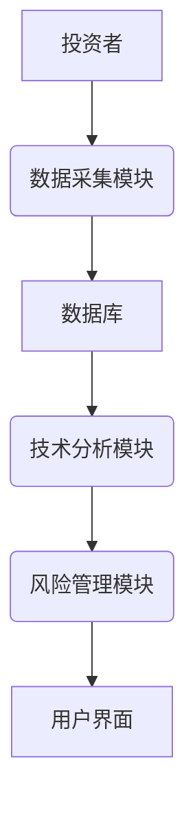
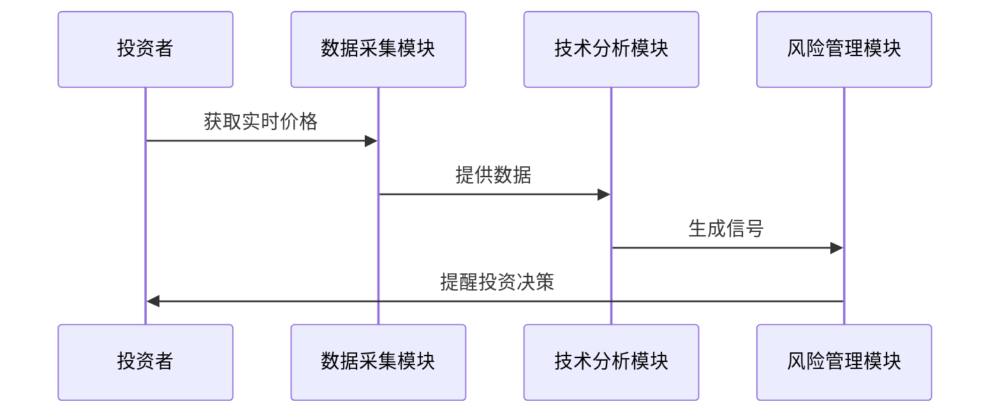

                 


# 巴菲特如何看待加密货币投资？

> 关键词：巴菲特，加密货币，投资策略，风险管理，区块链技术

> 摘要：本文深入分析巴菲特对比特币等加密货币的看法，探讨加密货币的基本原理、市场特点、投资策略以及风险管理。通过结合巴菲特的价值投资理念，本文为投资者提供加密货币投资的实战指南，涵盖技术分析、系统架构和案例分析。

---

## 第一部分：背景介绍

### 第1章：加密货币的基本概念与特点

#### 1.1 加密货币的定义与分类

- **加密货币的定义**：加密货币是一种基于区块链技术的数字货币，通过加密算法确保交易的安全性和匿名性。
- **分类**：
  - 按用途：比特币（主要用于投资）、以太坊（用于智能合约）、莱特币（用于支付）。
  - 按技术：公链、私链、侧链。
- **与传统货币的对比**：
  | 特性 | 传统货币 | 加密货币 |
  |------|----------|----------|
  | 发行 | 中央银行 | 去中心化 |
  | 交易 | 银行系统 | 区块链   |

#### 1.2 区块链技术的核心原理

- **区块链的基本概念**：分布式账本技术，确保数据的安全性和不可篡改性。
- **核心技术特点**：
  - 去中心化：没有中央机构控制。
  - 哈希函数：确保数据完整性。
  - 智能合约：自动执行交易逻辑。
- **安全性分析**：
  - 加密算法：RSA、椭圆曲线加密。
  - 分片技术：提高交易效率。

#### 1.3 巴菲特的投资理念

- **价值投资**：长期持有优质资产，追求内在价值。
- **安全边际**：买入价格低于内在价值，降低投资风险。
- **长期视角**：关注企业的长期价值，而非短期波动。

---

### 第2章：巴菲特对比特币的看法

#### 2.1 巴菲特对比特币的评价

- **否定态度**：认为比特币不具备内在价值，只是一个投机工具。
- **潜在风险**：价格波动大，监管不确定性高。
- **长期价值判断**：认为比特币不会取代传统货币，不具备实用价值。

#### 2.2 巴菲特对比特币的逻辑分析

- **货币本质**：货币应有稳定的内在价值和实际用途。
- **技术局限性**：比特币的交易速度和扩展性有限。
- **监管风险**：政府对加密货币的监管可能会影响其价值。

---

### 第3章：加密货币投资的策略与风险管理

#### 3.1 加密货币投资的基本策略

- **长期投资**：选择具有长期增长潜力的加密货币。
- **分散投资**：避免集中投资，降低风险。
- **技术分析**：通过K线图、均线、MACD等指标预测价格走势。

#### 3.2 巴菲特风格的投资策略在加密货币中的应用

- **价值投资**：寻找有实际应用场景的加密货币。
- **安全边际**：买入价格低于内在价值。
- **风险管理**：设定止损点，控制投资比例。

---

### 第4章：加密货币市场的系统性分析

#### 4.1 加密货币市场的基本结构

- **参与者**：矿工、交易所、投资者、开发者。
- **供需关系**：市场供给由挖矿决定，需求由投资者驱动。
- **价格形成机制**：市场供需、技术发展、政策监管共同影响价格。

#### 4.2 加密货币市场的技术分析

- **技术指标**：移动平均线（MA）、相对强弱指数（RSI）、布林带（Bollinger Bands）。
- **市场情绪**：通过社交媒体、论坛分析市场情绪。
- **价格波动模型**：使用时间序列分析预测价格走势。

---

### 第5章：加密货币投资的实战案例分析

#### 5.1 加密货币投资的典型案例

- **比特币价格波动案例**：2017年价格暴涨后 crash，2021年再次暴涨。
- **以太坊的技术升级案例**：从2.0升级到3.0，提升交易速度和可扩展性。
- **其他加密货币案例**：如狗狗币、柴犬币的市场炒作与崩盘。

#### 5.2 巴菲特风格的加密货币投资策略

- **长期价值投资**：投资以太坊等有技术优势的加密货币。
- **安全边际应用**：选择价格低于合理估值的加密货币。
- **风险管理实战**：设定止损点，避免过度杠杆。

---

### 第6章：加密货币投资的系统架构与实现

#### 6.1 系统功能设计

- **需求分析**：投资者需要实时价格、技术分析、风险管理工具。
- **功能模块**：
  - 数据采集：从交易所获取实时数据。
  - 技术分析：计算技术指标，生成买卖信号。
  - 风险管理：设定止损点，提醒投资风险。

#### 6.2 系统架构设计



#### 6.3 系统接口设计

- **API接口**：使用CoinMarketCap API获取实时价格。
- **数据处理**：将数据存入数据库，供分析模块使用。

#### 6.4 系统交互设计



---

### 第7章：加密货币投资的数学模型与算法

#### 7.1 时间序列分析模型

- **模型描述**：使用ARIMA模型预测价格走势。
- **公式**：
  $$ ARIMA(p, d, q) $$
  其中，p为自回归阶数，d为差分阶数，q为移动平均阶数。

#### 7.2 机器学习算法

- **算法选择**：使用LSTM进行时间序列预测。
- **代码示例**：

```python
import numpy as np
import pandas as pd
from sklearn.metrics import mean_squared_error
from keras.models import Sequential
from keras.layers import LSTM, Dense

# 加载数据
data = pd.read_csv('price_data.csv')
train_data = data['price'].values
train_data = train_data.reshape((len(train_data), 1))

# 数据预处理
train_data = train_data.astype('float32')
train_data = train_data.reshape((len(train_data), 1, 1))

# 模型构建
model = Sequential()
model.add(LSTM(50, input_shape=(1, 1)))
model.add(Dense(1))
model.compile(loss='mean_squared_error', optimizer='adam')

# 训练模型
model.fit(train_data, train_data, epochs=100, batch_size=1, verbose=2)

# 预测价格
test_data = data['price'].values[-100:]
test_data = test_data.reshape((len(test_data), 1, 1))
预测价格 = model.predict(test_data)
```

---

### 第8章：加密货币投资的环境与工具

#### 8.1 环境安装

- **操作系统**：Windows、macOS、Linux。
- **开发工具**：Jupyter Notebook、VS Code、PyCharm。
- **依赖安装**：使用pip安装相关库，如pandas、numpy、keras等。

#### 8.2 核心代码实现

- **数据采集**：使用API获取实时数据。
- **数据处理**：清洗、转换数据。
- **模型训练**：使用机器学习算法进行预测。

#### 8.3 案例分析

- **数据源**：选取比特币、以太坊等主要加密货币。
- **分析结果**：预测价格走势，提供投资建议。

---

## 第二部分：总结与小结

### 总结

- 巴菲特对比特币持否定态度，认为其不具备长期投资价值。
- 加密货币投资需结合技术分析和风险管理。
- 通过系统架构和数学模型，投资者可以更好地进行加密货币投资。

### 小结

- 加密货币市场波动性大，投资需谨慎。
- 结合巴菲特的价值投资理念，选择具有长期价值的加密货币。
- 使用技术分析工具和风险管理策略，降低投资风险。

---

## 作者信息

作者：AI天才研究院/AI Genius Institute & 禅与计算机程序设计艺术 /Zen And The Art of Computer Programming

