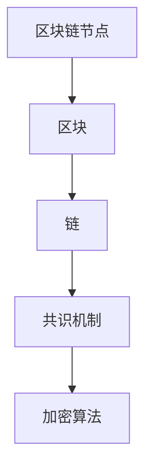
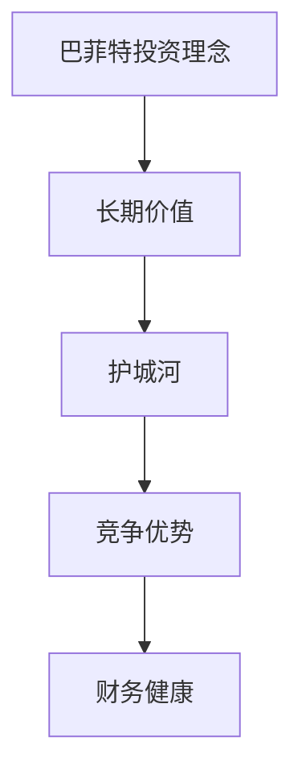

                 

# 巴菲特如何看待区块链技术的投资前景

## 关键词：巴菲特，区块链，投资前景，价值投资，DeFi，加密货币

## 摘要：本文探讨巴菲特对区块链技术的看法，分析区块链技术的投资潜力，结合巴菲特的价值投资理念，解析区块链技术如何改变金融行业，并为投资者提供理性决策的建议。

---

## 第一部分：区块链技术与投资的背景介绍

### 第1章：区块链技术概述

#### 1.1 区块链的基本概念

- **定义与核心原理**
  区块链是一种去中心化的分布式账本技术，通过密码学和共识算法确保数据的安全性和不可篡改性。
- **特点**
  - **去中心化**：没有单一控制点，依赖网络节点共同维护数据。
  - **不可篡改**：数据一旦记录，难以更改。
  - **透明性**：所有交易记录公开可查。
- **区块链与比特币的关系**
  比特币是区块链技术的首个应用，但区块链的应用远不止于加密货币。

#### 1.2 区块链在投资领域的应用

- **智能合约**
  自动执行合同条款，减少信任成本。
- **去中心化金融（DeFi）**
  提供无需传统金融机构的借贷、交易等服务。
- **NFTs**
  通过区块链技术实现数字资产的唯一性认证。

---

### 第2章：巴菲特的投资理念

#### 2.1 巴菲特的投资策略

- **价值投资**：寻找具有持续竞争优势、良好财务状况和优秀管理团队的企业。
- **长期投资**：关注企业的长期价值，而非短期市场波动。
- **避免短期交易**：巴菲特认为短期交易难以创造长期价值。

#### 2.2 巴菲特对风险的态度

- **风险控制**：优先考虑本金安全，避免高风险投资。
- **分散投资**：通过多样化降低风险。

---

## 第二部分：区块链技术的分析与投资潜力

### 第3章：区块链技术的核心原理

#### 3.1 区块链的工作机制

- **区块结构**
  每个区块包含数据和哈希指针，确保数据链的完整性和不可篡改性。
- **共识机制**
  - **POW（工作量证明）**：比特币采用的机制，通过计算解决数学难题来验证交易。
  - **POS（权益证明）**：通过持有代币的数量来分配记账权。
  - **DPOS（ delegated proof of stake）**：通过选举节点进行记账。
- **加密算法**
  使用哈希函数和数字签名确保数据安全。

#### 3.2 区块链的分类与特点

- **公链、私链、联盟链**
  - **公链**：完全去中心化，如比特币、以太坊。
  - **私链**：仅限特定用户访问，用于企业内部应用。
  - **联盟链**：由多个机构共同维护，用于特定场景。
- **Layer 1和Layer 2解决方案**
  - **Layer 1**：主链处理交易，如比特币、以太坊。
  - **Layer 2**：侧链或状态通道，提高交易速度。

---

### 第4章：区块链技术与传统金融的对比

#### 4.1 传统金融体系的缺陷

- **中心化问题**：依赖少数机构，存在信息不对称和权力集中。
- **交易成本高**：高昂的手续费和复杂的流程。
- **透明度低**：部分交易缺乏透明，容易滋生腐败。

#### 4.2 区块链的优势

- **降低信任成本**：通过去中心化和公开记录减少信任依赖。
- **提高透明度**：所有交易记录可查，增加透明度。
- **降低交易成本**：通过自动化和去中介化降低成本。

---

## 第三部分：巴菲特视角下的区块链投资分析

### 第5章：区块链技术是否符合巴菲特的投资标准

#### 5.1 巴菲特对科技公司的投资逻辑

- **护城河分析**：寻找具有强大竞争优势的企业。
- **竞争优势的持续性**：评估企业是否能在长期保持竞争优势。
- **财务健康状况**：关注企业的盈利能力和财务稳定性。

#### 5.2 区块链技术的长期潜力

- **颠覆性潜力**：区块链可能彻底改变金融体系和商业模式。
- **对传统金融体系的冲击**：去中心化可能削弱传统金融机构的中介作用。

---

### 第6章：区块链行业的投资机会与挑战

#### 6.1 区块链行业的主要投资方向

- **加密货币**：比特币、以太坊等。
- **DeFi**：去中心化借贷、交易所。
- **NFTs**：数字艺术品、知识产权保护。

#### 6.2 区块链投资的风险与挑战

- **技术风险**：安全性、可扩展性问题。
- **市场风险**：价格波动剧烈。
- **法律风险**：监管政策不确定性。

---

## 第四部分：投资策略与案例分析

### 第7章：巴菲特风格下的区块链投资策略

#### 7.1 长期价值投资与区块链

- **寻找具备护城河的区块链项目**：评估项目的核心竞争力。
- **关注团队背景与执行力**：优秀团队是项目成功的关键。
- **评估项目的可持续性与盈利能力**：确保项目具有长期发展潜力。

#### 7.2 风险控制与投资组合管理

- **分散投资**：降低风险。
- **定期评估与调整**：根据市场变化及时调整投资策略。

---

## 结论

区块链技术具有颠覆性潜力，但投资需谨慎。巴菲特的价值投资理念强调长期、稳健和风险控制，这与区块链技术的长期潜力相符。投资者应结合区块链技术和巴菲特的投资理念，选择具有强大竞争优势、良好团队和长期盈利能力的项目进行投资。

---

## 作者信息

作者：AI天才研究院/AI Genius Institute & 禅与计算机程序设计艺术/Zen And The Art of Computer Programming

---

# 图表部分

## 图表1：区块链的体系架构图

## 图表2：巴菲特投资理念的对比分析图

---

希望这篇文章能满足您的需求。如果需要进一步修改或补充，请随时告知。

