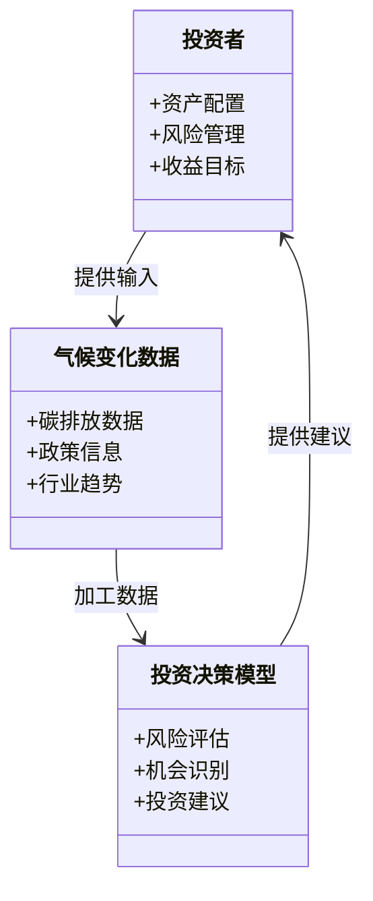

                 


# 巴菲特如何看待气候变化对投资的影响

## 关键词：
巴菲特, 气候变化, 投资影响, 风险管理, 可持续发展

## 摘要：
本文深入探讨巴菲特如何从价值投资的角度审视气候变化对投资的影响。通过分析气候变化对不同行业和企业的影响，结合巴菲特的投资策略和风险管理方法，本文揭示了在气候变化背景下，投资者如何识别风险、抓住机遇，并构建稳健的投资组合。文章还结合实际案例，提供系统的分析框架和决策模型，为投资者应对气候变化带来的挑战提供实用的指导。

---

## 第一部分：引言

### 1.1 巴菲特的投资理念
巴菲特以其价值投资理念闻名，强调长期投资、基本面分析和安全边际。他的投资策略注重企业的内在价值、竞争优势和长期盈利能力。这种理念在应对气候变化这一复杂问题时显得尤为重要。

#### 1.1.1 价值投资的核心原则
- **安全边际**：投资时，巴菲特寻找价格低于内在价值的股票，以确保有足够的安全空间。
- **长期视角**：关注企业的长期盈利能力，而非短期市场波动。
- **竞争优势**：投资具有强大护城河的企业，这些企业能在长期竞争中保持优势。

#### 1.1.2 长期投资的重要性
巴菲特认为，长期投资能够平滑短期市场波动，使投资者能够专注于企业的长期增长。长期投资还能帮助投资者更好地应对不可预测的外部事件，如气候变化的影响。

#### 1.1.3 巴菲特的投资风格与策略
- **集中投资**：巴菲特倾向于投资少数几家企业，以减少分散带来的风险。
- **逆周期投资**：在市场低迷时寻找被低估的投资机会。
- **股东价值**：关注企业的每股收益（EPS）和ROE（净资产收益率）等关键指标。

### 1.2 气候变化的现状与影响
气候变化不仅是环境问题，更是经济和投资领域的重大挑战。它影响着全球产业链、能源结构和政策法规。

#### 1.2.1 气候变化的定义与现状
气候变化指长期天气模式的显著变化，主要由人类活动导致的温室气体排放引起。当前，全球气温上升、极端天气频发，对全球经济和生态造成威胁。

#### 1.2.2 气候变化对全球经济的影响
- **经济成本**：气候变化可能导致农作物减产、基础设施破坏和自然灾害频发，增加全球经济的不确定性。
- **政策影响**：各国为应对气候变化，纷纷制定严格的环保法规，推动能源转型和绿色技术发展。
- **企业风险**：企业可能面临碳排放限制、供应链中断和品牌声誉损失等风险。

#### 1.2.3 气候变化与投资的关系
气候变化不仅影响企业盈利能力和行业结构，还影响金融市场的估值体系。投资者需要将气候变化因素纳入投资决策，以识别风险和机会。

---

## 第二部分：气候变化对投资的影响

### 2.1 气候变化对行业的具体影响
气候变化对不同行业的影响各异，既有风险也有机遇。

#### 2.1.1 石油与天然气行业的风险
- **政策风险**：随着全球向可再生能源转型，石油和天然气行业的监管压力增加。
- **需求下降**：电动汽车的普及和可再生能源的发展可能减少对化石燃料的需求。
- **碳定价**：碳排放权交易和碳税的实施将增加行业成本。

#### 2.1.2 可再生能源行业的机遇
- **增长潜力**：可再生能源的需求持续增长，尤其是风能和太阳能。
- **技术进步**：技术创新降低了可再生能源的成本，提高了效率。
- **政策支持**：各国政府通过补贴和税收优惠支持可再生能源发展。

#### 2.1.3 建筑与基础设施行业的挑战
- **适应性投资**：气候变化要求建筑行业投资于抗灾能力强的基础设施。
- **材料需求**：绿色建筑材料的需求增加，推动相关行业的发展。

### 2.2 企业层面的气候变化风险
气候变化对企业的影响不仅限于财务，还包括运营和声誉。

#### 2.2.1 碳排放的监管风险
- **碳中和目标**：企业需要制定碳中和计划，否则可能面临罚款或限制。
- **碳定价**：碳排放权交易机制使企业的碳排放成本上升。

#### 2.2.2 气候变化对企业利润的影响
- **成本增加**：企业可能需要投入更多资金应对气候变化带来的运营挑战。
- **收入下降**：气候变化可能导致某些地区的消费能力下降，影响企业收入。

#### 2.2.3 供应链中断的风险
- **物流中断**：极端天气可能导致物流中断，影响企业的供应链稳定性。
- **原材料供应**：气候变化可能影响某些原材料的供应稳定性。

### 2.3 投资机会与市场趋势
尽管气候变化带来风险，但也创造了新的投资机会。

#### 2.3.1 绿色能源的投资潜力
- **技术突破**：可再生能源技术的进步降低了成本，提高了效率。
- **市场需求**：绿色能源需求的增长为企业提供了新的利润来源。
- **政策支持**：各国政府的政策支持为绿色能源行业提供了成长空间。

#### 2.3.2 碳中和目标下的投资机会
- **碳捕获技术**：投资于碳捕获和储存技术，帮助实现碳中和目标。
- **绿色金融**：支持绿色项目的资金需求增加，推动绿色金融工具的发展。

#### 2.3.3 可持续发展的市场趋势
- **消费者偏好**：消费者越来越倾向于支持可持续发展的企业。
- **企业社会责任**：企业社会责任（CSR）成为投资者评估企业的重要指标。

---

## 第三部分：巴菲特的投资策略与风险管理

### 3.1 巴菲特的长期投资策略
巴菲特的投资策略强调长期性和稳健性，这在应对气候变化时尤为重要。

#### 3.1.1 长期投资的稳定性
- **避免短期波动**：长期投资有助于忽略短期市场波动，专注于企业的长期价值。
- **稳定收益**：长期投资能够带来稳定的复利收益，抵御市场风险。

#### 3.1.2 选择具有持续竞争优势的企业
- **护城河**：投资具有强大竞争优势的企业，这些企业能够在气候变化等挑战中保持优势。
- **管理团队**：优秀的管理团队能够带领企业应对气候变化带来的挑战。

#### 3.1.3 风险管理的重要性
- **分散投资**：通过分散投资降低单一资产的风险。
- **风险评估**：定期评估投资组合中的风险，及时调整投资策略。

### 3.2 气候变化下的风险管理
气候变化带来的不确定性要求投资者采取有效的风险管理策略。

#### 3.2.1 风险评估与量化
- **情景分析**：通过不同气候变化情景的分析，评估其对投资组合的影响。
- **量化模型**：使用量化模型评估气候变化对不同资产的潜在影响。

#### 3.2.2 多样化投资组合以分散风险
- **资产配置**：在不同资产类别之间分散投资，降低特定资产的风险。
- **行业分散**：投资于不同行业的企业，避免单一行业风险。

#### 3.2.3 使用衍生工具对冲风险
- **期货和期权**：利用衍生工具对冲气候变化带来的价格波动风险。
- **碳排放权交易**：通过碳排放权交易对冲碳排放风险。

---

## 第四部分：系统分析与架构设计

### 4.1 投资决策模型的构建
为了应对气候变化带来的投资挑战，投资者需要构建一个系统化的投资决策模型。

#### 4.1.1 问题场景介绍
- **数据收集**：收集企业碳排放数据、行业趋势和政策信息。
- **模型构建**：建立一个综合考虑气候变化影响的投资模型。

#### 4.1.2 系统功能设计
- **领域模型**：通过领域模型（Mermaid类图）展示系统的功能模块。



---

## 第五部分：项目实战

### 5.1 案例分析：可再生能源投资
#### 5.1.1 环境安装
- **数据收集**：收集可再生能源企业的财务数据、碳排放数据和行业趋势。
- **工具选择**：使用Python和相关数据分析库（如Pandas、Matplotlib）进行分析。

#### 5.1.2 核心实现
通过Python代码分析可再生能源企业的投资潜力。

```python
import pandas as pd
import matplotlib.pyplot as plt

# 示例数据：可再生能源企业的财务数据和碳排放数据
data = {
    '公司': ['公司A', '公司B', '公司C'],
    '收入': [100, 150, 120],
    '利润': [20, 30, 25],
    '碳排放': [50, 40, 45]
}

df = pd.DataFrame(data)
print(df)

# 绘制碳排放与收入的关系图
plt.scatter(df['收入'], df['碳排放'])
plt.xlabel('收入')
plt.ylabel('碳排放')
plt.title('碳排放与收入关系图')
plt.show()
```

#### 5.1.3 案例分析
通过上述代码，可以分析可再生能源企业的收入与碳排放之间的关系，识别高排放企业的风险，评估低排放企业的投资潜力。

### 5.2 绿色金融工具的应用
#### 5.2.1 环境安装
- **工具选择**：使用绿色金融框架评估企业的可持续发展能力。

#### 5.2.2 核心实现
通过Python代码评估企业的绿色金融指标。

```python
import pandas as pd

# 示例数据：企业的绿色金融指标
data = {
    '公司': ['公司A', '公司B', '公司C'],
    '绿色收入占比': [30, 40, 25],
    '碳排放强度': [0.5, 0.4, 0.6],
    '可持续发展评级': ['A', 'B', 'C']
}

df = pd.DataFrame(data)
print(df)
```

---

## 第六部分：结论与启示

### 6.1 总结
气候变化对投资的影响深远，投资者需要将气候变化因素纳入投资决策。巴菲特的价值投资理念在应对气候变化时仍然有效，但需要结合新的市场环境和风险因素。

### 6.2 对投资者的启示
- **长期视角**：保持长期投资策略，关注企业的可持续发展能力。
- **风险管理**：通过分散投资和使用衍生工具应对气候变化带来的风险。
- **关注绿色投资机会**：投资于可再生能源和绿色技术，抓住市场趋势。

### 6.3 未来展望
随着全球向低碳经济转型，气候变化将继续影响投资领域。投资者需要不断学习和适应，利用新技术和新工具应对挑战，抓住机遇。

---

## 作者：AI天才研究院/AI Genius Institute & 禅与计算机程序设计艺术 /Zen And The Art of Computer Programming

---

通过以上结构，文章系统地分析了巴菲特如何看待气候变化对投资的影响，结合理论分析和实际案例，为投资者提供了有价值的指导。

