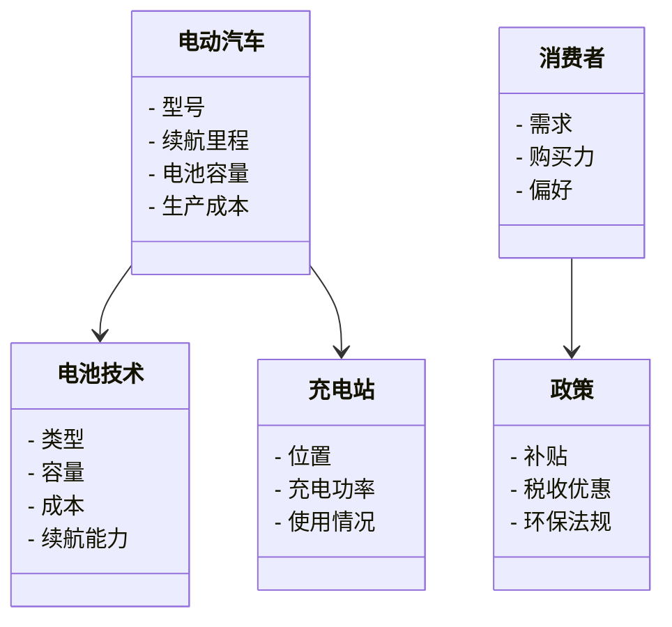

                 


# 巴菲特如何看待电动汽车行业的投资前景

## 关键词：巴菲特，电动汽车，投资前景，价值投资，行业分析

## 摘要：本文从巴菲特的投资理念出发，深入分析了电动汽车行业的现状、发展趋势以及投资价值。通过对比巴菲特的价值投资策略与电动汽车行业的特点，探讨了巴菲特可能如何看待这一行业的投资前景，为投资者提供了深刻的见解和实用的建议。

---

## 第1章 巴菲特投资理念概述

### 1.1 巴菲特投资理念的核心思想

#### 1.1.1 价值投资的定义与核心原则
价值投资是一种长期投资策略，核心在于寻找那些市场价格低于其内在价值的股票。巴菲特的价值投资理念强调以下几个原则：

- **安全边际**：买入价格低于内在价值，确保投资的安全性。
- **长期视角**：关注企业的长期盈利能力，而非短期市场波动。
- **优质企业**：投资具有强大竞争优势、良好管理团队和稳定财务状况的企业。

#### 1.1.2 巴菲特的投资哲学与方法
巴菲特的哲学可以概括为“以合理的价格买入优秀的公司”。他强调：
- **企业基本面**：关注企业的收入、利润、现金流和资产负债表。
- **管理团队**：优秀的管理层能够创造持续的价值。
- **护城河**：企业应具备独特的竞争优势，形成“护城河”。

#### 1.1.3 巴菲特对市场的长期看法
巴菲特认为市场短期是投票机，长期是称重机。他倾向于忽略短期波动，专注于企业的长期价值。

---

### 1.2 电动汽车行业的现状与趋势

#### 1.2.1 电动汽车行业的定义与范围
电动汽车（Electric Vehicle, EV）是指完全或主要依靠电能驱动的车辆，包括纯电动汽车（BEV）、插电式混合动力汽车（PHEV）和燃料电池汽车（FCEV）。

#### 1.2.2 全球电动汽车市场的发展现状
- **增长迅速**：2020年全球电动汽车销量突破500万辆，市场渗透率不断提升。
- **政策驱动**：各国政府通过补贴、税收优惠和环保法规推动电动汽车发展。
- **技术进步**：电池技术的进步显著提高了续航里程和降低了成本。

#### 1.2.3 电动汽车行业的未来发展趋势
- **技术革新**：电池技术的突破将继续推动电动汽车的发展。
- **基础设施完善**：充电站和换电站的建设将加速电动汽车的普及。
- **行业整合**：市场竞争加剧，行业整合将带来更大的效率提升。

---

## 第2章 电动汽车行业的核心要素分析

### 2.1 电动汽车行业的技术驱动因素

#### 2.1.1 电池技术的核心作用
电池是电动汽车的核心部件，占整车成本的40%以上。当前，锂离子电池是主流，未来可能向固态电池、钠离子电池等方向发展。

#### 2.1.2 智能化技术的发展趋势
电动汽车正在向智能化方向发展，自动驾驶、智能网联等技术将提升用户体验和市场竞争力。

#### 2.1.3 充电技术的创新与挑战
快速充电技术、无线充电技术以及充电网络的建设是当前技术发展的重点。

---

### 2.2 电动汽车行业的市场驱动因素

#### 2.2.1 全球能源结构转型的影响
全球能源向清洁化、电气化转型，电动汽车作为重要的终端应用，将受益于这一趋势。

#### 2.2.2 政策支持与行业规范的推动
各国政府通过政策支持推动电动汽车行业的发展，例如欧盟的碳排放法规、中国的双积分政策等。

#### 2.2.3 消费者需求的变化与驱动
消费者对环保、节能和智能化的需求增加，推动了电动汽车市场的增长。

---

### 2.3 电动汽车行业的政策与法规环境

#### 2.3.1 全球主要国家的政策支持
- **中国**：实施双积分政策，鼓励车企生产新能源汽车。
- **美国**：联邦政府和州政府提供购车补贴和税收优惠。
- **欧盟**：通过碳排放法规推动电动汽车发展。

#### 2.3.2 行业标准与技术规范的制定
国际标准化组织（ISO）和国际电工委员会（IEC）等机构正在制定电动汽车相关的技术标准。

#### 2.3.3 政策变化对行业的影响
政策的不确定性可能对行业产生短期影响，但长期来看，政策支持仍然是行业发展的主要推动力。

---

## 第3章 巴菲特投资理念在电动汽车行业的应用

### 3.1 巴菲特的选股标准与电动汽车行业的匹配

#### 3.1.1 高质量企业的定义与特征
巴菲特认为，高质量企业应具备以下特征：
- **稳定的盈利能力**：ROE（净资产收益率）高且稳定。
- **强大的竞争优势**：具备技术壁垒或品牌优势。
- **良好的财务状况**：低负债率，现金流健康。

#### 3.1.2 电动汽车行业中的护城河分析
- **技术领先**：特斯拉在电池技术、自动驾驶领域的优势。
- **品牌影响力**：传统豪华车企（如宝马、奔驰）的品牌优势。
- **成本控制**：中国车企（如比亚迪）的成本优势。

#### 3.1.3 企业的财务健康状况与投资价值
巴菲特注重企业的财务健康状况，包括收入增长、利润率、现金流和负债水平。例如，特斯拉近年来的高增长和高研发投入，是否符合巴菲特的选股标准？

---

### 3.2 巴菲特对电动汽车行业长期价值的判断

#### 3.2.1 电动汽车行业的市场容量与增长潜力
- **市场规模**：预计到2030年，全球电动汽车销量将超过5000万辆，市场潜力巨大。
- **替代效应**：电动汽车将逐步取代传统燃油车，成为未来的主要交通工具。

#### 3.2.2 电动汽车行业的竞争格局分析
- **主要竞争者**：特斯拉、比亚迪、大众、丰田等。
- **潜在进入者**：科技公司（如苹果、谷歌）可能进入电动汽车领域。

#### 3.2.3 电动汽车行业的技术进步与创新
- **电池技术**：固态电池、钠离子电池等新技术可能带来革命性变化。
- **智能化技术**：自动驾驶、车联网等将提升用户体验。

---

### 3.3 巴菲特投资策略在电动汽车行业的实践

#### 3.3.1 投资电动汽车行业的关键成功因素
- **技术优势**：选择具备技术壁垒的企业。
- **市场地位**：关注市场份额领先的企业。
- **财务健康**：选择财务稳健的企业。

#### 3.3.2 电动汽车行业的投资风险与控制
- **技术风险**：技术落后可能导致竞争优势丧失。
- **政策风险**：政策变化可能影响行业格局。
- **市场竞争风险**：市场竞争加剧可能导致价格战。

#### 3.3.3 巴菲特对电动汽车行业的长期持有策略
巴菲特倾向于长期持有优质资产。对于电动汽车行业，他可能更倾向于投资那些具备长期竞争优势的企业。

---

## 第4章 电动汽车行业的投资价值分析

### 4.1 电动汽车行业的市场需求分析

#### 4.1.1 全球电动汽车市场的增长动力
- **环保政策**：全球碳中和目标推动电动汽车发展。
- **技术进步**：电池技术进步降低成本，提升续航里程。
- **消费者需求**：年轻一代消费者更倾向于环保和智能化产品。

#### 4.1.2 中国市场的独特地位与潜力
- **政策支持**：中国是全球最大的电动汽车市场，政府通过双积分政策推动行业发展。
- **产业优势**：中国具备完整的产业链和成本优势。

#### 4.1.3 欧美市场的政策驱动与需求增长
- **欧洲**：严格的碳排放法规推动电动汽车发展。
- **美国**：联邦和州政府提供购车补贴和税收优惠。

---

### 4.2 电动汽车行业的竞争格局分析

#### 4.2.1 主流企业的市场份额与竞争优势
- **特斯拉**：全球电动汽车市场的领导者，具备技术、品牌和资金优势。
- **比亚迪**：中国市场的龙头企业，具备成本优势和全产业链布局。
- **大众集团**：传统车企转型的代表，通过投资和合作快速布局电动汽车市场。

#### 4.2.2 新进入者的挑战与机遇
- **科技公司**：苹果、谷歌等科技公司可能进入电动汽车领域，带来新的技术和商业模式。
- **新兴车企**：蔚来、小鹏等新兴车企通过创新的产品和商业模式抢占市场份额。

#### 4.2.3 电动汽车行业整合的可能性与趋势
- **行业整合**：随着市场竞争加剧，可能会出现兼并重组。
- **联盟合作**：车企之间通过联盟合作降低研发和生产成本。

---

### 4.3 电动汽车行业的技术发展与投资机会

#### 4.3.1 关键技术的突破与应用
- **电池技术**：固态电池、钠离子电池等新技术可能带来革命性变化。
- **智能化技术**：自动驾驶、车联网等技术将提升用户体验和企业竞争力。

#### 4.3.2 技术创新对企业竞争力的影响
- **技术领先**：技术创新可以提升企业的市场地位和利润率。
- **技术落后**：技术落后可能导致企业竞争力下降。

#### 4.3.3 技术进步对投资价值的提升
- **技术驱动**：技术创新可能带来更高的市场估值和投资回报。
- **技术风险**：技术失败可能导致投资损失。

---

## 第5章 巴菲特投资策略在电动汽车行业的具体应用

### 5.1 巴菲特的选股标准与电动汽车行业的匹配

#### 5.1.1 高质量企业的定义与特征
- **特斯拉**：具备技术优势和品牌影响力，但财务杠杆较高。
- **比亚迪**：具备全产业链布局和成本优势，财务状况稳健。

#### 5.1.2 电动汽车行业中的护城河分析
- **技术壁垒**：特斯拉在电池技术和自动驾驶领域的优势。
- **品牌影响力**：传统豪华车企的品牌优势。

#### 5.1.3 企业的财务健康状况与投资价值
- **财务稳健**：比亚迪近年来的财务表现稳健，具备较高的投资价值。
- **财务杠杆**：特斯拉的高负债率可能影响其财务健康状况。

---

### 5.2 巴菲特对电动汽车行业的长期持有策略

#### 5.2.1 长期投资的价值
- **技术进步**：电动汽车行业的技术进步将推动企业的长期增长。
- **市场需求**：全球电动汽车市场的增长潜力巨大。

#### 5.2.2 短期波动的影响
- **市场波动**：短期市场波动可能影响股票价格，但不会改变行业的长期发展趋势。
- **政策变化**：政策变化可能对行业产生短期影响，但长期来看，政策支持仍然是行业发展的主要推动力。

---

## 第6章 电动汽车行业的系统分析与架构设计

### 6.1 系统功能设计

#### 6.1.1 电动汽车行业的领域模型
- **核心实体**：电动汽车、电池、充电站、消费者、政策。
- **核心关系**：电动汽车与电池的关系，电池与充电站的关系，消费者与政策的关系。



---

### 6.2 系统架构设计

#### 6.2.1 电动汽车行业的架构图


---

### 6.3 系统接口设计

#### 6.3.1 电动汽车与电池的关系
- **接口功能**：电池容量、充电速度、续航里程。

#### 6.3.2 电池与充电站的关系
- **接口功能**：充电功率、充电时间、充电费用。

#### 6.3.3 消费者与政策的关系
- **接口功能**：补贴金额、税收优惠、环保法规。

---

## 第7章 电动汽车行业的项目实战

### 7.1 项目背景与目标

#### 7.1.1 项目背景
分析电动汽车行业的投资价值，为投资者提供参考。

#### 7.1.2 项目目标
通过具体案例分析，探讨巴菲特可能如何看待电动汽车行业的投资前景。

---

### 7.2 核心实现源代码

#### 7.2.1 电动汽车市场分析代码

```python
import pandas as pd
import numpy as np

# 假设数据来源为电动汽车市场销量数据
data = {
    '年份': [2018, 2019, 2020, 2021, 2022],
    '销量': [100, 200, 300, 400, 500],
    '增长率': [0.5, 0.5, 0.33, 0.25, 0.25]
}

df = pd.DataFrame(data)
print(df)
```

---

### 7.3 项目小结

#### 7.3.1 经验总结
- **数据的重要性**：准确的数据分析是投资决策的基础。
- **模型的局限性**：模型无法完全预测市场的不确定性。

#### 7.3.2 投资建议
- **长期视角**：关注企业的长期价值。
- **风险控制**：分散投资，降低风险。

---

## 第8章 总结与展望

### 8.1 电动汽车行业的未来发展趋势
- **技术进步**：电池技术的突破将继续推动行业的发展。
- **政策支持**：全球范围内的政策支持将继续推动电动汽车市场的增长。
- **行业整合**：市场竞争加剧可能导致行业整合。

### 8.2 对投资者的建议
- **关注优质企业**：投资具备技术优势和财务健康状况良好的企业。
- **长期持有**：坚持巴菲特的长期投资理念，避免短期波动的干扰。

### 8.3 未来的研究方向
- **技术创新**：研究新技术对行业的影响。
- **政策变化**：关注全球政策变化对行业的影响。
- **市场动态**：持续跟踪市场动态，调整投资策略。

---

## 作者：AI天才研究院/AI Genius Institute & 禅与计算机程序设计艺术 /Zen And The Art of Computer Programming

