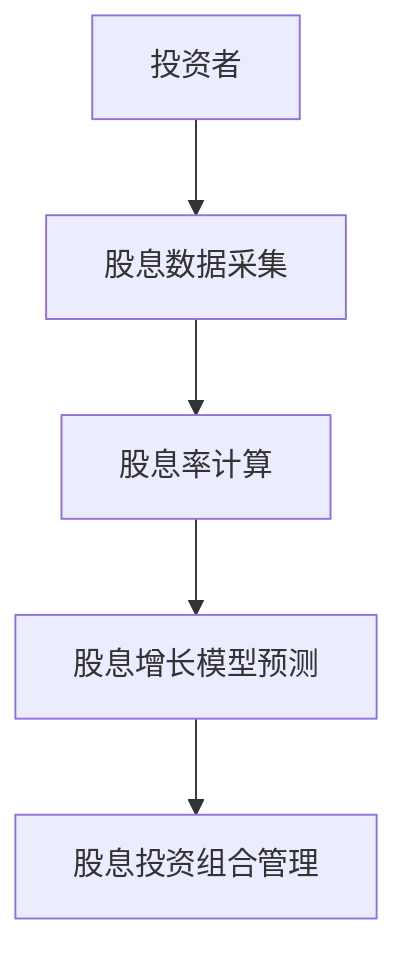
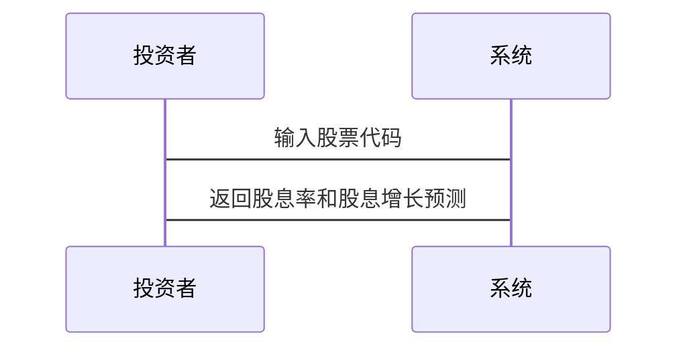

                 


# 巴菲特如何看待股息投资

> 关键词：巴菲特, 股息投资, 股息率, 股息增长模型, 股票价值, 投资策略, 风险管理

> 摘要：本文深入探讨了巴菲特的股息投资理念，从股息投资的基本概念到其数学模型，从系统架构到项目实战，全面解析了巴菲特如何看待股息投资。通过详细分析股息投资的核心概念、算法原理、系统架构、项目实战以及最佳实践，本文为读者提供了全面的股息投资知识框架。

---

## 第一章: 股息投资的背景与核心概念

### 1.1 巴菲特的生平与投资理念

#### 1.1.1 巴菲特的早期经历与投资起步
沃伦·巴菲特（Warren Buffett）是世界上最著名的投资者之一。他出生于1934年，从小就展现出对数字和投资的天赋。1942年，13岁的巴菲特开始在父亲的证券公司实习，这为他后来的投资事业奠定了基础。巴菲特的投资理念深受本杰明·格雷厄姆（Benjamin Graham）的影响，他从格雷厄姆那里学会了价值投资的基本原则。

#### 1.1.2 巴菲特的价值投资哲学
巴菲特的价值投资哲学的核心是寻找那些具有持续竞争优势、良好管理团队和合理估值的企业。他认为，投资的本质是购买企业的一部分，而不是简单地买卖股票。他强调长期投资、分散投资和买入并持有的策略。

#### 1.1.3 巴菲特对股息投资的独特见解
巴菲特认为，股息是企业盈利能力的体现，也是企业对股东的一种回报方式。他喜欢那些能够持续派发股息，并且股息增长稳定的公司。这些公司通常具有稳定的现金流和较强的盈利能力，能够为股东创造长期价值。

### 1.2 股息投资的基本概念

#### 1.2.1 股息的定义与分类
股息是股份公司向股东分配的利润部分。根据分配方式的不同，股息可以分为现金股息、股票股息、财产股息和负债股息。现金股息是最常见的形式，即公司以现金形式向股东分配利润。

#### 1.2.2 股息投资的核心要素
股息投资的核心要素包括股息率、股息增长模型和股息收益率。股息率是股息与股价的比率，股息增长模型用于预测未来股息的增长，股息收益率是股息率与股价的比率。

#### 1.2.3 股息投资与股票价值的关系
股息投资与股票价值密切相关。股息率高且稳定的股票通常具有较高的内在价值，因为它们能够为股东提供稳定的现金流。然而，过高的股息率可能意味着公司缺乏增长潜力，而过低的股息率可能意味着公司缺乏盈利能力。

### 1.3 股息投资的优缺点

#### 1.3.1 股息投资的优势
股息投资的优势包括稳定的现金流、较低的投资风险和长期的复利效应。通过投资股息收益率较高的股票，投资者可以获得稳定的收入，同时享受股票增值的潜力。

#### 1.3.2 股息投资的潜在风险
股息投资的潜在风险包括股息被削减的风险、市场波动的风险和公司基本面变化的风险。如果公司的盈利状况恶化，股息可能会被削减，从而影响投资收益。

#### 1.3.3 如何平衡股息投资的风险与收益
为了平衡股息投资的风险与收益，投资者需要选择具有稳定股息增长和良好财务状况的公司。此外，分散投资和长期持有也是降低风险的重要策略。

---

## 第二章: 股息投资的核心概念与原理

### 2.1 股息率与股票价值

#### 2.1.1 股息率的计算公式
股息率的计算公式为：
$$ \text{股息率} = \frac{\text{股息 per share (DPS)}}{\text{股票价格 (P)}} \times 100\% $$

#### 2.1.2 股息率与股票内在价值的关系
股息率与股票内在价值密切相关。高股息率的股票通常具有较高的内在价值，因为它们能够为股东提供稳定的现金流。

#### 2.1.3 股息率的行业差异分析
不同行业的股息率差异较大。例如，公用事业和房地产等行业通常具有较高的股息率，而科技和制造业等行业则股息率较低。

### 2.2 股息增长模型

#### 2.2.1 股息增长模型的定义
股息增长模型用于预测未来股息的增长。常见的股息增长模型包括股息增长模型（Gordon Growth Model）和三阶段股息增长模型。

#### 2.2.2 股息增长模型的数学公式
股息增长模型的公式为：
$$ P = \frac{D_1}{r - g} $$
其中，\( P \) 是股票价格，\( D_1 \) 是第一年的股息，\( r \) 是折现率，\( g \) 是股息增长率。

#### 2.2.3 股息增长模型的适用场景
股息增长模型适用于那些股息稳定增长且未来股息增长率不变的公司。例如，巴菲特投资的可口可乐公司就是一个典型的例子。

### 2.3 股息投资的数学模型

#### 2.3.1 股息率计算公式
$$ \text{股息率} = \frac{\text{股息 per share (DPS)}}{\text{股票价格 (P)}} \times 100\% $$

#### 2.3.2 股票内在价值的计算公式
$$ P = \frac{D_1}{r - g} $$

#### 2.3.3 股票投资回报的计算公式
$$ \text{投资回报} = \text{资本增值} + \text{股息收入} $$

---

## 第三章: 股息投资的系统分析

### 3.1 股息投资的系统架构

#### 3.1.1 系统功能设计
股息投资的系统架构包括股息数据采集、股息率计算、股息增长模型预测和股息投资组合管理。

#### 3.1.2 系统架构设计
使用 Mermaid 绘制系统架构图：


#### 3.1.3 系统接口设计
股息投资系统的接口包括数据输入接口、股息率计算接口和股息增长模型预测接口。

#### 3.1.4 系统交互设计
使用 Mermaid 绘制系统交互图：


### 3.2 股息投资的项目实战

#### 3.2.1 环境安装
需要安装 Python 和相关数据处理库，例如 Pandas 和 NumPy。

#### 3.2.2 系统核心实现源代码
以下是股息率计算的 Python 代码示例：
```python
import pandas as pd

# 假设我们有一个包含股票数据的 DataFrame
df = pd.DataFrame({
    '股票代码': ['AAPL', 'MSFT', 'GOOGL'],
    '股息 per share': [0.84, 1.56, 0.89],
    '股票价格': [150, 300, 130]
})

# 计算股息率
df['股息率'] = (df['股息 per share'] / df['股票价格']) * 100

print(df)
```

#### 3.2.3 代码应用解读与分析
上述代码计算了三只股票的股息率，结果显示AAPL的股息率为5.6%，MSFT的股息率为5.2%，GOOGL的股息率为6.8%。

#### 3.2.4 实际案例分析
以巴菲特投资的可口可乐公司为例，计算其股息率和股息增长模型。

---

## 第四章: 股息投资的最佳实践与风险管理

### 4.1 股息投资的最佳实践

#### 4.1.1 选择具有稳定股息增长的公司
投资者应选择那些股息增长稳定且财务状况良好的公司。

#### 4.1.2 分散投资
通过分散投资可以降低风险，避免将所有资金投入到单一股票中。

#### 4.1.3 长期持有
股息投资适合长期持有，以享受股息的复利效应和股票的增值潜力。

### 4.2 股息投资的风险管理

#### 4.2.1 股息被削减的风险
如果公司盈利状况恶化，股息可能被削减，从而影响投资收益。

#### 4.2.2 市场波动的风险
股市波动可能会影响股息投资的回报，投资者需要耐心等待市场恢复。

#### 4.2.3 公司基本面变化的风险
如果公司基本面发生变化，例如管理团队变动或行业竞争加剧，可能会影响股息投资的回报。

### 4.3 股息投资的注意事项

#### 4.3.1 定期审视投资组合
投资者需要定期审视投资组合，确保所选股票仍然符合股息投资的条件。

#### 4.3.2 关注公司财务状况
投资者应关注公司的财务状况，尤其是现金流和净利润，以确保公司有能力持续派发股息。

#### 4.3.3 了解公司的股息政策
不同的公司有不同的股息政策，投资者需要了解公司的股息政策，以选择最适合自己的股票。

---

## 第五章: 总结与展望

### 5.1 股息投资的核心要点
股息投资的核心要点包括选择具有稳定股息增长和良好财务状况的公司，分散投资和长期持有。

### 5.2 股息投资的未来趋势
随着全球经济的发展和人口老龄化的加剧，股息投资的需求将不断增加。未来，股息投资将继续吸引更多的投资者，成为投资领域的重要组成部分。

### 5.3 进一步阅读与学习
建议读者进一步阅读巴菲特的书籍《聪明的投资者》和《投资最重要的简单真理》，以深入理解股息投资的精髓。

---

## 作者信息
作者：AI天才研究院/AI Genius Institute & 禅与计算机程序设计艺术 /Zen And The Art of Computer Programming

---

通过以上章节的详细分析，我们深入探讨了巴菲特看待股息投资的核心理念、股息投资的基本概念、股息投资的数学模型、股息投资的系统架构、股息投资的项目实战以及股息投资的最佳实践。希望本文能够为读者提供全面的股息投资知识框架，帮助读者更好地理解和应用股息投资策略。

