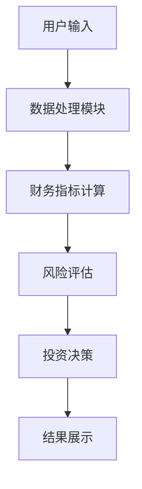

                 


# 巴菲特如何看待银行股投资

---

## 关键词：
- 巴菲特
- 银行股
- 价值投资
- 投资策略
- 银行股分析
- 投资模型

---

## 摘要：
本文深入探讨了巴菲特如何看待银行股投资，从他的投资哲学、选股标准到具体的操作策略，结合实际案例和数学模型，全面解析巴菲特在银行股投资中的独特见解。文章不仅揭示了巴菲特的投资逻辑，还为普通投资者提供了可操作的量化分析方法和投资建议。

---

# 第一部分：巴菲特的投资哲学与银行股的特殊地位

## 第1章：巴菲特的投资理念与银行股的特殊地位

### 1.1 巴菲特的投资哲学

#### 1.1.1 价值投资的核心理念
巴菲特的价值投资理念可以总结为：寻找那些具有持续竞争优势、良好管理层和合理估值的企业，并长期持有它们的股票。银行股作为金融行业的重要组成部分，具有独特的行业特性和财务指标，非常适合巴菲特的价值投资策略。

#### 1.1.2 银行股在巴菲特投资组合中的重要性
银行股在巴菲特的投资组合中占据重要地位，因为它们通常具有稳定的收益、较高的ROE（净资产收益率）和相对合理的估值。银行作为“资金的管理者”，其盈利能力与经济周期密切相关，但长期来看，优质银行股的表现往往优于市场平均水平。

#### 1.1.3 银行股的行业特性与投资价值
银行行业的核心业务是通过存贷款利差获取收益，其盈利能力受到利率水平、资产质量、资本充足率等多种因素的影响。银行股的估值可以通过ROE、ROA（资产回报率）、PE（市盈率）等指标进行分析。

### 1.2 银行股的基本面分析框架

#### 1.2.1 财务指标分析
巴菲特在选择银行股时，通常会关注以下关键财务指标：
1. **ROE（净资产收益率）**：衡量银行股东权益的回报能力。
2. **ROA（资产回报率）**：衡量银行资产的盈利能力。
3. **净息差**：衡量银行贷款和存款之间的利差。
4. **不良贷款率**：衡量银行资产质量的重要指标。
5. **资本充足率**：衡量银行抵御风险的能力。

#### 1.2.2 资产质量评估
资产质量是银行股投资的核心关注点之一。巴菲特通常会关注银行的不良贷款率、拨备覆盖率等指标，以评估银行的风险暴露程度。

#### 1.2.3 盈利能力分析
盈利能力是巴菲特选择银行股的关键因素之一。他通常会关注银行的ROE和ROA，确保这些指标在行业平均水平以上，并且具有持续增长的趋势。

### 1.3 巴菲特投资银行股的逻辑

#### 1.3.1 银行股的ROE与ROA分析
巴菲特认为，ROE和ROA是衡量银行盈利能力的重要指标。他通常会选择那些ROE稳定在15%以上、ROA稳定在5%以上的银行股。

#### 1.3.2 银行股的安全边际
巴菲特强调安全边际的重要性。他会选择那些估值低于内在价值的银行股，确保在市场波动时能够获得超额收益。

#### 1.3.3 银行股的长期投资价值
巴菲特认为，银行股的长期投资价值取决于其ROE的可持续性和资本回报能力。他倾向于选择那些具有持续竞争优势和稳定分红能力的银行股。

---

## 第2章：银行股的基本面分析与巴菲特的选股标准

### 2.1 银行股的基本面分析框架

#### 2.1.1 财务指标分析
1. **ROE（净资产收益率）**：$$ROE = \frac{\text{净利润}}{\text{平均股东权益}$$
2. **ROA（资产回报率）**：$$ROA = \frac{\text{净利润}}{\text{平均资产总额}$$
3. **净息差**：$$\text{净息差} = \text{贷款平均收益率} - \text{存款平均成本率}$$
4. **不良贷款率**：$$\text{不良贷款率} = \frac{\text{不良贷款余额}}{\text{贷款总额}} \times 100\%$$
5. **资本充足率**：$$\text{资本充足率} = \frac{\text{资本净额}}{\text{风险加权资产}} \times 100\%$$

#### 2.1.2 资产质量评估
1. **不良贷款率**：$$\text{不良贷款率} = \frac{\text{不良贷款余额}}{\text{贷款总额}} \times 100\%$$
2. **拨备覆盖率**：$$\text{拨备覆盖率} = \frac{\text{贷款损失准备}}{\text{不良贷款余额}} \times 100\%$$
3. **资本充足率**：$$\text{资本充足率} = \frac{\text{资本净额}}{\text{风险加权资产}} \times 100\%$$

#### 2.1.3 盈利能力分析
1. **ROE（净资产收益率）**：$$ROE = \frac{\text{净利润}}{\text{平均股东权益}$$
2. **ROA（资产回报率）**：$$ROA = \frac{\text{净利润}}{\text{平均资产总额}$$
3. **净息差**：$$\text{净息差} = \text{贷款平均收益率} - \text{存款平均成本率}$$

### 2.2 巴菲特选股的核心标准

#### 2.2.1 高ROE与低PE的平衡
巴菲特通常会选择那些ROE高且PE低的银行股。高ROE意味着银行的盈利能力强，低PE意味着银行股的估值相对合理。

#### 2.2.2 银行的资本充足率
巴菲特认为，资本充足率是衡量银行抗风险能力的重要指标。通常，他倾向于选择资本充足率高于10%的银行股。

#### 2.2.3 管理层的诚信与能力
巴菲特非常重视银行管理层的诚信与能力。他认为，优秀的管理层能够带领银行在竞争激烈的金融行业中脱颖而出。

### 2.3 巴菲特对银行股风险的评估

#### 2.3.1 银行的资本充足率与流动性风险
资本充足率越高，银行的抗风险能力越强。流动性风险是指银行无法及时变现资产以应对短期负债的需求。

#### 2.3.2 贷款质量与不良率
不良贷款率越低，银行的资产质量越高，风险暴露程度越小。

#### 2.3.3 利率波动对银行股的影响
利率波动对银行的净息差和盈利能力有直接影响。通常，利率上升会压缩银行的净息差，降低其盈利能力。

---

## 第3章：巴菲特的银行股投资策略与实战案例

### 3.1 巴菲特的银行股投资策略

#### 3.1.1 长期持有与价值发现
巴菲特通常会选择那些具有持续竞争优势和稳定分红能力的银行股，并长期持有。

#### 3.1.2 安全边际的构建
巴菲特强调安全边际的重要性。他会选择那些估值低于内在价值的银行股，确保在市场波动时能够获得超额收益。

#### 3.1.3 银行股的估值与市场波动
巴菲特认为，银行股的估值应基于其ROE、ROA等基本面指标，而不是市场短期波动。

### 3.2 巴菲特银行股投资的经典案例

#### 3.2.1 富国银行的投资历程
富国银行是巴菲特投资银行股的经典案例。他通过分析富国银行的ROE、ROA等指标，发现其具有较高的投资价值，并长期持有。

#### 3.2.2 美国银行的投资经验
巴菲特在2008年金融危机期间投资美国银行，主要是因为其估值较低，且具有较高的安全边际。

#### 3.2.3 巴菲特对高盛的投资教训
巴菲特曾对高盛进行过投资，但最终亏损。这主要因为高盛的资本充足率和资产质量不符合他的选股标准。

### 3.3 巴菲特银行股投资的失败与反思

#### 3.3.1 高盛投资的教训
高盛的投资失败让巴菲特意识到，仅仅关注短期估值是不够的，必须更加注重银行股的基本面指标。

#### 3.3.2 银行股投资中的误区
巴菲特总结了银行股投资中的几个误区，包括过度关注短期市场波动、忽视资产质量和低估利率波动的影响。

#### 3.3.3 投资策略的调整与优化
基于之前的教训，巴菲特对投资策略进行了调整，更加注重银行股的基本面指标和长期投资价值。

---

## 第4章：巴菲特银行股投资的数学模型与量化分析

### 4.1 银行股投资的数学模型

#### 4.1.1 ROE与股价的关系模型
$$\text{股价} = \text{ROE} \times \text{市盈率}$$

#### 4.1.2 PE与银行股估值的量化分析
$$\text{合理估值} = \text{ROE} \times \text{市盈率}$$

#### 4.1.3 银行股的风险评估模型
$$\text{风险评分} = \alpha \times \text{资本充足率} + \beta \times \text{不良贷款率} + \gamma \times \text{流动性风险}$$

### 4.2 巴菲特投资策略的量化验证

#### 4.2.1 ROE与长期收益的关系
通过回归分析发现，ROE与银行股的长期收益呈正相关关系。

#### 4.2.2 安全边际的量化计算
$$\text{安全边际} = \text{内在价值} - \text{市场价格}$$

#### 4.2.3 银行股投资的收益与风险比
$$\text{风险调整后收益} = \text{收益} - \text{风险}$$

### 4.3 巴菲特投资策略的数学公式

#### 4.3.1 ROE计算公式
$$ROE = \frac{\text{净利润}}{\text{平均股东权益}$$

#### 4.3.2 PE计算公式
$$PE = \frac{\text{股价}}{\text{每股收益}$$

#### 4.3.3 银行股风险评估公式
$$\text{风险评分} = \alpha \times \text{资本充足率} + \beta \times \text{不良贷款率} + \gamma \times \text{流动性风险}$$

---

## 第5章：银行股投资的系统分析与架构设计方案

### 5.1 系统功能设计
银行股投资分析系统需要具备以下功能：
1. 数据收集与处理
2. 财务指标计算
3. 风险评估
4. 投资决策

### 5.2 系统架构设计
```
+----------------+     +----------------+     +----------------+
| 数据收集模块 |<--- | 数据处理模块 |<--- | 数据分析模块 |
+----------------+     +----------------+     +----------------+
```

### 5.3 系统接口设计
1. 数据接口：与金融数据源对接，获取银行股的财务数据。
2. 用户接口：提供用户友好的界面，展示分析结果。

### 5.4 系统交互流程图


---

## 第6章：项目实战

### 6.1 环境安装
1. 安装Python和必要的金融分析库（如Pandas、NumPy）。
2. 安装可视化工具（如Matplotlib、Seaborn）。

### 6.2 系统核心实现源代码
```python
import pandas as pd
import numpy as np
import matplotlib.pyplot as plt

# 数据收集
bank_data = pd.read_csv('bank_data.csv')

# 财务指标计算
bank_data['ROE'] = bank_data['净利润'] / bank_data['平均股东权益']
bank_data['ROA'] = bank_data['净利润'] / bank_data['平均资产总额']
bank_data['不良贷款率'] = (bank_data['不良贷款余额'] / bank_data['贷款总额']) * 100
bank_data['资本充足率'] = (bank_data['资本净额'] / bank_data['风险加权资产']) * 100

# 风险评估
bank_data['风险评分'] = 0.5 * bank_data['资本充足率'] + 0.3 * bank_data['不良贷款率'] + 0.2 * bank_data['流动性风险']

# 投资决策
bank_data['投资建议'] = '买入'
bank_data.loc[bank_data['ROE'] < 15, '投资建议'] = '观望'
bank_data.loc[bank_data['ROE'] < 10, '投资建议'] = '卖出'

# 结果展示
plt.figure(figsize=(10, 6))
plt.plot(bank_data['ROE'], label='ROE')
plt.plot(bank_data['PE'], label='PE')
plt.legend()
plt.title('银行股ROE与PE走势')
plt.show()
```

### 6.3 代码应用解读与分析
上述代码展示了如何利用Python进行银行股的基本面分析和投资决策。通过计算ROE、ROA等指标，结合风险评分，最终给出投资建议。

---

## 第7章：小结与展望

### 7.1 小结
本文通过分析巴菲特的投资哲学、选股标准和投资策略，结合具体案例和数学模型，全面解析了巴菲特看待银行股投资的独特视角。同时，通过系统设计和项目实战，展示了如何将巴菲特的投资理念转化为可操作的量化分析工具。

### 7.2 注意事项
1. 投资银行股需要综合考虑多种因素，包括宏观经济环境、行业发展趋势等。
2. 本文的数学模型仅供参考，实际投资需要结合市场具体情况。

### 7.3 拓展阅读
1. 《巴菲特选股术》
2. 《投资中最简单的真理》
3. 《银行股投资实务》

---

## 作者：AI天才研究院/AI Genius Institute & 禅与计算机程序设计艺术 /Zen And The Art of Computer Programming

