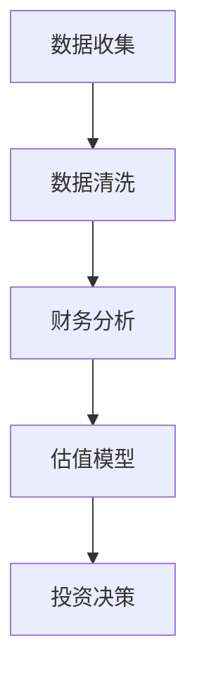
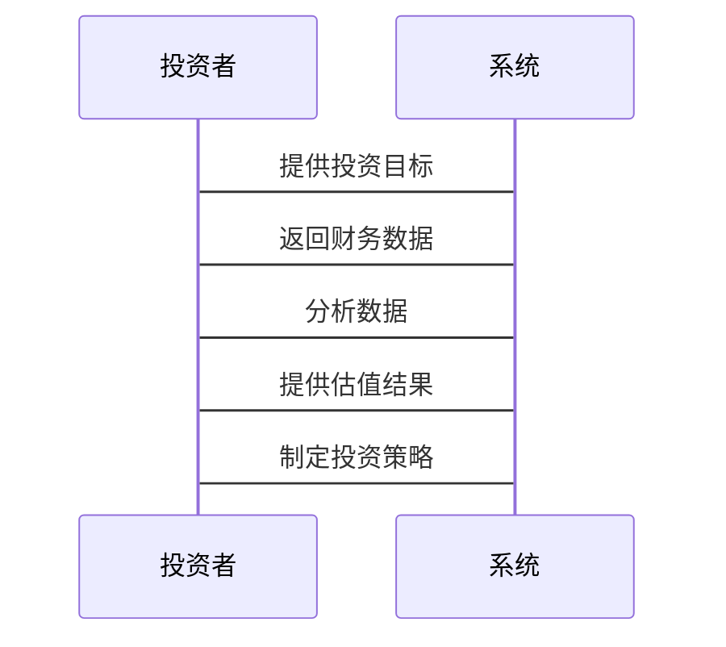

                 


# 巴菲特的'烟蒂'投资：从不良资产中发现价值

> 关键词：巴菲特，烟蒂投资，价值投资，不良资产，投资策略，财务分析

> 摘要：本文详细探讨了巴菲特的“烟蒂”投资策略，从理论基础、分析框架到实际案例，系统地分析了如何从不良资产中发现价值。文章结合技术语言，通过逻辑推理和实例分析，揭示了烟蒂投资法的核心思想及其在现代投资中的应用。

---

## 第一部分：引言

### 1.1 投资的基本概念
投资是将资金投入到某种资产或项目中，以期获得未来收益的行为。投资的核心在于通过分析资产的内在价值，判断其是否被市场低估或高估。巴菲特认为，投资的本质是寻找具有长期竞争优势的企业，并以合理的价格买入。

### 1.2 巴菲特的投资理念
巴菲特是价值投资的倡导者，他强调以低于内在价值的价格买入优质资产。烟蒂投资法是其价值投资理念的延伸，专注于寻找那些被市场忽视或低估的“烟蒂”型公司。

---

## 第二部分：烟蒂投资法的理论基础

### 2.1 烟蒂投资法的定义与特点
烟蒂投资法是指通过分析企业的基本面，寻找那些具有潜在价值但被市场忽视的公司。其特点包括：
- 低估值：企业的市场价格远低于其内在价值。
- 不良资产：企业可能处于困境，但具有扭亏为盈的潜力。
- 长期价值：关注企业的长期竞争优势和盈利能力。

### 2.2 烟蒂投资法的理论基础
烟蒂投资法的理论基础主要包括：
1. 市场有效性的分析：市场并非总是有效，存在错误定价的机会。
2. 安全边际：以低于内在价值的价格买入资产，确保投资的安全性。
3. 财务报表分析：通过分析企业的财务数据，评估其真实价值。

---

## 第三部分：烟蒂投资法的分析框架

### 3.1 财务报表分析
财务报表是评估企业价值的核心工具。烟蒂投资法通常从以下几个方面进行分析：
1. **盈利能力**：通过净利润率、ROE等指标评估企业的盈利能力。
2. **财务健康度**：通过资产负债表分析企业的负债情况和资产质量。
3. **现金流**：关注企业的现金流情况，判断其财务健康度和可持续性。

### 3.2 估值模型的应用
常见的估值模型包括：
1. **市盈率（P/E）**：将企业的市盈率与行业平均水平进行对比。
2. **市净率（P/B）**：将企业的市净率与行业平均水平进行对比。
3. **内在价值计算**：通过DCF模型等方法估算企业的内在价值。

---

## 第四部分：烟蒂投资法的案例分析

### 4.1 美国运通的案例
美国运通是一家信用卡公司，曾经因行业竞争加剧而股价暴跌。巴菲特通过分析其财务数据，发现其内在价值远高于市场价格，最终以低价买入，获得了丰厚的回报。

### 4.2 投资失败的教训
并非所有烟蒂型投资都能成功。例如，某些企业可能因管理不善或行业结构性问题而难以扭亏为盈。投资者需要在分析中严格筛选，避免盲目跟风。

---

## 第五部分：烟蒂投资法的风险提示

### 5.1 市场波动风险
市场波动可能会影响烟蒂型公司的股价，投资者需要有足够的耐心和信心，避免因短期波动而卖出。

### 5.2 企业基本面变化
企业的基本面可能发生重大变化，例如行业政策调整或竞争加剧，这可能影响企业的长期价值。

### 5.3 投资者的认知偏差
投资者可能因认知偏差而低估某些公司的风险，或者高估其潜在价值。因此，投资决策需要基于客观的数据分析。

---

## 第六部分：烟蒂投资法的系统架构设计

### 6.1 系统功能设计
烟蒂投资法的系统架构可以分为以下几个模块：
1. **数据收集模块**：收集企业的财务数据、行业信息和市场数据。
2. **分析模块**：对数据进行分析，评估企业的内在价值。
3. **决策模块**：根据分析结果，制定投资策略。

### 6.2 系统架构图
以下是一个烟蒂投资法的系统架构图：



### 6.3 系统交互流程图
以下是一个烟蒂投资法的系统交互流程图：



---

## 第七部分：项目实战

### 7.1 环境安装
需要安装以下工具：
- Python编程语言
- 数据分析库（Pandas, NumPy）
- 可视化工具（Matplotlib, Seaborn）

### 7.2 核心实现代码
以下是一个简单的烟蒂投资法分析框架的Python代码示例：

```python
import pandas as pd
import numpy as np

# 示例数据：企业财务数据
data = {
    '公司': ['A公司', 'B公司', 'C公司'],
    '收入': [100, 200, 150],
    '净利润': [20, 30, 25],
    '市盈率': [15, 20, 18]
}

df = pd.DataFrame(data)

# 计算内在价值
def calculate_intrinsic_value(row):
    # 示例：使用简化模型计算内在价值
    return row['净利润'] * 15  # 假设合理市盈率为15

df['内在价值'] = df.apply(lambda row: calculate_intrinsic_value(row), axis=1)

# 比较市场价格与内在价值
df['价格差异'] = df['内在价值'] - df['收入']

print(df)
```

---

## 第八部分：总结与展望

### 8.1 总结
烟蒂投资法是一种有效的投资策略，通过寻找被市场忽视的低估值企业，发现其潜在价值。投资者需要结合基本面分析和市场研究，制定合理的投资策略。

### 8.2 展望
随着技术的进步，烟蒂投资法可以通过大数据和人工智能进一步优化。投资者可以利用机器学习算法，分析更多的数据，发现潜在的投资机会。

---

## 作者：AI天才研究院 & 禅与计算机程序设计艺术

---

通过本文的分析，读者可以系统地了解巴菲特的烟蒂投资法，并在实际投资中加以应用。

