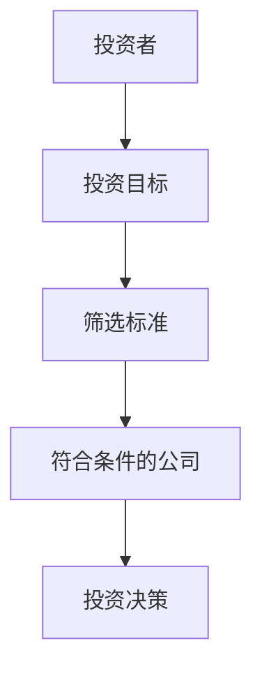
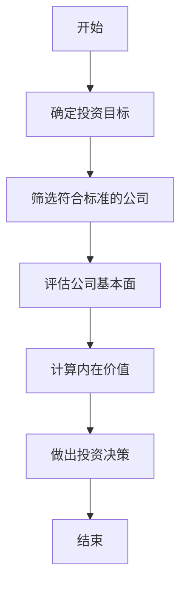
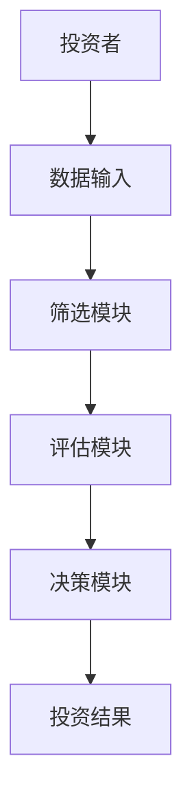

                 


# 巴菲特的20格打孔卡：集中投资策略

## 关键词：
- 巴菲特
- 投资策略
- 20格打孔卡
- 集中投资
- 风险管理

## 摘要：
巴菲特的20格打孔卡是一种集中投资策略，通过筛选和评估具有长期价值的公司，实现稳健的投资回报。本文详细介绍了打孔卡的背景、核心概念、算法原理、系统架构以及实际应用，帮助读者理解如何运用这种策略进行投资决策。

---

## 第一部分：巴菲特的20格打孔卡：集中投资策略概述

### 第1章：背景介绍

#### 1.1 巴菲特的投资理念
- **价值投资的定义**：寻找具有长期竞争优势、良好管理和低估价格的公司。
- **巴菲特的成功案例**：通过长期持有优质股票，实现财富的稳步增长。
- **20格打孔卡的起源**：巴菲特将投资决策过程简化为20个筛选标准，形成打孔卡。

#### 1.2 20格打孔卡的核心理念
- **集中投资策略**：将资金集中在少数优质资产上，降低风险。
- **筛选标准**：包括公司财务状况、竞争优势、管理团队等因素。
- **风险管理**：通过严格筛选标准，避免投资失败。

#### 1.3 打孔卡的有效性分析
- **历史表现**：打孔卡筛选的公司长期表现优于市场平均水平。
- **适用性**：适用于长期投资者，但需根据市场变化调整标准。

### 第2章：核心概念与联系

#### 2.1 核心概念原理
- **投资策略的核心要素**：公司基本面、财务状况、竞争优势。
- **打孔卡的筛选标准**：ROE、债务率、利润率等财务指标。
- **数学模型**：通过公式评估公司的内在价值和成长潜力。

#### 2.2 核心概念属性特征对比表
| 标准 | 重要性 | 具体指标 |
|------|--------|----------|
| ROE  | 高     | ≥15%    |
| 债务率 | 中     | ≤50%    |
| 利润率 | 高     | ≥10%    |

#### 2.3 ER实体关系图


---

## 第二部分：算法原理与系统分析

### 第3章：算法原理

#### 3.1 算法原理流程图


#### 3.2 内在价值计算公式
$$ \text{内在价值} = \frac{\text{现金流} \times (1 + g)}{k - g} $$

### 第4章：系统分析与架构设计

#### 4.1 系统功能设计
- **信息收集**：获取公司财务数据和行业分析。
- **筛选标准**：应用20格打孔卡的筛选标准进行初步筛选。
- **深度评估**：评估公司基本面和内在价值。
- **决策执行**：根据评估结果做出投资决策。

#### 4.2 系统架构图


---

## 第三部分：项目实战

### 第5章：项目实战

#### 5.1 环境安装
- 安装Python和相关库：pandas、numpy。

#### 5.2 核心代码实现
```python
def calculate_intrinsic_value(fcf, growth_rate, cost_of_capital):
    return (fcf * (1 + growth_rate)) / (cost_of_capital - growth_rate)
```

#### 5.3 案例分析
- 选择一家公司，计算其内在价值，评估是否符合打孔卡标准。

---

## 第四部分：最佳实践与总结

### 第6章：最佳实践

#### 6.1 小结
- 巴菲特的20格打孔卡是一种有效的投资策略，通过集中投资优质资产，实现长期收益。

#### 6.2 注意事项
- 定期更新筛选标准，适应市场变化。
- 风险管理是关键，避免过度集中。

#### 6.3 拓展阅读
- 《巴菲特的打孔卡》：详细介绍打孔卡的筛选标准和应用。

---

## 作者：AI天才研究院 & 禅与计算机程序设计艺术

---

这篇博客详细介绍了巴菲特的20格打孔卡投资策略，从背景、核心概念、算法原理到实际应用，帮助读者全面理解这一策略，并能在实际投资中应用。

