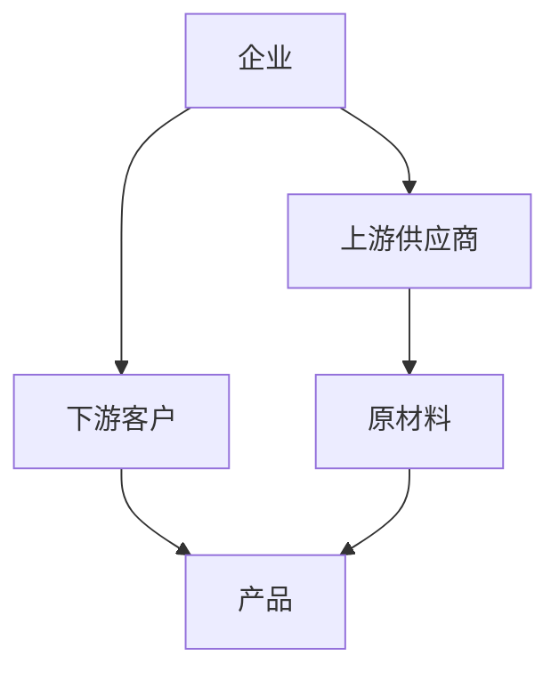
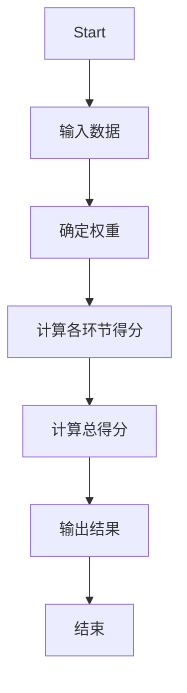
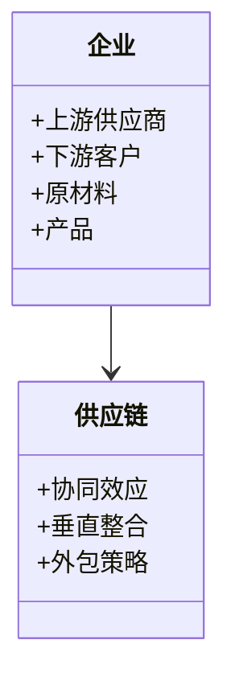
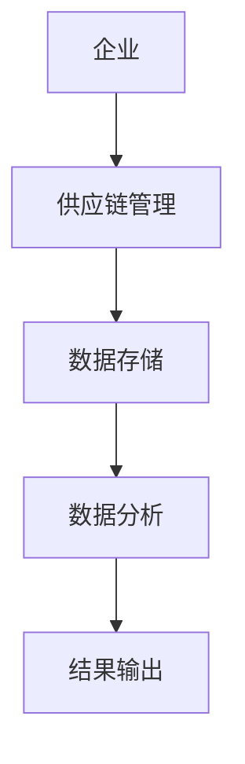
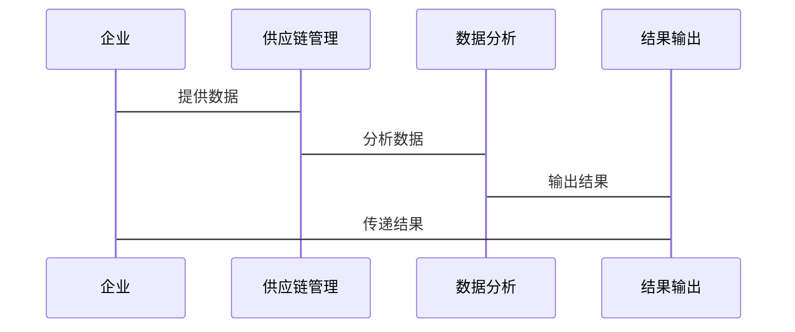

                 


# 巴菲特的产业链分析2.0：全球化背景下的供应链重构

## 关键词：巴菲特，产业链分析，供应链重构，全球化，投资决策

## 摘要：本文通过分析巴菲特产业链分析2.0的方法，结合全球化背景下的供应链重构，探讨如何通过产业链分析优化投资决策。文章从产业链的核心概念、算法原理、系统设计到项目实战，全面解析产业链分析的理论与实践。

---

# 第1章: 巴菲特产业链分析2.0的背景与意义

## 1.1 巴菲特产业链分析的背景

### 1.1.1 产业链分析的定义与核心要素

产业链分析是一种系统性研究企业供应链结构及其相互关系的方法。核心要素包括上游供应商、企业、下游客户、原材料、产品、服务等。

### 1.1.2 巴菲特产业链分析的演进历程

巴菲特的产业链分析从最初的简单供应链分析，逐步演变为复杂的系统性分析，尤其是在全球化背景下，更加注重供应链的协同效应和垂直整合能力。

### 1.1.3 全球化背景下的产业链重构趋势

全球化导致企业供应链的全球化布局，但近年来地缘政治和经济波动使得企业更加注重本地化和多元化供应链。

## 1.2 巴菲特产业链分析的核心意义

### 1.2.1 产业链分析在投资决策中的作用

通过分析企业的供应链结构，投资者可以评估企业的成本控制能力、议价能力、风险敞口等关键指标。

### 1.2.2 全球化背景下产业链重构的挑战与机遇

全球化带来供应链的复杂性，但也为企业提供了降低成本和优化效率的机会。

### 1.2.3 巴菲特产业链分析2.0的核心价值

通过系统性分析，巴菲特产业链分析2.0可以帮助投资者识别企业供应链中的潜在风险和竞争优势。

## 1.3 本章小结

本章介绍了巴菲特产业链分析2.0的背景、核心要素及其在全球化背景下的重要性。

---

# 第2章: 巴菲特产业链分析的核心概念与联系

## 2.1 核心概念的定义与属性特征

### 2.1.1 产业链的构成要素

- **上游供应商**：提供原材料或零部件的企业。
- **企业**：核心企业。
- **下游客户**：购买企业产品或服务的客户。
- **原材料**：企业生产所需的基础材料。
- **产品**：企业的最终产品或服务。
- **服务**：支持企业运营的各项服务。

### 2.1.2 产业链的分类与特征对比

| 分类标准 | 分类 | 特征 |
|----------|------|------|
| 阶段     | 上游 | 原材料供应 |
|          | 中游 | 生产制造 |
|          | 下游 | 销售与服务 |

### 2.1.3 产业链的生命周期与演变规律

产业链的生命周期包括形成、成长、成熟和衰退四个阶段，不同阶段的特征和策略有所不同。

## 2.2 产业链分析的ER实体关系图



## 2.3 产业链分析的核心原理

### 2.3.1 产业链的协同效应

协同效应是指产业链各环节之间协同工作带来的效率提升。

### 2.3.2 产业链的垂直整合与外包策略

垂直整合可以增强企业对供应链的控制能力，外包则可以降低成本。

### 2.3.3 产业链的竞争力评估模型

竞争力评估模型包括成本、质量、交付能力、创新能力等多个维度。

## 2.4 本章小结

本章详细介绍了产业链的核心概念及其相互关系，并通过ER图展示了产业链的实体关系。

---

# 第3章: 巴菲特产业链分析的算法原理

## 3.1 产业链分析的数学模型

### 3.1.1 产业链竞争力评估的数学公式

$$ C = \sum_{i=1}^{n} w_i \cdot x_i $$

其中，$C$ 表示产业链竞争力，$w_i$ 表示第 $i$ 个因素的权重，$x_i$ 表示第 $i$ 个因素的得分。

### 3.1.2 产业链协同效应的计算公式

$$ S = \frac{\sum_{j=1}^{m} s_j}{m} $$

其中，$S$ 表示产业链协同效应，$s_j$ 表示第 $j$ 个环节的协同得分，$m$ 表示环节总数。

## 3.2 产业链分析的算法流程



---

# 第4章: 系统分析与架构设计方案

## 4.1 问题场景介绍

以某汽车制造企业为例，分析其供应链的垂直整合能力。

## 4.2 系统功能设计

### 4.2.1 领域模型Mermaid类图



## 4.3 系统架构设计

### 4.3.1 系统架构Mermaid图



### 4.3.2 系统接口设计

- 输入接口：企业供应链数据。
- 输出接口：供应链竞争力评估结果。

### 4.3.3 系统交互Mermaid序列图



---

# 第5章: 项目实战

## 5.1 环境安装

- 安装Python和相关库（如pandas、numpy、scipy）。

## 5.2 核心代码实现

### 5.2.1 竞争力评估代码

```python
def calculate_competitiveness(weights, scores):
    return sum(w * s for w, s in zip(weights, scores))

weights = [0.4, 0.3, 0.2, 0.1]
scores = [0.8, 0.7, 0.6, 0.5]
competitiveness = calculate_competitiveness(weights, scores)
print(f"Competitiveness Score: {competitiveness}")
```

### 5.2.2 协同效应计算代码

```python
def calculate_synergy(scores):
    return sum(scores) / len(scores)

scores = [0.8, 0.7, 0.6, 0.5]
synergy = calculate_synergy(scores)
print(f"Synergy Score: {synergy}")
```

## 5.3 代码解读与分析

通过上述代码，我们可以计算企业的供应链竞争力和协同效应，从而评估其供应链的优劣。

## 5.4 案例分析

以某汽车制造企业的供应链为例，分析其竞争力和协同效应。

---

# 第6章: 最佳实践、小结、注意事项、拓展阅读

## 6.1 最佳实践

- 定期评估供应链竞争力。
- 优化协同效应，提升供应链效率。
- 注重供应链的垂直整合与外包策略。

## 6.2 小结

本文通过系统性分析，介绍了巴菲特产业链分析2.0的方法及其在全球化背景下的应用。

## 6.3 注意事项

- 数据的准确性和完整性是分析的关键。
- 供应链分析需要结合企业的实际情况。

## 6.4 拓展阅读

- 巴菲特投资思想的其他方面。
- 全球化背景下供应链管理的最新研究。

---

# 作者：AI天才研究院/AI Genius Institute & 禅与计算机程序设计艺术 /Zen And The Art of Computer Programming

