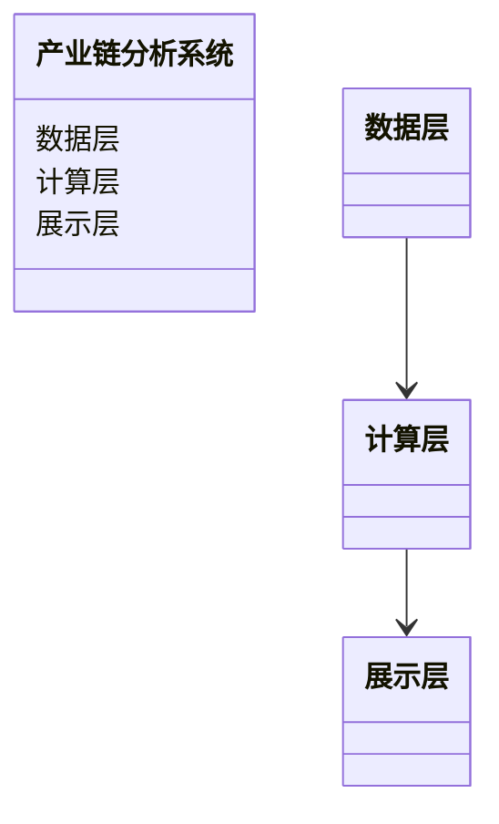

                 


# 巴菲特的产业链分析3.0：全球供应链重构下的投资机会

## 关键词：
巴菲特，产业链分析，全球供应链重构，投资机会，系统架构设计，数学模型，项目实战

## 摘要：
本文深入分析了巴菲特产业链分析3.0的核心理念，结合全球供应链重构的背景，探讨其在投资机会中的应用。通过系统架构设计、数学模型构建和项目实战案例，揭示了如何利用巴菲特的产业链分析方法在全球供应链重构中捕捉投资机会。

---

# 第一部分: 巴菲特产业链分析3.0基础

## 第1章: 巴菲特投资理念与产业链分析概述

### 1.1 巴菲特投资理念的演变
#### 1.1.1 从价值投资到产业链分析的演进
巴菲特的投资理念从早期的“价值投资”逐步扩展到对产业链的系统性分析，强调对行业和企业的深度理解。产业链分析成为其投资决策的重要工具。

#### 1.1.2 巴菲特产业链分析的核心思想
巴菲特认为，企业的价值不仅取决于其自身，还取决于其所在产业链的稳定性、上下游关系和整体竞争力。产业链分析的核心思想是通过识别产业链中的关键环节和竞争优势，评估企业的长期价值。

#### 1.1.3 产业链分析在投资决策中的地位
产业链分析是巴菲特投资决策的重要组成部分，通过分析产业链的结构、风险和机会，帮助投资者更好地评估企业的投资价值。

### 1.2 产业链分析的定义与特点
#### 1.2.1 产业链的定义
产业链是指从原材料供应到最终产品交付的完整生产过程，包括上游供应商、中游制造企业、下游分销商和终端消费者。

#### 1.2.2 产业链分析的特点
- **系统性**：产业链分析需要考虑产业链的各个环节及其相互关系。
- **动态性**：产业链会随着市场需求和技术进步而变化。
- **复杂性**：产业链涉及多个参与者和利益相关者。

#### 1.2.3 产业链分析与传统投资分析的区别
传统投资分析通常关注企业的财务指标和市场表现，而产业链分析更注重企业所处的行业环境和产业链结构。

### 1.3 全球供应链重构的背景
#### 1.3.1 全球化与供应链的基本概念
全球化促进了全球供应链的形成，但近年来地缘政治风险和疫情等因素导致供应链的不稳定。

#### 1.3.2 近年来供应链重构的主要驱动因素
- **地缘政治风险**：如中美贸易摩擦和俄乌冲突。
- **疫情冲击**：疫情暴露了全球供应链的脆弱性。
- **成本驱动**：企业为了降低成本和提高效率，重新布局供应链。

#### 1.3.3 重构对全球经济和投资的影响
供应链重构可能导致生产成本上升、效率下降，但也为某些行业提供了新的机会。

---

## 第2章: 巴菲特产业链分析的核心框架

### 2.1 产业链分析的关键要素
#### 2.1.1 产业链的构成要素
- **上游供应商**：提供原材料和零部件的企业。
- **中游制造企业**：负责生产制造的企业。
- **下游分销商**：负责产品销售和配送的企业。
- **终端消费者**：最终产品的需求者。

#### 2.1.2 产业链的上下游关系
- **上游对中游的影响**：原材料价格波动直接影响制造成本。
- **中游对下游的影响**：制造企业的生产效率和产品质量影响分销和销售。

#### 2.1.3 产业链的稳定性与风险点
- **稳定性**：产业链的稳定性和韧性。
- **风险点**：如供应链中断、原材料短缺等。

### 2.2 产业链分析的核心框架
#### 2.2.1 巴菲特产业链分析模型
巴菲特的产业链分析模型包括以下几个部分：
- **行业分析**：分析行业的市场规模、增长潜力和竞争格局。
- **企业分析**：分析企业的财务状况、竞争优势和管理能力。
- **产业链风险评估**：评估产业链中的潜在风险和不确定性。
- **投资机会识别**：识别产业链中的投资机会。

#### 2.2.2 模型的输入与输出
- **输入**：行业数据、企业财务数据、市场信息。
- **输出**：投资建议、风险评估、投资价值评分。

#### 2.2.3 模型的适用范围与限制
- **适用范围**：适用于制造业、科技行业等复杂的产业链。
- **限制**：模型的准确性依赖于数据的完整性和模型的假设条件。

---

## 第3章: 巴菲特产业链分析的数学模型与公式

### 3.1 核心概念的数学表达
#### 3.1.1 产业链价值的计算公式
$$
\text{产业链价值} = \sum_{i=1}^{n} \text{环节价值}_i
$$
其中，$\text{环节价值}_i$表示产业链中第i个环节的价值。

#### 3.1.2 产业链风险的量化模型
$$
\text{风险评分} = \frac{\sum_{j=1}^{m} \text{风险因素}_j \times \text{权重}_j}{\sum_{j=1}^{m} \text{权重}_j}
$$
其中，$\text{风险因素}_j$表示第j个风险因素的影响程度，$\text{权重}_j$表示第j个风险因素的权重。

#### 3.1.3 产业链机会的评估公式
$$
\text{机会评分} = \frac{\sum_{k=1}^{p} \text{机会因素}_k \times \text{权重}_k}{\sum_{k=1}^{p} \text{权重}_k}
$$
其中，$\text{机会因素}_k$表示第k个机会因素的影响程度，$\text{权重}_k$表示第k个机会因素的权重。

### 3.2 案例分析与公式应用
#### 3.2.1 某行业产业链的数学建模
以某行业的产业链为例，构建数学模型，分析各个环节的价值和风险。

#### 3.2.2 公式的实际应用案例
通过具体案例，展示如何利用上述公式评估产业链的价值和风险。

#### 3.2.3 案例分析的总结与启示
总结案例分析的结果，并提出对投资者的启示。

---

## 第4章: 巴菲特产业链分析的系统架构设计

### 4.1 系统分析与设计概述
#### 4.1.1 系统分析的目标
系统分析的目标是通过构建数学模型和系统架构，实现对产业链的全面分析和评估。

#### 4.1.2 系统设计的原则
- **模块化**：系统设计模块化，便于维护和扩展。
- **可扩展性**：系统设计具有良好的扩展性，能够适应不同的行业和场景。

#### 4.1.3 系统架构的层次划分
- **数据层**：包括数据的采集、存储和处理。
- **计算层**：包括数学模型的计算和分析。
- **展示层**：包括分析结果的可视化和展示。

### 4.2 系统功能设计
#### 4.2.1 领域模型（Mermaid类图）


#### 4.2.2 系统架构设计（Mermaid架构图）


#### 4.2.3 系统接口设计
系统接口设计包括：
- 数据接口：与数据库或其他数据源的接口。
- 计算接口：与数学模型计算模块的接口。
- 展示接口：与用户界面的接口。

#### 4.2.4 系统交互设计（Mermaid序列图）
```mermaid
sequenceDiagram
    participant 用户
    participant 系统
    用户 -> 系统: 请求分析
    系统 -> 数据层: 获取数据
    数据层 -> 系统: 返回数据
    系统 -> 计算层: 计算结果
    计算层 -> 系统: 返回结果
    系统 -> 展示层: 展示结果
    用户 <- 系统: 显示结果
```

---

## 第5章: 巴菲特产业链分析的项目实战

### 5.1 项目介绍
以某行业为例，构建完整的产业链分析系统，包括数据采集、模型计算和结果展示。

### 5.2 环境安装
- **软件环境**：安装Python、Jupyter Notebook、Mermaid工具。
- **数据环境**：获取行业数据和企业数据。

### 5.3 核心代码实现
#### 5.3.1 数据处理代码
```python
import pandas as pd

# 数据加载
data = pd.read_csv('产业链数据.csv')

# 数据清洗
data.dropna(inplace=True)
data = data[~data.duplicated()]
```

#### 5.3.2 数学模型实现
```python
def 计算产业链价值(data):
    产业链价值 = sum(data['环节价值'])
    return 产业链价值

def 计算风险评分(data):
    风险评分 = sum(data['风险因素'] * data['权重']) / sum(data['权重'])
    return 风险评分
```

#### 5.3.3 结果展示代码
```python
import matplotlib.pyplot as plt

plt.figure(figsize=(10,6))
plt.plot(时间序列, 产业链价值, 'b-', label='产业链价值')
plt.xlabel('时间')
plt.ylabel('价值')
plt.title('产业链价值变化趋势')
plt.legend()
plt.show()
```

### 5.4 案例分析与解读
通过具体案例分析，展示如何利用上述代码实现产业链分析，并解读分析结果。

### 5.5 项目小结
总结项目实施过程中的经验教训，提出改进建议。

---

## 第6章: 巴菲特产业链分析的最佳实践

### 6.1 小结
总结巴菲特产业链分析的核心思想和实际应用。

### 6.2 投资者注意事项
- **数据质量**：确保数据的准确性和完整性。
- **模型选择**：根据具体情况选择合适的数学模型。
- **风险管理**：重视产业链中的潜在风险。

### 6.3 拓展阅读
推荐相关书籍和文献，供读者深入学习。

---

## 作者：AI天才研究院/AI Genius Institute & 禅与计算机程序设计艺术 /Zen And The Art of Computer Programming

---

通过以上目录结构，我们可以看到，文章从背景介绍到系统架构设计，再到项目实战和最佳实践，全面覆盖了巴菲特产业链分析的各个方面，确保读者能够系统地理解和应用这一方法。

