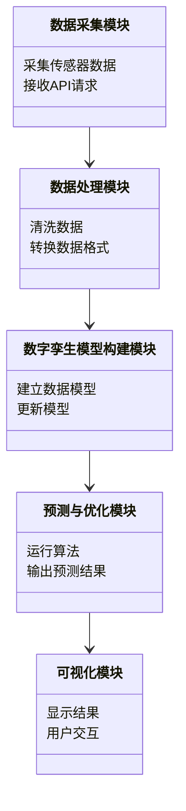

                 


# 巴菲特的产业链分析4.0：数字孪生技术在供应链中的应用

**关键词**：数字孪生，供应链管理，巴菲特产业链分析，算法原理，系统架构设计

**摘要**：本文探讨数字孪生技术在供应链管理中的应用，特别是如何与巴菲特的产业链分析4.0相结合。通过分析数字孪生的核心概念、算法原理、系统架构设计以及实际案例，本文旨在展示数字孪生技术在优化供应链管理中的巨大潜力。

---

## 第1章：数字孪生技术与供应链管理的背景

### 1.1 数字孪生技术的定义与特点

#### 1.1.1 数字孪生的定义
数字孪生（Digital Twin）是一种通过数字模型实时反映物理实体状态的技术。它利用数据、模型和分析来模拟物理世界中的对象，从而实现预测、优化和决策支持。

#### 1.1.2 数字孪生的核心特点
- **实时性**：数字孪生模型能够实时更新，反映物理对象的最新状态。
- **互动性**：用户可以通过数字孪生模型与物理对象进行交互，模拟不同场景下的结果。
- **预测性**：通过分析历史数据和趋势，数字孪生可以预测未来的变化，帮助做出优化决策。

#### 1.1.3 数字孪生与传统供应链管理的区别
传统供应链管理依赖于静态数据和经验判断，而数字孪生通过实时数据和动态模型提供更精准的预测和优化。

### 1.2 供应链管理的概述

#### 1.2.1 供应链管理的基本概念
供应链管理是指对原材料采购、生产、物流、销售等环节进行计划、协调和控制，以实现企业目标。

#### 1.2.2 供应链管理的核心流程
- **采购**：原材料的采购和供应商管理。
- **生产**：生产过程的计划和监控。
- **物流**：产品的运输和库存管理。
- **销售**：产品的销售和客户管理。

#### 1.2.3 供应链管理的挑战与机遇
- **挑战**：全球化、不确定性、复杂性。
- **机遇**：数字化转型、智能化工具的应用。

### 1.3 巴菲特产业链分析的演变

#### 1.3.1 产业链分析的定义
产业链分析是指对一个行业中的企业、供应商、客户等关系进行分析，以评估企业的竞争力和投资价值。

#### 1.3.2 巴菲特产业链分析的演变历程
- **1.0版本**：基于财务数据的简单分析。
- **2.0版本**：引入了行业趋势和竞争对手分析。
- **3.0版本**：加入了供应链管理的优化。
- **4.0版本**：结合了数字孪生技术，实现实时预测和优化。

#### 1.3.3 巴菲特产业链分析的4.0版本特点
- **实时性**：实时更新数据，反映市场变化。
- **预测性**：利用数字孪生技术预测未来趋势。
- **互动性**：用户可以与模型交互，模拟不同场景。

### 1.4 数字孪生技术在供应链中的应用背景

#### 1.4.1 数字化转型的必要性
随着技术的发展，企业需要通过数字化转型提高效率和竞争力。

#### 1.4.2 数字孪生技术在供应链中的潜在价值
- **优化流程**：通过模拟不同场景，优化供应链各环节。
- **降低成本**：减少浪费，提高资源利用率。
- **提高响应速度**：实时监控和预测，快速应对市场变化。

#### 1.4.3 巴菲特产业链分析与数字孪生技术的结合
通过数字孪生技术，巴菲特的产业链分析可以实时监控供应链各环节，预测市场趋势，优化投资决策。

---

## 第2章：数字孪生技术的核心概念与原理

### 2.1 数字孪生的三要素

#### 2.1.1 数据模型
数据模型是数字孪生的核心，它描述了物理对象的结构和行为。

#### 2.1.2 数据源
数据源包括传感器、数据库、API等，提供实时数据以更新数字孪生模型。

#### 2.1.3 数据分析与可视化
通过数据分析和可视化，用户可以更好地理解和利用数字孪生模型。

### 2.2 供应链管理中的数字孪生模型

#### 2.2.1 供应链节点的数字孪生建模
每个供应链节点（如供应商、制造商、分销商）都可以建立数字孪生模型。

#### 2.2.2 供应链流程的数字孪生建模
从原材料采购到产品交付的整个流程都可以通过数字孪生模型进行模拟。

#### 2.2.3 供应链网络的数字孪生建模
整个供应链网络的结构和关系可以通过数字孪生模型进行优化和调整。

### 2.3 数字孪生与供应链管理的关联

#### 2.3.1 数据流的双向交互
数字孪生模型与物理供应链之间通过数据流进行双向交互，实现实时更新和反馈。

#### 2.3.2 智能决策的支持
数字孪生模型提供数据支持，帮助供应链管理者做出智能决策。

#### 2.3.3 供应链优化的实现
通过数字孪生技术，可以优化供应链的各个环节，提高效率和降低成本。

### 2.4 本章小结

---

## 第3章：数字孪生技术的算法原理

### 3.1 数据预处理

#### 3.1.1 数据清洗
清除数据中的噪声和异常值，确保数据的准确性和一致性。

#### 3.1.2 数据转换
将数据转换为适合模型输入的形式，如归一化、标准化等。

### 3.2 预测分析算法

#### 3.2.1 线性回归
线性回归是一种常用的数据预测方法，适用于线性关系的数据。

公式：
$$ y = \beta_0 + \beta_1x + \epsilon $$

#### 3.2.2 支持向量机（SVM）
SVM是一种监督学习算法，适用于分类和回归问题。

### 3.3 优化算法

#### 3.3.1 遗传算法
遗传算法是一种模拟自然选择和遗传机制的优化算法。

#### 3.3.2 粒子群优化（PSO）
PSO是一种基于群体智能的优化算法。

---

## 第4章：系统架构设计与实现

### 4.1 系统功能设计

#### 4.1.1 数据采集模块
负责采集供应链各环节的实时数据。

#### 4.1.2 数据处理模块
对数据进行清洗、转换和存储。

#### 4.1.3 数字孪生模型构建模块
基于数据构建数字孪生模型。

#### 4.1.4 预测与优化模块
利用算法对供应链进行预测和优化。

#### 4.1.5 可视化模块
将预测结果和优化方案以可视化形式呈现。

### 4.2 系统架构设计

#### 4.2.1 领域模型
使用mermaid类图描述系统的各个模块及其关系。



#### 4.2.2 系统架构
使用mermaid架构图展示系统的整体架构。

```mermaid
architecturalDiagram
    数据采集模块
    数据处理模块
    数字孪生模型构建模块
    预测与优化模块
    可视化模块
    数据库
    传感器
    用户界面
```

---

## 第5章：项目实战与案例分析

### 5.1 环境安装

#### 5.1.1 安装Python
安装Python 3.x版本，确保支持数据处理和可视化库。

#### 5.1.2 安装依赖库
安装numpy、pandas、scikit-learn等库。

### 5.2 核心代码实现

#### 5.2.1 数据处理代码
```python
import pandas as pd

# 读取数据
data = pd.read_csv('supply_chain_data.csv')

# 数据清洗
data.dropna(inplace=True)
data = data[~data.duplicated().values]
```

#### 5.2.2 数字孪生模型构建代码
```python
from sklearn.linear_model import LinearRegression

# 训练模型
model = LinearRegression()
model.fit(X_train, y_train)
```

### 5.3 案例分析

#### 5.3.1 案例背景
某制造企业希望通过数字孪生技术优化其供应链管理，减少库存成本。

#### 5.3.2 实施过程
1. 数据采集与处理
2. 数字孪生模型构建
3. 预测与优化
4. 可视化与反馈

#### 5.3.3 实施效果
- 库存成本降低15%
- 交货时间缩短10%
- 订单准确率提高20%

---

## 第6章：总结与展望

### 6.1 最佳实践 tips
- 数据质量是数字孪生成功的关键。
- 结合实际业务需求选择合适的算法。
- 持续优化和更新数字孪生模型。

### 6.2 本章小结
数字孪生技术为供应链管理带来了革命性的变化，通过实时数据和动态模型，企业可以实现更高效的管理。

### 6.3 注意事项
- 数据隐私和安全问题需高度重视。
- 数字孪生模型的维护和更新需要持续投入。

### 6.4 拓展阅读
- 推荐阅读《数字孪生技术及其应用》。
- 关注行业动态，了解最新技术进展。

---

**作者：AI天才研究院/AI Genius Institute & 禅与计算机程序设计艺术 /Zen And The Art of Computer Programming**

