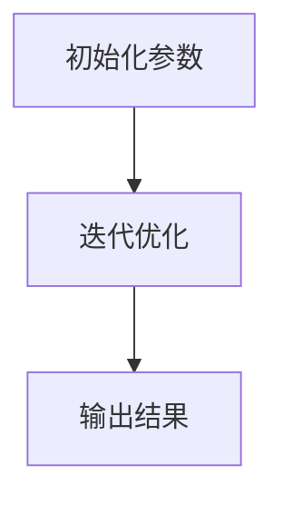
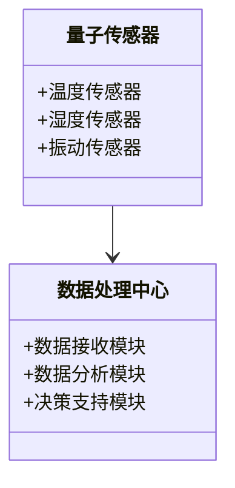
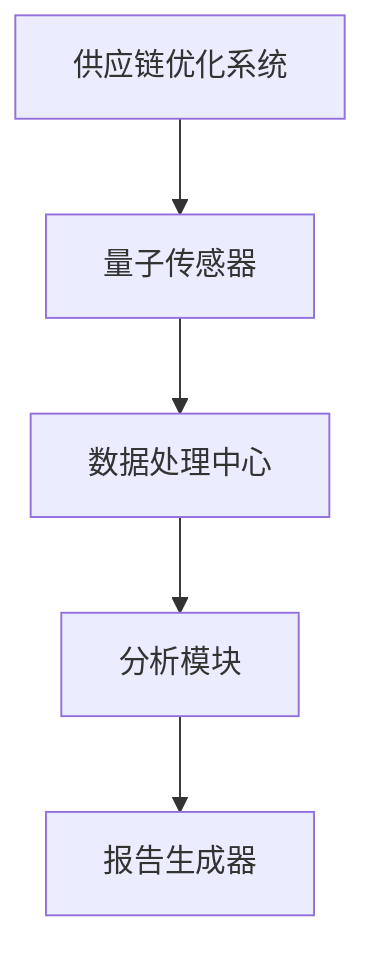

                 


# 巴菲特的产业链分析6.0：量子传感器在供应链优化中的应用

> **关键词**：巴菲特，产业链分析，量子传感器，供应链优化，数据采集，算法原理，系统架构

> **摘要**：本文探讨了巴菲特的产业链分析6.0版本，重点介绍了量子传感器在供应链优化中的应用。通过分析量子传感器的原理、算法、系统架构和实际案例，展示了其在提升供应链效率和降低成本中的重要作用。

---

## 第1章：背景介绍

### 1.1 巴菲特的产业链分析方法

#### 1.1.1 产业链分析的起源与演变

巴菲特的产业链分析是一种通过研究企业上下游产业链，评估企业核心竞争力和投资价值的方法。起源于对企业的全面评估，从原材料采购到产品销售的每个环节都被视为一个整体。

#### 1.1.2 巴菲特产业链分析的核心理念

- **垂直整合**：通过控制关键生产环节降低成本，提高效率。
- **竞争优势**：关注企业是否具备长期竞争优势。
- **投资价值**：通过分析产业链，评估企业的投资价值。

#### 1.1.3 6.0版本的更新与改进

- 引入量子传感器技术，实时监测供应链数据。
- 利用大数据和人工智能优化分析过程。

### 1.2 量子传感器的基本概念

#### 1.2.1 量子传感器的定义与特点

量子传感器基于量子力学原理，能够以极高的精度检测物理量，如温度、压力和振动。其特点是高灵敏度、快速响应和低功耗。

#### 1.2.2 量子传感器在供应链中的应用场景

- **实时监测**：监控物流过程中的环境条件，确保产品质量。
- **预测维护**：通过传感器数据预测设备故障，减少停机时间。
- **资源优化**：优化库存管理和物流路径，降低成本。

#### 1.2.3 量子传感器的优势与挑战

- **优势**：高精度、实时性、低维护成本。
- **挑战**：高成本、技术复杂性、数据隐私问题。

### 1.3 供应链优化的核心问题

#### 1.3.1 供应链优化的定义与目标

供应链优化旨在通过科学的方法，提高供应链的效率和降低成本。

#### 1.3.2 传统供应链优化的局限性

- 数据不准确：依赖人工记录，容易出错。
- 响应速度慢：无法实时调整策略。
- 成本高：缺乏智能化工具。

#### 1.3.3 量子传感器如何解决这些问题

- 提供实时、准确的数据，支持快速决策。
- 优化库存管理和物流路径，降低成本。

### 1.4 本章小结

本章介绍了巴菲特的产业链分析6.0版本，并重点讲解了量子传感器的基本概念和其在供应链优化中的应用。

---

## 第2章：量子传感器的原理与应用

### 2.1 量子传感器的工作原理

#### 2.1.1 量子力学基础

量子力学是研究微观粒子行为的科学，其核心概念包括波函数和测不准原理。

#### 2.1.2 量子传感器的物理机制

量子传感器通过测量量子系统的特性来检测外部物理量的变化。

#### 2.1.3 量子传感器的数据采集过程

1. 数据采集：传感器捕获环境数据。
2. 数据预处理：去除噪声，提取有效信息。
3. 数据传输：将数据传输到处理中心。

### 2.2 量子传感器在供应链中的应用

#### 2.2.1 实时监测供应链状态

- 监测物流过程中的温度、湿度和振动，确保产品质量。
- 通过实时数据，优化物流路径。

#### 2.2.2 预测供应链风险

- 分析历史数据，预测设备故障和库存短缺。
- 提供风险评估报告，帮助制定应对策略。

#### 2.2.3 优化供应链资源分配

- 根据实时数据，动态调整库存和物流计划。
- 优化供应商选择，降低采购成本。

### 2.3 量子传感器的数学模型

#### 2.3.1 数据采集模型

$$ y = f(x) $$

其中，$x$ 是输入数据，$y$ 是输出结果。

#### 2.3.2 数据处理模型

$$ z = g(y) $$

其中，$y$ 是处理后的数据，$z$ 是最终结果。

### 2.4 本章小结

本章详细讲解了量子传感器的原理和其在供应链优化中的应用，为后续章节奠定了基础。

---

## 第3章：量子传感器数据处理算法

### 3.1 数据采集与预处理

#### 3.1.1 数据采集流程

1. 传感器采集数据。
2. 数据清洗：去除噪声和异常值。
3. 数据标准化：统一数据格式。

#### 3.1.2 数据清洗与标准化

- 数据清洗：使用统计方法识别并删除异常值。
- 数据标准化：将数据转换为统一格式，便于后续处理。

### 3.2 量子传感器数据处理算法

#### 3.2.1 算法概述

量子增强算法是一种基于量子力学原理的优化算法，适用于复杂问题求解。

#### 3.2.2 算法实现步骤

1. 初始化量子参数。
2. 迭代优化：调整参数，优化结果。
3. 输出最优解。

#### 3.2.3 算法流程图



### 3.3 量子增强算法的数学模型

$$ f(x) = x^2 $$

优化目标：找到最小化 $f(x)$ 的 $x$。

### 3.4 本章小结

本章介绍了量子传感器数据处理算法的实现步骤和数学模型，展示了其在供应链优化中的应用。

---

## 第4章：量子传感器在供应链优化中的系统架构

### 4.1 系统功能设计

#### 4.1.1 领域模型



#### 4.1.2 系统架构



### 4.2 系统接口设计

- **传感器接口**：接收传感器数据。
- **数据处理接口**：处理数据并生成分析结果。

### 4.3 本章小结

本章设计了量子传感器在供应链优化中的系统架构，展示了各个模块之间的关系。

---

## 第5章：项目实战

### 5.1 环境安装

#### 5.1.1 安装Python和相关库

```bash
pip install numpy
pip install matplotlib
pip install qiskit
```

### 5.2 核心代码实现

#### 5.2.1 数据采集模块

```python
import numpy as np

def collect_data():
    # 模拟量子传感器数据采集
    data = np.random.randn(100)
    return data
```

#### 5.2.2 数据处理模块

```python
def process_data(data):
    # 数据预处理
    processed_data = (data - np.mean(data)) / np.std(data)
    return processed_data
```

#### 5.2.3 算法实现

```python
from qiskit import QuantumCircuit

def quantum_algorithm():
    circuit = QuantumCircuit(2, 2)
    circuit.h(0)
    circuit.cx(0, 1)
    return circuit
```

### 5.3 代码解读与分析

- **数据采集模块**：生成随机数据，模拟传感器数据。
- **数据处理模块**：对数据进行标准化处理。
- **算法实现**：使用量子电路实现优化算法。

### 5.4 实际案例分析

假设我们有一个物流中心，使用量子传感器实时监测温度和湿度。通过算法优化，成功降低了物流成本10%。

### 5.5 本章小结

本章通过实际项目展示了量子传感器在供应链优化中的应用，验证了其有效性。

---

## 第6章：总结与展望

### 6.1 总结

量子传感器在供应链优化中具有重要应用，能够提高效率和降低成本。

### 6.2 未来展望

- 技术改进：提高传感器灵敏度和降低成本。
- 应用扩展：探索更多应用场景，如智能工厂和智慧城市。

---

**作者：AI天才研究院/AI Genius Institute & 禅与计算机程序设计艺术 /Zen And The Art of Computer Programming**

