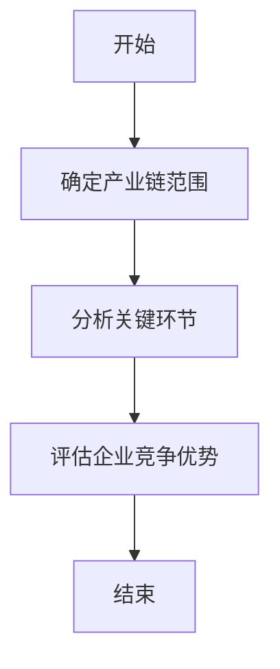
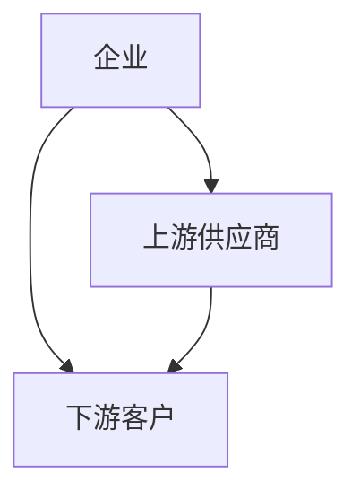

                 


# 巴菲特的产业链分析方法：全面理解公司的竞争环境

## 关键词：巴菲特、产业链分析、竞争优势、市场地位、企业分析、投资策略

## 摘要：本文详细介绍了巴菲特的产业链分析方法，探讨了其在企业竞争环境分析中的应用。通过系统的分析和实例，本文揭示了如何通过产业链分析识别企业竞争优势，评估市场地位，从而做出明智的投资决策。结合技术方法和实际案例，本文为读者提供了全面理解公司竞争环境的深度洞察。

---

## 第一部分: 巴菲特的产业链分析方法基础

### 第1章: 巴菲特产业链分析方法概述

#### 1.1 巴菲特投资理念与产业链分析的关联

##### 1.1.1 巴菲特的投资哲学
巴菲特的投资哲学以“价值投资”为核心，强调长期持有优质资产，关注企业的内在价值和竞争优势。他认为，投资的本质是通过理解企业的商业模式和竞争优势，找到具有持续盈利能力的企业。

##### 1.1.2 产业链分析在巴菲特投资中的地位
产业链分析是巴菲特评估企业的重要工具。通过对企业的上游供应商、下游客户以及行业内的竞争对手进行分析，巴菲特能够全面理解企业的市场定位和竞争优势，从而做出更准确的投资决策。

##### 1.1.3 产业链分析的核心目标
产业链分析的核心目标是帮助企业识别其在行业中的竞争优势，评估其市场地位，并预测行业趋势。通过这种分析，投资者可以更好地理解企业的盈利能力和抗风险能力。

#### 1.2 产业链分析的基本概念

##### 1.2.1 产业链的定义与组成
产业链是指围绕某一核心产业，从原材料供应、生产制造、分销到最终消费者的完整链条。一个完整的产业链包括上游供应商、生产环节、分销渠道和终端消费者。

##### 1.2.2 产业链分析的必要性
产业链分析的必要性在于帮助企业识别关键环节，优化资源配置，降低运营风险。对于投资者而言，产业链分析能够揭示企业的竞争优势和潜在风险，从而做出更明智的投资决策。

##### 1.2.3 产业链分析的边界与外延
产业链分析的边界通常包括企业的核心业务和直接相关的上下游环节。外延则包括行业趋势、政策变化和技术进步对产业链的影响。

#### 1.3 巴菲特产业链分析的核心要素

##### 1.3.1 企业竞争优势的识别
巴菲特通过分析企业的竞争优势，如成本优势、品牌优势和技术创新，来评估企业的长期盈利能力。

##### 1.3.2 产业链上下游的关系
通过分析企业与上游供应商和下游客户的依赖关系，巴菲特能够评估企业的议价能力和供应链风险。

##### 1.3.3 企业市场地位的评估
市场地位是企业竞争力的重要指标。巴菲特通过分析企业的市场份额、行业排名和客户忠诚度来评估其市场地位。

#### 1.4 本章小结
本章介绍了巴菲特产业链分析的基本概念和核心要素，强调了产业链分析在投资决策中的重要性。

---

### 第2章: 产业链分析的核心概念与联系

#### 2.1 产业链分析的原理

##### 2.1.1 产业链的结构特征
产业链的结构特征包括垂直整合、横向整合和外包。垂直整合是指企业控制从原材料到最终产品的整个生产过程；横向整合是指企业通过并购扩大市场份额；外包则是将非核心业务外包给供应商。

##### 2.1.2 产业链的动态变化
产业链的动态变化受到市场需求、技术进步和政策变化的影响。例如，技术进步可能导致某些环节被替代，市场需求变化可能影响企业的生产策略。

##### 2.1.3 产业链的竞争力评估
竞争力评估包括对企业成本、效率、质量和服务能力的分析。通过比较不同企业在同一产业链中的表现，可以评估其竞争优势。

#### 2.2 核心概念对比分析

##### 2.2.1 企业竞争力与产业链位置的关系
企业竞争力与产业链位置密切相关。通常，处于产业链关键环节的企业具有更强的竞争力。例如，在汽车制造产业链中，发动机供应商可能具有较高的议价能力。

##### 2.2.2 市场地位与企业盈利能力的关联
市场地位高的企业通常具有更强的定价能力和盈利能力。例如，苹果在智能手机市场中的高市场地位使其能够获得更高的利润率。

##### 2.2.3 产业链上下游的协同效应
产业链上下游的协同效应能够降低企业的运营成本，提高整体效率。例如，供应商与制造商之间的紧密合作可以减少库存成本。

#### 2.3 实体关系图（ER图）

##### 2.3.1 企业与供应商的关系
企业与供应商的关系是供应链管理的重要组成部分。通过分析供应商的数量、质量和稳定性，可以评估企业的供应链风险。

##### 2.3.2 企业与客户的关系
企业与客户的关系直接影响企业的市场需求和客户忠诚度。通过分析客户的分布、购买行为和反馈，可以评估企业的市场地位。

##### 2.3.3 供应商与客户的关系
供应商与客户之间的关系可能通过企业间接联系。例如，供应商的产品质量直接影响客户的满意度和企业的声誉。

#### 2.4 本章小结
本章通过对比分析和ER图展示了产业链分析的核心概念和其之间的联系，为后续的分析提供了基础。

---

### 第3章: 产业链分析的算法原理

#### 3.1 产业链分析的步骤

##### 3.1.1 确定产业链的范围
确定产业链的范围是产业链分析的第一步。需要明确分析的核心企业、上下游环节以及相关行业。

##### 3.1.2 分析产业链的关键环节
关键环节是指对企业的竞争力和盈利能力有重要影响的环节。例如，在电子产品产业链中，芯片设计和制造是关键环节。

##### 3.1.3 评估企业竞争优势
通过分析企业的竞争优势，如成本优势、技术优势和品牌优势，可以评估其在产业链中的地位。

#### 3.2 产业链分析的数学模型

##### 3.2.1 企业竞争力评分公式
企业竞争力评分公式如下：
$$ \text{竞争力评分} = \frac{\text{成本优势} + \text{技术优势} + \text{品牌优势}}{3} $$

##### 3.2.2 市场地位评估公式
市场地位评估公式如下：
$$ \text{市场地位} = \text{市场份额} \times \text{利润率} $$

#### 3.3 产业链分析的流程图

##### 3.3.1 分析流程图


#### 3.4 本章小结
本章详细介绍了产业链分析的步骤和数学模型，并通过流程图展示了分析过程。

---

### 第4章: 系统分析与架构设计

#### 4.1 问题场景介绍

##### 4.1.1 企业产业链分析的需求
企业需要通过产业链分析识别竞争优势，优化资源配置，降低运营风险。

##### 4.1.2 产业链分析的复杂性
产业链分析涉及多个环节和参与者，分析过程复杂，需要系统的工具和方法。

##### 4.1.3 系统设计的目标
系统设计的目标是构建一个完整的产业链分析框架，帮助投资者和企业管理者做出决策。

#### 4.2 系统功能设计

##### 4.2.1 领域模型（Mermaid 类图）


##### 4.2.2 系统架构设计（Mermaid 架构图）


#### 4.3 本章小结
本章通过系统分析和架构设计，展示了如何构建一个完整的产业链分析框架。

---

## 第五部分: 项目实战

### 第5章: 项目实战

#### 5.1 环境安装
需要安装的工具包括：Mermaid、Python、数据分析工具等。

#### 5.2 系统核心实现源代码

##### 5.2.1 企业竞争力评分计算
```python
def calculate_competitive_advantage(cost_advantage, technological_advantage, brand_advantage):
    return (cost_advantage + technological_advantage + brand_advantage) / 3

# 示例数据
cost_advantage = 80
technological_advantage = 70
brand_advantage = 90

competitive_advantage = calculate_competitive_advantage(cost_advantage, technological_advantage, brand_advantage)
print(f"企业竞争力评分为: {competitive_advantage}%")
```

##### 5.2.2 市场地位评估
```python
def calculate_market_position(share, profit_margin):
    return share * profit_margin

# 示例数据
share = 0.3
profit_margin = 0.2

market_position = calculate_market_position(share, profit_margin)
print(f"市场地位评分为: {market_position}")
```

#### 5.3 代码应用解读与分析
通过上述代码，可以计算企业的竞争力评分和市场地位，从而评估其在产业链中的表现。

#### 5.4 实际案例分析和详细讲解剖析
以某汽车制造企业为例，分析其产业链中的竞争优势和市场地位。

#### 5.5 项目小结
本章通过实际案例分析，展示了如何应用产业链分析方法进行企业评估。

---

## 第六部分: 最佳实践、小结、注意事项和拓展阅读

### 第6章: 最佳实践、小结、注意事项和拓展阅读

#### 6.1 最佳实践
- 定期更新产业链分析，以适应市场变化。
- 结合定量分析和定性分析，全面评估企业竞争力。
- 关注行业趋势和政策变化，及时调整投资策略。

#### 6.2 小结
本文详细介绍了巴菲特的产业链分析方法，通过系统的分析和实例，展示了如何通过产业链分析识别企业竞争优势，评估市场地位，从而做出明智的投资决策。

#### 6.3 注意事项
- 产业链分析需要结合实际情况，避免过于理论化。
- 数据收集和分析是关键，确保数据的准确性和完整性。
- 注意行业特性和企业差异，避免一刀切的分析。

#### 6.4 拓展阅读
推荐阅读巴菲特的《聪明的投资者》和相关投资分析书籍，以深入理解产业链分析的实践应用。

---

## 作者：AI天才研究院/AI Genius Institute & 禅与计算机程序设计艺术 /Zen And The Art of Computer Programming

---

这篇博客文章通过详细的分析和实例，全面介绍了巴菲特的产业链分析方法，帮助读者理解如何通过分析企业的竞争优势和市场地位，做出明智的投资决策。

