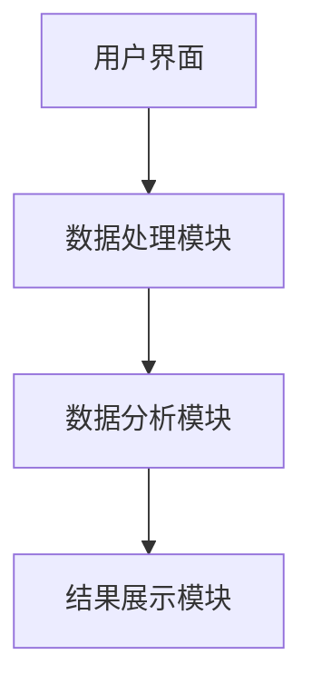

                 


# 《巴菲特的价值投资再思考：数字时代的适应与创新》

## 第一部分：引言

### 第1章：巴菲特价值投资的背景与核心理念
#### 1.1 巴菲特的背景与投资哲学
- 1.1.1 巴菲特的生平简介
- 1.1.2 价值投资的核心理念
- 1.1.3 巴菲特的投资策略与风格

#### 1.2 数字时代对价值投资的影响
- 1.2.1 数字技术的发展与投资环境的变化
- 1.2.2 传统价值投资在数字时代的挑战
- 1.2.3 数字时代下价值投资的创新方向

## 第二部分：价值投资的核心概念与数学模型

### 第2章：价值投资的核心概念
#### 2.1 价值投资的基本概念
- 2.1.1 安全边际的定义与计算
- 2.1.2 内在价值的评估方法
- 2.1.3 市场先生的概念与投资机会

#### 2.2 数字时代下的价值评估模型
- 2.2.1 传统DCF模型的局限性
- 2.2.2 基于大数据的改进模型
- 2.2.3 人工智能在价值评估中的应用

### 第3章：数学模型与算法分析
#### 3.1 常用的价值评估算法
- 3.1.1 DCF模型的数学公式
  $$DCF = \frac{CF}{(r - g)}$$
- 3.1.2 市盈率与市净率的计算方法
  - 市盈率：P/E = 市价/每股收益
  - 市净率：P/B = 市价/每股净资产

#### 3.2 人工智能在价值评估中的应用
- 3.2.1 机器学习模型的构建与训练
- 3.2.2 自然语言处理在新闻分析中的应用
- 3.2.3 算法交易的数学模型与实现

## 第三部分：数字技术对投资决策的影响

### 第4章：大数据与人工智能在投资中的应用
#### 4.1 大数据在投资中的应用
- 4.1.1 数据的收集与处理
- 4.1.2 数据分析的工具与方法
- 4.1.3 数据可视化与决策支持

#### 4.2 人工智能在投资中的应用
- 4.2.1 机器学习在预测中的作用
- 4.2.2 自然语言处理在新闻分析中的应用
- 4.2.3 AI在风险控制中的应用

### 第5章：系统架构与技术实现
#### 5.1 投资分析系统的架构设计
- 5.1.1 系统功能模块划分
- 5.1.2 系统架构的mermaid图



#### 5.2 算法实现与代码示例
- 5.2.1 基于机器学习的预测模型
  ```python
  import numpy as np
  import pandas as pd
  from sklearn.linear_model import LinearRegression

  # 数据预处理
  data = pd.read_csv('data.csv')
  X = data[['feature1', 'feature2']]
  y = data['target']
  
  # 模型训练
  model = LinearRegression()
  model.fit(X, y)
  
  # 预测
  predictions = model.predict(X)
  ```

## 第四部分：创新与适应

### 第6章：投资策略的数字化转型
#### 6.1 传统策略的数字化重构
- 6.1.1 股票筛选的自动化
- 6.1.2 投资组合优化的算法化
- 6.1.3 风险管理的智能化

#### 6.2 数字时代下的创新思维
- 6.2.1 创新与传统价值投资的结合
- 6.2.2 数字化工具的创新使用
- 6.2.3 创新中的风险管理与伦理

## 第五部分：案例分析与实战

### 第7章：数字时代下的投资案例
#### 7.1 成功案例分析
- 7.1.1 AI驱动的量化投资案例
- 7.1.2 大数据驱动的行业分析案例
- 7.1.3 数字化风险管理的成功实践

#### 7.2 失败案例与教训
- 7.2.1 技术依赖导致的决策失误
- 7.2.2 过度创新的风险
- 7.2.3 数字化转型中的常见误区

## 第六部分：未来展望与总结

### 第8章：未来展望与总结
#### 8.1 数字技术的未来发展趋势
- 8.1.1 人工智能的进一步发展
- 8.1.2 大数据技术的深化应用
- 8.1.3 区块链等新兴技术对投资的影响

#### 8.2 价值投资的未来方向
- 8.2.1 继续创新与适应
- 8.2.2 加强技术驱动的决策能力
- 8.2.3 提升风险管理的智能化水平

---

## 作者：AI天才研究院 & 禅与计算机程序设计艺术

---

### 总结：
本书从传统价值投资的基本原理出发，结合数字时代的技术变革，详细探讨了如何将大数据和人工智能等技术融入投资决策中。通过系统的理论分析、数学模型的建立、实际案例的分析以及未来趋势的展望，为投资者提供了在数字时代下如何进行价值投资的深刻见解和实用方法。

