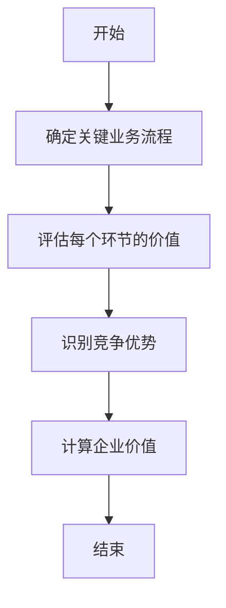
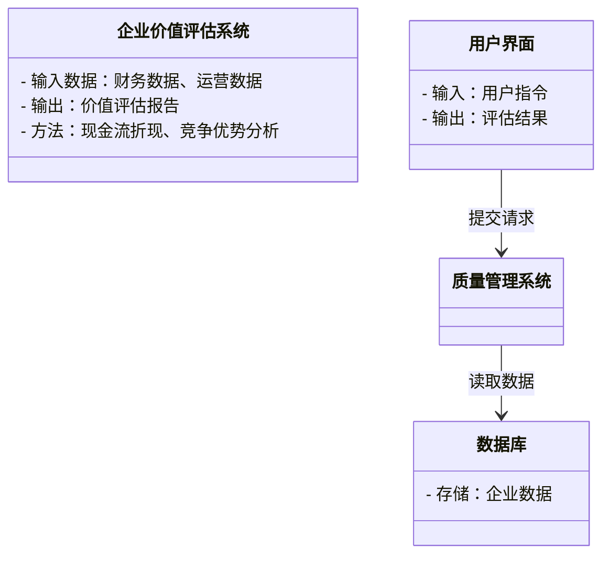

                 


# 巴菲特的价值链分析：数字化转型中的价值重构

## 关键词
- 巴菲特，价值链分析，企业价值，数字化转型，投资策略，竞争优势，现金流

## 摘要
本文详细探讨了巴菲特的价值链分析方法及其在数字化转型中的应用。通过分析企业的各个价值环节，结合数字化技术，重构企业价值，为企业在数字化时代提供新的价值评估和管理策略。文章从背景、核心概念、算法原理、系统架构到实际案例，全面解析了如何在数字化转型中利用巴菲特的分析方法进行价值重构。

## 第一部分：背景介绍

### 第1章：巴菲特的价值链分析概述

#### 1.1 问题背景
- 投资者在数字化转型中面临企业价值评估的新挑战，传统方法难以适应数据驱动的决策需求。
- 企业价值重构的需求日益迫切，数字化转型改变了企业的运作模式和价值创造方式。

#### 1.2 问题描述
- 数字化转型如何影响企业价值评估？
- 如何利用巴菲特的价值链分析方法在数字化环境中重构企业价值？

#### 1.3 问题解决
- 引入巴菲特的价值链分析，结合数字化技术，重构企业价值模型。
- 利用大数据和机器学习优化价值评估过程。

#### 1.4 边界与外延
- 价值链分析的适用范围：适用于所有行业，但特别适用于数据驱动型企业。
- 数字化转型的边界：涵盖从运营到战略的所有层面。

#### 1.5 概念结构与核心要素
- 核心要素：现金流、竞争优势、可持续发展。
- 分析框架：价值链分析、数字技术应用、企业价值重构。

## 第二部分：核心概念与联系

### 第2章：巴菲特的价值链分析原理

#### 2.1 核心概念
- 企业价值：现金流的现值，考虑时间价值和风险因素。
- 价值链分析：识别关键业务流程和竞争优势，优化资源配置。

#### 2.2 核心概念对比
| 方法       | 传统方法                          | 数字化方法                          |
|------------|-----------------------------------|------------------------------------|
| 数据来源    | 财务报表                          | 结构化数据、非结构化数据            |
| 分析工具    | 财务指标分析                      | 大数据分析、机器学习                |
| 输出        | 财务价值评估                      | 数据驱动的预测模型                  |

#### 2.3 实体关系图
```mermaid
erDiagram
    customer[客户] {
        id: integer
        name: string
        transaction: integer
    }
    product[产品] {
        id: integer
        name: string
        cost: float
    }
    transaction[交易] {
        id: integer
        date: date
        amount: float
    }
    customer--|>transaction: 进行
    product-->transaction: 涉及
```

## 第三部分：算法原理讲解

### 第3章：巴菲特分析的数学模型

#### 3.1 算法流程图


#### 3.2 核心算法代码
```python
def calculate_intrinsic_value(enterprise):
    # 计算现金流
    free_cash_flow = enterprise.revenue - enterprise.cost - enterprise.tax
    # 折现率
    discount_rate = enterprise.wacc
    # 永续年金现值
    terminal_value = free_cash_flow / (discount_rate - enterprise.growth_rate)
    # 企业价值
    intrinsic_value = (free_cash_flow + terminal_value) / (1 + discount_rate)
    return intrinsic_value
```

#### 3.3 数学模型
- 企业价值公式：
  $$ \text{企业价值} = \frac{\text{现金流} + \text{终值}}{1 + \text{折现率}} $$
- 现金流折现法：
  $$ \text{现金流现值} = \sum_{t=1}^{n} \frac{\text{现金流}_t}{(1 + r)^t} $$

## 第四部分：系统分析与架构设计

### 第4章：数字化转型系统设计

#### 4.1 问题场景
- 数字化转型中，企业需要实时评估价值，快速响应市场变化。

#### 4.2 系统功能设计


#### 4.3 系统架构设计


## 第五部分：项目实战

### 第5章：案例分析与实现

#### 5.1 项目环境
- 技术栈：Python、机器学习库、数据库

#### 5.2 核心代码实现
```python
def evaluate_competitive_advantage(company_data):
    # 数据清洗
    company_data = company_data.dropna()
    # 计算ROE
    company_data['ROE'] = company_data['净利润'] / company_data['股东权益']
    # 竞争优势识别
    industry_median = company_data['ROE'].median()
    company_data['竞争优势'] = company_data['ROE'] > industry_median
    return company_data
```

#### 5.3 代码解读
- 数据清洗：处理缺失值，确保数据完整性。
- ROE计算：评估股东回报，判断盈利能力。
- 竞争优势识别：通过行业比较，确定企业的竞争优势。

#### 5.4 案例分析
- 以科技公司为例，分析其ROE是否高于行业平均水平，判断其竞争优势。

## 第六部分：最佳实践与总结

### 第6章：总结与注意事项

- 总结：通过结合巴菲特的价值链分析和数字化技术，企业可以在转型中重构价值，提升竞争力。
- 注意事项：确保数据质量，合理选择模型，持续优化算法。
- 拓展阅读：推荐书籍《巴菲特传》、《数据驱动的决策》。

## 作者
作者：AI天才研究院 & 禅与计算机程序设计艺术

