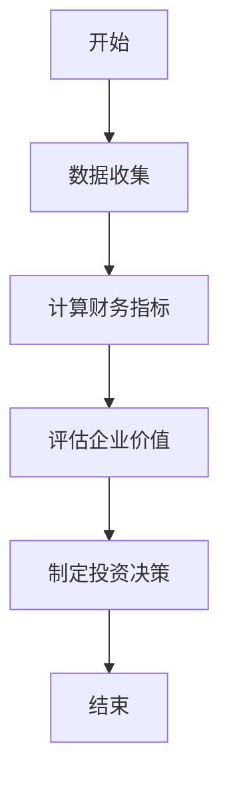
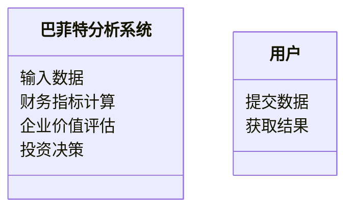
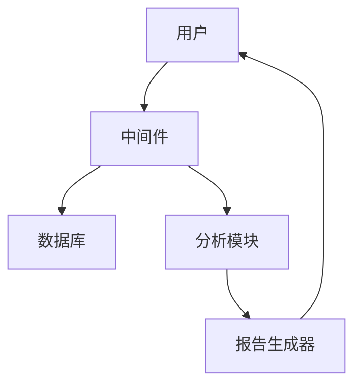
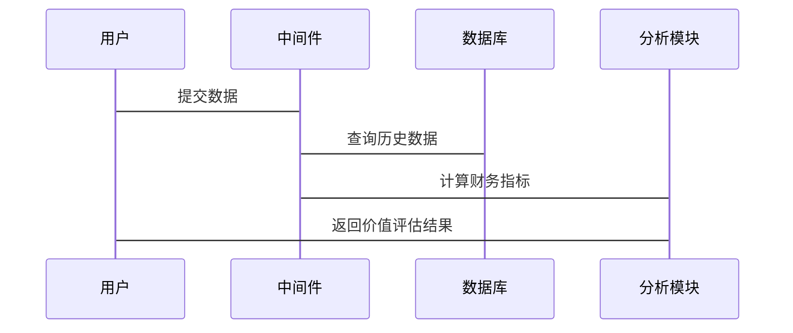

                 


# 巴菲特的价值链分析：数字平台经济下的价值创造

## 关键词：巴菲特，价值链分析，数字平台经济，价值创造，投资策略，经济模式，价值评估

## 摘要：本文深入探讨巴菲特的价值链分析方法，并将其应用于数字平台经济，分析其价值创造机制，为企业投资决策提供新视角。

---

## 第一章：背景介绍

### 1.1 巴菲特的价值观与投资理念

#### 1.1.1 巴菲特的价值观
- **长期主义**：巴菲特强调长期投资，关注企业的内在价值。
- **安全边际**：确保投资的安全性，避免重大损失。
- **简单与可预测性**：偏好简单、易懂且业绩稳定的公司。

#### 1.1.2 巴菲特的投资理念
- **价值投资**：寻找市场价低于内在价值的股票。
- **安全边际**：买入价格低于评估价值，以确保安全。
- **长期持有**：避免频繁交易，长期持有优质股票。

#### 1.1.3 巴菲特与数字平台经济
- 巴菲特对科技企业的谨慎态度。
- 数字平台经济的特点：数据驱动、平台化、网络效应。
- 数字经济对企业价值评估的影响。

### 1.2 数字平台经济的演变
- **定义**：通过数字技术构建的平台，连接供需双方，创造价值。
- **主要模式**：双边市场、广告模式、订阅服务。
- **发展趋势**：数据化、智能化、全球化。

---

## 第二章：核心概念与联系

### 2.1 巴菲特的价值链分析模型

#### 2.1.1 价值链的基本构成
- **输入**：资源、劳动力、资本。
- **过程**：生产、加工、配送。
- **输出**：产品、服务、价值。

#### 2.1.2 数字平台经济中的价值链
- **数据驱动**：数据收集、处理、分析。
- **平台连接**：用户、供应商、合作伙伴。
- **价值创造**：通过平台实现高效资源配置。

#### 2.1.3 数字平台经济的特征
- 网络效应：用户越多，平台价值越高。
- 数据资产：数据是核心资源。
- 边际成本低：平台扩展成本低。

### 2.2 巴菲特模型与数字平台经济的对比
- **传统企业**：关注成本控制、效率提升。
- **数字平台**：关注数据驱动、网络效应。
- **融合点**：数据资产的价值评估、平台生态的构建。

### 2.3 数字平台经济中的价值创造
- **案例分析**：以阿里巴巴为例，分析其价值链。
- **平台价值公式**：$$ V = D \times N \times C $$
  - D：数据量
  - N：网络效应
  - C：用户参与度

---

## 第三章：算法原理讲解

### 3.1 巴菲特分析方法的步骤

#### 3.1.1 数据收集
- 财务数据：收入、利润、现金流。
- 市场数据：行业趋势、竞争对手。

#### 3.1.2 财务指标计算
- 市盈率（P/E）：$$ P/E = \frac{股价}{每股收益} $$
- 市净率（P/B）：$$ P/B = \frac{股价}{每股净资产} $$
- 内在价值估算：使用DCF模型。

#### 3.1.3 企业价值评估
- 现金流折现模型（DCF）：$$ V = \sum_{t=1}^{n} \frac{CF_t}{(1+r)^t} $$
  - CF_t：第t年的现金流
  - r：折现率

#### 3.1.4 投资决策
- 安全边际：$$ 安全价 = V \times (1 - \alpha) $$
  - α：折扣率，根据市场情况调整。

### 3.2 巴菲特分析算法流程图



### 3.3 Python代码实现

```python
import numpy as np

def discounted_cash_flow(cash_flows, discount_rate):
    return sum(flow / (1 + discount_rate)**t for t, flow in enumerate(cash_flows))

# 示例数据
cash_flows = [100, 150, 200, 250, 300]
discount_rate = 0.08

value = discounted_cash_flow(cash_flows, discount_rate)
print(f"企业价值：{value}")
```

---

## 第四章：系统分析与架构设计

### 4.1 系统功能设计

#### 4.1.1 领域模型



#### 4.1.2 系统架构



### 4.2 接口设计

#### 4.2.1 输入接口
- REST API：接收企业数据和市场数据。

#### 4.2.2 输出接口
- 返回分析结果和投资建议。

### 4.3 交互流程图



---

## 第五章：项目实战

### 5.1 环境安装

```bash
pip install numpy pandas
```

### 5.2 核心代码实现

```python
import pandas as pd

def compute_pe_ttm(df):
    df['PE_TTM'] = df['股价'] / df['每股收益(TTM)']
    return df

# 示例数据
data = {
    '股价': [100, 120, 80],
    '每股收益(TTM)': [20, 25, 15]
}
df = pd.DataFrame(data)
df = compute_pe_ttm(df)
print(df)
```

### 5.3 案例分析

#### 5.3.1 案例：某互联网公司

- 数据分析：$$ PE = 30 $$
- 价值评估：$$ 内在价值 = 150 $$
- 投资建议：买入。

### 5.4 小结

- 实战案例展示了如何应用算法进行投资决策。
- 强调数据质量和模型选择的重要性。

---

## 第六章：最佳实践

### 6.1 小结

- 巴菲特的价值链分析在数字平台经济中具有重要应用。
- 数字平台经济的特点影响价值评估方法。

### 6.2 注意事项

- 数据质量：确保数据的准确性和完整性。
- 模型选择：根据实际情况调整模型参数。
- 风险管理：分散投资，控制风险。

### 6.3 拓展阅读

- 推荐书籍：《巴菲特致股东的信》。
- 学术论文：《数字平台经济的价值评估模型》。

---

## 附录

### 附录A：参考文献

- 巴菲特年度致股东信。
- 数字经济相关学术论文。

### 附录B：工具推荐

- 数据分析工具：Python、Excel。
- 可视化工具：Tableau、Power BI。

---

## 作者

作者：AI天才研究院/AI Genius Institute & 禅与计算机程序设计艺术/Zen And The Art of Computer Programming

