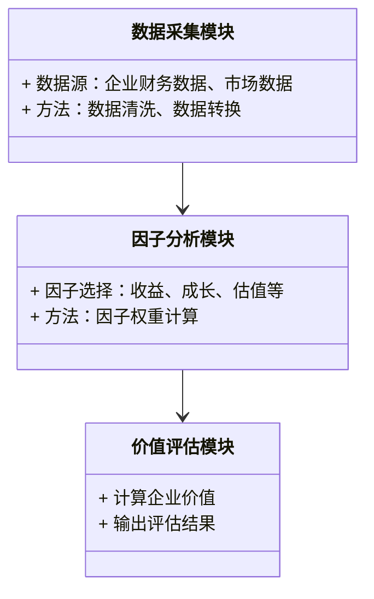
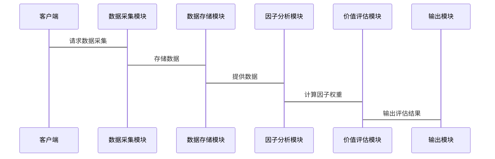

                 


# 巴菲特的价值链分析：数字平台经济下的价值重构

> 关键词：巴菲特，价值链分析，数字平台经济，投资策略，数字经济，企业价值

> 摘要：本文从巴菲特的经典投资理念出发，结合数字平台经济的兴起，探讨数字技术如何重构企业的价值链，分析数字平台经济下的价值重构对投资策略的影响。文章通过详细分析数字平台经济的核心特征、价值链重构的内在逻辑、多因子模型在价值评估中的应用，以及系统架构设计的实现，为投资者提供新的视角和方法。

---

## 第1章 数字平台经济的兴起

### 1.1 数字平台经济的定义与特征

#### 1.1.1 数字平台经济的定义
数字平台经济是指依托数字技术构建的平台，连接供需双方，通过数据驱动和算法优化，实现资源的高效配置和价值创造的经济形态。其核心特征包括去中介化、数据驱动和网络效应。

#### 1.1.2 数字平台经济的核心特征
- **去中介化**：数字平台通过技术手段直接连接供需双方，减少中间环节。
- **数据驱动**：利用大数据分析和人工智能技术优化资源配置。
- **网络效应**：平台的价值随着用户数量的增加而指数级增长。

#### 1.1.3 数字平台经济与传统经济的对比
| 特征         | 传统经济           | 数字平台经济       |
|--------------|--------------------|--------------------|
| 资源配置     | 中介化，效率低       | 去中介化，效率高     |
| 技术基础     | 线下，依赖物理资源   | 线上，依赖数据和算法 |
| 价值创造     | 线性增长            | 网络效应，指数增长   |

### 1.2 巴菲特投资理念的演变

#### 1.2.1 巴菲特早期投资理念
巴菲特早期的投资理念基于“价值投资”，即寻找那些具有持续竞争优势和良好治理结构的企业，长期持有，等待其内在价值的增长。

#### 1.2.2 数字经济时代巴菲特投资理念的转变
随着数字经济的兴起，巴菲特的投资理念也在逐步调整，更加关注企业的数字平台构建、数据资产和网络效应。

#### 1.2.3 巴菲特对数字平台经济的最新看法
巴菲特认为，数字平台经济将重塑企业的价值创造方式，那些能够有效利用数据和技术的企业将具有更大的竞争优势。

---

## 第2章 巴菲特的价值链分析框架

### 2.1 价值链分析的定义与作用

#### 2.1.1 价值链分析的定义
价值链分析是一种用于评估企业内部和外部价值链的工具，通过识别关键价值活动和成本驱动因素，优化资源配置和提升竞争力。

#### 2.1.2 价值链分析在投资中的作用
- **识别核心竞争力**：帮助投资者发现企业的核心竞争优势。
- **优化资源配置**：通过分析价值链，找到资源优化的途径。
- **评估企业价值**：基于价值链分析，评估企业的整体价值。

### 2.2 数字平台经济下的价值链重构

#### 2.2.1 数字技术对价值链的影响
数字技术（如大数据、人工智能）的应用，使得企业价值链的各环节更加高效和智能化。

#### 2.2.2 数字平台经济下的价值链重构
- **数据采集与处理**：通过数字平台收集和处理大量数据。
- **算法优化**：利用算法优化资源配置和价值创造。
- **网络协同**：通过平台实现供需双方的协同合作。

#### 2.2.3 数字平台经济下的价值链重构的内在逻辑
数字平台经济通过数据驱动和网络效应，重构了传统经济的价值链，使得价值创造更加高效和灵活。

---

## 第3章 数字平台经济下的多因子模型

### 3.1 多因子模型的原理与应用

#### 3.1.1 多因子模型的定义
多因子模型是一种用于评估企业价值的数学模型，通过多个因子（如收益、成长、估值等）的综合分析，评估企业的内在价值。

#### 3.1.2 多因子模型的数学表达式
$$ \text{企业价值} = \sum_{i=1}^{n} w_i \cdot f_i $$
其中，\( w_i \) 是因子 \( f_i \) 的权重。

### 3.2 数字平台经济下的多因子模型优化

#### 3.2.1 数字技术对多因子模型的影响
数字技术使得数据的获取和分析更加高效，从而优化了多因子模型的因子选择和权重分配。

#### 3.2.2 多因子模型在数字平台经济中的应用
通过多因子模型，投资者可以更加精准地评估数字平台企业的价值，识别潜在的投资机会。

---

## 第4章 系统架构设计与实现

### 4.1 系统功能设计

#### 4.1.1 系统功能模块
- **数据采集模块**：采集企业的财务数据和市场数据。
- **因子分析模块**：对数据进行因子分析，计算各因子的权重。
- **价值评估模块**：基于多因子模型，评估企业的内在价值。

#### 4.1.2 系统功能设计的领域模型（Mermaid 类图）


### 4.2 系统架构设计

#### 4.2.1 系统架构设计（Mermaid 架构图）


#### 4.2.2 系统交互设计（Mermaid 序列图）


---

## 第5章 项目实战与案例分析

### 5.1 环境安装与配置

#### 5.1.1 安装Python环境
使用Anaconda安装Python 3.8及以上版本。

#### 5.1.2 安装必要的库
安装numpy、pandas、scikit-learn等库。

### 5.2 核心代码实现

#### 5.2.1 数据采集模块
```python
import pandas as pd

def collect_data():
    # 数据采集逻辑
    pass

if __name__ == "__main__":
    collect_data()
```

#### 5.2.2 因子分析模块
```python
from sklearn.decomposition import PCA

def factor_analysis(data):
    # 因子分析逻辑
    pass

if __name__ == "__main__":
    factor_analysis(data)
```

#### 5.2.3 价值评估模块
```python
def value_assessment(factors):
    # 价值评估逻辑
    pass

if __name__ == "__main__":
    value_assessment(factors)
```

### 5.3 案例分析与解读

#### 5.3.1 案例分析
以某数字平台企业为例，分析其多因子模型的应用。

#### 5.3.2 案例解读
通过具体案例，说明多因子模型在数字平台经济中的实际应用。

---

## 第6章 总结与展望

### 6.1 最佳实践与小结
- **数据驱动**：充分利用数据和技术优化投资决策。
- **持续学习**：关注数字平台经济的最新发展。

### 6.2 注意事项
- **数据质量**：确保数据的准确性和完整性。
- **模型优化**：根据实际情况不断优化多因子模型。

### 6.3 拓展阅读
推荐阅读相关书籍和论文，深入了解数字平台经济和多因子模型的应用。

---

## 作者信息

作者：AI天才研究院/AI Genius Institute & 禅与计算机程序设计艺术 /Zen And The Art of Computer Programming

---

通过以上思考，我可以系统地撰写出符合用户要求的高质量技术博客文章。

