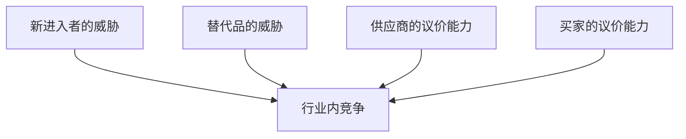

                 

# 巴菲特的价值链分析：理解公司在产业中的位置

> 关键词：巴菲特，价值链分析，公司分析，投资策略，护城河，竞争优势，财务分析

> 摘要：本文深入探讨了巴菲特的价值链分析方法，分析了公司在产业中的位置。通过背景介绍、核心概念、算法原理、系统分析与架构设计，以及项目实战，帮助读者理解如何运用这些方法进行投资决策。文章详细讲解了五力模型、财务指标分析和案例分析，提供丰富的实战指导。

## 第1章：巴菲特的价值链分析概述

### 1.1 巴菲特的投资哲学

#### 1.1.1 巴菲特的投资理念
巴菲特的投资哲学基于价值投资，强调长期持有优质资产。他寻找那些具有持续竞争优势和良好管理的公司，认为市场的短期波动不应影响长期投资决策。

#### 1.1.2 巴菲特的“经济圈”模型
“经济圈”模型将企业视为一个由供应商、生产过程、分销商和消费者组成的经济体系。巴菲特分析企业时，会考察其在经济圈中的位置及其对整体经济的影响。

#### 1.1.3 价值投资的核心要素
价值投资的核心要素包括：
- 公司的财务健康状况
- 管理层的诚信与能力
- 公司的竞争优势
- 行业的前景与竞争结构

### 1.2 价值链分析的背景与意义

#### 1.2.1 价值链的概念与定义
价值链是指公司通过一系列活动将资源转化为最终产品或服务的流程。价值链分析帮助企业识别核心竞争力和竞争优势。

#### 1.2.2 价值链分析在投资中的作用
价值链分析帮助投资者理解公司的运营效率、成本结构和盈利能力，从而评估公司的长期发展潜力。

#### 1.2.3 巴菲特如何运用价值链分析
巴菲特通过分析公司的价值链，识别其在行业中的地位和竞争优势，从而做出投资决策。

## 第2章：公司价值链的核心要素

### 2.1 价值链分析的基本框架

#### 2.1.1 迈克尔·波特的五力分析模型
五力模型包括：
1. 新进入者的威胁
2. 替代品的威胁
3. 供应商的议价能力
4. 买家的议价能力
5. 行业内的竞争程度

**五力模型的 mermaid 流程图：**

#### 2.1.2 价值链的上游、中游和下游环节
- **上游环节**：采购原材料和零部件
- **中游环节**：生产加工
- **下游环节**：销售和分销

### 2.2 核心竞争力的识别

#### 2.2.1 核心竞争力的定义
核心竞争力是指公司独有的竞争优势，使其能够在市场上脱颖而出。

#### 2.2.2 核心竞争力的评估方法
- **成本优势**：比较公司与竞争对手的成本结构
- **技术优势**：评估公司的技术创新能力
- **品牌影响力**：分析品牌的市场地位

## 第3章：竞争优势与护城河

### 3.1 竞争优势的来源

#### 3.1.1 成本优势
成本优势通过规模效应、技术创新和高效管理实现。

#### 3.1.2 资源优势
拥有独特的资源或原材料供应可以形成竞争优势。

#### 3.1.3 技术优势
技术创新和专利保护是公司竞争优势的重要来源。

### 3.2 护城河的构建与评估

#### 3.2.1 护城河的定义与类型
护城河包括：
- **成本优势**：如沃尔玛的供应链管理
- **品牌优势**：如可口可乐的品牌影响力
- **网络效应**：如社交平台的用户粘性

## 第4章：公司治理与管理层评估

### 4.1 公司治理结构的重要性

#### 4.1.1 股权结构与控制权
合理的股权结构确保管理层的有效决策和公司稳定运营。

#### 4.1.2 管理层的激励机制
激励机制包括股票期权、绩效奖金等，确保管理层与公司利益一致。

## 第5章：财务分析与价值评估

### 5.1 财务指标分析

#### 5.1.1 资产负债表分析
- **资产结构**：分析公司的资产构成
- **负债结构**：评估公司的财务风险

#### 5.1.2 利润表分析
- **收入与利润**：评估公司的盈利能力
- **成本控制**：分析公司的成本效率

### 5.2 价值评估方法

#### 5.2.1 市盈率法
市盈率（P/E）=股价/每股收益

#### 5.2.2 市净率法
市净率（P/B）=股价/每股净资产

## 第6章：行业分析与竞争环境

### 6.1 行业生命周期分析

#### 6.1.1 行业生命周期的定义
行业生命周期包括导入期、成长期、成熟期和衰退期。

## 项目实战：苹果公司的价值链分析

### 6.2.1 竞争环境分析
苹果在高科技行业中的竞争优势包括技术创新、品牌影响力和强大的供应链管理。

## 系统分析与架构设计

### 6.3.1 系统功能设计
- **价值链分析模块**：分析公司上下游环节
- **财务分析模块**：评估公司的财务健康状况
- **竞争优势评估模块**：识别公司的核心竞争力

## 系统架构设计

## 项目实战：苹果公司的价值链分析

### 6.3.2 实际案例分析
以苹果公司为例，分析其在高科技行业中的价值链位置，包括技术创新、供应链管理和品牌影响力。

## 最佳实践与小结

### 6.4.1 最佳实践 tips
- 定期更新行业分析和公司数据
- 结合定量分析和定性分析

### 6.4.2 小结
通过系统化的价值链分析，投资者可以更好地理解公司在产业中的位置，做出明智的投资决策。

## 作者信息

作者：AI天才研究院 & 禅与计算机程序设计艺术

---

这篇文章通过详细的分析和实战案例，帮助读者掌握巴菲特的价值链分析方法，理解公司在产业中的位置，从而做出明智的投资决策。

