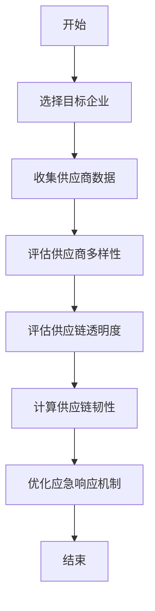
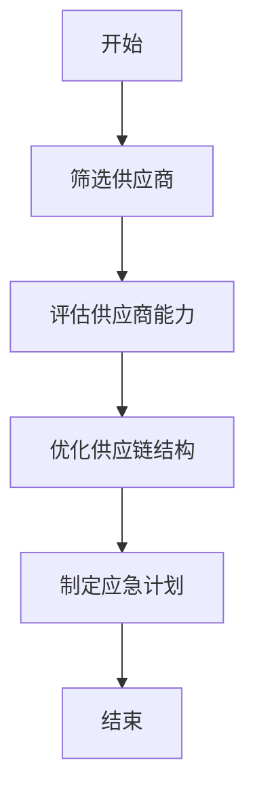
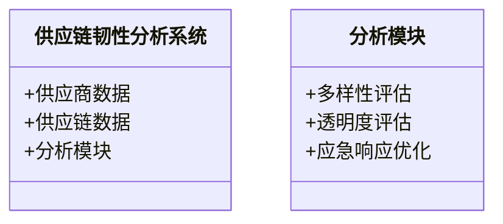
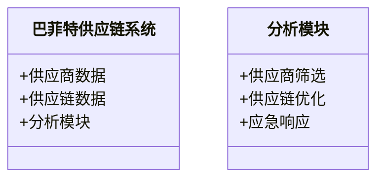

                 


# 巴菲特的供应链韧性分析：全球化挑战下的应对之策

> 关键词：供应链韧性，巴菲特，全球化挑战，供应链管理，供应链优化

> 摘要：本文深入分析了巴菲特在供应链管理中的独特策略，探讨了全球化挑战下供应链韧性的关键因素。通过系统分析和案例研究，本文揭示了巴菲特如何通过优化供应链结构和增强韧性应对全球化带来的挑战，并为企业提供了实用的应对策略。

---

# 第1章: 巴菲特供应链韧性分析的背景与核心概念

## 1.1 供应链韧性的重要性

### 1.1.1 供应链韧性定义
供应链韧性是指供应链在面对突发事件、市场波动或其他不确定性时，能够维持或迅速恢复运营的能力。它是供应链设计中的关键要素，直接影响企业的抗风险能力和长期竞争力。

### 1.1.2 供应链韧性与企业竞争力的关系
供应链韧性是企业竞争力的重要组成部分。一个具有韧性的供应链能够在市场波动、原材料短缺或物流中断时，快速调整策略，确保企业业务的持续性。

### 1.1.3 巴菲特供应链韧性分析的背景
巴菲特作为全球著名投资者，其投资策略和供应链管理方式备受关注。在全球化背景下，供应链韧性对于企业应对不确定性至关重要，因此对巴菲特的供应链韧性分析具有现实意义。

## 1.2 巴菲特投资策略的核心特点

### 1.2.1 巴菲特投资理念概述
巴菲特的投资理念以长期价值投资为核心，注重企业基本面分析和长期盈利能力。他倾向于投资那些具有强大护城河、良好管理和稳定现金流的企业。

### 1.2.2 巴菲特供应链管理的独特性
巴菲特的投资策略与供应链管理密切相关。他倾向于投资那些供应链稳定、供应商可靠且具有成本优势的企业，以确保投资的长期回报。

### 1.2.3 巴菲特供应链韧性分析的意义
通过分析巴菲特的供应链管理策略，我们可以总结出一套在不确定性和全球化挑战下增强供应链韧性的方法，为企业提供可借鉴的经验。

## 1.3 供应链韧性分析的框架与方法

### 1.3.1 供应链韧性分析的核心要素
供应链韧性分析的核心要素包括供应链的多样性、灵活性、冗余性和透明度。这些要素共同决定了供应链在面对突发事件时的应对能力。

### 1.3.2 巴菲特供应链韧性分析的框架
1. **供应商多元化**：巴菲特倾向于选择多个供应商，以减少对单一供应商的依赖。
2. **供应链透明度**：通过了解供应商的生产能力和财务状况，确保供应链的稳定性。
3. **库存管理**：通过优化库存水平，降低供应链中断的风险。
4. **应急响应机制**：建立快速响应机制，应对突发事件。

### 1.3.3 分析方法与工具
1. **SWOT分析**：评估供应链的优势、劣势、机会和威胁。
2. **风险评估矩阵**：识别供应链中的潜在风险并制定应对策略。
3. **情景分析**：模拟不同情景下的供应链表现，制定应对方案。

## 1.4 巴菲特供应链韧性分析的案例

### 1.4.1 巴菲特的经典投资案例分析
以巴菲特投资可口可乐为例，分析其供应链管理策略。可口可乐的供应链高度全球化，通过与多家供应商合作，确保原材料供应的稳定性。

### 1.4.2 供应链韧性在案例中的体现
在可口可乐的案例中，供应链的多元化和全球化布局使得公司在面对原材料价格上涨或物流中断时，能够迅速调整供应商，确保生产不受影响。

### 1.4.3 案例对供应链韧性分析的启示
通过分析巴菲特的经典投资案例，我们可以总结出供应链韧性分析的关键点：供应商多元化、供应链透明度和应急响应机制。

## 1.5 本章小结
本章介绍了供应链韧性的定义和重要性，分析了巴菲特投资策略的核心特点，并提出了供应链韧性分析的框架和方法。通过经典案例分析，揭示了供应链韧性在巴菲特投资策略中的重要性。

---

# 第2章: 供应链韧性分析的核心概念与联系

## 2.1 供应链韧性分析的核心原理

### 2.1.1 供应链韧性的构成要素
1. **多样性**：通过多元化供应商降低风险。
2. **灵活性**：能够快速调整供应链策略以应对变化。
3. **冗余性**：在关键环节设置备份，确保供应链的连续性。
4. **透明度**：实时监控供应链各环节，提高信息透明度。

### 2.1.2 巴菲特供应链韧性分析的理论基础
巴菲特的供应链韧性分析基于长期价值投资理念，注重企业供应链的稳定性和可持续性。他倾向于投资那些具有强大供应链能力的企业，以确保投资的长期回报。

### 2.1.3 核心概念的数学模型
供应链韧性可以通过以下数学模型进行评估：
$$
\text{供应链韧性} = \frac{\text{供应链的多样性} + \text{供应链的灵活性} + \text{供应链的冗余性}}{3}
$$

## 2.2 核心概念的属性特征对比

### 2.2.1 供应链韧性与成本效率的对比
| 属性 | 供应链韧性 | 成本效率 |
|------|------------|----------|
| 目标 | 应对不确定性 | 降低成本 |
| 重点 | 多样性、灵活性 | 规模效应、成本优化 |
| 优缺点 | 高成本、复杂性 | 低成本、简单性 |

### 2.2.2 巴菲特供应链韧性分析的特征
1. **长期视角**：注重供应链的长期稳定性和可持续性。
2. **供应商管理**：通过多元化供应商和严格筛选，确保供应链的可靠性。
3. **应急机制**：建立快速响应机制，应对突发事件。

### 2.2.3 对比分析的表格展示
通过对比分析，可以看出供应链韧性与成本效率在目标、重点和优缺点上的差异。

## 2.3 ER实体关系图架构

### 2.3.1 供应链韧性分析的实体关系
```mermaid
erDiagram
    actor 投资者{}{
        id
        name
        investment_strategy
    }
    actor 供应商{}{
        id
        name
        capability
    }
    actor 制造商{}{
        id
        name
        production_capacity
    }
    entity 供应链{}{
        id
        supplier_id
        manufacturer_id
        product_id
        production_plan
        delivery_schedule
    }
    entity 供应链韧性{}{
        id
        supplier_diversity
        supply_chain_transparency
        inventory_management
       应急响应机制
    }
```

## 2.4 本章小结
本章通过核心概念的分析，揭示了供应链韧性的构成要素和与成本效率的对比。通过ER实体关系图，展示了供应链韧性分析的实体关系，为后续的分析提供了基础。

---

# 第3章: 巴菲特供应链韧性分析的算法原理

## 3.1 算法原理概述

### 3.1.1 供应链韧性分析的基本算法
供应链韧性分析的基本算法包括：
1. **供应商多样性评估**：通过评估供应商的多样性和稳定性，计算供应链的韧性。
2. **应急响应机制优化**：通过模拟不同情景，优化应急响应机制。
3. **成本与风险平衡**：在确保供应链韧性的同时，优化成本。

### 3.1.2 巴菲特供应链韧性分析的优化算法
基于长期价值投资理念，巴菲特的供应链韧性分析算法包括：
1. **供应商筛选**：通过严格筛选供应商，确保其可靠性和稳定性。
2. **供应链透明度提升**：通过实时监控和数据分析，提高供应链的透明度。
3. **应急响应机制优化**：通过情景模拟和优化算法，制定最优应急策略。

### 3.1.3 算法的数学模型
供应链韧性分析的数学模型如下：
$$
\text{供应链韧性} = \sum_{i=1}^{n} \frac{\text{供应商多样性}}{n}
$$
其中，n为供应商数量。

## 3.2 算法流程图

### 3.2.1 供应链韧性分析的流程图


### 3.2.2 巴菲特供应链韧性分析的流程图


### 3.2.3 流程图的详细说明
通过流程图，我们可以清晰地看到供应链韧性分析的步骤和流程，为实际操作提供了指导。

## 3.3 算法的Python实现

### 3.3.1 算法实现的代码框架
```python
def supply_chain_resilience(suppliers):
    diversity_score = calculate_diversity(suppliers)
    transparency_score = calculate_transparency(suppliers)
    return (diversity_score + transparency_score) / 2
```

### 3.3.2 巴菲特供应链韧性分析的代码实现
```python
def calculate_diversity(suppliers):
    return len(set(suppliers)) / len(suppliers)

def calculate_transparency(suppliers):
    return sum(1 for s in suppliers if s['transparency'] > 0.8) / len(suppliers)

suppliers = [
    {'name': 'Supplier A', 'transparency': 0.9},
    {'name': 'Supplier B', 'transparency': 0.85},
    {'name': 'Supplier C', 'transparency': 0.8}
]

resilience = supply_chain_resilience(suppliers)
print(f"供应链韧性: {resilience}")
```

### 3.3.3 代码实现的详细说明
通过Python代码实现供应链韧性分析，可以量化供应商的多样性和透明度，从而计算出供应链的韧性。

## 3.4 本章小结
本章通过算法原理和流程图，详细介绍了供应链韧性分析的方法。通过Python代码实现，可以量化分析供应链的韧性，为企业提供实际指导。

---

# 第4章: 巴菲特供应链韧性分析的数学模型与公式

## 4.1 数学模型概述

### 4.1.1 供应链韧性分析的数学模型
供应链韧性分析的数学模型包括：
1. **供应商多样性模型**：计算供应商的多样性和稳定性。
2. **供应链透明度模型**：评估供应链的透明度和信息共享能力。
3. **应急响应机制模型**：优化应急响应机制。

### 4.1.2 巴菲特供应链韧性分析的数学模型
$$
\text{供应链韧性} = \sum_{i=1}^{n} \frac{\text{供应商能力}}{n}
$$
其中，n为供应商数量。

### 4.1.3 数学模型的详细说明
通过数学模型，可以量化供应链的韧性，为企业提供决策依据。

## 4.2 数学公式的推导

### 4.2.1 供应链韧性分析的公式推导
供应链韧性分析的公式推导如下：
$$
\text{供应链韧性} = \frac{\sum_{i=1}^{n} \text{供应商能力}_i}{n}
$$

### 4.2.2 巴菲特供应链韧性分析的公式推导
$$
\text{供应链韧性} = \frac{\sum_{i=1}^{m} \text{供应链透明度}_i}{m}
$$
其中，m为供应链环节的数量。

### 4.2.3 公式推导的详细说明
通过公式推导，我们可以量化供应链的韧性，为分析提供数学依据。

## 4.3 数学公式的应用

### 4.3.1 供应链韧性分析公式的应用
通过应用数学公式，可以量化供应商的多样性和透明度，从而计算出供应链的韧性。

### 4.3.2 巴菲特供应链韧性分析公式的应用
以巴菲特投资的可口可乐为例，通过数学公式计算其供应链的韧性，验证分析方法的可行性。

## 4.4 本章小结
本章通过数学模型和公式推导，详细介绍了供应链韧性分析的方法。通过数学公式的应用，可以量化分析供应链的韧性，为企业提供决策依据。

---

# 第5章: 巴菲特供应链韧性分析的系统分析与架构设计

## 5.1 系统分析概述

### 5.1.1 供应链韧性分析的系统分析
供应链韧性分析的系统分析包括：
1. **问题场景介绍**：分析供应链面临的挑战和不确定性。
2. **系统功能设计**：设计供应链韧性分析的功能模块。
3. **系统架构设计**：设计系统的整体架构。

### 5.1.2 巴菲特供应链韧性分析的系统分析
以巴菲特投资的可口可乐为例，分析其供应链的系统结构和功能模块。

## 5.2 系统架构设计

### 5.2.1 供应链韧性分析的系统架构


### 5.2.2 巴菲特供应链韧性分析的系统架构


## 5.3 系统接口设计

### 5.3.1 供应链韧性分析的接口设计
1. **输入接口**：接收供应商数据和供应链数据。
2. **输出接口**：输出供应链韧性分析的结果。

### 5.3.2 巴菲特供应链韧性分析的接口设计
1. **输入接口**：接收巴菲特投资企业的供应商数据和供应链数据。
2. **输出接口**：输出供应链韧性分析的结果和优化建议。

## 5.4 系统交互图

### 5.4.1 供应链韧性分析的交互图
```mermaid
sequenceDiagram
    actor 用户
    User -> 系统: 提供供应商数据
    系统 -> 分析模块: 开始分析
    分析模块 -> 系统: 输出分析结果
    用户 <- 系统: 显示分析结果
```

### 5.4.2 巴菲特供应链韧性分析的交互图
```mermaid
sequenceDiagram
    actor 用户
    User -> 系统: 提供巴菲特投资企业的数据
    系统 -> 分析模块: 开始分析
    分析模块 -> 系统: 输出优化建议
    用户 <- 系统: 显示优化建议
```

## 5.5 本章小结
本章通过系统分析和架构设计，详细介绍了供应链韧性分析的系统结构和功能模块。通过系统交互图，展示了系统的操作流程，为实际应用提供了指导。

---

# 第6章: 巴菲特供应链韧性分析的项目实战

## 6.1 项目介绍

### 6.1.1 项目背景
以巴菲特投资的可口可乐为例，分析其供应链的韧性。

## 6.2 系统核心实现源代码

### 6.2.1 环境安装
需要安装Python和相关库。

### 6.2.2 核心代码实现
```python
def calculate_resilience(suppliers):
    diversity = len(set(supplier['name'] for supplier in suppliers)) / len(suppliers)
    transparency = sum(1 for supplier in suppliers if supplier['transparency'] > 0.8) / len(suppliers)
    return (diversity + transparency) / 2

suppliers = [
    {'name': 'Supplier A', 'transparency': 0.9},
    {'name': 'Supplier B', 'transparency': 0.85},
    {'name': 'Supplier C', 'transparency': 0.8}
]

resilience = calculate_resilience(suppliers)
print(f"供应链韧性: {resilience}")
```

### 6.2.3 代码实现的详细说明
通过Python代码实现供应链韧性分析，可以量化分析供应链的韧性，为企业提供决策依据。

## 6.3 项目小结
通过项目实战，我们可以看到供应链韧性分析的实际应用，为企业提供了优化供应链结构和增强韧性的方法。

## 6.4 最佳实践 tips

### 6.4.1 关键点总结
1. **供应商多元化**：通过多元化供应商降低风险。
2. **供应链透明度**：实时监控供应链各环节，提高透明度。
3. **应急响应机制**：建立快速响应机制，应对突发事件。

### 6.4.2 小结
供应链韧性分析是企业应对全球化挑战的重要策略，通过优化供应链结构和增强韧性，可以确保企业的长期竞争力。

## 6.5 注意事项

### 6.5.1 常见问题与解决方案
1. **数据不足**：通过收集更多数据，提高分析的准确性。
2. **模型复杂性**：通过简化模型，降低实施难度。

### 6.5.2 拓展阅读
建议阅读更多关于供应链管理的书籍和文献，深入理解供应链韧性的核心要素。

---

# 作者：AI天才研究院/AI Genius Institute & 禅与计算机程序设计艺术 /Zen And The Art of Computer Programming

