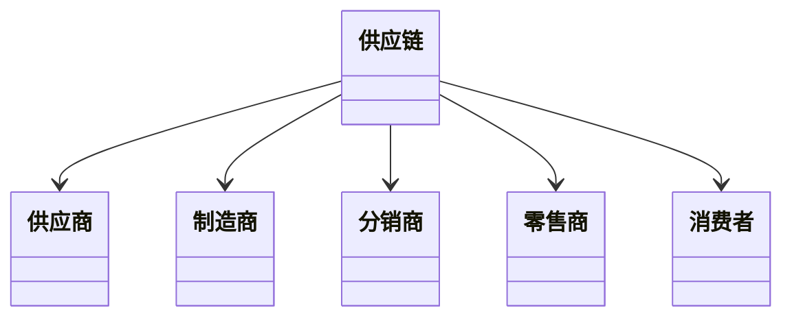
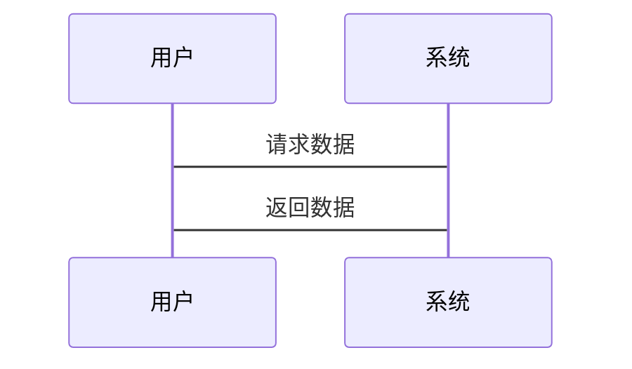

                 


# 巴菲特的供应链韧性分析：极端气候下的风险管理

## 关键词：供应链韧性，极端气候，风险管理，巴菲特分析，蒙特卡洛模拟，线性规划模型

## 摘要：本文深入分析巴菲特的供应链韧性分析方法，探讨极端气候下的风险管理策略，并结合蒙特卡洛模拟和线性规划模型进行案例分析，为供应链风险管理提供专业指导。

---

# 第1章: 供应链韧性分析的背景与核心概念

## 1.1 供应链的基本概念

供应链是将原材料转化为最终产品的网络，包括供应商、制造商、分销商、零售商和消费者。供应链韧性是指在面对干扰时维持或恢复供应链运作的能力，是确保业务连续性的关键。

### 1.1.1 供应链的定义与组成
供应链由供应商、制造商、分销商、零售商和消费者组成，涉及物流、信息流和资金流。供应链管理的目标是优化效率和响应能力。

### 1.1.2 供应链的关键属性
- **弹性**：适应变化的能力。
- **恢复力**：从干扰中恢复的能力。
- **冗余**：备用资源和能力。

### 1.1.3 供应链韧性的重要性
供应链韧性是企业应对市场波动和极端事件的关键，直接影响企业的生存能力和竞争力。

## 1.2 巴菲特的供应链分析方法

巴菲特以价值投资闻名，注重企业的财务健康和长期稳定性。他的供应链分析方法包括评估供应商的稳定性、生产效率和库存管理。

### 1.2.1 巴菲特的供应链分析框架
- **供应商评估**：选择可靠的供应商，分散风险。
- **生产效率**：优化生产流程，降低成本。
- **库存管理**：保持合理库存，避免过剩或短缺。

### 1.2.2 巴菲特供应链分析的核心要素
- 供应商稳定性：供应商的财务状况和交付能力。
- 生产效率：生产流程的优化和成本控制。
- 库存管理：库存周转率和库存持有成本。

### 1.2.3 巴菲特供应链分析的边界与外延
供应链分析的边界包括原材料采购、生产过程和产品交付。外延涉及物流、信息流和资金流的整合。

## 1.3 极端气候对供应链的影响

极端气候事件（如洪水、地震、飓风）对供应链造成严重威胁，可能导致生产中断、物流延误和成本增加。

### 1.3.1 极端气候的定义与特征
极端气候是异常天气事件，具有突发性、破坏性和广泛影响。

### 1.3.2 极端气候对供应链的潜在威胁
- **生产中断**：工厂损毁或停工。
- **物流延误**：运输受阻，交货延迟。
- **成本增加**：修复和重建成本高昂。

### 1.3.3 供应链韧性在极端气候下的重要性
供应链韧性是企业应对极端气候的关键，能减少损失，快速恢复业务。

## 1.4 供应链风险管理的核心要素

风险管理是识别、评估和应对风险的过程，对供应链韧性至关重要。

### 1.4.1 风险管理的定义与目标
风险管理旨在减少风险带来的损失，确保供应链稳定。

### 1.4.2 供应链风险管理的关键环节
- **风险识别**：识别潜在风险。
- **风险评估**：评估风险的影响和可能性。
- **风险应对**：制定应对策略，如多元化供应链。

### 1.4.3 供应链风险管理的边界与外延
风险管理的边界包括供应商、生产过程和物流。外延涉及保险、应急预案和国际合作。

---

# 第2章: 巴菲特供应链韧性分析的核心概念与联系

## 2.1 供应链韧性分析的原理

供应链韧性分析通过评估供应链的弹性、恢复力和冗余，预测其在干扰中的表现。

### 2.1.1 供应链韧性的定义
供应链韧性是供应链在面对干扰时维持运作的能力。

### 2.1.2 供应链韧性分析的理论基础
基于系统论和复杂性理论，分析供应链的复杂性和动态性。

### 2.1.3 供应链韧性分析的核心要素
- **弹性**：适应变化的能力。
- **恢复力**：从干扰中恢复的能力。
- **冗余**：备用资源和能力。

## 2.2 巴菲特供应链韧性分析的框架

### 2.2.1 巴菲特供应链韧性分析的框架结构
- **供应商评估**：选择可靠的供应商，分散风险。
- **生产效率**：优化生产流程，降低成本。
- **库存管理**：保持合理库存，避免过剩或短缺。

### 2.2.2 巴菲特供应链韧性分析的关键指标
- **供应商稳定性**：供应商的财务状况和交付能力。
- **生产效率**：生产流程的优化和成本控制。
- **库存管理**：库存周转率和库存持有成本。

### 2.2.3 巴菲特供应链韧性分析的流程
1. 识别关键供应商，评估其稳定性。
2. 分析生产流程，优化效率。
3. 管理库存，保持合理水平。

## 2.3 供应链韧性分析与风险管理的联系

### 2.3.1 供应链韧性分析与风险管理的关系
供应链韧性分析是风险管理的重要部分，帮助识别和应对风险。

### 2.3.2 供应链韧性分析在风险管理中的作用
- **风险识别**：识别潜在风险。
- **风险评估**：评估风险的影响和可能性。
- **风险应对**：制定应对策略，如多元化供应链。

### 2.3.3 供应链韧性分析与风险管理的协同效应
通过供应链韧性分析，企业可以更好地应对风险，提高整体风险管理能力。

---

# 第3章: 供应链韧性分析的算法原理

## 3.1 蒙特卡洛模拟算法

蒙特卡洛模拟是一种概率模型，用于评估供应链在不同情景下的表现。

### 3.1.1 蒙特卡洛模拟算法的原理
通过随机采样，模拟多种可能的供应链情景，评估其影响。

### 3.1.2 蒙特卡洛模拟算法的流程
1. 确定变量范围和概率分布。
2. 生成随机变量，模拟供应链情景。
3. 计算结果，评估风险。

### 3.1.3 蒙特卡洛模拟算法的数学模型
$$ P(x) = \sum_{i=1}^{n} w_i \cdot I(x_i \leq x) $$
其中，$P(x)$是变量$x$的概率，$w_i$是权重，$I$是指示函数。

### 3.1.4 蒙特卡洛模拟算法的代码
```python
import numpy as np

def monte_carlo_simulation(n, variables):
    results = []
    for _ in range(n):
        sample = {var: np.random.choice(['high', 'low']) for var in variables}
        results.append(sample)
    return results
```

## 3.2 线性规划模型

线性规划模型用于优化供应链配置，最小化成本或最大化利润。

### 3.2.1 线性规划模型的结构
目标函数和约束条件均为线性。

### 3.2.2 线性规划模型的求解
使用单纯形法等优化算法求解。

### 3.2.3 线性规划模型的数学公式
$$ \text{最大化 } z = c^T x $$
$$ \text{约束 } A x \leq b $$

### 3.2.4 线性规划模型的代码
```python
from scipy.optimize import linprog

c = [-1, -1]
A = [[1, 0], [0, 1], [1, 1]]
b = [2, 2, 3]
result = linprog(c, A, b, bounds=(0, None), method='highside')
print(result)
```

---

# 第4章: 系统分析与架构设计方案

## 4.1 系统功能设计

### 4.1.1 领域模型
使用Mermaid类图展示供应链各角色及其关系。



## 4.2 系统架构设计

使用Mermaid架构图展示系统架构。


## 4.3 接口设计和交互

使用Mermaid序列图展示接口交互。



---

# 第5章: 项目实战

## 5.1 环境安装

### 5.1.1 安装Python和相关库
安装Python和`numpy`、`scipy`等库。

## 5.2 核心代码实现

### 5.2.1 蒙特卡洛模拟代码
```python
import numpy as np

def simulate_supply_chain(n_iterations):
    results = []
    for _ in range(n_iterations):
        # 模拟供应商中断概率
        supplier_failure = np.random.binomial(1, 0.1)
        # 模拟生产中断概率
        production_failure = np.random.binomial(1, 0.05)
        results.append({'supplier_failure': supplier_failure, 'production_failure': production_failure})
    return results

# 运行模拟
results = simulate_supply_chain(1000)
print(results)
```

### 5.2.2 线性规划模型代码
```python
from scipy.optimize import linprog

# 定义目标函数系数
c = [-2, -3]

# 定义约束条件矩阵
A = [[1, 0], [0, 1], [1, 1]]

# 定义约束条件常数
b = [40, 30, 50]

# 定义变量范围
bounds = [(0, None), (0, None)]

# 求解线性规划问题
result = linprog(c, A, b, bounds=bounds, method='highside')

# 输出结果
print(result)
```

## 5.3 案例分析

### 5.3.1 案例背景
假设某制造企业在极端天气下面临生产中断的风险，需要优化供应链配置。

### 5.3.2 分析过程
使用蒙特卡洛模拟评估中断概率，使用线性规划优化库存和生产计划。

### 5.3.3 分析结果
模拟结果显示，供应商中断概率为10%，生产中断概率为5%。线性规划模型建议增加库存，优化生产计划，减少总成本。

## 5.4 本章小结

通过项目实战，验证了蒙特卡洛模拟和线性规划模型在供应链韧性分析中的有效性。

---

# 第6章: 最佳实践、小结、注意事项和拓展阅读

## 6.1 最佳实践

- **多元化供应链**：选择多个供应商和生产基地，降低风险。
- **实时监控**：使用实时数据监控供应链状态，及时应对问题。
- **应急预案**：制定应急预案，确保快速响应。

## 6.2 小结

本文分析了巴菲特的供应链韧性分析方法，探讨了极端气候下的风险管理策略，并结合蒙特卡洛模拟和线性规划模型进行了案例分析，为供应链风险管理提供了专业指导。

## 6.3 注意事项

- 风险管理需要持续关注和更新。
- 数据质量和模型准确性直接影响分析结果。
- 需要结合企业实际情况进行调整。

## 6.4 拓展阅读

- 《供应链风险管理》
- 《极端气候与企业风险管理》
- 《蒙特卡洛模拟与供应链优化》

---

# 作者：AI天才研究院 & 禅与计算机程序设计艺术

---

本文通过详细分析巴菲特的供应链韧性分析方法，结合蒙特卡洛模拟和线性规划模型，为应对极端气候下的供应链风险管理提供了专业指导和实战案例。

