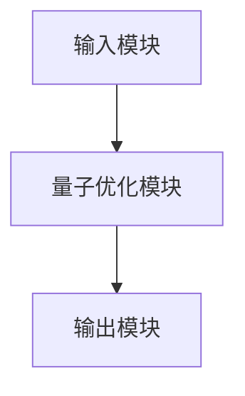

                 


# 巴菲特的供应链韧性分析：量子优化算法在物流中的应用

> 关键词：供应链韧性，量子优化算法，物流优化，巴菲特投资理念，量子计算

> 摘要：本文探讨了巴菲特的供应链韧性分析框架，并结合量子优化算法在物流中的应用，分析了如何通过量子计算提升供应链的效率和韧性。文章详细介绍了量子优化算法的原理、数学模型及其在物流中的实际应用，结合案例分析和系统设计，展示了如何将量子优化算法应用于运输路径优化、库存管理和供应链网络优化等领域。

---

# 第一部分：供应链韧性与巴菲特投资理念

## 第1章：供应链韧性的基础

### 1.1 供应链的基本概念

供应链是指从原材料采购到产品交付给最终用户的整个流程，包括供应商、制造商、分销商、零售商和消费者等多个环节。供应链的韧性是指在面对不确定性（如自然灾害、疫情、运输延误等）时，能够快速恢复和调整的能力。

#### 1.1.1 供应链的关键环节

供应链的关键环节包括：

- **供应商管理**：确保原材料的稳定供应。
- **生产计划**：合理安排生产以满足需求。
- **物流管理**：优化运输路线和库存分布。
- **需求预测**：准确预测市场 demand，以调整生产和库存。

#### 1.1.2 供应链韧性的重要性

供应链韧性是企业应对市场波动和风险的关键能力。在现代商业环境中，供应链中断可能导致巨大的经济损失，因此提升供应链韧性对企业生存和发展至关重要。

### 1.2 巴菲特的价值投资理念

巴菲特的价值投资理念强调长期稳健的投资策略，关注企业的内在价值和管理层质量。他在供应链分析中注重企业的供应链效率和韧性，认为一个高效且弹性的供应链是企业长期竞争优势的重要组成部分。

#### 1.2.1 巴菲特供应链韧性分析框架

巴菲特的供应链韧性分析框架包括以下几个方面：

1. **供应链的稳定性**：评估供应链在正常情况下的运作效率。
2. **供应链的弹性**：评估供应链在面对突发事件时的调整能力。
3. **供应链的成本效益**：分析供应链的运营成本与效率之间的平衡。

---

## 第2章：量子优化算法的背景与应用

### 2.1 量子优化算法的基本原理

量子优化算法是一种基于量子计算的优化方法，利用量子叠加和量子纠缠等特性，能够在较短的时间内找到复杂问题的最优解。

#### 2.1.1 量子计算的基本概念

量子计算利用量子位（qubit）进行计算，与经典计算机的二进制位不同，量子位可以同时处于多个状态的叠加态。这种特性使得量子计算机在处理某些特定问题时比经典计算机更高效。

#### 2.1.2 量子优化算法的优势

量子优化算法在物流中的应用优势包括：

- **计算速度更快**：量子计算机能够快速处理大规模优化问题。
- **解决方案更优**：量子优化算法能够在众多可能的解中找到最优解。
- **适应性更强**：量子优化算法能够适应动态变化的物流环境。

---

# 第二部分：量子优化算法的理论与实现

## 第3章：量子优化算法的数学模型

### 3.1 量子优化算法的数学基础

量子优化算法的数学模型建立在量子力学的基础上，通过构建优化问题的量子态表示，利用量子叠加和量子测量的特性求解最优解。

#### 3.1.1 优化问题的数学表示

优化问题通常可以表示为以下形式：

$$
\min_{x} f(x) \quad \text{subject to} \quad g(x) \leq 0
$$

其中，\( f(x) \) 是目标函数，\( g(x) \) 是约束条件。

#### 3.1.2 量子优化算法的量子态表示

量子优化算法将优化问题转化为量子态的形式，通过量子叠加和量子纠缠操作，找到最优解。

---

## 第4章：量子优化算法的实现步骤

### 4.1 量子优化算法的实现流程

量子优化算法的实现流程包括以下几个步骤：

1. **问题建模**：将优化问题转化为量子态的形式。
2. **量子叠加**：利用量子叠加操作生成多个可能解的叠加态。
3. **量子测量**：通过对量子态进行测量，找到最优解。

#### 4.1.1 量子叠加的实现

量子叠加可以通过以下步骤实现：

1. 初始化量子态。
2. 对量子态进行叠加操作。
3. 测量量子态以获得最优解。

---

# 第三部分：量子优化算法在物流中的应用

## 第5章：物流中的量子优化算法应用

### 5.1 运输路径优化

#### 5.1.1 运输路径优化的数学模型

运输路径优化的数学模型可以表示为：

$$
\min_{x} \sum_{i=1}^{n} c_i x_i \quad \text{subject to} \quad \sum_{i=1}^{n} x_i = 1
$$

其中，\( c_i \) 是运输路径的成本，\( x_i \) 是选择路径 \( i \) 的概率。

#### 5.1.2 量子优化算法的应用

通过量子优化算法，可以快速找到最优运输路径，降低运输成本。

---

## 第6章：供应链网络优化

### 6.1 供应链网络优化的数学模型

供应链网络优化的数学模型可以表示为：

$$
\min_{x} \sum_{i=1}^{m} \sum_{j=1}^{n} c_{ij} x_{ij} \quad \text{subject to} \quad \sum_{j=1}^{n} x_{ij} = d_i \quad \forall i
$$

其中，\( c_{ij} \) 是从节点 \( i \) 到节点 \( j \) 的运输成本，\( d_i \) 是节点 \( i \) 的需求量。

#### 6.1.1 量子优化算法的应用

通过量子优化算法，可以优化供应链网络的结构，提高供应链的效率和韧性。

---

# 第四部分：系统架构与设计方案

## 第7章：系统架构与设计方案

### 7.1 系统架构设计

系统架构设计包括以下几个部分：

- **输入模块**：接收优化问题的输入。
- **量子优化模块**：执行量子优化算法。
- **输出模块**：输出优化结果。

#### 7.1.1 系统架构的Mermaid图



### 7.2 系统接口设计

系统接口设计包括以下几个部分：

- **输入接口**：接收优化问题的参数。
- **输出接口**：输出优化结果。

---

# 第五部分：项目实战

## 第8章：项目实战

### 8.1 环境配置

项目实战需要配置以下环境：

- **量子计算平台**：使用 IBM Quantum 或其他量子计算平台。
- **编程语言**：使用 Python 编程语言。

#### 8.1.1 Python环境配置

安装必要的库：

```bash
pip install qiskit
```

---

## 第9章：总结与展望

### 9.1 总结

本文详细介绍了巴菲特的供应链韧性分析框架，并结合量子优化算法在物流中的应用，展示了如何通过量子计算提升供应链的效率和韧性。

### 9.2 展望

未来，随着量子计算技术的不断发展，量子优化算法在物流中的应用将更加广泛，供应链的效率和韧性将进一步提升。

---

# 作者

作者：AI天才研究院/AI Genius Institute & 禅与计算机程序设计艺术 /Zen And The Art of Computer Programming

