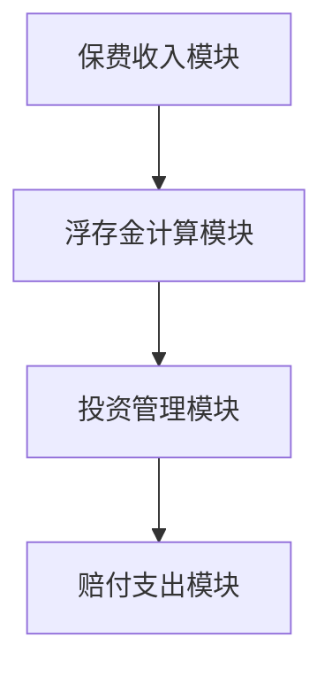
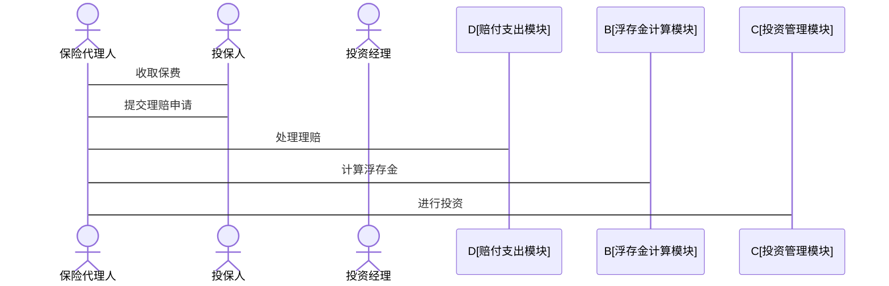

                 

# 巴菲特的保险浮存金策略：利用他人的钱投资

**关键词**：巴菲特、保险浮存金、投资策略、价值投资、财务分析、资产配置

**摘要**：本文将深入探讨巴菲特的保险浮存金策略，分析其背后的逻辑、数学模型和实际应用。我们将从保险浮存金的定义、形成机制、财务特征入手，结合巴菲特的投资理念，揭示其如何利用保险公司的浮存金进行长期投资，并实现财富增长。同时，本文将通过实际案例分析，展示浮存金策略的成功与局限性，并总结其对个人和机构投资者的启示。

---

# 第一部分：保险浮存金的背景与定义

## 第1章：保险浮存金的定义与背景

### 1.1 保险浮存金的定义
保险浮存金是指保险公司收取的保费与赔付支出之间的差额部分，这部分资金在保险公司运作期间被暂时存放，用于投资或其他业务用途。它是一种特殊的资金来源，具有长期性和稳定性。

### 1.2 巴菲特的保险浮存金策略
巴菲特通过控制保险公司，利用浮存金的长期性和稳定性进行投资，从而实现资产的长期增值。这种策略的核心在于将浮存金视为一种“免费的资金”，通过长期投资获得收益。

### 1.3 保险浮存金的形成机制
浮存金的形成与保险公司的业务模式密切相关。以下是浮存金形成的三个关键步骤：
1. **保费收入**：保险公司通过收取保费获得资金。
2. **赔付支出**：保险公司需要根据保单条款支付理赔款。
3. **浮存金的形成**：保费收入与赔付支出之间的差额即为浮存金。

### 1.4 保险浮存金的财务特征
以下是保险浮存金的核心特征：
- **时间价值**：浮存金的长期性使其能够用于长期投资，从而获得更高的收益。
- **规模效应**：浮存金的规模越大，投资收益的边际效应越显著。
- **收益稳定性**：浮存金的投资收益相对稳定，且不受短期市场波动的影响。

---

# 第二部分：保险浮存金的数学模型与算法

## 第2章：保险浮存金的数学模型

### 2.1 浮存金的现金流分析
浮存金的现金流可以通过以下公式进行计算：

$$ \text{浮存金} = \text{保费收入} - \text{赔付支出} $$

其中，保费收入和赔付支出的具体计算公式如下：

- **保费收入**：根据保险产品的定价和销售情况确定。
- **赔付支出**：根据保单的赔付率和理赔情况确定。

### 2.2 浮存金的收益计算
浮存金的投资收益可以通过以下公式计算：

$$ \text{投资收益} = \text{浮存金} \times \text{投资收益率} $$

其中，投资收益率取决于巴菲特的投资策略。巴菲特通常选择低风险、高收益的资产配置方式，例如股票、债券和固定收益投资。

### 2.3 浮存金的风险管理
为了确保浮存金的安全性和稳定性，巴菲特采用了以下风险管理策略：
1. **分散投资**：将浮存金分散投资于不同的资产类别，以降低风险。
2. **长期持有**：避免频繁交易，减少交易成本和税务负担。
3. **价值投资**：选择具有长期增长潜力的优质资产。

---

# 第三部分：保险浮存金的系统分析与实现

## 第3章：保险浮存金的系统架构

### 3.1 系统功能设计
以下是保险浮存金系统的功能模块：
1. **保费收入模块**：负责计算和记录保费收入。
2. **赔付支出模块**：负责计算和记录赔付支出。
3. **浮存金计算模块**：根据保费收入和赔付支出计算浮存金。
4. **投资管理模块**：根据浮存金的规模和收益目标进行资产配置和投资管理。

### 3.2 系统架构设计
以下是保险浮存金系统的架构图：

### 3.3 系统接口设计
以下是系统接口的交互图：

---

# 第四部分：保险浮存金的案例分析与实战

## 第4章：巴菲特的保险浮存金策略案例

### 4.1 巴菲特早期的浮存金策略
在巴菲特早期的投资生涯中，他通过控制多家保险公司，利用浮存金进行长期投资，实现了资产的快速积累。

### 4.2 巴菲特的经典投资案例
以下是巴菲特利用浮存金进行投资的经典案例：
1. **购买喜诗糖果公司**：通过浮存金的长期投资，巴菲特成功收购了喜诗糖果公司，并实现了资产增值。
2. **收购国民赔偿公司**：通过浮存金的杠杆效应，巴菲特成功收购了国民赔偿公司，并将其整合到伯克希尔哈撒韦公司。

### 4.3 应对危机的浮存金策略
在2008年金融危机期间，巴菲特利用浮存金的稳定性，逆势投资，成功抄底市场，实现了资产的大幅增值。

---

# 第五部分：保险浮存金策略的总结与启示

## 第5章：保险浮存金策略的总结

### 5.1 保险浮存金策略的核心要素
1. **长期性**：浮存金的长期性使其能够用于长期投资。
2. **稳定性**：浮存金的稳定性使其能够抵御短期市场波动。
3. **杠杆效应**：浮存金的规模效应使其能够实现收益的放大。

### 5.2 保险浮存金策略的局限性
1. **资金链风险**：如果浮存金的来源不稳定，可能会影响投资的连续性。
2. **市场风险**：浮存金的投资收益受到市场波动的影响。
3. **监管风险**：保险公司的浮存金受到严格监管，可能影响投资灵活性。

---

## 第6章：对个人和机构投资者的启示

### 6.1 个人投资者的启示
1. **长期投资的重要性**：个人投资者应注重长期投资，避免短期波动的影响。
2. **资产配置的科学性**：个人投资者应根据自身的财务状况和风险承受能力，进行科学的资产配置。

### 6.2 机构投资者的启示
1. **资金的稳定性**：机构投资者应注重资金的稳定性，确保投资的连续性。
2. **风险控制的必要性**：机构投资者应建立完善的风险控制机制，确保投资的安全性。

---

## 作者：AI天才研究院 & 禅与计算机程序设计艺术

---

通过本文的分析，我们可以看到巴菲特的保险浮存金策略是一种高效的投资方式，其核心在于利用保险公司的浮存金进行长期投资。然而，这种策略的成功离不开巴菲特的价值投资理念和风险管理能力。对于个人和机构投资者来说，浮存金策略的成功与否，取决于对市场、资产和风险的深刻理解。希望本文能够为读者提供有价值的启示，并帮助他们在投资领域取得更大的成功。

