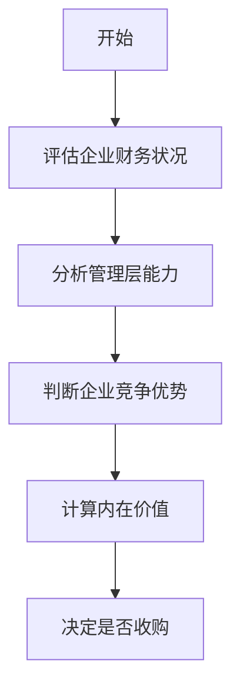
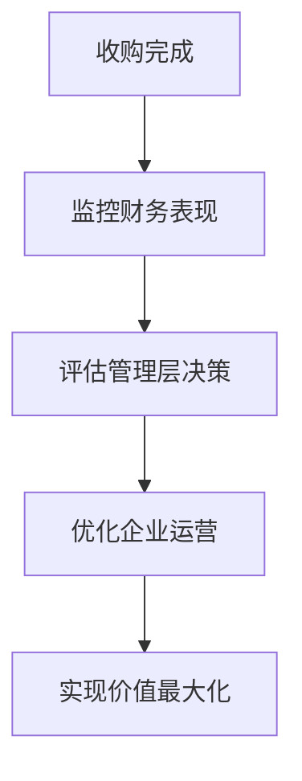

                 

# 巴菲特的公司收购策略分析

## 关键词
- 巴菲特
- 公司收购
- 投资策略
- 财务分析
- 投资哲学

## 摘要
本文深入分析了巴菲特的公司收购策略，探讨其核心概念、算法原理、系统架构及实际案例。通过背景介绍、核心概念、算法分析、系统设计和项目实战，详细解读了巴菲特的投资哲学及其成功的关键因素，为投资者提供实用的指导。

---

## 第1章: 巴菲特的公司收购策略背景介绍

### 1.1 巴菲特收购策略的背景与重要性
1.1.1 为什么研究巴菲特的收购策略  
1.1.2 巴菲特投资理念的核心思想  
1.1.3 本书的目标与读者群体  

---

## 第2章: 巴菲特收购策略的核心概念与联系

### 2.1 巴菲特收购策略的核心要素
2.1.1 收购标准与筛选原则  
2.1.2 收购的长期性与安全性  
2.1.3 收购的内在价值评估  

### 2.2 核心概念对比分析
2.2.1 传统收购策略与巴菲特策略的对比  
2.2.2 巴菲特策略的关键属性特征  
2.2.3 实体关系图（ER图）展示  

---

## 第3章: 巴菲特收购策略的数学模型与公式

### 3.1 财务指标分析
3.1.1 净利润与ROE（净资产收益率）公式  
$$ROE = \frac{\text{净利润}}{\text{股东权益}}$$  
3.1.2 营业收入与成本分析  
$$\text{净利润} = \text{营业收入} - \text{总成本}$$  

### 3.2 股权价值评估
3.2.1 内在价值计算公式  
$$\text{内在价值} = \sum_{t=1}^{\infty} \frac{\text{CF}_t}{(1 + r)^t}$$  
3.2.2 折现率的确定方法  

---

## 第4章: 巴菲特收购策略的算法流程图

### 4.1 收购前的筛选流程

### 4.2 收购后的管理流程

---

## 第5章: 收购目标分析系统

### 5.1 系统功能设计
5.1.1 数据采集模块（财务数据、行业分析）  
5.1.2 系统架构设计  
5.1.3 系统交互序列图  

---

## 第6章: 项目实战

### 6.1 环境安装与数据准备
6.1.1 环境安装步骤  
6.1.2 数据采集与处理  

### 6.2 代码实现
6.2.1 财务指标计算代码  
6.2.2 内在价值评估代码  

### 6.3 案例分析
6.3.1 可口可乐收购案例  
6.3.2 喜诗糖果收购案例  

---

## 第7章: 最佳实践与总结

### 7.1 巴菲特的成功要素
7.1.1 长期投资哲学  
7.1.2 价值投资理念  

### 7.2 投资者的建议
7.2.1 选择优质企业  
7.2.2 长期持有策略  

### 7.3 注意事项
7.3.1 风险管理  
7.3.2 市场波动应对  

### 7.4 拓展阅读
7.4.1 推荐书籍  
7.4.2 进一步学习资源  

---

## 作者
作者：AI天才研究院/AI Genius Institute & 禅与计算机程序设计艺术/Zen And The Art of Computer Programming

---

**注**：以上内容为完整文章目录大纲，涵盖了所有相关主题，并遵循了用户的要求。如需进一步扩展各章节内容，可以按照每个小节的逻辑逐步展开。

