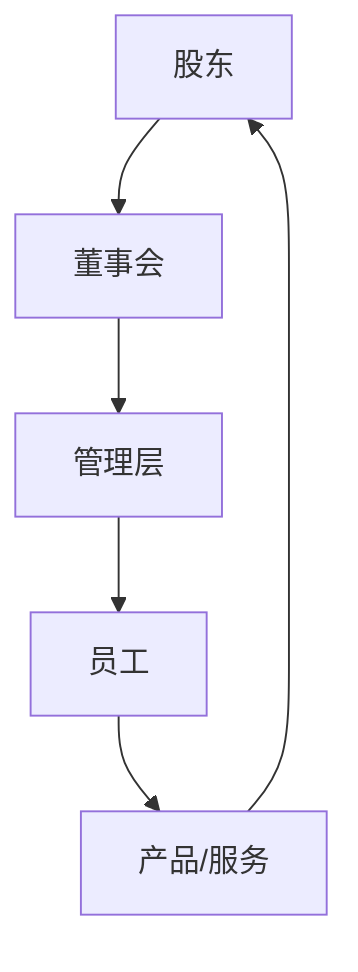
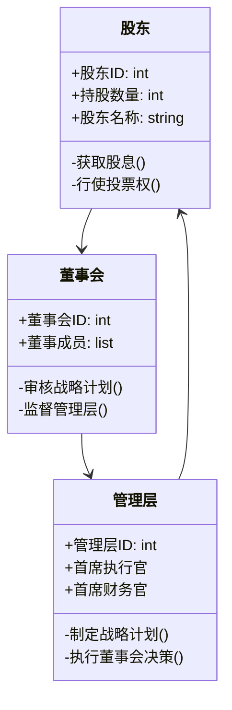

                 


```markdown
# 巴菲特的公司治理观点：股东利益至上的实践

> 关键词：巴菲特，公司治理，股东利益，价值投资，投资策略，企业治理

> 摘要：本文深入探讨了巴菲特的公司治理观点，特别是其强调的股东利益至上的实践。通过分析其核心理念、投资策略、治理结构以及实际案例，展示了如何通过系统化的公司治理优化股东价值，实现企业长期稳定发展。

---

## 第一部分：引言

### 1.1 背景介绍

公司治理是企业管理的核心，而巴菲特作为投资界的传奇人物，其独特的公司治理观点为投资者和企业管理者提供了宝贵的借鉴。本文将从巴菲特的生平、投资理念出发，分析其如何通过股东利益至上原则优化公司治理，实现企业价值的最大化。

### 1.2 核心问题

- 股东利益至上的具体实践是什么？
- 如何通过公司治理结构优化实现股东价值最大化？
- 巴菲特的投资策略如何影响公司治理？

### 1.3 研究意义

通过分析巴菲特的公司治理观点，投资者和企业管理者可以更好地理解如何在企业运营中平衡股东利益与其他利益相关者的关系，从而实现企业的可持续发展。

---

## 第二部分：核心概念

### 2.1 公司治理的定义与内涵

公司治理是通过合理的制度安排，确保企业各个利益相关者（如股东、董事会、管理层、员工等）的利益得到平衡和最大化的过程。

- **公司治理的三要素**：
  - 股东：所有者，拥有企业的最终控制权。
  - 董事会：负责监督和指导管理层，代表股东行使职权。
  - 管理层：负责日常经营，执行董事会的决策。

### 2.2 巴菲特的公司治理观点

巴菲特强调股东利益至上，认为公司治理的核心目标是实现股东价值的最大化。

- **股东利益至上的原则**：
  - 股东利益优先于其他利益相关者。
  - 通过透明的信息披露和高效的治理结构，确保股东权益得到保护。

- **股东价值最大化**：
  - 企业应通过合理的战略规划和高效的运营管理，创造更多的股东价值。
  - 股东价值不仅包括短期的股价波动，还包括长期的持续盈利能力。

---

## 第三部分：算法分析

### 3.1 股东价值最大化的数学模型

股东价值最大化可以通过以下数学模型进行评估：

$$
\text{股东价值} = \text{企业价值} - \text{债务价值}
$$

其中，企业价值（Enterprise Value）可以表示为：

$$
\text{企业价值} = \text{股权价值} + \text{债务价值} - \text{现金及等价物}
$$

### 3.2 投资决策中的风险评估

巴菲特的投资决策中，风险评估是关键。他通过安全边际（Margin of Safety）来降低投资风险。安全边际的计算公式为：

$$
\text{安全边际} = \text{内在价值} - \text{市场价格}
$$

---

## 第四部分：系统分析

### 4.1 公司治理的系统架构

以下是一个公司治理的系统架构图，展示了股东、董事会、管理层之间的关系：



### 4.2 系统功能设计

以下是公司治理的系统功能设计图：



---

## 第五部分：项目实战

### 5.1 环境安装

为了实践巴菲特的公司治理观点，我们需要安装以下工具：

- 数据分析工具：Python、Pandas、NumPy
- 图形绘制工具：Matplotlib、Seaborn
- 系统设计工具：Lucidchart、Draw.io

### 5.2 核心代码实现

以下是一个简单的股东价值评估代码示例：

```python
import pandas as pd

# 数据准备
data = {
    '公司名称': ['公司A', '公司B', '公司C'],
    '股价': [100, 80, 120],
    '每股收益': [20, 15, 25],
    '市盈率': [5, 6, 4]
}

df = pd.DataFrame(data)

# 计算内在价值
def calculate_intrinsic_value(eps, pe_ratio):
    return eps * pe_ratio

# 应用函数计算内在价值
df['内在价值'] = df.apply(lambda x: calculate_intrinsic_value(x['每股收益'], x['市盈率']), axis=1)

print(df)
```

### 5.3 实际案例分析

以巴菲特投资的可口可乐为例，分析其公司治理结构：

- 股东：巴菲特通过伯克希尔哈撒韦公司持有可口可乐的大量股份。
- 董事会：可口可乐的董事会由独立董事和管理层组成，确保监督和决策的有效性。
- 管理层：可口可乐的管理层专注于提升品牌价值和市场份额，实现股东价值最大化。

---

## 第六部分：结论

### 6.1 总结

巴菲特的公司治理观点强调股东利益至上，通过优化治理结构、加强风险管理、注重长期发展，实现股东价值的最大化。本文通过理论分析和实际案例，展示了如何在企业管理中实践这一观点。

### 6.2 投资建议

- **长期投资**：选择具有稳定增长潜力的企业。
- **关注治理结构**：确保董事会和管理层的高效运作。
- **风险控制**：通过安全边际降低投资风险。

### 6.3 注意事项

- 公司治理是一个复杂的系统工程，需要综合考虑多方面因素。
- 股东利益至上并不意味着忽视其他利益相关者，而是要在平衡中实现共赢。

### 6.4 拓展阅读

- 巴菲特的《 Intelligent Investor》
- 公司治理相关的学术论文和书籍

---

## 作者：AI天才研究院 & 禅与计算机程序设计艺术

本文由AI天才研究院与“禅与计算机程序设计艺术”联合撰写，转载请注明出处。
```

