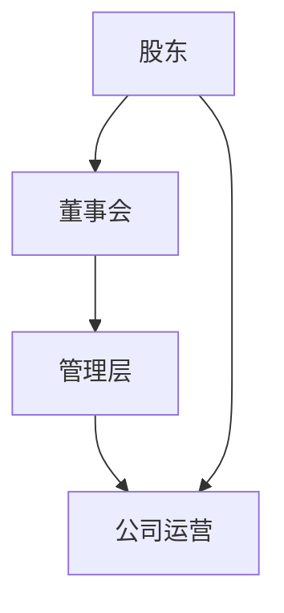
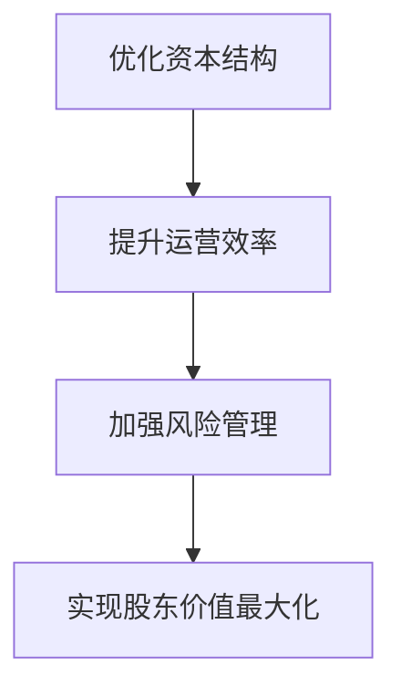
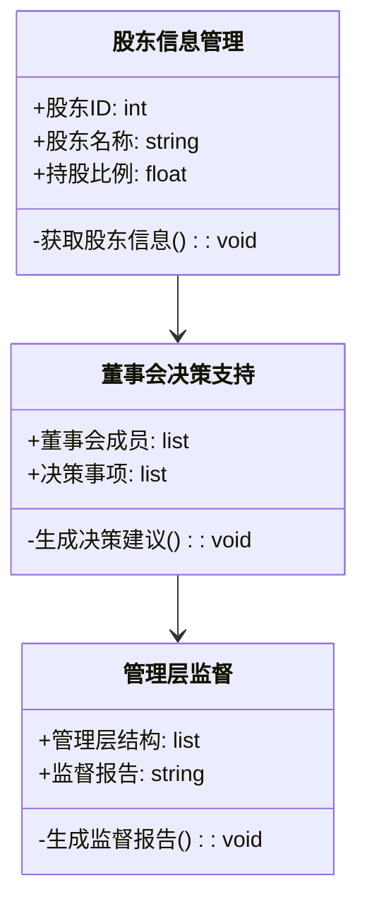
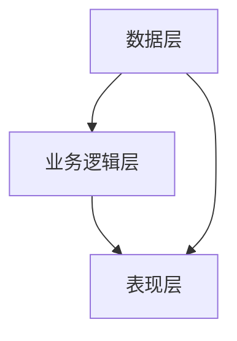

                 


# 巴菲特的公司治理观：股东利益至上

## 关键词
- 巴菲特
- 公司治理
- 股东利益
- 股东价值
- 治理原则

## 摘要
本文深入探讨了巴菲特的公司治理观，特别是其核心理念——股东利益至上。通过分析巴菲特的投资哲学、治理原则和实践策略，结合技术博客的专业语言，详细阐述了股东价值的实现路径、董事会治理的优化方法以及公司治理的系统架构。本文还通过实例分析和算法模型，展示了如何将股东利益最大化与企业长期发展相结合，为读者提供了一个全面而深入的视角。

---

## 第一部分：背景介绍

### 1.1 公司治理的基本概念
公司治理是关于公司如何管理和监督其业务的框架，涉及股东、董事会、管理层和其他利益相关者之间的权利和责任分配。有效的公司治理能够确保公司长期稳定发展，同时实现股东价值最大化。

### 1.2 巴菲特的投资哲学
沃伦·巴菲特是全球最著名的投资者之一，他的投资哲学以“价值投资”为核心，强调长期持有优质资产。巴菲特认为，公司治理是实现股东价值最大化的重要保障。

### 1.3 股东利益至上的核心思想
巴菲特的公司治理观强调股东利益至上，认为公司管理层应以股东利益为核心，避免短期行为，注重长期价值的创造。

---

## 第二部分：核心概念与联系

### 2.1 股东权利与义务
股东作为公司的所有者，享有投票权、分红权、剩余索取权等基本权利。同时，股东也需履行支持公司发展、监督管理层的义务。

#### 股东权利对比表
| 权利类型        | 描述                       |
|-----------------|----------------------------|
| 投票权          | 股东有权参与公司重大决策   |
| 分红权          | 股东有权分享公司利润       |
| 剩余索取权      | 股东有权在公司清算时优先受偿 |

### 2.2 股东与董事会的关系
董事会是公司治理的核心机构，负责监督管理层并代表股东利益。巴菲特强调董事会应独立于管理层，确保决策的公正性。

#### 股东与董事会的关系图


---

## 第三部分：算法原理

### 3.1 股东价值评估模型
巴菲特的股东价值评估模型强调对公司未来现金流的折现，以确定其内在价值。

#### 股东价值计算公式
$$\text{内在价值} = \sum_{t=1}^{n} \frac{\text{现金流}_t}{(1 + r)^t}$$
其中，r为折现率，n为预测期数。

### 3.2 股东价值实现路径
通过优化资本结构、提升运营效率和加强风险管理，公司可以实现股东价值的最大化。

#### 股东价值实现流程图


---

## 第四部分：系统分析与架构设计

### 4.1 系统功能设计
设计一个公司治理系统，需要包括股东信息管理、董事会决策支持、管理层监督等功能。

#### 系统功能模块图


### 4.2 系统架构设计
采用分层架构，包括数据层、业务逻辑层和表现层。

#### 系统架构图


---

## 第五部分：项目实战

### 5.1 环境安装
安装Python和相关库，如pandas、numpy，用于数据分析和建模。

### 5.2 核心代码实现
以下是股东价值评估的Python代码示例：

```python
import numpy as np
import pandas as pd

def calculate_intrinsic_value(cash_flows, discount_rate):
    return np.sum(cash_flows / (1 + discount_rate) ** np.arange(len(cash_flows)))

# 示例数据
cash_flows = [100, 150, 200, 250]
discount_rate = 0.1

iv = calculate_intrinsic_value(cash_flows, discount_rate)
print(f"内在价值: {iv}")
```

### 5.3 实例分析
假设一家公司未来三年的现金流分别为100万、150万、200万，折现率为10%，计算其内在价值。

#### 结果
$$\text{内在价值} = 100/1.1 + 150/1.1^2 + 200/1.1^3 \approx 384.82 \text{万元}$$

---

## 第六部分：最佳实践与小结

### 6.1 最佳实践
1. 董事会应独立于管理层，确保决策的公正性。
2. 采用长期的股东价值评估模型，避免短期行为。
3. 加强风险管理，确保股东利益的最大化。

### 6.2 小结
巴菲特的公司治理观强调股东利益至上，通过优化资本结构、提升运营效率和加强风险管理，公司可以实现股东价值的最大化。本文结合技术博客的专业语言，详细分析了巴菲特的治理理念，并通过实例和代码展示了其在实践中的应用。

---

## 作者：AI天才研究院 & 禅与计算机程序设计艺术

---

通过本文的分析，读者可以深入了解巴菲特的公司治理观，并将其应用于实际的公司管理中。

