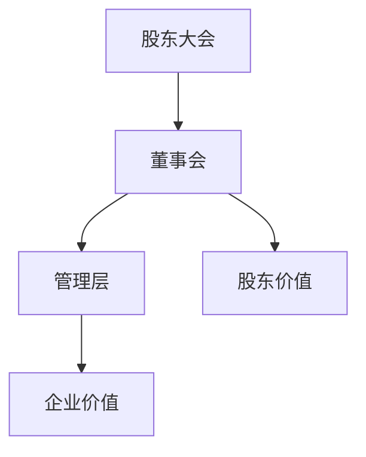

                 


# 巴菲特的公司治理观：股东利益至上的原则

## 关键词：
- 巴菲特、公司治理、股东利益、资本资产定价模型、治理结构、利益相关者

## 摘要：
本文探讨巴菲特的公司治理观，重点分析股东利益至上的原则及其在公司治理中的应用。通过介绍核心概念、分析其与其他治理原则的关系，并结合数学模型和系统架构设计，阐述如何有效实施这些原则。文章还提供实际案例，展示如何优化股东价值，并总结最佳实践。

---

# 第一部分：背景介绍

## 第1章：巴菲特的公司治理观概述

### 1.1 巴菲特的背景与投资理念

#### 1.1.1 巴菲特的生平与投资哲学
沃伦·巴菲特（Warren Buffett）是全球著名的投资家和慈善家，被誉为“股神”。他的投资哲学以价值投资为核心，强调长期稳定的投资回报和对公司基本面的深入分析。巴菲特认为，投资的本质是购买企业的一部分，而不仅仅是买卖股票。

#### 1.1.2 巴菲特与公司治理的关系
巴菲特不仅是投资者，也是公司治理的积极参与者。他认为，良好的公司治理是实现股东价值最大化的重要保障。他倡导透明、高效的治理结构，确保管理层和董事会能够代表股东利益，避免利益冲突。

#### 1.1.3 巴菲特公司治理观的核心思想
巴菲特的核心思想是：公司治理应以股东利益为中心，通过有效的治理结构和决策机制，确保管理层的行为符合股东的长期利益。他强调，公司治理不仅仅是形式上的合规，而是要真正实现股东的价值最大化。

### 1.2 股东利益至上的原则

#### 1.2.1 股东价值的定义与衡量
股东价值通常指股东权益的市场价值，包括资产、收益和分红等。巴菲特认为，股东价值最大化是公司治理的首要目标，而实现这一目标需要通过有效的治理机制来确保管理层的行为与股东利益一致。

#### 1.2.2 股东价值与企业长期发展的关系
企业的发展与股东价值密切相关。长期来看，企业的盈利能力、创新能力和市场地位直接影响股东的价值。巴菲特强调，企业应注重长期价值创造，而不是短期股价波动。

#### 1.2.3 股东利益至上的原则与企业治理的目标
公司治理的目标是通过合理分配权力和责任，确保企业能够实现股东的长期利益。巴菲特认为，股东利益至上的原则要求公司在决策时优先考虑股东的利益，同时平衡其他利益相关者的权益。

---

## 第2章：股东利益与公司治理的边界

### 2.1 股东利益的外延与限制

#### 2.1.1 股东利益的合法边界
股东利益的实现必须在法律框架内进行。公司治理中，股东的权利和义务由公司章程和相关法律法规规定。例如，股东有权参与公司重大决策，但不得滥用权利损害公司或其他利益相关者。

#### 2.1.2 股东利益与社会利益的平衡
虽然股东利益是公司治理的核心，但企业也应承担社会责任。巴菲特认为，企业应在追求股东利益的同时，关注环境保护、员工福利和社会公益，实现可持续发展。

#### 2.1.3 股东利益与公司其他利益相关者的协调
公司治理涉及多方利益相关者，包括股东、董事会、管理层、员工和客户等。巴菲特强调，股东利益至上并不意味着忽视其他利益相关者，而是在确保股东利益的同时，协调各方利益，实现共赢。

---

# 第二部分：核心概念与联系

## 第3章：股东利益至上的原则与公司治理结构

### 3.1 公司治理结构的组成与功能

#### 3.1.1 股东大会的作用与职责
股东大会是公司治理的核心机构，负责选举和监督董事会，审议重大事项等。巴菲特强调，股东大会应确保股东的知情权和参与权，使股东能够有效行使权利。

#### 3.1.2 董事会的结构与功能
董事会是公司治理的关键，负责制定战略、监督管理层并确保公司合规。巴菲特认为，董事会应独立于管理层，具备专业能力和决策能力，以维护股东利益。

#### 3.1.3 高级管理层的职责与权力
管理层负责日常经营，执行董事会决策。巴菲特强调，管理层应具备诚信和专业能力，确保公司运营高效，并定期向董事会和股东汇报。

### 3.2 股东在公司治理中的角色

#### 3.2.1 股东的知情权与参与权
股东有权了解公司的财务状况、经营成果和重大决策，并通过股东大会行使参与权。巴菲特认为，透明的信息披露是实现股东知情权的关键。

#### 3.2.2 股东的投票权与决策权
股东通过投票权参与公司重大决策，如选举董事会成员、批准公司章程等。巴菲特强调，股东应积极行使投票权，避免“搭便车”现象。

#### 3.2.3 股东的监督权与制衡权
股东有权监督管理层和董事会，确保其行为符合股东利益。巴菲特认为，有效的监督机制是防止管理层滥用权力的重要保障。

---

## 第4章：股东利益与公司治理中的关键原则

### 4.1 股东利益至上的原则与其他治理原则的关系

#### 4.1.1 利益相关者理论
利益相关者理论强调公司应平衡股东、员工、客户等多方利益。巴菲特认为，股东利益至上并不排斥其他利益相关者，而是要在实现股东利益的同时，兼顾其他利益相关者的权益。

#### 4.1.2 股权激励机制
股权激励是将管理层与股东利益绑定的有效手段。巴菲特认为，合理的股权激励可以激发管理层的积极性，实现公司与股东的双赢。

#### 4.1.3 透明与披露
透明的信息披露是实现股东知情权的重要手段。巴菲特强调，公司应定期披露财务报表、战略规划和重大事项，增强股东的信任。

---

## 第5章：数学模型与算法原理

### 5.1 股东价值的数学模型

#### 5.1.1 资本资产定价模型（CAPM）
CAPM用于计算资产的期望回报率，公式为：
$$
E(R_i) = R_f + \beta_i (R_m - R_f)
$$
其中，$E(R_i)$ 是资产的期望回报率，$R_f$ 是无风险利率，$\beta_i$ 是资产的贝塔系数，$R_m$ 是市场期望回报率。

#### 5.1.2 股东价值的评估
股东价值可以看作是公司未来现金流的现值。使用CAPM计算加权平均资本成本（WACC），然后用WACC贴现公司现金流，得到企业价值。公式为：
$$
EV = \sum_{t=1}^{n} \frac{CF_t}{(1 + WACC)^t}$$

---

## 第6章：系统分析与架构设计方案

### 6.1 系统功能设计

#### 6.1.1 领域模型类图


#### 6.1.2 系统架构图


---

## 第7章：项目实战

### 7.1 环境安装与核心代码实现

#### 7.1.1 环境安装
假设我们使用Python进行数据分析，安装必要的库：
```
pip install pandas numpy matplotlib
```

#### 7.1.2 核心代码实现
计算股东价值的代码示例：
```python
import pandas as pd
import numpy as np

def calculate_shareholder_value(fcf, wacc):
    # 计算企业价值
    ev = np.npv(wacc, fcf)
    # 计算股东价值（假设无债务）
    shareholder_value = ev
    return shareholder_value

# 示例数据
fcf = [100, 150, 200, 250]  # 自由现金流
wacc = 0.10  # 加权平均资本成本

sv = calculate_shareholder_value(fcf, wacc)
print(f"股东价值: {sv}")
```

---

## 第8章：最佳实践、小结、注意事项和拓展阅读

### 8.1 最佳实践
- 定期审查公司治理结构，确保其符合股东利益。
- 建立透明的信息披露机制，增强股东信任。
- 引入股权激励机制，绑定管理层与股东利益。

### 8.2 小结
巴菲特的公司治理观强调股东利益至上，通过有效的治理结构和机制，确保股东价值最大化。本文结合理论、数学模型和系统设计，详细阐述了这一观点，并提供了实际应用的案例。

### 8.3 注意事项
- 股东利益至上并非忽视其他利益相关者，而是在实现股东利益的同时，平衡各方利益。
- 在实施股东利益至上的原则时，需注意避免短期行为，注重长期价值创造。

### 8.4 拓展阅读
- 《巴菲特的智慧》（The Warren Buffett Way）：深入探讨巴菲特的投资哲学和公司治理观点。
- 《公司治理与股东价值》（Corporate Governance and Shareholder Value）：系统分析公司治理与股东价值的关系。

---

## 作者：AI天才研究院 & 禅与计算机程序设计艺术

通过本文，我们深入探讨了巴菲特的公司治理观，从理论到实践，从概念到系统设计，为读者提供了全面的视角。希望本文能为公司治理的研究和实践提供有价值的参考。

