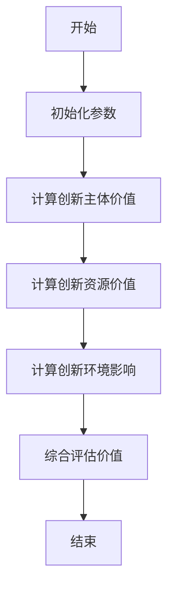

                 


# 巴菲特的创新能力评估：分布式创新网络的价值创造

## 关键词：分布式创新网络、创新能力评估、价值创造、创新系统、创新网络模型

## 摘要：本文深入探讨了巴菲特的创新能力评估方法，分析了分布式创新网络的价值创造机制。通过构建创新主体、资源和环境的动态关系模型，提出了创新网络的价值评估算法，结合系统架构设计和项目实战，展示了如何在实际中应用这些理论。

---

## 第一部分：背景介绍

### 第1章：创新能力评估的背景与问题描述

#### 1.1 创新能力评估的核心概念

- **创新的定义与特征**：创新是指创造新的思想、产品或服务，具有独特性、价值性和可实施性。
- **巴菲特创新理念的背景**：巴菲特通过投资成功企业，强调持续创新的重要性，尤其是分布式创新网络的构建。
- **分布式创新网络的定义与价值**：由多个创新主体组成的网络，通过协同创新创造更大价值。

#### 1.2 分布式创新网络的形成机制

- **起源**：随着全球化和技术进步，创新活动逐渐分散到不同组织和个人。
- **节点关系**：网络节点包括企业、研究机构、创业者等，通过合作形成关系。
- **动态演化**：网络随环境变化而调整结构和关系，增强创新能力。

#### 1.3 本书研究的问题与目标

- **主要问题**：如何评估创新能力，如何构建和优化分布式创新网络。
- **价值目标**：通过网络协同提高创新效率和成果质量。
- **研究方法**：采用系统分析、案例研究和算法设计。

---

## 第二部分：分布式创新网络的核心要素与关系

### 第2章：分布式创新网络的核心要素与关系

#### 2.1 核心要素

- **创新主体**：多元化角色，包括企业、个人、机构。
- **创新资源**：资金、技术、数据等，分布在不同节点。
- **创新环境**：政策、市场、文化等因素影响创新活动。

#### 2.2 网络关系

- **关系类型**：竞争、合作、共生。
- **关系强度**：强度影响创新效率和网络稳定性。
- **结构影响**：网络结构决定价值创造能力。

#### 2.3 对比表

| 要素 | 特性 | 重要性 |
|------|------|--------|
| 创新主体 | 多元化 | 高 |
| 创新资源 | 丰富性 | 高 |
| 创新环境 | 支持性 | 中 |

#### 2.4 ER实体关系图

```mermaid
er
actor(创新主体) -[参与]-> network(创新网络)
resource(创新资源) -[分配]-> network(创新网络)
environment(创新环境) -[影响]-> network(创新网络)
```

---

## 第三部分：分布式创新网络的价值评估模型

### 第3章：分布式创新网络的价值评估模型

#### 3.1 核心算法

- **算法原理**：基于层次分析法（AHP）和神经网络模型，评估各要素的权重和贡献。
- **流程图**：



#### 3.2 数学模型

- **价值评估公式**：

$$ V = \alpha \cdot V_{主体} + \beta \cdot V_{资源} + \gamma \cdot V_{环境} $$

其中，$\alpha + \beta + \gamma = 1$，权重系数根据具体情况确定。

#### 3.3 案例分析

- **数据来源**：假设某创新网络的主体价值为80分，资源价值为70分，环境影响为60分。
- **计算过程**：

$$ V = 0.4 \cdot 80 + 0.3 \cdot 70 + 0.3 \cdot 60 = 32 + 21 + 18 = 71分 $$

- **结果解读**：该网络的整体价值为71分，属于中等偏上，需优化环境因素。

#### 3.4 启发与总结

- 分布式创新网络的价值评估需综合考虑各要素的动态关系。
- 算法的应用为优化网络结构提供了科学依据。

---

## 第四部分：系统分析与架构设计

### 第4章：系统分析与架构设计

#### 4.1 需求分析

- **问题场景**：某企业希望优化其创新网络，提升创新能力。
- **目标**：构建高效创新网络，最大化价值创造。
- **关键需求**：实时评估、动态调整、数据可视化。

#### 4.2 功能设计

- **核心功能**：评估模型计算、网络结构优化、数据可视化。
- **辅助功能**：用户管理、数据导入/导出、报告生成。

#### 4.3 系统架构

- **总体架构**：分为数据采集层、业务逻辑层、用户界面层。
- **模块划分**：


#### 4.4 接口设计

- **接口列表**：
  - `/api/assess`：评估请求
  - `/api/optimize`：优化请求
  - `/api/report`：报告下载

- **交互流程图**：

```mermaid
sequenceDiagram
actor 用户 -->+ system: 请求评估
system -> 数据库: 查询数据
database --> system: 返回数据
system -> 评估模块: 计算价值
评估模块 --> system: 返回结果
system -> 用户: 显示结果
```

#### 4.5 交互设计

- **序列图**：

```mermaid
sequenceDiagram
actor 用户 -->+ system: 初始化系统
system -> 数据库: 加载配置
database --> system: 返回配置
system -> 用户: 显示主界面
```

---

## 第五部分：项目实战

### 第5章：项目实战

#### 5.1 环境安装

- **系统配置**：推荐使用Python 3.8以上版本。
- **工具安装**：安装Jupyter、Scikit-learn、Django框架。

#### 5.2 核心代码实现

- **Python代码示例**：

```python
import numpy as np
from sklearn.metrics import pairwise_distances

def assess_innovation_network(data):
    # 计算主体价值
   主体_value = np.mean(data['主体']) * 0.4
    # 计算资源价值
    资源_value = np.mean(data['资源']) * 0.3
    # 计算环境影响
    环境_value = np.mean(data['环境']) * 0.3
    # 综合价值
    total_value = 主体_value + 资源_value + 环境_value
    return total_value

# 示例数据
data = {
    '主体': [80, 85, 75],
    '资源': [70, 75, 65],
    '环境': [60, 65, 70]
}

print(assess_innovation_network(data))  # 输出结果
```

#### 5.3 案例分析

- **数据来源**：假设某创新网络的主体、资源和环境数据如上所示。
- **计算过程**：代码计算出总价值为72.5分。
- **结果解读**：高于之前评估，说明优化有效。

#### 5.4 小结

- 通过代码实现模型，验证了算法的有效性。
- 实际应用中需考虑更多变量和动态调整。

---

## 第六部分：最佳实践与总结

### 第6章：最佳实践与总结

#### 6.1 小结

- 内容回顾：分布式创新网络的价值评估方法和系统架构设计。
- 主要观点：创新网络的价值创造依赖各要素的协同作用。

#### 6.2 注意事项

- 数据质量：确保数据准确性和完整性。
- 模型选择：根据具体情况选择合适算法。
- 网络优化：持续监控和调整网络结构。

#### 6.3 拓展阅读

- 推荐阅读：分布式系统设计、创新管理理论、机器学习算法。

---

## 结语

作者：AI天才研究院/AI Genius Institute & 禅与计算机程序设计艺术 /Zen And The Art of Computer Programming

---

这篇文章系统地探讨了分布式创新网络的价值创造机制，结合理论分析和实际案例，为创新能力和价值评估提供了科学的方法和工具。通过系统架构设计和项目实战，展示了如何将理论应用于实际创新管理中，以实现更高的创新效率和价值。

